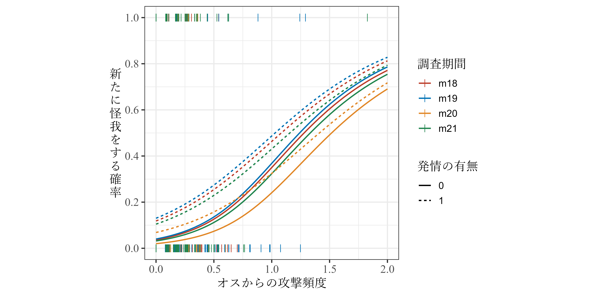
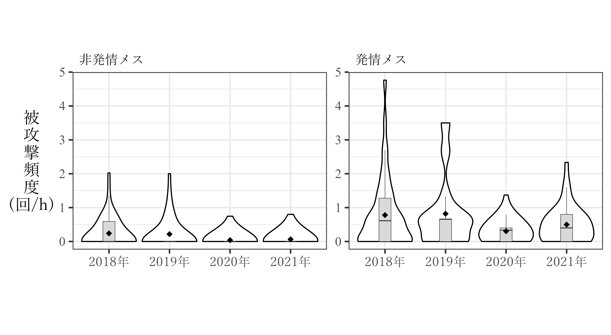
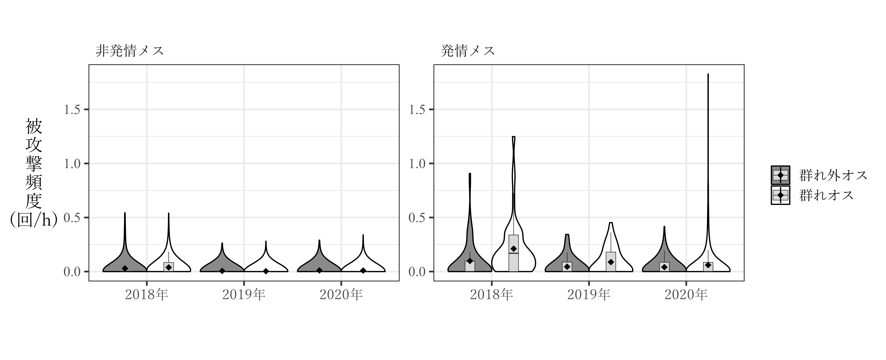
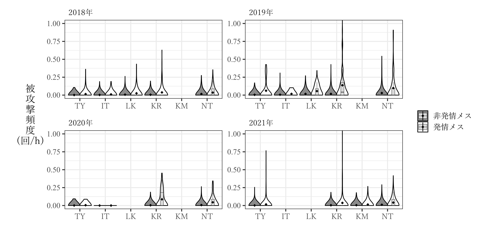

--- 
title: "交尾期の群れ内の凝集性に関する分析"  
author: "Tsubasa Yamaguchi"
date: "`r Sys.Date()`"
output: 
  bookdown::gitbook:
    split_by: rmd  
    split_bib: yes  
    number_sections: true   
    toc_depth: 5   
    css: custom_style.css   
    df_print: paged  
site: bookdown::bookdown_site  
output_dir: "docs"  
documentclass: book  
header-includes:
   - \usepackage{amsmath}
   - \usepackage{nccmath}
biblio-style: jecon    
bibliography: cohesion.bib   
link-citations: yes
csl: apa.csl
---

```{r, echo = FALSE}
knitr::opts_chunk$set(echo = TRUE, message = FALSE,
                      warning = FALSE, fig.align = "center",
                      cache = TRUE)
```

# 本稿の目的 {-}   
本稿は、個体追跡データをもとに

なお、本稿の作成に使用したファイルとRのコードは筆者の[Github](https://github.com/TsubasaYamaguchi-jinrui/SurvivalAnalysis)ですべて閲覧できる。  


<!--chapter:end:index.Rmd-->

# 0.  パッケージの読み込み {-}   
```{r}
## データハンドリング
library(tidyverse)
library(lubridate)
library(readxl)
library(dbplyr)

## モデリング  
library(lme4)
library(glmmTMB)
library(brms)
library(rstan)
library(DHARMa)
library(DHARMa.helpers)
library(easystats)
library(ggeffects)
library(ggdist)

## ネットワーク関連  
library(asnipe)
library(sna)
library(ANTs)
library(tidygraph)
library(ggraph)
library(igraph)

## ベイズモデルの設定
rstan_options(auto_write = TRUE) 
options(mc.cores = parallel::detectCores()) 

## グラフや表関連
library(patchwork)
library(flextable)
library(ggeffects)
library(DT)
library(knitr)
library(kableExtra)
library(stargazer)
library(ggsci)
library(lemon)
library(ggplotify)
library(ggsignif)

## フォント関連
library(extrafont)
require(systemfonts)
require(fontregisterer)
```

なお、本稿はRの基本操作と`tidyverse`パッケージによるデータハンドリングができることを前提としている。`tidyverse`パッケージを用いたデータ処理については、以下の書籍などを参照。  

- R for Data Science [@Wickham2016]  
[電子書籍](https://r4ds.had.co.nz/), [日本語](https://www.oreilly.co.jp/books/9784873118147/)  

- R Graphics Coocbook 2nd Edition [@Chang2018]   
[電子書籍](https://r-graphics.org/), [日本語](https://www.oreilly.co.jp/books/9784873118925/)  

- RユーザのためのRstudio[実践]入門~tidyverseによるモダンな分析フローの世界 改訂2版 [@Matsumura2021] [出版社サイト](https://gihyo.jp/book/2021/978-4-297-12170-9)  

<!--chapter:end:Chapter0.Rmd-->

# 使用する基礎データ  

```{r child = "C:/Users/Tsubasa Yamaguchi/Desktop/Study/DoctorStudy/data_cleaning.Rmd", include = FALSE}

```

<!--chapter:end:Chapter1.Rmd-->

# データクリーニング  
2019~2021年交尾期の個体追跡データを読み込み、データを加工する。  

## データの読み込み  
個体追跡データを読み込む。  
```{r}
## 2018交尾期  
focal_raw18 <- read_excel("C:/Users/Tsubasa Yamaguchi/Desktop/Study/data/2018mating/2018mating_raw.xlsx",
                      sheet = "focal_raw",
                      col_types = c(rep("numeric",2),rep("date",3),rep("text",1),rep("numeric",2), rep("text",2),"numeric","text",
                                    rep("numeric",3),rep("text",9),rep("numeric",2),rep("text",6),rep("numeric",5),rep("text",2))) %>% 
  mutate(start_time = as_datetime(str_c(date," ", format(as.POSIXct(start_time), format = "%H:%M:%S")))) %>% 
  mutate(fin_time = as_datetime(str_c(date," ", format(as.POSIXct(fin_time), format = "%H:%M:%S")))) 

## 2019交尾期
focal_raw19 <- read_excel("C:/Users/Tsubasa Yamaguchi/Desktop/Study/data/2019mating/2019mating_raw.xlsx",
                      sheet = "focal_raw",
                      col_types = c(rep("numeric",2),rep("date",3),rep("text",1),rep("numeric",2), rep("text",2),"numeric","text",
                                    rep("numeric",3),rep("text",9),rep("numeric",2),rep("text",6),rep("numeric",5),rep("text",2))) %>% 
  mutate(start_time = as_datetime(str_c(date," ", format(as.POSIXct(start_time), format = "%H:%M:%S")))) %>% 
  mutate(fin_time = as_datetime(str_c(date," ", format(as.POSIXct(fin_time), format = "%H:%M:%S")))) 

## 2020交尾期  
focal_raw20 <- read_excel("C:/Users/Tsubasa Yamaguchi/Desktop/Study/DoctorStudy/data/2020mating/2020mating_raw.xlsx",
                      sheet = "focal_raw",
                      col_types = c(rep("numeric",2),rep("date",3),rep("text",1),rep("numeric",2), rep("text",2), "numeric","text",
                                    rep("numeric",3),rep("text",21),rep("numeric",2),rep("text",4),rep("numeric",4),"text","numeric","text")) %>% 
  mutate(start_time = as_datetime(str_c(date," ", format(as.POSIXct(start_time), format = "%H:%M:%S")))) %>% 
  mutate(fin_time = as_datetime(str_c(date," ", format(as.POSIXct(fin_time), format = "%H:%M:%S")))) 


## 2021交尾期
focal_raw21 <- read_excel("C:/Users/Tsubasa Yamaguchi/Desktop/Study/DoctorStudy/data/2021mating/2021mating_raw.xlsx",
                      sheet = "focal_raw",
                      col_types = c(rep("numeric",2),rep("date",3),rep("text",1),rep("numeric",2), rep("text",2), "numeric","text",
                                    rep("numeric",3), rep("text",21),rep("numeric",2),rep("text",4),rep("numeric",4),"text","numeric","text")) %>% 
  mutate(start_time = as_datetime(str_c(date," ", format(as.POSIXct(start_time), format = "%H:%M:%S")))) %>% 
  mutate(fin_time = as_datetime(str_c(date," ", format(as.POSIXct(fin_time), format = "%H:%M:%S")))) 

## まとめる  
focal_raw18 %>% 
  bind_rows(focal_raw19, focal_raw20, focal_raw21) %>% 
  mutate(study_period = ifelse(date <= "2018-12-10","m18",
                               ifelse(date >= "2019-09-01" & date <= "2019-12-31","m19",
                                      ifelse(date >= "2020-09-01" & date <= "2020-12-31","m20","m21")))) %>% 
  mutate(year = year(date)) %>% 
  mutate(no_focal = str_c(study_period,"_",no_focal)) %>% 
  dplyr::select(-(app_sub:no_lv2)) -> focal_raw
```

データは以下の通り。  
```{r}
datatable(focal_raw,
          options = list(scrollX = 60),
          filter = list(position ="top"))
```
<br/>  

## データの加工  
### メス情報の追加  
#### 追跡個体の発情状態と各観察日の確認メス数、最大メス数の追加  
各観察日に群れで確認されたメス数(6歳以上)と、追跡個体の発情状態の列を追加する。  

```{r}
female_time <- read_csv("C:/Users/Tsubasa Yamaguchi/Desktop/Study/data/combined_data/female_pre_all.csv") %>% 
  mutate(date = as_date(date))

female18 %>%
  bind_rows(female19) %>% 
  bind_rows(female20) %>% 
  bind_rows(female21) -> female_all

female_all %>% 
  filter(age >= 6) %>% 
  group_by(date) %>% 
  summarise(no_female = sum(presence)) %>% 
  ungroup() -> num_female

female_time %>% 
  pivot_longer(cols = Kur:Har,
               names_to = "femaleID",
               values_to = "presence") %>% 
  filter(is.na(presence)|(presence != "DD" & presence != "NS")) %>% 
  group_by(date) %>% 
  summarise(max_female = n()) %>% 
  ungroup() -> max_female

focal_raw %>% 
  left_join(num_female, by = "date") %>% 
  left_join(max_female, by = "date") %>% 
  left_join(female_all %>% dplyr::select(date, femaleID, rank, rs2),
            by = c("date", "subject" = "femaleID")) -> focal_raw_b
```

#### 各観察日の発情メス数のデータを追加  
```{r}
## 発情メス数の追加  
female_all %>% 
  group_by(date) %>% 
  summarise(no_est = sum(rs2, na.rm = TRUE)) %>% 
  ungroup() %>% 
  right_join(focal_raw_b) -> focal_raw_c
```


### オスの情報の追加  
#### 群れ外オスの数{#s-ntm}  
各観察日に群れで確認された群れオス以外のオスの数(`no_ntm`)を追加する。なお、2018年についてはデータがない。  
各観察期間について以下のオスたちを群れオスとした。  

- 2018~2019年: *TY*、*IT*、*LK*、*KR*  
- 2020年: *TY*、*IT*、*KR*、*KM*  
- 2021年: *TY*、*KR*、*KM*    

```{r}
male19 %>% 
  bind_rows(male20) %>% 
  bind_rows(male21) %>% 
  mutate(year = year(date)) %>% 
  mutate(ntm = ifelse(year == "2019" & maleID %in% c("TY","IT","KR","LK"),0,
                      ifelse(year == "2020" & maleID %in% c("TY","IT","KR"),0,
                             ifelse(year == "2021" & maleID %in% c("TY","KR","KM"),0,1)))) %>% 
  replace_na(list(presence = 0))-> male_all

male_all %>% 
  group_by(date) %>% 
  filter(ntm == "1") %>% 
  summarise(no_ntm= sum(presence)) %>% 
  ungroup() %>% 
  right_join(focal_raw_c, by = "date") -> focal_raw_d
```

#### TYとITの確認状況  
調査期間中、第一位オスのタイヨウ(*TY*)と第二位オスのイツモ(*IT*)の群れへの出入りが頻繁に観察された。  
そこで、彼らが個体追跡時にいたか否かについての列(`TY`、`IT`)を追加する。  

彼らが確認できた時刻に関するデータを読み込む。  
```{r}
hrmales_pre19 <- read_excel("C:/Users/Tsubasa Yamaguchi/Desktop/Study/data/2019mating/2019mating_raw.xlsx",
                      sheet = "male_presence_long",
                      col_types = c("date","text","numeric","date","date")) %>% 
  mutate(in_atleast = as_datetime(str_c(date," ", format(as.POSIXct(in_atleast), format = "%H:%M:%S")))) %>% 
  mutate(out_atleast = as_datetime(str_c(date," ", format(as.POSIXct(out_atleast), format = "%H:%M:%S")))) 

hrmales_pre20 <- read_excel("C:/Users/Tsubasa Yamaguchi/Desktop/Study/DoctorStudy/data/2020mating/2020mating_raw.xlsx",
                      sheet = "male_presence_long",
                      col_types = c("date","text","numeric",rep("text",2),"date","date","numeric")) %>% 
  dplyr::select(-`in`,-out, -all_day) %>% 
  mutate(in_atleast = as_datetime(str_c(date," ", format(as.POSIXct(in_atleast), format = "%H:%M:%S")))) %>% 
  mutate(out_atleast = as_datetime(str_c(date," ", format(as.POSIXct(out_atleast), format = "%H:%M:%S")))) 

hrmales_pre21 <- read_excel("C:/Users/Tsubasa Yamaguchi/Desktop/Study/DoctorStudy/data/2021mating/2021mating_raw.xlsx",
                      sheet = "male_presence_long",
                      col_types = c("date","text","numeric","date","date")) %>% 
  mutate(in_atleast = as_datetime(str_c(date," ", format(as.POSIXct(in_atleast), format = "%H:%M:%S")))) %>% 
  mutate(out_atleast = as_datetime(str_c(date," ", format(as.POSIXct(out_atleast), format = "%H:%M:%S")))) 

hrmales_pre <- bind_rows(hrmales_pre19, hrmales_pre20, hrmales_pre21)
```

個体追跡データのデータシートに列を追加する。  
```{r}
## データの加工
hrmales_pre %>%
  left_join(bind_rows(base_19b,base_20b,base_21b) %>% dplyr::select(date, start, fin), by = "date") %>% 
  mutate(in_atleast = ifelse(male_presence == "1" & is.na(in_atleast), start, in_atleast)) %>% 
  mutate(out_atleast = ifelse(male_presence == "1" & is.na(out_atleast), fin, out_atleast)) %>% 
  mutate(in_atleast = as_datetime(in_atleast),
         out_atleast = as_datetime(out_atleast)) %>% 
  dplyr::select(-start,-fin) -> hrmales_pre_b

## TY
focal_raw_d %>% 
  left_join(hrmales_pre_b %>% filter(maleID == "TY"), by = "date") %>% 
  mutate(TY = ifelse(male_presence == "0",0,
                     ifelse(male_presence == "1" & start_time >= in_atleast & fin_time <= out_atleast, 1,
                            ifelse(male_presence == "1" & fin_time <= in_atleast, 0,
                                   ifelse(male_presence == "1" & start_time >= out_atleast, 0, 2))))) %>% 
  dplyr::select(-male_presence, -in_atleast, -out_atleast, -maleID)-> focal_raw_e


## IT
focal_raw_e %>% 
  left_join(hrmales_pre_b %>% filter(maleID == "IT"), by = "date") %>% 
  mutate(IT = ifelse(male_presence == "0",0,
                     ifelse(male_presence == "1" & start_time >= in_atleast & fin_time <= out_atleast, 1,
                            ifelse(male_presence == "1" & fin_time <= in_atleast, 0,
                                   ifelse(male_presence == "1" & start_time >= out_atleast, 0, 2))))) %>% 
  dplyr::select(-male_presence, -in_atleast, -out_atleast, -maleID) -> focal_raw_f

## 2018年については出入りはないので出欠状況  
male_pre18 %>% 
  dplyr::select(date, TY,IT) %>% 
  rename(TY18 = TY, IT18 = IT) %>% 
  right_join(focal_raw_f, by = "date") %>% 
  mutate(TY = ifelse(study_period == "m18", TY18,TY)) %>% 
  mutate(IT = ifelse(study_period == "m18", IT18, IT)) %>% 
  dplyr::select(-TY18, -IT18)-> focal_raw_g
```

フォーカルの途中でTYまたはITの確認状況が変わったものが５つあった。
```{r}
focal_raw_g %>% 
  filter(IT == "2"| TY == "2") %>% 
  distinct(date, no_focal, subject, TY, IT)
```

#### フォーカルを攻撃したオスのID  
フォーカルが攻撃を受けた際の攻撃したオスのIDを表す列を作成する。  
```{r}
focal_raw_g %>% 
  replace_na(list(agg_focal = 0)) %>% 
  replace_na(list(victim1 = "NA", victim2 = "NA", aggressor1 = "NA", aggressor2 = "NA")) %>% 
  mutate(if_victim1 = ifelse(agg_focal == 1 & str_detect(victim1, subject),1,0),
         if_victim2 = ifelse(agg_focal == 1 & str_detect(victim2, subject),1,0)) %>% 
  mutate(aggressor_focal = ifelse(if_victim1 == 1 & if_victim2 == 1, str_c(aggressor1,",",aggressor2),
                                  ifelse(if_victim1 == 1 , aggressor1,
                                         ifelse(if_victim2 == 1, aggressor2,NA)))) %>% 
  ## aggressor2には、追跡個体が同時刻に2頭から攻撃を受けたときのみ値が入る　　
  separate(aggressor_focal, into = c("aggressor_focal1","aggressor_focal2"), sep = ",")-> focal_raw_fin
```

加工したデータは以下の通り。  
```{r}
datatable(focal_raw_fin,
          options = list(scrollX = 60),
          filter = list(position ="top"))
```

<!--chapter:end:focal_cleaning.Rmd-->

# オスの攻撃はメスのコストになっているのか  
本章では、オスからの攻撃がメスの怪我の有無と関連しているかを調べることで、オスの攻撃がメスのコストになっているかを検討する。  

## 交尾期と非交尾期の比較  
### 被攻撃頻度  
前提として、**交尾期には非交尾期よりもオスからメスへの攻撃頻度が高いのか**を検討する。ここでは、個体追跡中にメスが攻撃を受けた頻度の比較を行う。なお、交尾期のデータは<u>対象個体が発情しているときとしていないときで分ける</u>。  

#### データの読み込み・加工  
まず、個体追跡データから各フォーカルセッション中に攻撃を受けた回数を算出するためにデータを読み込み、加工する。    

**交尾期**  
```{r}
focal_list_m <- focal_raw_fin %>% 
  mutate(if_victim1 = ifelse(agg_focal == "1" & str_detect(victim1, subject),1,0),
         if_victim2 = ifelse(agg_focal == "1" & str_detect(victim2, subject),1,0)) %>% 
  group_by(no_focal, date, subject, study_period,rs2) %>% 
  summarise(duration = max(time),
            no_agg1 = sum(if_victim1, na.rm = TRUE),
            no_agg2 = sum(if_victim2, na.rm = TRUE)) %>% 
  ungroup() %>% 
  mutate(no_agg = no_agg1 + no_agg2) %>% 
  select(-no_agg1, -no_agg2)
```

**非交尾期**  
```{r}
## 2019年  
focal_list19nm <- focal_list19nm <- read_excel("C:/Users/Tsubasa Yamaguchi/Desktop/Study/data/2019nonmating/2019nonmating_raw.xlsx",
                      sheet = "focal_raw")  %>% 
  group_by(no_focal, date, subject) %>% 
  summarise(duration = max(time),
            no_agg = sum(agg_focal)) %>% 
  ungroup() %>% 
  mutate(study_period = "nm19",
         no_focal = str_c(study_period,"_",no_focal))


## 2021年
focal_list21nm <-  read_excel("C:/Users/Tsubasa Yamaguchi/Desktop/Study/DoctorStudy/data/2021nonmating/2021nonmating_raw.xlsx",
                      sheet = "focal_list") %>% 
  mutate(no_focal = str_c(study_period,"_",no_focal))

## 2022年  
focal_list22nm <- read_excel("C:/Users/Tsubasa Yamaguchi/Desktop/Study/DoctorStudy/data/2022nonmating/2022nonmating_raw.xlsx",
                      sheet = "focal_list") %>% 
  mutate(no_focal = str_c(study_period,"_",no_focal))
```

全データを結合する。分析には、60分以上追跡した個体追跡セッションのみを用いる。    
```{r}
focal_list <- bind_rows(focal_list_m,focal_list19nm, focal_list21nm, focal_list22nm) %>% 
  replace_na(list(rs2 = 0)) %>% 
  mutate(mating = ifelse(str_detect(study_period,"nm"),0,1)) %>% 
  mutate(cat = ifelse(rs2 == "1","est",
                      ifelse(mating == "0", "nm", "nonest"))) %>% 
  filter(duration >= 60) %>% 
  mutate(logdur = log(duration/60)) 
```

データは以下の通り。  
```{r}
datatable(focal_list,
          options = list(scrollX = 20),
          filter = list(position ="top"))
```
<br/>  

#### 分析  
##### モデリング    
それでは、分析を行う。モデルの概要は以下の通り。  
事前分布には弱情報事前分布を用いた。  

- 分布: 負の二項分布  
- リンク関数: log  
- 応答変数: オスから攻撃された回数(`no_agg`)    
- オフセット項: 各セッションの観察時間の対数(`logdur`)      
- 説明変数: メスの発情状態`cat`(交尾期発情メス`est`、交尾期費発情`nonest`、非交尾期`nm`)  
- ランダム切片: 追跡個体(`subject`)、調査期間(`study_period`)   

```{r}
m_aggcomp <- brm(no_agg ~ cat + offset(logdur) + (1|subject) + (1|study_period),
                 family = negbinomial,
                 iter = 5000, warmup = 2500, seed = 13,
                 prior = c(prior(student_t(4,0,10), class = "b"),
                           prior(student_t(4,0,10), class = "Intercept"),
                           prior(student_t(4,0,10), class = "sd"),
                           prior(gamma(0.01,0.01), class = "shape")),
                 control=list(adapt_delta = 0.9999, max_treedepth = 20),
                 backend = "cmdstanr",
                 data = focal_list,
                 file = "model/m_aggcomp.rds")
```

###### モデルチェック  
`DHARMa`パッケージ及び、そのヘルパーパッケージである`DHARMa.helpers`パッケージを用いてモデルチェックを行う。  

分布から大きく外れていることはなく、過分散や外れ値の問題もないよう。  
```{r, include = FALSE}
check_aggcomp <- dh_check_brms(m_aggcomp)
```

```{r, fig.dim = c(4.5,4.5)}
plotQQunif(check_aggcomp)
```

ゼロ過剰の問題もなかった。  
```{r, fig.dim = c(4.5,4.5)}
testZeroInflation(check_aggcomp)
```

###### 結果の確認  
モデルの結果は以下の通り。`Rhat`はすべて1.01以下であり、収束の問題はないと思われる。有向サンプルサイズにも大きな問題はない。    
```{r}
model_parameters(m_aggcomp)
```
<br/> 

多重比較の結果は以下の通り。被攻撃頻度は交尾期発情 > 交尾期非発情 > 非交尾期で、いずれの差も有意。  
```{r}
estimate_contrasts(m_aggcomp,
                   contrast = "cat")
```
<br/> 

###### 結果の図示  
```{r}
posterior_samples(m_aggcomp) %>% 
  select(1,2,3) %>% 
  rename("est" = 1, "nm" = 2, "nonest" = 3) %>% 
  tidyr::expand(data.frame(cat = c("est","nonest","nm")),
         nesting(est, nm, nonest)) %>% 
  mutate(lambda = ifelse(cat == "est", exp(est),
                         ifelse(cat == "nonest", exp(est+ nonest),
                                ifelse(cat == "nm", exp(est + nm),"NA")))) %>% 
  mutate(lambda = as.numeric(lambda)) %>% 
  group_by(cat) %>% 
  summarise(Mean = mean(lambda),
         CI_low = quantile(lambda, 0.025),
         CI_high = quantile(lambda, 0.975)) -> mean_aggcomp
  

focal_list %>% 
  ungroup() %>% 
  mutate(cat = fct_relevel(cat,"nm","nonest","est")) %>% 
  ggplot(aes(x = cat, y = no_agg*60/duration))+
  geom_violin(scale = "width",
              fill = "grey65",
              color = "white",
              bw = 0.23)+
  geom_boxplot(width = 0.3,
               size = 0.7,
               outlier.alpha = 0,
               fill = "grey42") +
  geom_pointrange(data = mean_aggcomp,
                aes(y = Mean, ymin = CI_low, ymax = CI_high),
                color = "white",
                size = 0.3)+
  geom_errorbar(data = mean_aggcomp,
                aes(y = Mean, ymin = CI_low, ymax = CI_high),
                width = 0.1,
                linewidth = 0.8,
                color = "white")+
  geom_signif(comparisons = list(c("nm","nonest")),
              y_position = 2.1,
              annotation = "***") +
  geom_signif(comparisons = list(c("nonest","est")),
              y_position = 4.85,
              annotation = "***") +
  geom_signif(comparisons = list(c("nm","est")),
              y_position = 5.3,
              annotation = "***") +
  scale_y_continuous(breaks = seq(0,6,1)) +
  theme_bw(base_size = 15)+
  labs(x = "", y = "被\n攻\n撃\n頻\n度\n(回/h)") +
  scale_x_discrete(labels = c("非交尾期", "交尾期\n(非発情)","交尾期\n(発情)"))+
  theme(axis.title.y = element_text(angle = 0,
                                    vjust = 0.5,
                                    family = "Yu Mincho"),
        axis.text.x = element_text(family = "Yu Mincho"),
        axis.text.y = element_text(family = "Times New Roman",
                                   size = 18)) -> p_aggcomp

# ggsave("figure/p_aggcomp.png", p_aggcomp, width = 120, height = 120, units = "mm", dpi = 600)
```

結果は以下のようになる(図\@ref(fig:fig-aggcomp))。  
```{r fig-aggcomp, echo=FALSE, out.width="60%", fig.cap="季節ごとの被攻撃頻度"}
knitr::include_graphics("figure/p_aggcomp.png")
```
<br/>  

### 怪我の頻度 {#injcomp}   
それでは、実際にオスの攻撃が多い交尾期に怪我が多くなるかを調べる。先ほど同様に、交尾期のデータは<u>対象個体が発情しているときとしていないときで分ける</u>。    

#### データの読み込みと加工  

各メスがそれぞれの観察日に群れで最初に確認されてから、群れの観察を終了するまでの時間の長さを算出する。分析には**少なくとも300分以上**確認出来た個体のデータのみを用いる。2018年交尾期は確認時刻のデータがないため、それを除いた調査期間のデータを用いる。    

まずは、メスが確認された時刻のデータを読み込む。  
```{r}
female_time <- read_csv("C:/Users/Tsubasa Yamaguchi/Desktop/Study/data/combined_data/female_pre_all.csv") %>% 
  mutate(date = as_date(date))

att <- read_csv("data/attributes.csv")
```

確認できた時間の長さを算出する。  
```{r}
base_18b %>% 
  bind_rows(base_19_nm, base_19b, base_20_nm, base_20b, base_21_nm, base_21b, base_22_nm) -> base_all

female_time %>% 
  pivot_longer(cols = Kur:Har,
               names_to = "femaleID",
               values_to = "presence") %>% 
  left_join(base_all %>% select(date, start, fin, suspend, restart),
            by = "date") %>% 
  ## 死亡個体と確認時間不明個体、非対称個体(6歳未満)は除く
  filter(presence != "?" & presence != "DD" & presence != "NS" & presence != "NA") %>% 
  mutate(date = as_date(date)) %>%
  mutate(presence = str_c(date," ", presence)) %>% 
  mutate(presence = as_datetime(presence)) %>% 
  mutate(suspend_time = as.numeric(restart - suspend)) %>% 
  mutate(dur = ifelse(is.na(suspend), as.numeric(fin - presence),
                      ifelse(!is.na(suspend) & presence <= suspend, as.numeric(fin - presence) - suspend_time,
                             ifelse(!is.na(suspend) & presence >= restart, as.numeric(fin - presence), "NA")))) %>% 
  mutate(dur = as.numeric(dur)) %>% 
  mutate(season = ifelse(month(date)>=9 & month(date) <= 12, "m", "nm")) %>% 
  mutate(study_period = str_c(season,str_sub(year(date),3,4))) %>% 
  dplyr::select(date, femaleID, study_period, dur) -> female_dur
```

怪我のデータを読み込み、加工する。  
```{r}
## 交尾期 
injury18 <- read_excel("C:/Users/Tsubasa Yamaguchi/Desktop/Study/data/2018mating/2018mating_raw.xlsx", sheet = "injury")
injury19 <- read_excel("C:/Users/Tsubasa Yamaguchi/Desktop/Study/data/2019mating/2019mating_raw.xlsx", sheet = "injury")
injury20 <- read_excel("C:/Users/Tsubasa Yamaguchi/Desktop/Study/DoctorStudy/data/2020mating/2020mating_raw.xlsx",sheet = "injury")
injury21 <- read_excel("C:/Users/Tsubasa Yamaguchi/Desktop/Study/DoctorStudy/data/2021mating/2021mating_raw.xlsx",sheet = "injury")

## 非交尾期  
injury19nm <- read_excel("C:/Users/Tsubasa Yamaguchi/Desktop/Study/data/2019nonmating/2019nonmating_raw.xlsx", sheet = "injury")
injury21nm <- read_excel("C:/Users/Tsubasa Yamaguchi/Desktop/Study/DoctorStudy/data/2021nonmating/2021nonmating_raw.xlsx",sheet = "injury")
injury22nm <- read_excel("C:/Users/Tsubasa Yamaguchi/Desktop/Study/DoctorStudy/data/2022nonmating/2022nonmating_raw.xlsx",sheet = "injury")

## 結合  
injury <- bind_rows(injury18,injury19,injury20,injury21,injury19nm,injury21nm,injury22nm) %>% 
  pivot_longer(Kur:Har, names_to = "femaleID", values_to = "injury") %>% 
  mutate(injury01 = ifelse(injury >= 1, 1, 0)) %>% 
  mutate(injury02 = ifelse(injury >= 2, 1, 0)) %>% 
  mutate(date = as_date(date))
```

メスが確認できた時間や発情状態のデータと結合し、観察時間が300分以上のデータのみを抽出する。  
```{r}
injury %>% 
  left_join(female_dur, by = c("date", "femaleID")) %>% 
  filter(dur >= 300) %>% 
  left_join(female_all %>% dplyr::select(date, femaleID, rs2), by = c("date","femaleID")) %>% 
  replace_na(list(rs2 = 0)) %>% 
  mutate(cat = ifelse(rs2 == "1","est",
                    ifelse(str_detect(study_period, "nm"),"nm", "nonest"))) -> injury_fin
```

メスの発情状態`cat`(交尾期発情メス`est`、交尾期費発情`nonest`、非交尾期`nm`)によって怪我をした日数割合を算出する。なお、分析には少なくとも5日以上その状態が観察できた場合のみを用いる。  
```{r}
injury_fin %>% 
  group_by(cat, femaleID, study_period) %>% 
  summarise(N = n(),
            no_inj = sum(injury01, na.rm = TRUE)) %>%
  ## 5日以上観察できた状態のみ
  filter(N >= 5) %>% 
  ungroup() -> injury_long
```

データは以下の通り。  
```{r}
datatable(injury_long,
          options = list(scrollX = 20),
          filter = list(position ="top"))
```

#### 分析  
##### モデリング     
それでは、モデリングを行う。モデルの概要は以下の通り。  
事前分布には弱情報事前分布を用いた。  

- 分布: 二項分布  
- リンク関数: ロジット関数  
- 応答変数: 怪我をした日数割合(`no_inj`/N)    
- 説明変数: メスの発情状態`cat`(交尾期・発情`est`、交尾期・非発情`nonest`、非交尾期`nm`)  
- ランダム切片: メスID(`femaleID`)、調査期間(`study_period`)   

```{r}
m_injcomp <- brm(no_inj|trials(N) ~ cat  + (1|femaleID) + (1|study_period),
                 family = binomial,
                 iter = 5000, warmup = 2500, seed = 13,
                 prior = c(prior(student_t(4,0,10), class = "b"),
                           prior(student_t(4,0,10), class = "Intercept"),
                           prior(student_t(3,0,4), class = "sd")),
                 control=list(adapt_delta = 0.9999, max_treedepth = 22),
                 backend = "cmdstanr",
                 data = injury_long,
                 file = "model/m_injcomp.rds")
```

###### モデルチェック  
`DHARMa`パッケージ及び、そのヘルパーパッケージである`DHARMa.helpers`パッケージを用いてモデルチェックを行う。  

分布から大きく外れていることはなく、過分散や外れ値の問題もないよう。  
```{r, include = FALSE}
check_injcomp <- dh_check_brms(m_injcomp)
```

```{r, fig.dim = c(4.5,4.5)}
plotQQunif(check_injcomp)
```

ゼロ過剰の問題もなかった。  
```{r, fig.dim = c(4.5,4.5)}
testZeroInflation(check_injcomp)
```

###### 結果の確認  
モデルの結果は以下の通り。`Rhat`はすべて1.01以下であり、収束の問題はないと思われる。有向サンプルサイズにも大きな問題はない。    
```{r}
model_parameters(m_injcomp)
```
<br/>  

多重比較の結果は以下の通り。怪我日数割合は有意に交尾期・発情 > 交尾期・非発情・非交尾期。しかし、交尾期・非発情と非交尾期の間に有意に差はなかった。これは、非交尾期にも山椒などの棘がある植物を食べた際にできた小さな怪我が結構あったため? あるいは、交尾期のデータに発情メスがいなかった日も含まれているため？      
```{r}
estimate_contrasts(m_injcomp,
                   contrast = "cat",
                   ci = 0.95)
```
<br/> 

確信区間を90%にすると、非交尾期と交尾期・非発情の差の確信区間は0を含まない。  
```{r}
estimate_contrasts(m_injcomp,
                   contrast = "cat",
                   ci = 0.9)
```


###### 結果の図示  
結果を図示する。  
```{r}
mean_injury <- estimate_means(m_injcomp, at = "cat") %>% 
  data.frame()

injury_long %>% 
  mutate(cat = fct_relevel(cat,"nm","nonest","est")) %>% 
  ggplot(aes(x = cat, y = no_inj/N)) +
  geom_violin(scale = "width",
              fill = "grey65",
              color = "white",
              bw = 0.043)+
  geom_boxplot(width = 0.4,
               size = 0.7,
               outlier.alpha = 0,
               fill = "grey42") +
  geom_signif(comparisons = list(c("nm","nonest")),
              y_position = 0.2,
              annotation = "†") +
  geom_signif(comparisons = list(c("nonest","est")),
              y_position = 0.58,
              annotation = "***") +
  geom_signif(comparisons = list(c("nm","est")),
              y_position = 0.63,
              annotation = "***") +
  geom_pointrange(data = mean_injury,
                aes(y = Probability, ymin = CI_low, ymax = CI_high),
                color = "white",
                size = 0.3)+
  geom_errorbar(data = mean_injury,
                aes(y = Probability, ymin = CI_low, ymax = CI_high),
                width = 0.1,
                linewidth = 0.8,
                color = "white")+
  scale_y_continuous(breaks = seq(0,0.6,0.1)) +
  theme_bw(base_size = 15)+
  labs(x = "", y = "怪\n我\n日\n数\n割\n合\n(回/日)") +
  scale_x_discrete(labels = c("非交尾期", "交尾期\n(非発情)","交尾期\n(発情)"))+
  theme(axis.title.y = element_text(angle = 0,
                                    vjust = 0.5,
                                    family = "Yu Mincho"),
        axis.text.x = element_text(family = "Yu Mincho"),
        axis.text.y = element_text(family = "Times New Roman",
                                   size = 18)) -> p_injcomp

# ggsave("figure/p_injcomp.png", p_injcomp, width = 140, height = 120, units = "mm", dpi = 600)
```

結果は以下のようになる(図\@ref(fig:fig-injcomp))。  
```{r fig-injcomp, echo=FALSE, out.width="60%", fig.cap="季節ごとの被攻撃頻度"}
knitr::include_graphics("figure/p_injcomp.png")
```
<br/>  

## 交尾期内での被攻撃頻度と怪我の関連  
交尾期に着目し、メスの被攻撃頻度と怪我の有無の関連を調べる。   

### データの読み込み・加工  
各観察日に確認された各メスへのオスの攻撃頻度(全生起サンプリング)を計算する。群れオスと群れ外オスを分けて算出する。  

まず、攻撃のrawデータを読み込む。  
```{r}
agg18 <- read_excel("C:/Users/Tsubasa Yamaguchi/Desktop/Study/data/2018mating/2018mating_raw.xlsx", sheet = "agg_MF") 
agg19 <- read_excel("C:/Users/Tsubasa Yamaguchi/Desktop/Study/data/2019mating/2019mating_raw.xlsx", sheet = "agg_MF") 
agg20 <- read_excel("C:/Users/Tsubasa Yamaguchi/Desktop/Study/DoctorStudy/data/2020mating/2020mating_raw.xlsx",
                      sheet = "agg_MF") 
agg21 <- read_excel("C:/Users/Tsubasa Yamaguchi/Desktop/Study/DoctorStudy/data/2021mating/2021mating_raw.xlsx",
                      sheet = "agg_MF")

## 結合  
bind_rows(agg18, agg19, agg20, agg21) %>% 
  dplyr::select(date, type, type_no, aggressor, victim:victim3) %>% 
  mutate(date = as_date(date)) %>% 
  pivot_longer(cols = victim:victim3,
               names_to = "victim",
               values_to = "femaleID") %>% 
  drop_na(femaleID) %>% 
  dplyr::select(-victim) %>% 
  mutate(aggressor = str_replace(aggressor,"\\?","")) %>% 
  mutate(study_period = str_c("m",str_sub(year(date),3,4)))-> aggression_all
```

データは以下の通り。  
```{r}
datatable(aggression_all,
          filter = list(position ="top"))
```
<br/>  

各メスごとに被攻撃頻度を算出する。各調査期間に6歳以上だったメスを対象とする。    

各年のオスの情報についてデータフレームを作成する。
```{r}
## 対象のオス
bind_rows(data.frame(study_period = "m18", 
                     maleID = c("TY","IT","LK","KR","EG"),
                     ntm = c(0,0,0,0,1)),
          data.frame(study_period = "m19", 
                     maleID = c("TY","IT","LK","KR","TM","KM","TG","EG","SH","JN","RU","KY","RY"),
                     ntm = c(0,0,0,0,0,1,1,1,1,1,1,1,1)),
          data.frame(study_period = "m20", 
                     maleID = c("TY","IT","KR","KM","TG","EG","SH","RU","RY","HG","FU","KY"),
                     ntm = c(0,0,0,1,1,1,1,1,1,1,1,1)),
          data.frame(study_period = "m21",
                     maleID = c("TY","KR","KM","TG","EG","SH","JN","RU","KY","HT","RY"),
                     ntm = c(0,0,0,1,1,1,1,1,1,1,1))) -> males
```

攻撃データに攻撃したオスと攻撃されたメスの情報を追加する。  
```{r}
aggression_all %>% 
  left_join(att, by = c("femaleID","study_period")) %>% 
  left_join(males, by = c("aggressor" = "maleID","study_period")) %>% 
  filter(age >= 6) -> aggression_all_b
```

データを基に、それぞれのメスが各観察日に群れオス・群れ外オスそれぞれから攻撃された頻度を求める。  
```{r}
aggression_all_b %>% 
  filter(!is.na(ntm)) %>% 
  filter(type_no >= 1) %>% 
  group_by(date, femaleID, ntm) %>% 
  summarise(no_agg = n()) %>% 
  ungroup() %>% 
  pivot_wider(names_from = ntm, values_from = no_agg) %>% 
  rename(agg_tm = `0`, agg_ntm = `1`) -> agg_female_ntm
```

分析には**少なくとも300分以上**確認出来た個体のデータのみを用いる。攻撃データをメスの怪我の状況や確認時間長などが載っているデータフレーム(`injury_fin`)に結合する。  

```{r}
injury_fin %>% 
  left_join(agg_female_ntm, by = c("date","femaleID")) %>%
  ## 交尾期データのみ
  filter(!str_detect(study_period,"nm")) %>% 
  filter(dur >= 300) %>% 
  ## 各観察日の群れ追跡時間を結合  
  left_join(base_all %>% dplyr::select(date, duration)) %>% 
  ## NAになっているところを0で埋める  
  replace_na(list(agg_tm = 0, agg_ntm = 0)) %>% 
  ## 被攻撃頻度を算出  
  mutate(rate_agg_tm = agg_tm*60/duration,
         rate_agg_ntm = agg_ntm*60/duration,
         rate_agg_tm2 = agg_tm*60/dur,
         rate_agg_ntm2 = agg_ntm*60/dur) -> agg_injury_ntm
```

### 分析1 (群れオス・群れ外オスを区別)             
#### モデリング
それでは、モデリングを行う。モデルの詳細は以下のとおりである。  
事前分布には弱情報事前分布を用いた。  

- 分布: ベルヌーイ分布    
- リンク関数: ロジット関数    
- 応答変数: 怪我が確認されたか否か(`injury01`)           
- 説明変数: 群れオスからの攻撃頻度(`rate`_agg_tm`)、群れ外オスからの攻撃頻度(`rate_agg_ntm``)、メスの発情の有無(`rs2`)、調査期間(`study_period`)  
- ランダム切片: メスID(`femaleID`)      

```{r}
## 被攻撃頻度を群れ追跡時間から算出 
m_agginj <- brm(injury01 ~ rate_agg_tm + rate_agg_ntm + rs2  + study_period + (1|femaleID),
                family = bernoulli,
                iter = 5000, warmup = 2500, seed = 13,
                 prior = c(prior(student_t(4,0,10), class = "b"),
                           prior(student_t(4,0,10), class = "Intercept"),
                           prior(student_t(4,0,10), class = "sd")),
                 control=list(adapt_delta = 0.9999, max_treedepth = 20),
                 backend = "cmdstanr",
                 data = agg_injury_ntm,
                 file = "model/m_agginj.rds")

## 被攻撃頻度を各個体を確認した時刻から群れ追跡終了時刻までの時間で算出  
m_agginj2 <- brm(injury01 ~ rate_agg_tm2 + rate_agg_ntm2 + rs2  + study_period + (1|femaleID),
                family = bernoulli,
                iter = 5000, warmup = 2500, seed = 13,
                 prior = c(prior(student_t(4,0,10), class = "b"),
                           prior(student_t(4,0,10), class = "Intercept"),
                           prior(student_t(4,0,10), class = "sd")),
                 control=list(adapt_delta = 0.9999, max_treedepth = 20),
                 backend = "cmdstanr",
                 data = agg_injury_ntm,
                 file = "model/m_agginj2.rds")
```

###### モデルチェック  
`DHARMa`パッケージ及び、そのヘルパーパッケージである`DHARMa.helpers`パッケージを用いてモデルチェックを行う。  

```{r, include = FALSE}
check_agginj <- dh_check_brms(m_agginj)
check_agginj2 <- dh_check_brms(m_agginj2)
```

いずれのモデルも、分布から大きく外れていることはなく、過分散や外れ値の問題もないよう。
```{r, fig.dim = c(4.5,4.5)}
plotQQunif(check_agginj)
```

```{r, fig.dim = c(4.5,4.5)}
plotQQunif(check_agginj2)
```


###### 結果の確認  
モデルの結果は以下の通り。`Rhat`はすべて1.01以下であり、収束の問題はないと思われる。有向サンプルサイズにも大きな問題はない。    
いずれのモデルでも、群れオス・群れ外オスの攻撃いずれもが怪我と有意に関連。  

```{r}
model_parameters(m_agginj) %>% 
  data.frame() %>% 
  select(c(1,2,4,5)) %>%   
  mutate("95%CI" = str_c("[",sprintf("%.2f",CI_low),",",sprintf("%.2f",CI_high),"]")) %>% 
  mutate(Median = sprintf("%.2f",Median)) %>% 
  select(1,2,5) %>% 
  mutate(Parameter = str_replace(Parameter,"b_","")) %>% 
  mutate(Parameter = str_replace_all(Parameter, c("Intercept" = "切片","rate_agg_tm" = "群れオスからの攻撃頻度",
                                                  "rate_agg_ntm" = "群れ外オスからの攻撃頻度",
                                                  "rs2" = "発情有(vs 無)",
                                                  "study_periodm19" = "2019年(vs 2018年)",
                                              　　"study_periodm20" = "2020年(vs 2018年)",
                                              　　"study_periodm21" = "2021年(vs 2018年)",
                                              　　":" = "×"))) %>% 
  rename("説明変数" =1, "係数の推定値" = 2) %>% 
  flextable() %>% 
  theme_zebra() %>% 
  colformat_double(digits=2) %>% 
  set_table_properties(layout="autofit",width = 1) %>% 
  align(j=2:3,part = "all",align = "center") %>% 
  font(part = "header", fontname = "Yu Mincho") %>% 
  font(part = "body", j=2:3, fontname = "Times New Roman") %>% 
  font(part = "body", j=1, fontname = "Yu Mincho") %>% 
  width(j=c(1), width = 2.3) %>% 
  width(j = 2, width = 1.5)-> table_agginj

table_agginj

# save_as_image(table_agginj, "table/table_agginj.png")
```
<br/>  

```{r}
model_parameters(m_agginj2)
```

##### 結果の作図  
**群れオス**  
```{r}
nd_agginj_tm <- tidyr::crossing(rate_agg_tm = seq(0,2,length.out =100),
                       rate_agg_ntm = mean(agg_injury_ntm$rate_agg_ntm),
                       study_period = c("m18","m19","m20","m21"),
                       rs2 = c(0,1))

fit_agginj_tm <- fitted(m_agginj,
                      newdata = nd_agginj_tm,
                      re_formula = NA) %>% 
               bind_cols(nd_agginj_tm)


agg_injury_ntm %>% 
  ggplot(aes(x = rate_agg_tm, y = injury01, color = study_period))+
  geom_point(shape = "|", size = 3)+
  geom_line(data = fit_agginj_tm,
            aes(y = Estimate, linetype = as.factor(rs2)),
            size = 0.7)+
  theme_bw(base_size = 14)+
  scale_y_continuous(breaks = seq(0,1,by = 0.2)) +
  labs(x = "群れオスからの攻撃頻度", y = "怪\n我\n日\n数\n割\n合\n(回/日)",
       color = "調査期間", linetype = "発情の有無") +
  scale_color_nejm()+
  theme(axis.title.y = element_text(angle = 0,
                                    vjust = 0.5,
                                    family = "Yu Mincho"),
        axis.title.x = element_text(family = "Yu Mincho"),
        axis.text = element_text(family = "Times New Roman",
                                   size = 13),
        legend.position = "none",
        legend.title = element_text(family = "Yu Mincho"),
        aspect.ratio = 1) -> p_agginj_tm
```

**群れ外オス**  
```{r}
nd_agginj_ntm <- tidyr::crossing(rate_agg_ntm = seq(0,1,length.out =100),
                       rate_agg_tm = mean(agg_injury_ntm$rate_agg_tm),
                       study_period = c("m18","m19","m20","m21"),
                       rs2 = c(0,1))

fit_agginj_ntm <- fitted(m_agginj,
                      newdata = nd_agginj_ntm,
                      re_formula = NA) %>% 
               bind_cols(nd_agginj_ntm)


agg_injury_ntm %>% 
  ggplot(aes(x = rate_agg_ntm, y = injury01, color = study_period))+
  geom_point(shape = "|", size = 3)+
  geom_line(data = fit_agginj_ntm,
            aes(y = Estimate, linetype = as.factor(rs2)),
            size = 0.7)+
  theme_bw(base_size = 14)+
  scale_y_continuous(breaks = seq(0,1,by = 0.2)) +
  labs(x = "群れ外オスからの攻撃頻度", y = "怪\n我\n日\n数\n割\n合\n(回/日)",
       color = "調査期間", linetype = "発情の有無") +
  scale_color_nejm()+
  coord_cartesian(xlim = c(0,1.02))+
  scale_x_continuous(breaks = seq(0,1,by=0.2))+
  theme(axis.title.y = element_text(angle = 0,
                                    vjust = 0.5,
                                    family = "Yu Mincho"),
        axis.title.x = element_text(family = "Yu Mincho"),
        axis.text = element_text(family = "Times New Roman",
                                   size = 13),
        legend.title = element_text(family = "Yu Mincho"),
        aspect.ratio = 1) -> p_agginj_ntm

p_agginj <- p_agginj_tm + p_agginj_ntm

# ggsave("figure/p_agginj.png", p_agginj, width = 230, height = 120, units = "mm", dpi = 600)
```

結果は以下のようになる(図\@ref(fig:fig-agginj))。  
```{r fig-agginj, echo=FALSE, out.width="100%", fig.cap="被攻撃頻度と怪我の関連"}
knitr::include_graphics("figure/p_agginj.png")
```
<br/>  

### 分析2 (群れオス・群れ外オスを区別しない)           
#### データの加工  
オスの属性を問わず、それぞれのメスが各観察日にオスから攻撃された頻度を求め、怪我のデータと結合する。  
```{r}
aggression_all_b %>% 
  filter(type_no >= 1) %>% 
  group_by(date, femaleID) %>% 
  summarise(no_agg = n()) %>% 
  ungroup() -> agg_female_all
```

分析には**少なくとも300分以上**確認出来た個体のデータのみを用いる。攻撃データをメスの怪我の状況や確認時間長などが載っているデータフレーム(`injury_fin`)に結合する。  

```{r}
injury_fin %>% 
  left_join(agg_female_all, by = c("date","femaleID")) %>%
  ## 交尾期データのみ
  filter(!str_detect(study_period,"nm")) %>% 
  filter(dur >= 300) %>% 
  ## 各観察日の群れ追跡時間を結合  
  left_join(base_all %>% dplyr::select(date, duration)) %>% 
  ## NAになっているところを0で埋める  
  replace_na(list(no_agg = 0)) %>% 
  ## 被攻撃頻度を算出  
  mutate(rate_agg = no_agg*60/duration,
         rate_agg2 = no_agg*60/dur) -> agg_injury_all
```

#### モデリング
それでは、モデリングを行う。モデルの詳細は以下のとおりである。  
事前分布には弱情報事前分布を用いた。  

- 分布: ベルヌーイ分布    
- リンク関数: ロジット関数    
- 応答変数: 怪我が確認されたか否か(`injury01`)           
- 説明変数: オスからの攻撃頻度(`rate_agg``)、メスの発情の有無(`rs2`)、攻撃頻度と発情の有無の交互作用、調査期間(`study_period`)  
- ランダム切片: メスID(`femaleID`)      

```{r}
## 被攻撃頻度を群れ追跡時間から算出 
m_agginj_all <- brm(injury01 ~ rate_agg + rs2 + rate_agg:rs2 + study_period + (1|femaleID),
                    family = bernoulli,
                    iter = 5000, warmup = 2500, seed = 13,
                    prior = c(prior(student_t(4,0,10), class = "b"),
                           prior(student_t(4,0,10), class = "Intercept"),
                           prior(student_t(4,0,10), class = "sd")),
                     control=list(adapt_delta = 0.9999, max_treedepth = 20),
                     backend = "cmdstanr",
                     data = agg_injury_all,
                     file = "model/m_agginj_all.rds")

## 被攻撃頻度を各個体を確認した時刻から群れ追跡終了時刻までの時間で算出  
m_agginj_all2 <- brm(injury01 ~ rate_agg2 + rs2 + rate_agg2:rs2 + study_period + (1|femaleID),
                    family = bernoulli,
                    iter = 5000, warmup = 2500, seed = 13,
                    prior = c(prior(student_t(4,0,10), class = "b"),
                           prior(student_t(4,0,10), class = "Intercept"),
                           prior(student_t(4,0,10), class = "sd")),
                     control=list(adapt_delta = 0.9999, max_treedepth = 20),
                     backend = "cmdstanr",
                     data = agg_injury_all,
                     file = "model/m_agginj_all2.rds")
``` 

###### モデルチェック  
`DHARMa`パッケージ及び、そのヘルパーパッケージである`DHARMa.helpers`パッケージを用いてモデルチェックを行う。  

```{r, include = FALSE}
check_agginj_all <- dh_check_brms(m_agginj_all)
check_agginj_all2 <- dh_check_brms(m_agginj_all2)
```

いずれのモデルも、分布から大きく外れていることはなく、過分散や外れ値の問題もないよう。
```{r, fig.dim = c(4.5,4.5)}
plotQQunif(check_agginj_all)
```

```{r, fig.dim = c(4.5,4.5)}
plotQQunif(check_agginj_all2)
```

###### 結果の確認  
**1つ目のモデル**  
モデルの結果は以下の通り。`Rhat`はすべて1.01以下であり、収束の問題はないと思われる。有向サンプルサイズにも大きな問題はない。    
```{r}
model_parameters(m_agginj_all) %>% 
  data.frame() %>% 
  select(c(1,2,4,5)) %>%   
  mutate("95%CI" = str_c("[",sprintf("%.2f",CI_low),",",sprintf("%.2f",CI_high),"]")) %>% 
  mutate(Median = sprintf("%.2f",Median)) %>% 
  select(1,2,5) %>% 
  mutate(Parameter = str_replace(Parameter,"b_","")) %>% 
  mutate(Parameter = str_replace_all(Parameter, c("Intercept" = "切片","rate_agg" = "オスからの攻撃頻度",
                                                  "rate_agg:rs2" = "オスからの攻撃頻度×発情の有無",
                                                  "rs2" = "発情有(vs 無)",
                                                  "study_periodm19" = "2019年(vs 2018年)",
                                              　　"study_periodm20" = "2020年(vs 2018年)",
                                              　　"study_periodm21" = "2021年(vs 2018年)",
                                              　　":" = "×"))) %>% 
  rename("説明変数" =1, "係数の推定値" = 2) %>% 
  flextable() %>% 
  theme_zebra() %>% 
  colformat_double(digits=2) %>% 
  set_table_properties(layout="autofit",width = 1) %>% 
  align(j=2:3,part = "all",align = "center") %>% 
  font(part = "header", fontname = "Yu Mincho") %>% 
  font(part = "body", j=2:3, fontname = "Times New Roman") %>% 
  font(part = "body", j=1, fontname = "Yu Mincho") %>% 
  width(j=c(1), width = 2.7) %>% 
  width(j = 2, width = 1.5)-> table_agginj_all

table_agginj_all

# save_as_image(table_agginj_all, "table/table_agginj_all.png")
```
<br/>  

交互作用項を含む結果を確認する。発情メス、非発情メスのいずれについても「オスからの攻撃が多い日ほど有意に怪我をする確率が高くなっていた。    
```{r}
estimate_slopes(m_agginj_all,
                trend = "rate_agg",
                at = "rs2 = c(0,1)")
```
<br/>  

**2つ目のモデル**  
こちらも結果は変わらず。  
```{r}
model_parameters(m_agginj_all2)
```
<br/>  

```{r}
estimate_slopes(m_agginj_all2,
                trend = "rate_agg2",
                at = "rs2 = c(0,1)")
```
<br/>  

##### 結果の作図   
```{r}
nd_agginj_all <- tidyr::crossing(rate_agg = seq(0,2,length.out =100),
                       study_period = c("m18","m19","m20","m21"),
                       rs2 = c(0,1))

fit_agginj_all <- fitted(m_agginj_all,
                      newdata = nd_agginj_all,
                      re_formula = NA) %>% 
               bind_cols(nd_agginj_all)


agg_injury_all %>% 
  ggplot(aes(x = rate_agg, y = injury01, color = study_period))+
  geom_point(shape = "|", size = 3)+
  geom_line(data = fit_agginj_all,
            aes(y = Estimate, linetype = as.factor(rs2)),
            linewidth = 0.7)+
  theme_bw(base_size = 14)+
  scale_y_continuous(breaks = seq(0,1,by = 0.2)) +
  labs(x = "オスからの攻撃頻度", y = "怪\n我\n日\n数\n割\n合\n(回/日)",
       color = "調査期間", linetype = "発情の有無") +
  scale_color_nejm()+
  theme(axis.title.y = element_text(angle = 0,
                                    vjust = 0.5,
                                    family = "Yu Mincho"),
        axis.title.x = element_text(family = "Yu Mincho"),
        axis.text = element_text(family = "Times New Roman",
                                   size = 13),
        legend.title = element_text(family = "Yu Mincho"),
        aspect.ratio = 1) -> p_agginj_all

# ggsave("figure/p_agginj_all.png", p_agginj_all, width = 240, height = 120, units = "mm", dpi = 600)
```

結果は以下のようになる(図\@ref(fig:fig-agginj-all))。  
```{r fig-agginj-all, echo=FALSE, out.width="100%", fig.cap="被攻撃頻度と怪我の関連"}

```
<br/>  


<!--chapter:end:cost_of_aggression.Rmd-->

# メスの被攻撃頻度はどのようなときに多くなるか  
以下では、メスがオスから攻撃される頻度がどのような要因によって変化するのかを検討する。  

## 個体追跡データによる分析  
### データの加工  
個体追跡の生データを加工する。メスの被攻撃頻度に関連する要因としては、以下のものを考える。2018年は群れ外オス数が確認できていないため、ここでは除外する。また、60分以上追跡できた個体追跡セッションのみを用いる。      

- 追跡個体の発情の有無  
- 観察日の群れ外オス数  
- 観察日の発情メス数  
- 観察時の*TY*の有無、*IT*の有無(2019~2020年のみ)   

**群れオス・群れ外オスを区別せず**  
```{r}
focal_raw_fin %>% 
  group_by(no_focal, subject, rs2, TY, IT) %>% 
  summarise(no_agg1 = sum(if_victim1, na.rm = TRUE),
            no_agg2 = sum(if_victim2, na.rm = TRUE),
            dur = max(time),
            no_ntm = mean(no_ntm, na.rm = TRUE),
            no_est = mean(no_est, na.rm = TRUE),
            study_period = unique(study_period)) %>% 
  ungroup() %>% 
  mutate(no_agg = no_agg1 + no_agg2) %>% 
  select(-no_agg1, -no_agg2) %>% 
  mutate(logdur = log(dur/60)) %>% 
  replace_na(list(IT = 0)) %>% 
  mutate(cen_ntm = no_ntm - mean(no_ntm, na.rm = TRUE),
         cen_est = no_est - mean(no_est, na.rm = TRUE),
         std_ntm = standardize(no_ntm),
         std_est = standardize(no_est)) -> focal_sum
```


**群れオス・群れ外オスを区別**  
```{r}
focal_raw_fin %>% 
  left_join(males, by = c("study_period", "aggressor_focal1" = "maleID")) %>% 
  rename(ntm1 = ntm) %>% 
  mutate(ntm1 = ifelse(is.na(aggressor_focal1),NA,
                       ifelse(is.na(ntm1) & !is.na(aggressor_focal1),1,ntm1))) %>% 
  left_join(males, by = c("study_period", "aggressor_focal2" = "maleID")) %>% 
  rename(ntm2 = ntm) %>% 
  mutate(ntm2 = ifelse(is.na(aggressor_focal2),NA,
                       ifelse(is.na(ntm2) & !is.na(aggressor_focal2),1,ntm2))) -> focal_raw_fin_b
  
focal_raw_fin_b %>% 
  filter(agg_focal == "1") %>% 
  group_by(no_focal, subject, ntm1) %>% 
  summarise(no_agg = sum(agg_focal, na.rm = TRUE)) %>% 
  ungroup() %>% 
  pivot_wider(names_from = ntm1, values_from = no_agg) %>% 
  rename(agg_tm1 = `0`, agg_ntm1 = `1`) %>% 
  replace_na(list(agg_tm1 = 0, agg_ntm1 = 0))-> focal_list_ntm1

focal_raw_fin_b %>% 
  filter(agg_focal == "1" & !is.na(aggressor_focal2)) %>% 
  group_by(no_focal, subject, ntm2) %>% 
  summarise(no_agg = sum(agg_focal, na.rm = TRUE)) %>% 
  ungroup() %>% 
  pivot_wider(names_from = ntm2, values_from = no_agg) %>% 
  rename(agg_tm2 = `0`, agg_ntm2 = `1`) %>% 
  replace_na(list(agg_tm2 = 0, agg_ntm2 = 0)) -> focal_list_ntm2

left_join(focal_list_ntm1, focal_list_ntm2) %>% 
  replace_na(list(agg_tm2 = 0, agg_ntm2 = 0)) %>% 
  mutate(agg_tm = agg_tm1 + agg_tm2,
         agg_ntm = agg_ntm1 + agg_ntm2) %>% 
  select(-(agg_tm1:agg_ntm2)) %>% 
  right_join(focal_sum) %>% 
  replace_na(list(agg_tm = 0, agg_ntm = 0)) -> focal_sum_ntm
```

まとめたものは以下の通り。  
```{r}
datatable(focal_sum,
          options = list(scrollX = 10),
          filter = list(position ="top"))
```
<br/>  

### データの確認  
#### 調査年ごとの被攻撃頻度  
調査期間ごとに、発情メス・非発情メスが群れオス・群れ外オスから攻撃された頻度を図示する。  
```{r}
focal_sum_ntm %>% 
  filter(dur >= 60) %>% 
  pivot_longer(agg_tm:agg_ntm, names_to = "type", values_to= "agg") %>% 
  ggplot(aes(x = study_period, y = agg*60/dur))+
  geom_violin(aes(fill = type), bw = 0.25,
              color = "black",
              scale = "width")+
  geom_boxplot(aes(color = type),
               fill = "grey85",
               outlier.alpha = 0,
               width = 0.2,
               size = 0.2,
               position = position_dodge(0.9))+
  stat_summary(aes(fill = type),
               fun = "mean",
               position = position_dodge(0.9),
               shape = 18,
               size = 0.5)+
  labs(x = "", y = "被\n攻\n撃\n頻\n度\n(回/h)",
       fill = "", color = "")+
  facet_rep_wrap(~rs2, repeat.tick.labels = TRUE,
                 ncol = 2,
                 labeller = as_labeller(c("0" = "非発情メス","1" = "発情メス")))+
  theme_bw(base_size = 15)+
  scale_fill_manual(values = c("grey54","white"),
                    labels = c("群れ外オス","群れオス"))+
  scale_color_manual(values = c("grey10","grey10"),
                    labels = c("群れ外オス","群れオス"))+
  scale_x_discrete(labels = c("2018年","2019年","2020年","2021年"))+
  theme(aspect.ratio = 0.7,
        strip.background = element_blank(),
        strip.text = element_text(family = "Yu Mincho",
                                  hjust = 0),
        axis.text.x =  element_text(family = "Yu Mincho"),
        axis.title.y = element_text(family = "Yu Mincho",
                                    angle = 0,
                                    vjust = 0.5),
        legend.text = element_text(family = "Yu Mincho"),
        axis.text.y = element_text(family = "Times New Roman")) -> p_focalagg_studyperiod

# ggsave("figure/p_focalagg_studyperiod.png", p_focalagg_studyperiod, width = 270, height = 110, units = "mm", dpi = 600)
```

以下の通り。  
```{r fig-aggfocal-studyperiod, echo=FALSE, out.width="100%", fig.cap="調査期間ごとの被攻撃頻度"}
knitr::include_graphics("figure/p_focalagg_studyperiod.png")
```
<br/>  

続いて、群れオス・群れ外オスを分けバージョンを図示する。    
```{r}
focal_sum_ntm %>% 
  filter(dur >= 60) %>% 
  ggplot(aes(x = study_period, y = no_agg*60/dur))+
  geom_violin(bw = 0.3,
              color = "black",
              scale = "width")+
  geom_boxplot(fill = "grey85",
               outlier.alpha = 0,
               width = 0.2,
               size = 0.2)+
  stat_summary(fun = "mean",
               shape = 18,
               size = 0.5)+
  labs(x = "", y = "被\n攻\n撃\n頻\n度\n(回/h)",
       fill = "", color = "")+
  facet_rep_wrap(~rs2, repeat.tick.labels = TRUE,
                 ncol = 2,
                 labeller = as_labeller(c("0" = "非発情メス","1" = "発情メス")))+
  theme_bw(base_size = 15)+
  scale_x_discrete(labels = c("2018年","2019年","2020年","2021年"))+
  theme(aspect.ratio = 0.7,
        strip.background = element_blank(),
        strip.text = element_text(family = "Yu Mincho",
                                  hjust = 0),
        axis.text.x =  element_text(family = "Yu Mincho"),
        axis.title.y = element_text(family = "Yu Mincho",
                                    angle = 0,
                                    vjust = 0.5),
        legend.text = element_text(family = "Yu Mincho"),
        axis.text.y = element_text(family = "Times New Roman")) -> p_focalagg_studyperiod_2

# ggsave("figure/p_focalagg_studyperiod_2.png", p_focalagg_studyperiod_2, width = 200, height = 110, units = "mm", dpi = 600)
```

以下の通り。  
```{r fig-aggfocal-studyperiod-2, echo=FALSE, out.width="100%", fig.cap="調査期間ごとの被攻撃頻度"}

```
<br/>  

#### オスごとの攻撃頻度  
##### データの加工  
```{r}
focal_raw_fin_b %>% 
  mutate(aggressor1 = ifelse(ntm1 == "1", "NT", aggressor_focal1)) %>% 
  mutate(aggressor2 = ifelse(ntm2 == "1", "NT", aggressor_focal2)) -> focal_raw_maleID
  
focal_raw_maleID %>% 
  filter(agg_focal == "1") %>% 
  group_by(no_focal, subject, aggressor1) %>% 
  summarise(agg_ID = n()) %>% 
  ungroup() %>% 
  rename(aggressor = aggressor1) -> focal_agg_ID1

focal_raw_maleID %>% 
  filter(agg_focal == "1") %>% 
  group_by(no_focal, subject, aggressor2) %>% 
  summarise(agg_ID = n()) %>% 
  ungroup() %>% 
  drop_na(aggressor2) %>% 
  rename(aggressor = aggressor2) -> focal_agg_ID2

focal_agg_ID1 %>% 
  bind_rows(focal_agg_ID2) %>% 
  group_by(no_focal, aggressor) %>% 
  summarise(agg = sum(agg_ID)) %>% 
  ungroup() -> focal_agg_ID 
  
focal_agg_ID  %>% 
  right_join(focal_sum_ntm) %>%
  drop_na(aggressor) %>% 
  replace_na(list(agg = 0)) %>% 
  select(no_focal, aggressor) %>% 
  complete(no_focal, aggressor) %>% 
  left_join(focal_agg_ID) %>% 
  replace_na(list(agg = 0)) %>% 
  right_join(focal_sum_ntm) %>% 
  mutate(inc = ifelse(study_period %in% c("m18","m19","m20") & aggressor == "KM"| study_period == "m21" & aggressor == "IT"|
                        study_period %in% c("m20","m21") & aggressor == "LK",0,1)) %>% 
  filter(inc == "1") %>% 
  mutate(inc2 = ifelse(TY == "0" & aggressor == "TY"|IT == "0" & aggressor == "IT", 0,1)) %>% 
  filter(inc2 == "1")-> focal_sum_ID
```

##### 図示  
```{r}
N <- focal_sum_ID %>% 
  mutate(rs2 = as.factor(rs2)) %>% 
  mutate(rate_agg = agg*60/dur) %>% 
  mutate(study_period = str_c("20",str_sub(study_period,2,3),"年")) %>% 
  mutate(aggressor = fct_relevel(aggressor,"TY","IT","LK","KR","KM","NT")) %>% 
  filter(dur >= 60) %>% 
  group_by(study_period, aggressor, rs2) %>% 
  summarise(N = n(),
            y = max(rate_agg + 0.3)) %>% 
  ungroup()

focal_sum_ID %>% 
  mutate(rs2 = as.factor(rs2)) %>% 
  filter(dur >= 60) %>% 
  mutate(rate_agg = agg*60/dur) %>% 
  mutate(study_period = str_c("20",str_sub(study_period,2,3),"年")) %>% 
  mutate(aggressor = fct_relevel(aggressor,"TY","IT","LK","KR","KM","NT")) %>% 
  ggplot(aes(x = aggressor, y = rate_agg))+
  geom_violin(aes(fill = rs2), bw = 0.25,
              color = "black",
              scale = "width")+
  geom_boxplot(aes(color = rs2),
               fill = "grey85",
               outlier.alpha = 0,
               width = 0.25,
               position = position_dodge(0.9),
               size = 0.2)+
  stat_summary(aes(fill = rs2),
               fun = "mean",
               position = position_dodge(0.9),
               shape = 18,
               size = 0.35)+
  geom_text(data = N,
            aes(y = y, color = rs2, label = N),
            stat = "identity",
            position = position_dodge(0.9),
            family = "Times New Roman",
            size = 3) +
  labs(x = "", y = "被\n攻\n撃\n頻\n度\n(回/h)",
       fill = "", color = "")+
  facet_rep_wrap(~study_period, repeat.tick.labels = TRUE,
                 ncol = 2) +
  theme_bw(base_size = 15)+
  scale_fill_manual(values = c("grey54","white"),
                    labels = c("非発情メス","発情メス"))+
  scale_color_manual(values = c("grey10","grey10"),
                    labels = c("非発情メス","発情メス"))+
  theme(aspect.ratio = 0.5,
        strip.background = element_blank(),
        strip.text = element_text(family = "Yu Mincho",
                                  hjust = 0),
        axis.text.x =  element_text(family = "Yu Mincho"),
        axis.title.y = element_text(family = "Yu Mincho",
                                    angle = 0,
                                    vjust = 0.5),
        legend.text = element_text(family = "Yu Mincho"),
        axis.text.y = element_text(family = "Times New Roman")) -> p_focalagg_maleID

# ggsave("figure/p_focalagg_maleID.png", p_focalagg_maleID, width = 270, height = 130, units = "mm", dpi = 600)
```

以下の通り。  
```{r fig-aggfocal-maleID, echo=FALSE, out.width="100%", fig.cap="調査期間ごとの各オスからの被攻撃頻度"}
knitr::include_graphics("figure/p_focalagg_maleID.png")
```

### 分析  
それでは、分析に移る。以下では、主に群れ外オス数がメスの被攻撃頻度と同関連しているかを検討する。  

#### 群れオスと群れ外オスの攻撃を区別しない    
まず、群れオスと群れ外オスの攻撃を区別しないで分析を行う。  

##### モデリング1       
モデルの詳細は以下の通り。なお、群れ外オス数と発情メス数は中心化した。60分以上追跡したデータのみを使用。      

- 分布: 負の二項分布  
- 応答変数: 被攻撃回数(`no_agg`)    
- オフセット項: log(追跡時間)(`logdur`)    
- 説明変数: 追跡個体の発情の有無(`rs2`)、観察日の群れ外オス数(`cen_ntm`)、発情メス数(`cen_est`)、発情の有無×群れ外オス数、発情の有無×発情メス数、*TY*の有無(`TY`)、調査期間(`study_period`)    
- ランダム切片: 追跡個体ID  

```{r}
m_aggfocal <- brm(no_agg ~ cen_ntm + cen_ntm:rs2 + rs2 + TY + study_period + offset(logdur) + (1|subject),
                     family = negbinomial,
                     iter = 5000, warmup = 2500, seed = 13,
                     prior = c(prior(student_t(4,0,5), class = "b"),
                           prior(student_t(4,0,10), class = "Intercept"),
                           prior(student_t(4,0,10), class = "sd"),
                           prior(gamma(0.01,0.01), class = "shape")),
                     control=list(adapt_delta = 0.9999, max_treedepth = 20),
                     backend = "cmdstanr",
                     data = focal_sum %>% filter(dur >= 60),
                    file = "model/m_aggfocal.rds")
```

###### モデルチェック  
分布から大きく外れていることはなく、過分散や外れ値の問題もないよう。  
```{r, include = FALSE}
check_m_aggfocal <- dh_check_brms(m_aggfocal)
```

```{r}
plotQQunif(check_m_aggfocal)
```

ゼロ過剰の問題もない。  
```{r}
testZeroInflation(check_m_aggfocal)
```

VIFは全て10以下であり、そこまで多重共線性の問題はないよう。  
```{r}
check_collinearity(m_aggfocal)
```

###### 結果の確認  
調査期間と発情の有無が有意な影響。2020年と2021年は他の変数を統制したときに2019年より被攻撃頻度が低かったようだ。  
```{r}
model_parameters(m_aggfocal) %>% 
  data.frame() %>% 
  select(c(1,3,5,6)) %>%   
  filter(Parameter != "shape") %>% 
  mutate("95%CI" = str_c("[",sprintf("%.2f",CI_low),",",sprintf("%.2f",CI_high),"]")) %>% 
  mutate(Median = sprintf("%.2f",Median)) %>% 
  select(1,2,5) %>% 
  mutate(Parameter = str_replace(Parameter,"b_","")) %>% 
  mutate(Parameter = str_replace_all(Parameter, c("Intercept" = "切片","cen_ntm" = "群れ外オス数","rs2" = "発情有(vs 無)",
                                              "TY" = "TY(在 vs 不在)", "study_periodm20" = "2020年(vs 2019年)",
                                              "study_periodm21" = "2021年(vs 2019年)", "cen_ntm:rs2" = "群れ外オス数×発情の有無",
                                              ":" = "×"))) %>% 
  rename("説明変数" =1, "係数の推定値" = 2) %>% 
  flextable() %>% 
  theme_zebra() %>% 
  colformat_double(digits=2) %>% 
  set_table_properties(layout="autofit",width = 1) %>% 
  align(j=2:3,part = "all",align = "center") %>% 
  font(part = "header", fontname = "Yu Mincho") %>% 
  font(part = "body", j=2:3, fontname = "Times New Roman") %>% 
  font(part = "body", j=1, fontname = "Yu Mincho") %>% 
  width(j=c(1), width = 2.3) %>% 
  width(j = 2, width = 1.5)-> table_agg_focal

table_agg_focal  

# save_as_image(table_agg_focal, "table/table_agg_focal.png")
```
<br/>  

交互作用項のある変数の検討を行う。  

まず、群れ外オス数については非発情メスについては被攻撃頻度と正の関連があった。  
```{r}
estimate_slopes(m_aggfocal,
               trend = "cen_ntm",
               at = "rs2 = c(0,1)")
```
<br/>  

発情の有無については、群れ外オス数に関わりなく非発情メスの方が発情メスよりも被攻撃頻度が有意に低い(図\@ref(fig:fig-aggfocal-rs))。
```{r fig-aggfocal-rs, fig.dim = c(12,5), fig.cap = "群れ外オス数/発情メス数ごとの発情の有無の効果"}
estimate_contrasts(m_aggfocal,
                   contrast = "rs2 = c(0,1)",
                   at = c("cen_ntm"),
                   length = 30) %>% 
  data.frame() -> estimate_cont_rs_ntm

estimate_cont_rs_ntm %>%
  mutate(no_ntm = cen_ntm + mean(focal_sum$no_ntm, na.rm = TRUE)) %>% 
  ggplot(aes(x = no_ntm, y = -Difference))+
  geom_line()+
  geom_ribbon(aes(ymin = -CI_low,
                  ymax = -CI_high),
              alpha = 0.2)+
  geom_hline(yintercept = 0,
             color = "red")+
  theme_bw(base_size = 15)+
  theme(aspect.ratio = 1,
        plot.title = element_text(size = 13))+
  scale_x_continuous(breaks = seq(0,13,1))+
  labs(title = "Effect of estrous status\nby number of nontroop males",
       y = "estrous - anestrus",
       x = "no. of nontroop males") -> p_cont_rs_ntm

p_cont_rs_ntm

# ggsave("figure/p_cont_rs_ntm.png", p_cont_rs_ntm, dpi = 600, width =100, height =100, units = "mm")
```

##### モデリング2  
発情メス・非発情メスを分けて、群れ外オス数と調査年の交互作用を入れる(→ VIFが高くなってしまう)。そのほかの変数は同じ。

```{r}
## 発情・非発情を分けて観察年と群れ外オス数の交互作用をいれる
### 非発情メス
m_aggfocal_an <- brm(no_agg ~ cen_ntm*study_period + TY +  offset(logdur) + (1|subject),
                     family = negbinomial,
                     iter = 5000, warmup = 2500, seed = 13,
                     prior = c(prior(student_t(4,0,5), class = "b"),
                           prior(student_t(4,0,10), class = "Intercept"),
                           prior(student_t(4,0,10), class = "sd"),
                           prior(gamma(0.01,0.01), class = "shape")),
                     control=list(adapt_delta = 0.9999, max_treedepth = 20),
                     backend = "cmdstanr",
                     data = focal_sum %>% filter(dur >= 60 & rs2 == "0"),
                     file = "model/m_aggfocal_an.rds")

### 発情メス
m_aggfocal_es <- brm(no_agg ~ cen_ntm*study_period + TY +  offset(logdur) + (1|subject),
                     family = negbinomial,
                     iter = 5000, warmup = 2500, seed = 13,
                     prior = c(prior(student_t(4,0,5), class = "b"),
                           prior(student_t(4,0,10), class = "Intercept"),
                           prior(student_t(4,0,10), class = "sd"),
                           prior(gamma(0.01,0.01), class = "shape")),
                     control=list(adapt_delta = 0.9999, max_treedepth = 20),
                     backend = "cmdstanr",
                     data = focal_sum %>% filter(dur >= 60 & rs2 == "1"),
                     file = "model/m_aggfocal_es.rds")
```

###### モデルチェック  
いずれのモデルも分布から大きく外れていることはなく、過分散や外れ値の問題もないよう。  
```{r, include = FALSE}
check_m_aggfocal_es <- dh_check_brms(m_aggfocal_es)
check_m_aggfocal_an <- dh_check_brms(m_aggfocal_an)
```

```{r}
plotQQunif(check_m_aggfocal_es)
plotQQunif(check_m_aggfocal_an)
```

ゼロ過剰の問題もない。  
```{r}
testZeroInflation(check_m_aggfocal_es)  
testZeroInflation(check_m_aggfocal_an)  
```

VIFが高くなってしまう。  
```{r}
check_collinearity(m_aggfocal_es)
check_collinearity(m_aggfocal_an)
```

##### モデリング3  
VIFが高くなった群れ外オス数と調査年の交互作用を除く。
```{r}
## 発情・非発情を分けて観察年と群れ外オス数の交互作用をいれる
### 非発情メス
m_aggfocal_an2 <- brm(no_agg ~ cen_ntm + study_period + TY +  offset(logdur) + (1|subject),
                     family = negbinomial,
                     iter = 5000, warmup = 2500, seed = 13,
                     prior = c(prior(student_t(4,0,5), class = "b"),
                           prior(student_t(4,0,10), class = "Intercept"),
                           prior(student_t(4,0,10), class = "sd"),
                           prior(gamma(0.01,0.01), class = "shape")),
                     control=list(adapt_delta = 0.9999, max_treedepth = 20),
                     backend = "cmdstanr",
                     data = focal_sum %>% filter(dur >= 60 & rs2 == "0"),
                     file = "model/m_aggfocal_an2.rds")

### 発情メス
m_aggfocal_es2 <- brm(no_agg ~ cen_ntm + study_period + TY +  offset(logdur) + (1|subject),
                     family = negbinomial,
                     iter = 5000, warmup = 2500, seed = 13,
                     prior = c(prior(student_t(4,0,5), class = "b"),
                           prior(student_t(4,0,10), class = "Intercept"),
                           prior(student_t(4,0,10), class = "sd"),
                           prior(gamma(0.01,0.01), class = "shape")),
                     control=list(adapt_delta = 0.9999, max_treedepth = 20),
                     backend = "cmdstanr",
                     data = focal_sum %>% filter(dur >= 60 & rs2 == "1"),
                     file = "model/m_aggfocal_es2.rds")
```

###### モデルチェック  
いずれのモデルも分布から大きく外れていることはなく、過分散や外れ値の問題もないよう。  
```{r, include = FALSE}
check_m_aggfocal_es2 <- dh_check_brms(m_aggfocal_es2)
check_m_aggfocal_an2 <- dh_check_brms(m_aggfocal_an2)
```

```{r}
plotQQunif(check_m_aggfocal_es2)
plotQQunif(check_m_aggfocal_an2)
```

ゼロ過剰の問題もない。  
```{r}
testZeroInflation(check_m_aggfocal_es2)  
testZeroInflation(check_m_aggfocal_an2)  
```

VIFの問題もなし。  
```{r}
check_collinearity(m_aggfocal_es2)
check_collinearity(m_aggfocal_an2)
```

###### 結果の確認  
**非発情メス**  
調査期間と群れ外オス数が有意な影響。
```{r}
model_parameters(m_aggfocal_an2) %>% 
  data.frame() %>% 
  select(c(1,3,5,6)) %>%   
  filter(Parameter != "shape") %>% 
  mutate("95%CI" = str_c("[",sprintf("%.2f",CI_low),",",sprintf("%.2f",CI_high),"]")) %>% 
  mutate(Median = sprintf("%.2f",Median)) %>% 
  select(1,2,5) %>% 
  mutate(Parameter = str_replace(Parameter,"b_","")) %>% 
  mutate(Parameter = str_replace_all(Parameter, c("Intercept" = "切片","cen_ntm" = "群れ外オス数","rs2" = "発情有(vs 無)",
                                              "TY" = "TY(在 vs 不在)", "study_periodm20" = "2020年(vs 2019年)",
                                              "study_periodm21" = "2021年(vs 2019年)", "cen_ntm:rs2" = "群れ外オス数×発情の有無",
                                              ":" = "×"))) %>% 
  rename("説明変数" =1, "係数の推定値" = 2) %>% 
  flextable() %>% 
  theme_zebra() %>% 
  colformat_double(digits=2) %>% 
  set_table_properties(layout="autofit",width = 1) %>% 
  align(j=2:3,part = "all",align = "center") %>% 
  font(part = "header", fontname = "Yu Mincho") %>% 
  font(part = "body", j=2:3, fontname = "Times New Roman") %>% 
  font(part = "body", j=1, fontname = "Yu Mincho") %>% 
  width(j=c(1), width = 2.3) %>% 
  width(j = 2, width = 1.5)-> table_aggfocal_an

table_aggfocal_an  

# save_as_image(table_aggfocal_an, "table/table_aggfocal_an.png")
```
<br/>  

**発情メス**   
調査期間と群れ外オス数が有意な影響。
```{r}
model_parameters(m_aggfocal_es2) %>% 
  data.frame() %>% 
  select(c(1,3,5,6)) %>%   
  filter(Parameter != "shape") %>% 
  mutate("95%CI" = str_c("[",sprintf("%.2f",CI_low),",",sprintf("%.2f",CI_high),"]")) %>% 
  mutate(Median = sprintf("%.2f",Median)) %>% 
  select(1,2,5) %>% 
  mutate(Parameter = str_replace(Parameter,"b_","")) %>% 
  mutate(Parameter = str_replace_all(Parameter, c("Intercept" = "切片","cen_ntm" = "群れ外オス数","rs2" = "発情有(vs 無)",
                                              "TY" = "TY(在 vs 不在)", "study_periodm20" = "2020年(vs 2019年)",
                                              "study_periodm21" = "2021年(vs 2019年)", "cen_ntm:rs2" = "群れ外オス数×発情の有無",
                                              ":" = "×"))) %>% 
  rename("説明変数" =1, "係数の推定値" = 2) %>% 
  flextable() %>% 
  theme_zebra() %>% 
  colformat_double(digits=2) %>% 
  set_table_properties(layout="autofit",width = 1) %>% 
  align(j=2:3,part = "all",align = "center") %>% 
  font(part = "header", fontname = "Yu Mincho") %>% 
  font(part = "body", j=2:3, fontname = "Times New Roman") %>% 
  font(part = "body", j=1, fontname = "Yu Mincho") %>% 
  width(j=c(1), width = 2.3) %>% 
  width(j = 2, width = 1.5)-> table_aggfocal_es

table_aggfocal_es 

# save_as_image(table_aggfocal_es, "table/table_aggfocal_es.png")
```
<br/>  


#### 群れオス・群れ外オスを区別  
続いて、群れオスと群れ外オスの攻撃を区別して分析する。  
いずれの分析ではモデルは以下の通りで、群れオス・群れ外オスを区別しない場合と同じである。  

- 分布: 負の二項分布  
- 応答変数: 被攻撃回数(`no_agg`)    
- オフセット項: log(追跡時間)(`logdur`)    
- 説明変数: 追跡個体の発情の有無(`rs2`)、観察日の群れ外オス数(`cen_ntm`)、発情の有無×群れ外オス数、*TY*の有無(`TY`)、調査期間(`study_period`)    
- ランダム切片: 追跡個体ID  

##### 群れオスからの攻撃頻度  
###### モデリング1        
まず、群れオスの攻撃についてモデリングする。  
```{r}
m_aggfocal_tm <- brm(agg_tm ~ cen_ntm*rs2 + TY + study_period + offset(logdur) + (1|subject),
                         family = negbinomial,
                         iter = 5000, warmup = 2500, seed = 13,
                           prior = c(prior(student_t(4,0,5), class = "b"),
                           prior(student_t(4,0,10), class = "Intercept"),
                           prior(student_t(4,0,10), class = "sd"),
                           prior(gamma(0.01,0.01), class = "shape")),
                         control=list(adapt_delta = 0.9999, max_treedepth = 20),
                         backend = "cmdstanr",
                         data = focal_sum_ntm %>% filter(dur >= 60),
                         file = "model/m_aggfocal_tm.rds")
```

**モデルチェック**  
分布から大きく外れていることはなく、過分散や外れ値の問題もないよう。  
```{r, include = FALSE}
check_m_aggfocal_tm <- dh_check_brms(m_aggfocal_tm)
```

```{r}
plotQQunif(check_m_aggfocal_tm)
```

ゼロ過剰の問題もない。  
```{r}
testZeroInflation(check_m_aggfocal_tm)
```

多重共線性の問題もない。   
```{r}
check_collinearity(m_aggfocal_tm)
```

**結果の確認**  
発情の有無と調査期間のみが有意だった。  
```{r}
model_parameters(m_aggfocal_tm) %>% 
  data.frame() %>% 
  select(c(1,3,5,6)) %>%   
  filter(Parameter != "shape") %>% 
  mutate("95%CI" = str_c("[",sprintf("%.2f",CI_low),",",sprintf("%.2f",CI_high),"]")) %>% 
  mutate(Median = sprintf("%.2f",Median)) %>% 
  select(1,2,5) %>% 
  mutate(Parameter = str_replace(Parameter,"b_","")) %>% 
  mutate(Parameter = str_replace_all(Parameter, c("Intercept" = "切片","cen_ntm" = "群れ外オス数","rs2" = "発情有(vs 無)",
                                              "TY" = "TY(在 vs 不在)", "study_periodm20" = "2020年(vs 2019年)",
                                              "study_periodm21" = "2021年(vs 2019年)", "cen_ntm:rs2" = "群れ外オス数×発情の有無",
                                              ":" = "×"))) %>% 
  rename("説明変数" =1, "係数の推定値" = 2) %>% 
  flextable() %>% 
  theme_zebra() %>% 
  colformat_double(digits=2) %>% 
  set_table_properties(layout="autofit",width = 1) %>% 
  align(j=2:3,part = "all",align = "center") %>% 
  font(part = "header", fontname = "Yu Mincho") %>% 
  font(part = "body", j=2:3, fontname = "Times New Roman") %>% 
  font(part = "body", j=1, fontname = "Yu Mincho") %>% 
  width(j=c(1), width = 2.3) %>% 
  width(j = 2, width = 1.5)-> table_agg_focal_tm

table_agg_focal_tm  

# save_as_image(table_agg_focal_tm, "table/table_agg_focal_tm.png")
```
<br/>  

交互作用項のある変数の検討を行う。発情メス・非発情メスのいずれについても観察日の群れ外オス数の効果はなかった。  
```{r}
estimate_slopes(m_aggfocal_tm,
               trend = "cen_ntm",
               at = "rs2 = c(0,1)")
```
<br/>  

発情の有無については、群れ外オス数に関わりなく非発情メスの方が発情メスよりも被攻撃頻度が有意に低い(図\@ref(fig:fig-aggfocal-rs-tm))。  
```{r fig-aggfocal-rs-tm, fig.dim = c(12,5), fig.cap = "群れ外オス数/発情メス数ごとの発情の有無の効果"}
estimate_contrasts(m_aggfocal_tm,
                   contrast = "rs2 = c(0,1)",
                   at = c("cen_ntm"),
                   length = 30) %>% 
  data.frame() -> estimate_cont_rs_tm_ntm

estimate_cont_rs_tm_ntm %>%
  mutate(no_ntm = cen_ntm + mean(focal_sum_ntm$no_ntm, na.rm = TRUE)) %>% 
  ggplot(aes(x = no_ntm, y = -Difference))+
  geom_line()+
  geom_ribbon(aes(ymin = -CI_low,
                  ymax = -CI_high),
              alpha = 0.2)+
  geom_hline(yintercept = 0,
             color = "red")+
  theme_bw(base_size = 15)+
  theme(aspect.ratio = 1,
        plot.title = element_text(size = 13))+
  scale_x_continuous(breaks = seq(0,13,1))+
  labs(title = "Effect of estrous status\nby number of nontroop males",
       y = "estrous - anestrus",
       x = "no. of nontroop males") -> p_cont_rs_tm_ntm

p_cont_rs_tm_ntm

# ggsave("figure/p_cont_rs_tm_ntm.png", p_cont_rs_tm_ntm, dpi = 600, width =100, height =100, units = "mm")
```

**結果の図示**  
```{r}
focal_sum_ntm %>% 
  filter(dur >= 60) -> focal_sum_ntm_b

nd_aggfocal_tm <- tidyr::crossing(rs2 = c(0,1),
                          study_period = c("m19","m20","m21"),
                          cen_ntm = seq(min(focal_sum_ntm_b$cen_ntm, na.rm = TRUE),
                                        max(focal_sum_ntm_b$cen_ntm, na.rm = TRUE), length.out = 50),
                          TY = 0.5)

posterior_samples(m_aggfocal_tm) %>% 
  select(1:7) %>% 
  rename("In" = 1, "b_ntm" = 2, "b_rs" = 3, "b_TY" = 4, "m20" = 5, "m21" = 6, "int" = 7) %>% 
  tidyr::expand(nd_aggfocal_tm,
         nesting(In, b_ntm, b_rs, b_TY, m20, m21, int)) %>%  
  mutate(lambda = ifelse(study_period == "m19", exp(In + b_ntm*cen_ntm + b_rs*rs2 + b_TY*TY + int*cen_ntm*rs2),
                  ifelse(study_period == "m20", exp(In + m20+ b_ntm*cen_ntm + b_rs*rs2 + b_TY*TY + int*cen_ntm*rs2),
                  ifelse(study_period == "m21", exp(In + m21+b_ntm*cen_ntm + b_rs*rs2 + b_TY*TY + int*cen_ntm*rs2),0)))) %>% 
  mutate(lambda = as.numeric(lambda)) %>% 
  group_by(study_period, rs2, cen_ntm) %>% 
  summarise(Mean = mean(lambda),
         CI_low = quantile(lambda, 0.025),
         CI_high = quantile(lambda, 0.975)) %>% 
  mutate(no_ntm = cen_ntm + mean(focal_sum_ntm_b$no_ntm, na.rm = TRUE))-> fit_aggfocal_tm

focal_sum_ntm_b %>% 
  ggplot(aes(x = no_ntm, y = agg_tm*60/dur))+
  geom_count(aes(color = study_period),
             alpha = 0.7)+
  scale_size(range = c(2,6))+
  geom_line(data = fit_aggfocal_tm,
            aes(x = no_ntm, y = Mean, color = study_period))+
  geom_ribbon(data = fit_aggfocal_tm,
              aes(y = Mean, ymin = CI_low, ymax = CI_high,
                  fill = study_period),
              alpha = 0.3)+
  facet_grid(~rs2,
             labeller = as_labeller(c("0" = "非発情", "1" = "発情")))+
  theme_bw(base_size = 15)+
  theme_bw(base_size = 15)+
  labs(x = "観察日の群れ外オス数", y = "被\n攻\n撃\n頻\n度\n(回/h)",
       color = "調査期間", fill = "調査期間") +
  scale_x_continuous(breaks = seq(0,15,2))+
  scale_fill_nejm()+
  scale_color_nejm()+
  theme(axis.title.y = element_text(angle = 0,
                                    vjust = 0.5,
                                    family = "Yu Mincho"),
        axis.title.x = element_text(family = "Yu Mincho"),
        axis.text.x = element_text(family = "Yu Mincho"),
        axis.text.y = element_text(family = "Times New Roman",
                                   size = 12),
        strip.text = element_text(family = "Yu Mincho",
                                  hjust = 0),
        strip.background = element_blank(),
        legend.title = element_text(family = "Yu Mincho"),
        legend.text = element_text(family = "Times New Roman"),
        aspect.ratio = 1)  -> p_aggfocal_tm

# ggsave("figure/p_aggfocal_tm.png",  p_aggfocal_tm, width = 220, height = 100, units = "mm", dpi = 600)
```

```{r fig-aggfocal-tm, echo=FALSE, out.width="100%", fig.cap="群れ外オス数ごとの群れオスからの被攻撃頻度"}
knitr::include_graphics("figure/p_aggfocal_tm.png")
```

###### モデリング2  
発情メス・非発情メスを分けて、群れ外オス数と調査年の交互作用を入れる(→ VIFが高くなってしまう)。そのほかの変数は同じ。

```{r}
## 発情・非発情を分けて観察年と群れ外オス数の交互作用をいれる
### 非発情メス
m_aggfocal_tm_an <- brm(agg_tm ~ cen_ntm*study_period + TY +  offset(logdur) + (1|subject),
                     family = negbinomial,
                     iter = 5000, warmup = 2500, seed = 13,
                     prior = c(prior(student_t(4,0,5), class = "b"),
                           prior(student_t(4,0,10), class = "Intercept"),
                           prior(student_t(4,0,10), class = "sd"),
                           prior(gamma(0.01,0.01), class = "shape")),
                     control=list(adapt_delta = 0.9999, max_treedepth = 20),
                     backend = "cmdstanr",
                     data = focal_sum %>% filter(dur >= 60 & rs2 == "0"),
                     file = "model/m_aggfocal_tm_an.rds")

### 発情メス
m_aggfocal_tm_es <- brm(agg_tm ~ cen_ntm*study_period + TY +  offset(logdur) + (1|subject),
                     family = negbinomial,
                     iter = 5000, warmup = 2500, seed = 13,
                     prior = c(prior(student_t(4,0,5), class = "b"),
                           prior(student_t(4,0,10), class = "Intercept"),
                           prior(student_t(4,0,10), class = "sd"),
                           prior(gamma(0.01,0.01), class = "shape")),
                     control=list(adapt_delta = 0.9999, max_treedepth = 20),
                     backend = "cmdstanr",
                     data = focal_sum %>% filter(dur >= 60 & rs2 == "1"),
                     file = "model/m_aggfocal_tm_es.rds")
```

**モデルチェック**  
いずれのモデルも分布から大きく外れていることはなく、過分散や外れ値の問題もないよう。  
```{r, include = FALSE}
check_m_aggfocal_tm_es <- dh_check_brms(m_aggfocal_tm_es)
check_m_aggfocal_tm_an <- dh_check_brms(m_aggfocal_tm_an)
```

```{r}
plotQQunif(check_m_aggfocal_tm_es)
plotQQunif(check_m_aggfocal_tm_an)
```

ゼロ過剰の問題もない。  
```{r}
testZeroInflation(check_m_aggfocal_tm_es)  
testZeroInflation(check_m_aggfocal_tm_an)  
```

VIFが高くなってしまう。  
```{r}
check_collinearity(m_aggfocal_tm_es)
check_collinearity(m_aggfocal_tm_an)
```

###### モデリング3  
そこで、VIFが高くなった群れ外オス数と調査年の交互作用を除く。
```{r}
##　非発情メス
m_aggfocal_tm_an2 <- brm(agg_tm ~ cen_ntm + study_period + TY +  offset(logdur) + (1|subject),
                     family = negbinomial,
                     iter = 5000, warmup = 2500, seed = 13,
                     prior = c(prior(student_t(4,0,5), class = "b"),
                           prior(student_t(4,0,10), class = "Intercept"),
                           prior(student_t(4,0,10), class = "sd"),
                           prior(gamma(0.01,0.01), class = "shape")),
                     control=list(adapt_delta = 0.9999, max_treedepth = 20),
                     backend = "cmdstanr",
                     data = focal_sum_ntm %>% filter(dur >= 60 & rs2 == "0"),
                     file = "model/m_aggfocal_tm_an2.rds")

### 発情メス
m_aggfocal_tm_es2 <- brm(agg_tm ~ cen_ntm + study_period + TY +  offset(logdur) + (1|subject),
                     family = negbinomial,
                     iter = 5000, warmup = 2500, seed = 13,
                     prior = c(prior(student_t(4,0,5), class = "b"),
                           prior(student_t(4,0,10), class = "Intercept"),
                           prior(student_t(4,0,10), class = "sd"),
                           prior(gamma(0.01,0.01), class = "shape")),
                     control=list(adapt_delta = 0.9999, max_treedepth = 20),
                     backend = "cmdstanr",
                     data = focal_sum_ntm %>% filter(dur >= 60 & rs2 == "1"),
                     file = "model/m_aggfocal_tm_es2.rds")
```

**モデルチェック**    
いずれのモデルも分布から大きく外れていることはなく、過分散や外れ値の問題もないよう。  
```{r, include = FALSE}
check_m_aggfocal_tm_es2 <- dh_check_brms(m_aggfocal_tm_es2)
check_m_aggfocal_tm_an2 <- dh_check_brms(m_aggfocal_tm_an2)
```

```{r}
plotQQunif(check_m_aggfocal_tm_es2)
plotQQunif(check_m_aggfocal_tm_an2)
```

ゼロ過剰の問題もない。  
```{r}
testZeroInflation(check_m_aggfocal_tm_es2)  
testZeroInflation(check_m_aggfocal_tm_an2)  
```

VIFの問題もなし。  
```{r}
check_collinearity(m_aggfocal_tm_es2)
check_collinearity(m_aggfocal_tm_an2)
```

**結果の確認**  

**非発情メス**  
調査期間のみが有意な影響。
```{r}
model_parameters(m_aggfocal_tm_an2) %>% 
  data.frame() %>% 
  select(c(1,3,5,6)) %>%   
  filter(Parameter != "shape") %>% 
  mutate("95%CI" = str_c("[",sprintf("%.2f",CI_low),",",sprintf("%.2f",CI_high),"]")) %>% 
  mutate(Median = sprintf("%.2f",Median)) %>% 
  select(1,2,5) %>% 
  mutate(Parameter = str_replace(Parameter,"b_","")) %>% 
  mutate(Parameter = str_replace_all(Parameter, c("Intercept" = "切片","cen_ntm" = "群れ外オス数","rs2" = "発情有(vs 無)",
                                              "TY" = "TY(在 vs 不在)", "study_periodm20" = "2020年(vs 2019年)",
                                              "study_periodm21" = "2021年(vs 2019年)", "cen_ntm:rs2" = "群れ外オス数×発情の有無",
                                              ":" = "×"))) %>% 
  rename("説明変数" =1, "係数の推定値" = 2) %>% 
  flextable() %>% 
  theme_zebra() %>% 
  colformat_double(digits=2) %>% 
  set_table_properties(layout="autofit",width = 1) %>% 
  align(j=2:3,part = "all",align = "center") %>% 
  font(part = "header", fontname = "Yu Mincho") %>% 
  font(part = "body", j=2:3, fontname = "Times New Roman") %>% 
  font(part = "body", j=1, fontname = "Yu Mincho") %>% 
  width(j=c(1), width = 2.3) %>% 
  width(j = 2, width = 1.5)-> table_aggfocal_tm_an

table_aggfocal_tm_an  

# save_as_image(table_aggfocal_tm_an, "table/table_aggfocal_tm_an.png")
```
<br/>  

**発情メス**   
有意な変数はなし。  
```{r}
model_parameters(m_aggfocal_tm_es2) %>% 
  data.frame() %>% 
  select(c(1,3,5,6)) %>%   
  filter(Parameter != "shape") %>% 
  mutate("95%CI" = str_c("[",sprintf("%.2f",CI_low),",",sprintf("%.2f",CI_high),"]")) %>% 
  mutate(Median = sprintf("%.2f",Median)) %>% 
  select(1,2,5) %>% 
  mutate(Parameter = str_replace(Parameter,"b_","")) %>% 
  mutate(Parameter = str_replace_all(Parameter, c("Intercept" = "切片","cen_ntm" = "群れ外オス数","rs2" = "発情有(vs 無)",
                                              "TY" = "TY(在 vs 不在)", "study_periodm20" = "2020年(vs 2019年)",
                                              "study_periodm21" = "2021年(vs 2019年)", "cen_ntm:rs2" = "群れ外オス数×発情の有無",
                                              ":" = "×"))) %>% 
  rename("説明変数" =1, "係数の推定値" = 2) %>% 
  flextable() %>% 
  theme_zebra() %>% 
  colformat_double(digits=2) %>% 
  set_table_properties(layout="autofit",width = 1) %>% 
  align(j=2:3,part = "all",align = "center") %>% 
  font(part = "header", fontname = "Yu Mincho") %>% 
  font(part = "body", j=2:3, fontname = "Times New Roman") %>% 
  font(part = "body", j=1, fontname = "Yu Mincho") %>% 
  width(j=c(1), width = 2.3) %>% 
  width(j = 2, width = 1.5)-> table_aggfocal_tm_es

table_aggfocal_tm_es

# save_as_image(table_aggfocal_tm_es2, "table/table_aggfocal_tm_es.png")
```
<br/>  


##### 群れ外オスからの攻撃頻度  
###### モデリング      
続いて、群れ外オスからの攻撃についてモデリングする。  

```{r}
m_aggfocal_ntm <- brm(agg_ntm ~ cen_ntm*rs2 + TY + study_period + offset(logdur) + (1|subject),
                     family = negbinomial,
                     iter = 5000, warmup = 2500, seed = 13,
                     prior = c(prior(student_t(4,0,5), class = "b"),
                           prior(student_t(4,0,10), class = "Intercept"),
                           prior(student_t(4,0,10), class = "sd"),
                           prior(gamma(0.01,0.01), class = "shape")),
                     control=list(adapt_delta = 0.9999, max_treedepth = 20),
                     backend = "cmdstanr",
                     data = focal_sum_ntm %>% filter(dur >= 60),
                     file = "model/m_aggfocal_ntm.rds")
```

**モデルチェック**  
分布から大きく外れていることはなく、過分散や外れ値の問題もないよう。  
```{r, include = FALSE}
check_m_aggfocal_ntm <- dh_check_brms(m_aggfocal_ntm)
```

```{r}
plotQQunif(check_m_aggfocal_ntm)
```

ゼロ過剰の問題もない。  
```{r}
testZeroInflation(check_m_aggfocal_ntm)
```

VIFは全て10以下であり、そこまで多重共線性の問題はないよう。  
```{r}
check_collinearity(m_aggfocal_ntm)
```

**結果の確認**  
群れ外オス数、調査期間、発情の有無に有意な影響があった。
```{r}
model_parameters(m_aggfocal_ntm)%>% 
  data.frame() %>% 
  select(c(1,3,5,6)) %>%   
  filter(Parameter != "shape") %>% 
  mutate("95%CI" = str_c("[",sprintf("%.2f",CI_low),",",sprintf("%.2f",CI_high),"]")) %>% 
  mutate(Median = sprintf("%.2f",Median)) %>% 
  select(1,2,5) %>% 
  mutate(Parameter = str_replace(Parameter,"b_","")) %>% 
  mutate(Parameter = str_replace_all(Parameter, c("Intercept" = "切片","cen_ntm" = "群れ外オス数","rs2" = "発情有(vs 無)",
                                              "TY" = "TY(在 vs 不在)", "study_periodm20" = "2020年(vs 2019年)",
                                              "study_periodm21" = "2021年(vs 2019年)", "cen_ntm:rs2" = "群れ外オス数×発情の有無",
                                              ":" = "×"))) %>% 
  rename("説明変数" =1, "係数の推定値" = 2) %>% 
  flextable() %>% 
  theme_zebra() %>% 
  colformat_double(digits=2) %>% 
  set_table_properties(layout="autofit",width = 1) %>% 
  align(j=2:3,part = "all",align = "center") %>% 
  font(part = "header", fontname = "Yu Mincho") %>% 
  font(part = "body", j=2:3, fontname = "Times New Roman") %>% 
  font(part = "body", j=1, fontname = "Yu Mincho") %>% 
  width(j=c(1), width = 2.3) %>% 
  width(j = 2, width = 1.5)-> table_agg_focal_ntm

table_agg_focal_ntm  

# save_as_image(table_agg_focal_ntm, "table/table_agg_focal_ntm.png")
```
<br/>  


交互作用項のある変数の検討を行う。  

まず、群れ外オス数については非発情メスについて被攻撃頻度と正の関連があった。  
```{r}
estimate_slopes(m_aggfocal_ntm,
                trend = "cen_ntm",
                at = "rs2 = c(0,1)")
```
<br/>  

発情の有無については、群れ外オス数が中くらいのときは非発情メスの方と発情メスの被攻撃頻度の差は有意ではなかった(図\@ref(fig:fig-aggfocal-rs-ntm))。　　  

```{r fig-aggfocal-rs-ntm, fig.dim = c(12,5), fig.cap = "群れ外オス数/発情メス数ごとの発情の有無の効果"}
estimate_contrasts(m_aggfocal_ntm,
                   contrast = "rs2 = c(0,1)",
                   at = c("cen_ntm"),
                   length = 30) %>% 
  data.frame() -> estimate_cont_rs_ntm_ntm

estimate_cont_rs_ntm_ntm %>%
  mutate(no_ntm = cen_ntm + mean(focal_sum_ntm$no_ntm, na.rm = TRUE)) %>% 
  ggplot(aes(x = no_ntm, y = -Difference))+
  geom_line()+
  geom_ribbon(aes(ymin = -CI_low,
                  ymax = -CI_high),
              alpha = 0.2)+
  geom_hline(yintercept = 0,
             color = "red")+
  theme_bw(base_size = 14)+
  theme(aspect.ratio = 1,
        plot.title = element_text(size = 13))+
  scale_x_continuous(breaks = seq(0,13,1))+
  labs(title = "Effect of estrous status\nby number of nontroop males",
       y = "anesrus - estrous",
       x = "no. of nontroop males") -> p_cont_rs_ntm_ntm

p_cont_rs_ntm_ntm

# ggsave("figure/p_cont_rs_ntm_ntm.png", p_cont_rs_ntm_ntm, dpi = 600, width =100, height =100, units = "mm")
```

**結果の図示**  
```{r}
focal_sum_ntm %>% 
  filter(dur >= 60) -> focal_sum_ntm_b

nd_aggfocal_ntm <- tidyr::crossing(rs2 = c(0,1),
                          study_period = c("m19","m20","m21"),
                          cen_ntm = seq(min(focal_sum_ntm_b$cen_ntm, na.rm = TRUE),
                                        max(focal_sum_ntm_b$cen_ntm, na.rm = TRUE), length.out = 50),
                          TY = 0.5)

posterior_samples(m_aggfocal_ntm) %>% 
  select(1:7) %>% 
  rename("In" = 1, "b_ntm" = 2, "b_rs" = 3, "b_TY" = 4, "m20" = 5, "m21" = 6, "int" = 7) %>% 
  tidyr::expand(nd_aggfocal_tm,
         nesting(In, b_ntm, b_rs, b_TY, m20, m21, int)) %>%  
  mutate(lambda = ifelse(study_period == "m19", exp(In + b_ntm*cen_ntm + b_rs*rs2 + b_TY*TY + int*cen_ntm*rs2),
                  ifelse(study_period == "m20", exp(In + m20+ b_ntm*cen_ntm + b_rs*rs2 + b_TY*TY + int*cen_ntm*rs2),
                  ifelse(study_period == "m21", exp(In + m21+b_ntm*cen_ntm + b_rs*rs2 + b_TY*TY + int*cen_ntm*rs2),0)))) %>% 
  mutate(lambda = as.numeric(lambda)) %>% 
  group_by(study_period, rs2, cen_ntm) %>% 
  summarise(Mean = mean(lambda),
         CI_low = quantile(lambda, 0.025),
         CI_high = quantile(lambda, 0.975)) %>% 
  mutate(no_ntm = cen_ntm + mean(focal_sum_ntm_b$no_ntm, na.rm = TRUE))-> fit_aggfocal_ntm

focal_sum_ntm_b %>% 
  ggplot(aes(x = no_ntm, y = agg_ntm*60/dur))+
  geom_count(aes(color = study_period),
             alpha = 0.7)+
  scale_size(range = c(2,6))+
  geom_line(data = fit_aggfocal_ntm,
            aes(x = no_ntm, y = Mean, color = study_period))+
  geom_ribbon(data = fit_aggfocal_ntm,
              aes(y = Mean, ymin = CI_low, ymax = CI_high,
                  fill = study_period),
              alpha = 0.3)+
  facet_wrap(~rs2,
             labeller = as_labeller(c("0" = "非発情", "1" = "発情")))+
  theme_bw(base_size = 15)+
  theme_bw(base_size = 15)+
  labs(x = "観察日の群れ外オス数", y = "被\n攻\n撃\n頻\n度\n(回/h)",
       color = "調査期間", fill = "調査期間") +
  scale_x_continuous(breaks = seq(0,15,2))+
  scale_fill_nejm()+
  scale_color_nejm()+
  theme(axis.title.y = element_text(angle = 0,
                                    vjust = 0.5,
                                    family = "Yu Mincho"),
        axis.title.x = element_text(family = "Yu Mincho"),
        axis.text.x = element_text(family = "Yu Mincho"),
        axis.text.y = element_text(family = "Times New Roman",
                                   size = 12),
        strip.text = element_text(family = "Yu Mincho",
                                  hjust = 0),
        strip.background = element_blank(),
        legend.title = element_text(family = "Yu Mincho"),
        legend.text = element_text(family = "Times New Roman"),
        aspect.ratio = 1)  -> p_aggfocal_ntm

# ggsave("figure/p_aggfocal_ntm.png",  p_aggfocal_ntm, width = 220, height = 100, units = "mm", dpi = 600)
```

```{r fig-aggfocal-ntm, echo=FALSE, out.width="100%", fig.cap="群れ外オス数ごとの群れ外オスからの被攻撃頻度"}
knitr::include_graphics("figure/p_aggfocal_ntm.png")
```

###### モデリング2  
発情メス・非発情メスを分けて、群れ外オス数と調査年の交互作用を入れる(→ VIFが高くなってしまう)。そのほかの変数は同じ。

```{r}
### 非発情メス
m_aggfocal_ntm_an <- brm(agg_ntm ~ cen_ntm*study_period + TY +  offset(logdur) + (1|subject),
                     family = negbinomial,
                     iter = 5000, warmup = 2500, seed = 13,
                     prior = c(prior(student_t(4,0,5), class = "b"),
                           prior(student_t(4,0,10), class = "Intercept"),
                           prior(student_t(4,0,10), class = "sd"),
                           prior(gamma(0.01,0.01), class = "shape")),
                     control=list(adapt_delta = 0.9999, max_treedepth = 20),
                     backend = "cmdstanr",
                     data = focal_sum_ntm %>% filter(dur >= 60 & rs2 == "0"),
                     file = "model/m_aggfocal_ntm_an.rds")

### 発情メス
m_aggfocal_ntm_es <- brm(agg_ntm ~ cen_ntm*study_period + TY +  offset(logdur) + (1|subject),
                     family = negbinomial,
                     iter = 5000, warmup = 2500, seed = 13,
                     prior = c(prior(student_t(4,0,5), class = "b"),
                           prior(student_t(4,0,10), class = "Intercept"),
                           prior(student_t(4,0,10), class = "sd"),
                           prior(gamma(0.01,0.01), class = "shape")),
                     control=list(adapt_delta = 0.9999, max_treedepth = 20),
                     backend = "cmdstanr",
                     data = focal_sum_ntm %>% filter(dur >= 60 & rs2 == "1"),
                     file = "model/m_aggfocal_ntm_es.rds")
```

**モデルチェック**  

いずれのモデルも分布から大きく外れていることはなく、過分散や外れ値の問題もないよう。  
```{r, include = FALSE}
check_m_aggfocal_ntm_es <- dh_check_brms(m_aggfocal_ntm_es)
check_m_aggfocal_ntm_an <- dh_check_brms(m_aggfocal_ntm_an)
```

```{r}
plotQQunif(check_m_aggfocal_ntm_es)
plotQQunif(check_m_aggfocal_ntm_an)
```

ゼロ過剰の問題もない。  
```{r}
testZeroInflation(check_m_aggfocal_ntm_es)  
testZeroInflation(check_m_aggfocal_ntm_an)  
```

VIFが高くなってしまう。  
```{r}
check_collinearity(m_aggfocal_ntm_es)
check_collinearity(m_aggfocal_ntm_an)
```

###### モデリング3  
そこで、VIFが高くなった群れ外オス数と調査年の交互作用を除く。
```{r}
##　非発情メス
m_aggfocal_ntm_an2 <- brm(agg_ntm ~ cen_ntm + study_period + TY +  offset(logdur) + (1|subject),
                     family = negbinomial,
                     iter = 5000, warmup = 2500, seed = 13,
                     prior = c(prior(student_t(4,0,5), class = "b"),
                           prior(student_t(4,0,10), class = "Intercept"),
                           prior(student_t(4,0,10), class = "sd"),
                           prior(gamma(0.01,0.01), class = "shape")),
                     control=list(adapt_delta = 0.9999, max_treedepth = 20),
                     backend = "cmdstanr",
                     data = focal_sum_ntm %>% filter(dur >= 60 & rs2 == "0"),
                     file = "model/m_aggfocal_ntm_an2.rds")

### 発情メス
m_aggfocal_ntm_es2 <- brm(agg_ntm ~ cen_ntm + study_period + TY +  offset(logdur) + (1|subject),
                     family = negbinomial,
                     iter = 5000, warmup = 2500, seed = 13,
                     prior = c(prior(student_t(4,0,5), class = "b"),
                           prior(student_t(4,0,10), class = "Intercept"),
                           prior(student_t(4,0,10), class = "sd"),
                           prior(gamma(0.01,0.01), class = "shape")),
                     control=list(adapt_delta = 0.9999, max_treedepth = 20),
                     backend = "cmdstanr",
                     data = focal_sum_ntm %>% filter(dur >= 60 & rs2 == "1"),
                     file = "model/m_aggfocal_ntm_es2.rds")
```

**モデルチェック**    
いずれのモデルも分布から大きく外れていることはなく、過分散や外れ値の問題もないよう。  
```{r, include = FALSE}
check_m_aggfocal_ntm_es2 <- dh_check_brms(m_aggfocal_ntm_es2)
check_m_aggfocal_ntm_an2 <- dh_check_brms(m_aggfocal_ntm_an2)
```

```{r}
plotQQunif(check_m_aggfocal_ntm_es2)
plotQQunif(check_m_aggfocal_ntm_an2)
```

ゼロ過剰の問題もない。  
```{r}
testZeroInflation(check_m_aggfocal_ntm_es2)  
testZeroInflation(check_m_aggfocal_ntm_an2)  
```

VIFの問題もなし。  
```{r}
check_collinearity(m_aggfocal_ntm_es2)
check_collinearity(m_aggfocal_ntm_an2)
```

**結果の確認**  

**非発情メス**  
調査期間と群れ外オス数が有意な影響。
```{r}
model_parameters(m_aggfocal_ntm_an2) %>% 
  data.frame() %>% 
  select(c(1,3,5,6)) %>%   
  filter(Parameter != "shape") %>% 
  mutate("95%CI" = str_c("[",sprintf("%.2f",CI_low),",",sprintf("%.2f",CI_high),"]")) %>% 
  mutate(Median = sprintf("%.2f",Median)) %>% 
  select(1,2,5) %>% 
  mutate(Parameter = str_replace(Parameter,"b_","")) %>% 
  mutate(Parameter = str_replace_all(Parameter, c("Intercept" = "切片","cen_ntm" = "群れ外オス数","rs2" = "発情有(vs 無)",
                                              "TY" = "TY(在 vs 不在)", "study_periodm20" = "2020年(vs 2019年)",
                                              "study_periodm21" = "2021年(vs 2019年)", "cen_ntm:rs2" = "群れ外オス数×発情の有無",
                                              ":" = "×"))) %>% 
  rename("説明変数" =1, "係数の推定値" = 2) %>% 
  flextable() %>% 
  theme_zebra() %>% 
  colformat_double(digits=2) %>% 
  set_table_properties(layout="autofit",width = 1) %>% 
  align(j=2:3,part = "all",align = "center") %>% 
  font(part = "header", fontname = "Yu Mincho") %>% 
  font(part = "body", j=2:3, fontname = "Times New Roman") %>% 
  font(part = "body", j=1, fontname = "Yu Mincho") %>% 
  width(j=c(1), width = 2.3) %>% 
  width(j = 2, width = 1.5)-> table_aggfocal_ntm_an

table_aggfocal_ntm_an  

# save_as_image(table_aggfocal_ntm_an, "table/table_aggfocal_ntm_an.png")
```
<br/>  

**発情メス**   
有意な変数はなし。  
```{r}
model_parameters(m_aggfocal_ntm_es2) %>% 
  data.frame() %>% 
  select(c(1,3,5,6)) %>%   
  filter(Parameter != "shape") %>% 
  mutate("95%CI" = str_c("[",sprintf("%.2f",CI_low),",",sprintf("%.2f",CI_high),"]")) %>% 
  mutate(Median = sprintf("%.2f",Median)) %>% 
  select(1,2,5) %>% 
  mutate(Parameter = str_replace(Parameter,"b_","")) %>% 
  mutate(Parameter = str_replace_all(Parameter, c("Intercept" = "切片","cen_ntm" = "群れ外オス数","rs2" = "発情有(vs 無)",
                                              "TY" = "TY(在 vs 不在)", "study_periodm20" = "2020年(vs 2019年)",
                                              "study_periodm21" = "2021年(vs 2019年)", "cen_ntm:rs2" = "群れ外オス数×発情の有無",
                                              ":" = "×"))) %>% 
  rename("説明変数" =1, "係数の推定値" = 2) %>% 
  flextable() %>% 
  theme_zebra() %>% 
  colformat_double(digits=2) %>% 
  set_table_properties(layout="autofit",width = 1) %>% 
  align(j=2:3,part = "all",align = "center") %>% 
  font(part = "header", fontname = "Yu Mincho") %>% 
  font(part = "body", j=2:3, fontname = "Times New Roman") %>% 
  font(part = "body", j=1, fontname = "Yu Mincho") %>% 
  width(j=c(1), width = 2.3) %>% 
  width(j = 2, width = 1.5)-> table_aggfocal_ntm_es

table_aggfocal_ntm_es 

# save_as_image(table_aggfocal_es, "table/table_aggfocal_es.png")
```
<br/>  

## 全生起サンプリングを用いた分析  
続いて、全生起サンプリングのデータを用いて同様の分析を行う。  

### データの加工  
6歳以上のメスについて、各メスが確認された時刻から追跡終了までが300分以上のメスのデータのみを用いる。  
```{r}
female_dur %>% 
  filter(!str_detect(study_period,"nm")) %>% 
  left_join(agg_female_all, by = c("date","femaleID")) %>% 
  replace_na(list(no_agg = 0)) %>% 
  left_join(agg_female_ntm, by = c("date","femaleID")) %>% 
  replace_na(list(agg_tm = 0, agg_ntm = 0)) %>% 
  mutate(ok = ifelse(no_agg == agg_tm + agg_ntm,1,0)) %>% 
  left_join(female_all, by = c("date", "femaleID")) %>% 
  filter(dur >= 300) -> agg_ao_all
```

観察日の群れ外オス数、発情メス数の情報を追加。  
```{r}
## 群れ外オス数  
male_all %>% 
  group_by(date) %>% 
  filter(ntm == "1") %>% 
  summarise(no_ntm= sum(presence, na.rm = TRUE)) %>% 
  ungroup() %>% 
  right_join(agg_ao_all) -> agg_ao_all_b

## 発情メス数  
female_all %>% 
  group_by(date) %>% 
  summarise(no_est = sum(rs2, na.rm = TRUE)) %>% 
  ungroup() %>% 
  right_join(agg_ao_all_b) -> agg_ao_all_c
```

*TY*と*IT*の確認状況を追加する。なお、1時間以上確認できた日を1、1時間未満しか確認できていない日を0とした。  
```{r}
## 2018
hr18 <- read_excel("C:/Users/Tsubasa Yamaguchi/Desktop/Study/data/2018mating/2018mating_raw.xlsx",
              sheet =　"male_presence") %>% 
        select(date,TY,IT)

## 2019
hr19 <- read_excel("C:/Users/Tsubasa Yamaguchi/Desktop/Study/data/2019mating/2019mating_raw.xlsx",
              sheet =　"male_presence_anal") %>% 
        select(date,TY,IT)

## 2020  
hr20 <- read_excel("C:/Users/Tsubasa Yamaguchi/Desktop/Study/DoctorStudy/data/2020mating/2020mating_raw.xlsx",
              sheet =　"male_presence_anal") %>% 
        select(date,TY,IT)

## 2021  
hr21 <- read_excel("C:/Users/Tsubasa Yamaguchi/Desktop/Study/DoctorStudy/data/2021mating/2021mating_raw.xlsx",
              sheet =　"male_presence_anal") %>% 
        select(date,TY)

## 結合して加工
bind_rows(hr18, hr19, hr20, hr21) %>% 
  replace_na(list(IT = 0)) %>% 
  mutate(date = as_date(date))-> hr_presence

agg_ao_all_c %>% 
  left_join(hr_presence, by = "date") -> agg_ao_all_d
```

各観察日の群れ追跡時間を追加する。また、群れ外オス数と発情メス数を中心化する。    
```{r}
agg_ao_all_d %>% 
  left_join(base_all %>% select(date,duration)) %>% 
  mutate(logdur = log(duration/60)) %>% 
  ungroup() %>% 
  mutate() %>% 
  mutate(cen_est = no_est - mean(no_est),
         cen_ntm = no_ntm - mean(no_ntm, na.rm = TRUE))-> agg_ao_all_fin
```

データは以下の通り。  
```{r}
datatable(agg_ao_all_fin,
          options = list(scrollX = 30), 
          filter = list(position ="top"))
```

### データの確認  
#### 調査年ごとの被攻撃頻度  
まず、調査年ごとの被攻撃頻度を発情メス・非発情メスそれぞれに、群れオス・群れ外オスからの攻撃ついてまとめる。  
```{r}
agg_ao_all_fin %>% 
  pivot_longer(agg_tm:agg_ntm, names_to = "type", values_to= "agg") %>% 
  ggplot(aes(x = study_period, y = agg*60/duration))+
  geom_violin(aes(fill = type), bw = 0.07,
              color = "black",
              scale = "width")+
  geom_boxplot(aes(color = type),
               fill = "grey85",
               outlier.alpha = 0,
               width = 0.2,
               size = 0.2,
               position = position_dodge(0.9))+
  stat_summary(aes(fill = type),
               fun = "mean",
               position = position_dodge(0.9),
               shape = 18,
               size = 0.5)+
  labs(x = "", y = "被\n攻\n撃\n頻\n度\n(回/h)",
       fill = "", color = "")+
  facet_rep_wrap(~rs2, repeat.tick.labels = TRUE,
                 ncol = 2,
                 labeller = as_labeller(c("0" = "非発情メス","1" = "発情メス")))+
  theme_bw(base_size = 15)+
  scale_fill_manual(values = c("grey54","white"),
                    labels = c("群れ外オス","群れオス"))+
  scale_color_manual(values = c("grey10","grey10"),
                    labels = c("群れ外オス","群れオス"))+
  scale_x_discrete(labels = c("2018年","2019年","2020年","2021年"))+
  theme(aspect.ratio = 0.7,
        strip.background = element_blank(),
        strip.text = element_text(family = "Yu Mincho",
                                  hjust = 0),
        axis.text.x =  element_text(family = "Yu Mincho"),
        axis.title.y = element_text(family = "Yu Mincho",
                                    angle = 0,
                                    vjust = 0.5),
        legend.text = element_text(family = "Yu Mincho"),
        plot.title = element_text(family = "Yu Mincho"),
        axis.text.y = element_text(family = "Times New Roman")) -> p_aggao_studyperiod

# ggsave("figure/p_aggao_studyperiod.png", p_aggao_studyperiod, width = 270, height = 110, units = "mm", dpi = 600)
```

以下の通り。  
```{r fig-aggao-study-period, echo=FALSE, out.width="100%", fig.cap="調査期間ごとの被攻撃頻度"}

```

群れオス・群れ外オスを分けない場合も書く。  
```{r}
agg_ao_all_fin %>% 
  ggplot(aes(x = study_period, y = no_agg*60/duration))+
  geom_violin(bw = 0.07,
              color = "black",
              scale = "width")+
  geom_boxplot(fill = "grey85",
               outlier.alpha = 0,
               width = 0.2,
               size = 0.2,
               position = position_dodge(0.9))+
  stat_summary(fun = "mean",
               position = position_dodge(0.9),
               shape = 18,
               size = 0.5)+
  labs(x = "", y = "被\n攻\n撃\n頻\n度\n(回/h)",
       fill = "", color = "")+
  facet_rep_wrap(~rs2, repeat.tick.labels = TRUE,
                 ncol = 2,
                 labeller = as_labeller(c("0" = "非発情メス","1" = "発情メス")))+
  theme_bw(base_size = 15)+
  scale_x_discrete(labels = c("2018年","2019年","2020年","2021年"))+
  theme(aspect.ratio = 0.7,
        strip.background = element_blank(),
        strip.text = element_text(family = "Yu Mincho",
                                  hjust = 0),
        axis.text.x =  element_text(family = "Yu Mincho"),
        axis.title.y = element_text(family = "Yu Mincho",
                                    angle = 0,
                                    vjust = 0.5),
        legend.text = element_text(family = "Yu Mincho"),
        plot.title = element_text(family = "Yu Mincho"),
        axis.text.y = element_text(family = "Times New Roman")) -> p_aggao_studyperiod_2

# ggsave("figure/p_aggao_studyperiod_2.png", p_aggao_studyperiod_2, width = 200, height = 110, units = "mm", dpi = 600)
```

以下の通り。  
```{r fig-aggao-study-period-2, echo=FALSE, out.width="100%", fig.cap="調査期間ごとの被攻撃頻度"}
knitr::include_graphics("figure/p_aggao_studyperiod_2.png")
```

#### オスごとの攻撃頻度  
##### データの加工  
```{r}
aggression_all_b %>% 
  drop_na(ntm) %>% 
  mutate(aggressor2 = ifelse(ntm == "0", aggressor, "NT")) %>% 
  group_by(date, aggressor2, femaleID) %>% 
  summarise(agg = n()) %>% 
  ungroup() -> aggression_dyad

female_dur %>% 
  tidyr::expand(data.frame(maleID = c("TY","IT","LK","KR","KM","NT")), nesting(date,study_period,femaleID,dur)) %>% 
  left_join(aggression_dyad, by = c("date","maleID" = "aggressor2","femaleID")) %>% 
  replace_na(list(agg = 0)) %>% 
  left_join(hr_presence, by = "date") %>% 
  mutate(inc = ifelse(maleID == "TY" & TY == "0"|maleID == "IT" & IT == "0",0,1)) %>% 
  filter(inc == "1") %>% 
  mutate(inc2 = ifelse(study_period %in% c("m18","m19","m20") & maleID == "KM"| study_period == "m21" & maleID == "IT"|
                        study_period %in% c("m20","m21") & maleID == "LK",0,1)) %>% 
  filter(inc2 == "1") %>% 
  left_join(base_all %>% select(date,duration)) %>% 
  left_join(female_all %>% select(date, femaleID, rs2)) %>% 
  drop_na(rs2) -> aggao_dyad
```

##### 図示  
```{r}
N_ao <- aggao_dyad %>% 
  mutate(rs2 = as.factor(rs2)) %>% 
  filter(dur >= 300) %>% 
  filter(duration >= 300) %>% 
  mutate(rate_agg = agg*60/duration) %>% 
  mutate(study_period = str_c("20",str_sub(study_period,2,3),"年")) %>% 
  mutate(maleID = fct_relevel(maleID,"TY","IT","LK","KR","KM","NT")) %>% 
  group_by(study_period, maleID, rs2) %>% 
  summarise(N = n(),
            y = max(rate_agg + 0.3)) %>% 
  ungroup()

aggao_dyad %>% 
  filter(dur >= 300) %>% 
  filter(duration >= 300) %>% 
  mutate(rs2 = as.factor(rs2)) %>% 
  mutate(rate_agg = agg*60/duration) %>% 
  mutate(study_period = str_c("20",str_sub(study_period,2,3),"年")) %>% 
  mutate(maleID = fct_relevel(maleID,"TY","IT","LK","KR","KM","NT")) %>% 
  ggplot(aes(x = maleID, y = rate_agg))+
  geom_violin(aes(fill = rs2), bw = 0.05,
              color = "black",
              scale = "width")+
  geom_boxplot(aes(color = rs2),
               fill = "grey85",
               outlier.alpha = 0,
               width = 0.25,
               position = position_dodge(0.9),
               size = 0.2)+
  stat_summary(aes(fill = rs2),
               fun = "mean",
               position = position_dodge(0.9),
               shape = 18,
               size = 0.35)+
  labs(x = "", y = "被\n攻\n撃\n頻\n度\n(回/h)",
       fill = "", color = "")+
  facet_rep_wrap(~study_period, repeat.tick.labels = TRUE,
                 ncol = 2) +
  coord_cartesian(ylim = c(0,1))+
  theme_bw(base_size = 15)+
  scale_fill_manual(values = c("grey54","white"),
                    labels = c("非発情メス","発情メス"))+
  scale_color_manual(values = c("grey10","grey10"),
                    labels = c("非発情メス","発情メス"))+
  theme(aspect.ratio = 0.5,
        strip.background = element_blank(),
        strip.text = element_text(family = "Yu Mincho",
                                  hjust = 0),
        axis.text.x =  element_text(family = "Yu Mincho"),
        axis.title.y = element_text(family = "Yu Mincho",
                                    angle = 0,
                                    vjust = 0.5),
        legend.text = element_text(family = "Yu Mincho"),
        axis.text.y = element_text(family = "Times New Roman")) -> p_aggao_maleID

# ggsave("figure/p_aggao_maleID.png", p_aggao_maleID, width = 270, height = 130, units = "mm", dpi = 600)
```

以下の通り。  
```{r fig-aggao-maleID, echo=FALSE, out.width="100%", fig.cap="調査期間ごとの各オスからの被攻撃頻度"}

```

### 分析  
#### 群れオスと群れ外オスを区別しない  
それでは分析を行う。まず、群れオスと群れ外オスの攻撃を区別しないで分析を行う。  

##### モデリング1    
モデルの詳細は以下の通り。なお、群れ外オス数は中心化した。    

- 分布: 負の二項分布  
- 応答変数: 被攻撃回数(`no_agg`)    
- オフセット項: log(群れ追跡時間)(`logdur`)    
- 説明変数: 追跡個体の発情の有無(`rs2`)、観察日の群れ外オス数(`cen_ntm`)、発情の有無×群れ外オス数、*TY*の有無(`TY`)、調査期間(`study_period`)    
- ランダム切片: メスID(`femaleID`)、観察日(`date`)    

```{r}
m_aggao <- brm(no_agg ~ cen_ntm*rs2 + TY + study_period + offset(logdur) + (1|femaleID) + (1|date),
                     family = negbinomial,
                     iter = 5000, warmup = 2500, seed = 13,
                     prior = c(prior(student_t(4,0,5), class = "b"),
                           prior(student_t(4,0,10), class = "Intercept"),
                           prior(student_t(4,0,10), class = "sd"),
                           prior(gamma(0.01,0.01), class = "shape")),
                     control=list(adapt_delta = 0.9999, max_treedepth = 20),
                     backend = "cmdstanr",
                     data = agg_ao_all_fin %>% mutate(date = as.factor(date)),
                     file = "model/m_aggao.rds")
```

###### モデルチェック  
分布から大きく外れていることはなく、過分散や外れ値の問題もないよう。  
```{r, include = FALSE}
check_m_aggao <- dh_check_brms(m_aggao)
```

```{r}
plotQQunif(check_m_aggao)
```

ゼロ過剰の問題もない。  
```{r}
testZeroInflation(check_m_aggao)
```

VIFは全て10以下であり、そこまで多重共線性の問題はないよう。  
```{r}
check_collinearity(m_aggao)
```

###### 結果の確認  
群れ外オス数、*TY*の有無、発情の有無、調査期間、群れ外オス数と発情の有無が有意な影響。*TY*の有無については、*TY*がいる日は被攻撃頻度が有意に低下する。  
```{r}
model_parameters(m_aggao)  %>% 
  data.frame() %>% 
  select(c(1,3,5,6)) %>%   
  filter(Parameter != "shape") %>% 
  mutate("95%CI" = str_c("[",sprintf("%.2f",CI_low),",",sprintf("%.2f",CI_high),"]")) %>% 
  mutate(Median = sprintf("%.2f",Median)) %>% 
  select(1,2,5) %>% 
  mutate(Parameter = str_replace(Parameter,"b_","")) %>% 
  mutate(Parameter = str_replace_all(Parameter, c("Intercept" = "切片","cen_ntm" = "群れ外オス数","rs2" = "発情有(vs 無)",
                                              "TY" = "TY(在 vs 不在)", "study_periodm20" = "2020年(vs 2019年)",
                                              "study_periodm21" = "2021年(vs 2019年)", "cen_ntm:rs2" = "群れ外オス数×発情の有無",
                                              ":" = "×"))) %>% 
  rename("説明変数" =1, "係数の推定値" = 2) %>% 
  flextable() %>% 
  theme_zebra() %>% 
  colformat_double(digits=2) %>% 
  set_table_properties(layout="autofit",width = 1) %>% 
  align(j=2:3,part = "all",align = "center") %>% 
  font(part = "header", fontname = "Yu Mincho") %>% 
  font(part = "body", j=2:3, fontname = "Times New Roman") %>% 
  font(part = "body", j=1, fontname = "Yu Mincho") %>% 
  width(j=c(1), width = 2.3) %>% 
  width(j = 2, width = 1.5)-> table_agg_ao

table_agg_ao

# save_as_image(table_agg_ao, "table/table_agg_ao.png")
```
<br/>  

交互作用項のある変数の検討を行う。  
群れ外オス数については、発情の有無に限らず被攻撃頻度とは有意な正の関連があった。  
```{r}
estimate_slopes(m_aggao,
               trend = "cen_ntm",
               at = "rs2 = c(0,1)") %>% 
  data.frame() %>% 
  select(1:4) %>% 
  mutate("95%CI" = str_c("[",sprintf("%.2f",CI_low),",",sprintf("%.2f",CI_high),"]")) %>% 
  mutate(Coefficient = sprintf("%.2f",Coefficient)) %>% 
  select(1,2,5) %>% 
  mutate(rs2 = str_replace_all(rs2, c("0" = "なし", "1" = "あり"))) %>% 
  rename("発情の有無" =1, "群れ外オスの効果の推定値" = 2) %>% 
  flextable() %>% 
  theme_zebra() %>% 
  colformat_double(digits=2) %>% 
  set_table_properties(layout="autofit",width = 1) %>% 
  align(j=2:3,part = "all",align = "center") %>% 
  align(j=1, part = "left",align = "center") %>% 
  font(part = "header", fontname = "Yu Mincho") %>% 
  font(part = "body", j=2:3, fontname = "Times New Roman") %>% 
  font(part = "body", j=1, fontname = "Yu Mincho") %>% 
  width(j=c(1), width = 2.3) %>% 
  width(j = 2, width = 1.5)
```
<br/>  

発情の有無については、群れ外オス数に関わりなく非発情メスの方が発情メスよりも被攻撃頻度が有意に低い(図\@ref(fig:fig-aggao-rs))。  

```{r fig-aggao-rs, fig.dim = c(12,5), fig.cap = "群れ外オス数ごとの発情の有無の効果"}
estimate_contrasts(m_aggao,
                   contrast = "rs2 = c(0,1)",
                   at = c("cen_ntm"),
                   length = 30) %>% 
  data.frame() -> estimate_cont_ao_rs_ntm

estimate_cont_ao_rs_ntm %>%
  mutate(no_ntm = cen_ntm + mean(agg_ao_all_fin$no_ntm, na.rm = TRUE)) %>% 
  ggplot(aes(x = no_ntm, y = -Difference))+
  geom_line()+
  geom_ribbon(aes(ymin = -CI_low,
                  ymax = -CI_high),
              alpha = 0.2)+
  geom_hline(yintercept = 0,
             color = "red")+
  theme_bw(base_size = 14)+
  theme(aspect.ratio = 1,
        plot.title = element_text(size = 13))+
  scale_x_continuous(breaks = seq(0,13,1))+
  labs(title = "Effect of estrous status\nby number of nontroop males",
       y = "anesrus - estrous",
       x = "no. of nontroop males") -> p_cont_ao_rs_ntm

p_cont_ao_rs_ntm 

# ggsave("figure/p_cont_ao_rs_ntm.png", p_cont_ao_rs_ntm, dpi = 600, width =100, height =100, units = "mm")
```

##### モデリング2  
発情メス・非発情メスを分けて、群れ外オス数と調査年の交互作用を入れる(→ VIFが高くなってしまう)。そのほかの変数は同じ。

```{r}
### 非発情メス
m_aggao_an <- brm(no_agg ~ cen_ntm*study_period + TY + offset(logdur) + (1|femaleID) + (1|date),
                     family = negbinomial,
                     iter = 5000, warmup = 2500, seed = 13,
                     prior = c(prior(student_t(4,0,5), class = "b"),
                           prior(student_t(4,0,10), class = "Intercept"),
                           prior(student_t(4,0,10), class = "sd"),
                           prior(gamma(0.01,0.01), class = "shape")),
                     control=list(adapt_delta = 0.9999, max_treedepth = 20),
                     backend = "cmdstanr",
                     data = agg_ao_all_fin %>% mutate(date = as.factor(date)) %>% filter(rs2 == "0"),
                     file = "model/m_aggao_an.rds")

### 発情メス
m_aggao_es <- brm(no_agg ~ cen_ntm*study_period + TY + offset(logdur) + (1|femaleID) + (1|date),
                     family = negbinomial,
                     iter = 5000, warmup = 2500, seed = 13,
                     prior = c(prior(student_t(4,0,5), class = "b"),
                           prior(student_t(4,0,10), class = "Intercept"),
                           prior(student_t(4,0,10), class = "sd"),
                           prior(gamma(0.01,0.01), class = "shape")),
                     control=list(adapt_delta = 0.9999, max_treedepth = 20),
                     backend = "cmdstanr",
                     data = agg_ao_all_fin %>% mutate(date = as.factor(date)) %>% filter(rs2 == "1"),
                     file = "model/m_aggao_es.rds")
```

###### モデルチェック  
いずれのモデルも分布から大きく外れていることはなく、過分散や外れ値の問題もないよう。  
```{r, include = FALSE}
check_m_aggao_es <- dh_check_brms(m_aggao_es)
check_m_aggao_an <- dh_check_brms(m_aggao_an)
```

```{r}
plotQQunif(check_m_aggao_es)
plotQQunif(check_m_aggao_an)
```

ゼロ過剰の問題もない。  
```{r}
testZeroInflation(check_m_aggao_es)  
testZeroInflation(check_m_aggao_an)  
```

発情メスについてはVIFが10よりも高くなってしまう。  
```{r}
check_collinearity(m_aggao_es)
check_collinearity(m_aggao_an)
```

##### モデリング3  
そこで、発情メスについてはVIFが高くなった群れ外オス数と調査年の交互作用を除く。
```{r}
### 発情メス
m_aggao_es2 <- brm(no_agg ~ cen_ntm + study_period + TY + offset(logdur) + (1|femaleID) + (1|date),
                     family = negbinomial,
                     iter = 5000, warmup = 2500, seed = 13,
                     prior = c(prior(student_t(4,0,5), class = "b"),
                           prior(student_t(4,0,10), class = "Intercept"),
                           prior(student_t(4,0,10), class = "sd"),
                           prior(gamma(0.01,0.01), class = "shape")),
                     control=list(adapt_delta = 0.9999, max_treedepth = 20),
                     backend = "cmdstanr",
                     data = agg_ao_all_fin %>% mutate(date = as.factor(date)) %>% filter(rs2 == "1"),
                     file = "model/m_aggao_es2.rds")
```

###### モデルチェック  
いずれのモデルも分布から大きく外れていることはなく、過分散や外れ値の問題もないよう。  
```{r, include = FALSE}
check_m_aggfocal_es2 <- dh_check_brms(m_aggfocal_es2)
```

```{r}
plotQQunif(check_m_aggfocal_es2)
```

ゼロ過剰の問題もない。  
```{r}
testZeroInflation(check_m_aggfocal_es2)  
```

VIFの問題もなし。  
```{r}
check_collinearity(m_aggfocal_es2)
```

###### 結果の確認  
**非発情メス**  
調査期間と群れ外オス数、調査期間(2021)と群れ外オス数の交互作用が有意な影響。
```{r}
model_parameters(m_aggao_an) %>% 
  data.frame() %>% 
  select(c(1,3,5,6)) %>%   
  filter(Parameter != "shape") %>% 
  mutate("95%CI" = str_c("[",sprintf("%.2f",CI_low),",",sprintf("%.2f",CI_high),"]")) %>% 
  mutate(Median = sprintf("%.2f",Median)) %>% 
  select(1,2,5) %>% 
  mutate(Parameter = str_replace(Parameter,"b_","")) %>% 
  mutate(Parameter = str_replace_all(Parameter, c("Intercept" = "切片","cen_ntm" = "群れ外オス数","rs2" = "発情有(vs 無)",
                                              "TY" = "TY(在 vs 不在)", "study_periodm20" = "2020年(vs 2019年)",
                                              "study_periodm21" = "2021年(vs 2019年)", "cen_ntm:rs2" = "群れ外オス数×発情の有無",
                                              ":" = "×"))) %>% 
  rename("説明変数" =1, "係数の推定値" = 2) %>% 
  flextable() %>% 
  theme_zebra() %>% 
  colformat_double(digits=2) %>% 
  set_table_properties(layout="autofit",width = 1) %>% 
  align(j=2:3,part = "all",align = "center") %>% 
  font(part = "header", fontname = "Yu Mincho") %>% 
  font(part = "body", j=2:3, fontname = "Times New Roman") %>% 
  font(part = "body", j=1, fontname = "Yu Mincho") %>% 
  width(j=c(1), width = 2.7) %>% 
  width(j = 2, width = 1.5)-> table_aggao_an

table_aggao_an  

# save_as_image(table_aggao_an, "table/table_aggao_an.png")
```
<br/>  

交互作用項を含めて検討する。いずれの年も群れ外オス数は有意に被攻撃頻度と正に関連。    
```{r}
estimate_slopes(m_aggao_an,
                trend = "cen_ntm",
                at = "study_period")
```


**発情メス**   
調査期間とTYの在/不在が有意な影響。
```{r}
model_parameters(m_aggao_es2) %>% 
  data.frame() %>% 
  select(c(1,3,5,6)) %>%   
  filter(Parameter != "shape") %>% 
  mutate("95%CI" = str_c("[",sprintf("%.2f",CI_low),",",sprintf("%.2f",CI_high),"]")) %>% 
  mutate(Median = sprintf("%.2f",Median)) %>% 
  select(1,2,5) %>% 
  mutate(Parameter = str_replace(Parameter,"b_","")) %>% 
  mutate(Parameter = str_replace_all(Parameter, c("Intercept" = "切片","cen_ntm" = "群れ外オス数","rs2" = "発情有(vs 無)",
                                              "TY" = "TY(在 vs 不在)", "study_periodm20" = "2020年(vs 2019年)",
                                              "study_periodm21" = "2021年(vs 2019年)", "cen_ntm:rs2" = "群れ外オス数×発情の有無",
                                              ":" = "×"))) %>% 
  rename("説明変数" =1, "係数の推定値" = 2) %>% 
  flextable() %>% 
  theme_zebra() %>% 
  colformat_double(digits=2) %>% 
  set_table_properties(layout="autofit",width = 1) %>% 
  align(j=2:3,part = "all",align = "center") %>% 
  font(part = "header", fontname = "Yu Mincho") %>% 
  font(part = "body", j=2:3, fontname = "Times New Roman") %>% 
  font(part = "body", j=1, fontname = "Yu Mincho") %>% 
  width(j=c(1), width = 2.3) %>% 
  width(j = 2, width = 1.5)-> table_aggao_es

table_aggao_es 

# save_as_image(table_aggao_es, "table/table_aggao_es.png")
```
<br/>  


#### 群れオス・群れ外オスを区別する    
続いて、群れオスと群れ外オスの攻撃を区別して分析する。  
いずれの分析ではモデルは以下の通りで、群れオス・群れ外オスを区別しない場合と同じである。  

- 分布: 負の二項分布  
- 応答変数: 被攻撃回数(`no_agg`)    
- オフセット項: log(追跡時間)(`logdur`)    
- 説明変数: 追跡個体の発情の有無(`rs2`)、観察日の群れ外オス数(`cen_ntm`)、発情の有無×群れ外オス数、*TY*の有無(`TY`)、調査期間(`study_period`)    
- ランダム切片: 被攻撃個体ID、観察日  

##### 群れオスからの攻撃頻度  
###### モデリング    
まず、群れオスの攻撃についてモデリングする。  
```{r}
m_aggao_tm <- brm(agg_tm ~ cen_ntm*rs2 + TY + study_period + offset(logdur) + (1|femaleID) + (1|date),
                     family = negbinomial,
                     iter = 5000, warmup = 2500, seed = 13,
                     prior = c(prior(student_t(4,0,5), class = "b"),
                           prior(student_t(4,0,10), class = "Intercept"),
                           prior(student_t(4,0,10), class = "sd"),
                           prior(gamma(0.01,0.01), class = "shape")),
                     control=list(adapt_delta = 0.9999, max_treedepth = 20),
                     backend = "cmdstanr",
                     data = agg_ao_all_fin %>% mutate(date = as.factor(date)),
                 　  file = "model/m_aggao_tm.rds")
```

**モデルチェック**  
```{r, include = FALSE}
check_m_aggao_tm <- dh_check_brms(m_aggao_tm)
```

分布から大きく外れていることはなく、過分散や外れ値の問題もないよう。  
```{r}
plotQQunif(check_m_aggao_tm)
```

ゼロ過剰の問題もない。  
```{r}
testZeroInflation(check_m_aggao_tm)
```

VIFも10以下には収まっている。    
```{r}
check_collinearity(m_aggao_tm)
```

**結果の確認**  
群れ外オス数、*TY*の有無、発情の有無、調査期間、群れ外オス数と発情の有無の交互作用が有意な影響。  
```{r}
model_parameters(m_aggao_tm)%>% 
  data.frame() %>% 
  select(c(1,3,5,6)) %>%   
  filter(Parameter != "shape") %>% 
  mutate("95%CI" = str_c("[",sprintf("%.2f",CI_low),",",sprintf("%.2f",CI_high),"]")) %>% 
  mutate(Median = sprintf("%.2f",Median)) %>% 
  select(1,2,5) %>% 
  mutate(Parameter = str_replace(Parameter,"b_","")) %>% 
  mutate(Parameter = str_replace_all(Parameter, c("Intercept" = "切片","cen_ntm" = "群れ外オス数","rs2" = "発情有(vs 無)",
                                              "TY" = "TY(在 vs 不在)", "study_periodm20" = "2020年(vs 2019年)",
                                              "study_periodm21" = "2021年(vs 2019年)", "cen_ntm:rs2" = "群れ外オス数×発情の有無",
                                              ":" = "×"))) %>% 
  rename("説明変数" =1, "係数の推定値" = 2) %>% 
  flextable() %>% 
  theme_zebra() %>% 
  colformat_double(digits=2) %>% 
  set_table_properties(layout="autofit",width = 1) %>% 
  align(j=2:3,part = "all",align = "center") %>% 
  font(part = "header", fontname = "Yu Mincho") %>% 
  font(part = "body", j=2:3, fontname = "Times New Roman") %>% 
  font(part = "body", j=1, fontname = "Yu Mincho") %>% 
  width(j=c(1), width = 2.3) %>% 
  width(j = 2, width = 1.5)-> table_aggao_tm

table_aggao_tm

# save_as_image(table_aggao_tm, "table/table_aggao_tm.png")
```
<br/>  


交互作用項のある変数の検討を行う。  
群れ外オス数については、非発情メスのみで被攻撃頻度に有意に影響していた。  
```{r}
estimate_slopes(m_aggao_tm,
               trend = "cen_ntm",
               at = "rs2 = c(0,1)")
```
<br/>  

発情の有無については、群れ外オス数に関わりなく非発情メスの方が発情メスよりも被攻撃頻度が有意に低い(図\@ref(fig:fig-aggao-rs-tm))。  
```{r fig-aggao-rs-tm, fig.dim = c(12,5), fig.cap = "群れ外オス数ごとの発情の有無の効果"}
estimate_contrasts(m_aggao_tm,
                   contrast = "rs2 = c(0,1)",
                   at = c("cen_ntm"),
                   length = 30) %>% 
  data.frame() -> estimate_cont_ao_rs_tm_ntm

estimate_cont_ao_rs_tm_ntm %>%
  mutate(no_ntm = cen_ntm + mean(agg_ao_all_fin$no_ntm, na.rm = TRUE)) %>% 
  ggplot(aes(x = no_ntm, y = -Difference))+
  geom_line()+
  geom_ribbon(aes(ymin = -CI_low,
                  ymax = -CI_high),
              alpha = 0.2)+
  geom_hline(yintercept = 0,
             color = "red")+
  theme_bw(base_size = 14)+
  theme(aspect.ratio = 1,
        plot.title = element_text(size = 13))+
  scale_x_continuous(breaks = seq(0,13,1))+
  labs(title = "Effect of estrous status\nby number of nontroop males",
       y = "anesrus - estrous",
       x = "no. of nontroop males") -> p_cont_ao_rs_tm_ntm

p_cont_ao_rs_tm_ntm

## ggsave("figure/p_cont_ao_rs_tm_ntm.png", p_cont_ao_rs_tm_ntm, 
## dpi = 600, width =100, height =100, units = "mm")
```

**結果の図示**  
```{r}
nd_aggao_tm <- tidyr::crossing(rs2 = c(0,1),
                          study_period = c("m19","m20","m21"),
                          cen_ntm = seq(min(agg_ao_all_fin$cen_ntm, na.rm = TRUE),
                                        max(agg_ao_all_fin$cen_ntm, na.rm = TRUE), length.out = 50),
                          TY = 0.5)

posterior_samples(m_aggao_tm) %>% 
  select(1:7) %>% 
  rename("In" = 1, "b_ntm" = 2, "b_rs" = 3, "b_TY" = 4, "m20" = 5, "m21" = 6, "int" = 7) %>% 
  tidyr::expand(nd_aggao_tm,
         nesting(In, b_ntm, b_rs, b_TY, m20, m21, int)) %>%  
  mutate(lambda = ifelse(study_period == "m19", exp(In + b_ntm*cen_ntm + b_rs*rs2 + b_TY*TY + int*cen_ntm*rs2),
                  ifelse(study_period == "m20", exp(In + m20+ b_ntm*cen_ntm + b_rs*rs2 + b_TY*TY + int*cen_ntm*rs2),
                  ifelse(study_period == "m21", exp(In + m21+b_ntm*cen_ntm + b_rs*rs2 + b_TY*TY + int*cen_ntm*rs2),0)))) %>% 
  mutate(lambda = as.numeric(lambda)) %>% 
  group_by(study_period, rs2, cen_ntm) %>% 
  summarise(Mean = mean(lambda),
         CI_low = quantile(lambda, 0.025),
         CI_high = quantile(lambda, 0.975)) %>% 
  mutate(no_ntm = cen_ntm + mean(focal_sum_ntm_b$no_ntm, na.rm = TRUE))-> fit_aggao_tm

agg_ao_all_fin %>% 
  group_by(date, study_period, rs2, no_ntm) %>% 
  summarise(mean_agg = mean(agg_tm*60/duration)) %>% 
  ungroup() %>% 
  ggplot(aes(x = no_ntm, y = mean_agg))+
  geom_count(aes(color = study_period),
             alpha = 0.7)+
  scale_size(range = c(2,6))+
  geom_line(data = fit_aggao_tm,
            aes(x = no_ntm, y = Mean, color = study_period))+
  geom_ribbon(data = fit_aggao_tm,
              aes(y = Mean, ymin = CI_low, ymax = CI_high,
                  fill = study_period),
              alpha = 0.3)+
  facet_wrap(~rs2,
             labeller = as_labeller(c("0" = "非発情", "1" = "発情")))+
  theme_bw(base_size = 15)+
  theme_bw(base_size = 15)+
  labs(x = "観察日の群れ外オス数", y = "被\n攻\n撃\n頻\n度\n(回/h)",
       color = "調査期間", fill = "調査期間") +
  scale_x_continuous(breaks = seq(0,15,2))+
  scale_fill_nejm()+
  scale_color_nejm()+
  theme(axis.title.y = element_text(angle = 0,
                                    vjust = 0.5,
                                    family = "Yu Mincho"),
        axis.title.x = element_text(family = "Yu Mincho"),
        axis.text.x = element_text(family = "Yu Mincho"),
        axis.text.y = element_text(family = "Times New Roman",
                                   size = 12),
        strip.text = element_text(family = "Yu Mincho",
                                  hjust = 0),
        strip.background = element_blank(),
        legend.title = element_text(family = "Yu Mincho"),
        legend.text = element_text(family = "Times New Roman"),
        aspect.ratio = 1)  -> p_aggao_tm

# ggsave("figure/p_aggao_tm.png",  p_aggao_tm, width = 220, height = 100, units = "mm", dpi = 600)
```

```{r fig-aggao-tm, echo=FALSE, out.width="100%", fig.cap="群れ外オス数ごとの群れオスからの被攻撃頻度"}
knitr::include_graphics("figure/p_aggao_tm.png")
```

###### モデリング2  
発情メス・非発情メスを分けて、群れ外オス数と調査年の交互作用を入れる(→ VIFが高くなってしまう)。そのほかの変数は同じ。

```{r}
## 発情・非発情を分けて観察年と群れ外オス数の交互作用をいれる
### 非発情メス
m_aggao_tm_an <- brm(agg_tm ~ cen_ntm*study_period + TY + offset(logdur) + (1|femaleID) + (1|date),
                     family = negbinomial,
                     iter = 5000, warmup = 2500, seed = 13,
                     prior = c(prior(student_t(4,0,5), class = "b"),
                           prior(student_t(4,0,10), class = "Intercept"),
                           prior(student_t(4,0,10), class = "sd"),
                           prior(gamma(0.01,0.01), class = "shape")),
                     control=list(adapt_delta = 0.9999, max_treedepth = 20),
                     backend = "cmdstanr",
                     data = agg_ao_all_fin %>% mutate(date = as.factor(date)) %>% filter(rs2 == "0"),
                     file = "model/m_aggao_tm_an.rds")

### 発情メス
m_aggao_tm_es <- brm(agg_tm ~ cen_ntm*study_period + TY + offset(logdur) + (1|femaleID) + (1|date),
                     family = negbinomial,
                     iter = 5000, warmup = 2500, seed = 13,
                     prior = c(prior(student_t(4,0,5), class = "b"),
                           prior(student_t(4,0,10), class = "Intercept"),
                           prior(student_t(4,0,10), class = "sd"),
                           prior(gamma(0.01,0.01), class = "shape")),
                     control=list(adapt_delta = 0.9999, max_treedepth = 20),
                     backend = "cmdstanr",
                     data = agg_ao_all_fin %>% mutate(date = as.factor(date)) %>% filter(rs2 == "1"),
                     file = "model/m_aggao_tm_es.rds")
```

**モデルチェック**    
いずれのモデルも分布から大きく外れていることはなく、過分散や外れ値の問題もないよう。  
```{r, include = FALSE}
check_m_aggao_tm_es <- dh_check_brms(m_aggao_tm_es)
check_m_aggao_tm_an <- dh_check_brms(m_aggao_tm_an)
```

```{r}
plotQQunif(check_m_aggao_tm_es)
plotQQunif(check_m_aggao_tm_an)
```

ゼロ過剰の問題もない。  
```{r}
testZeroInflation(check_m_aggao_tm_es)  
testZeroInflation(check_m_aggao_tm_an)  
```

VIFは高いが、10よりは低くなっている。  
```{r}
check_collinearity(m_aggao_tm_es)
check_collinearity(m_aggao_tm_an)
```

**結果の確認**  

**非発情メス**  
調査期間と群れ外オス数、調査期間(2020年・2021年)と群れ外オス数の交互作用が有意な影響。
```{r}
model_parameters(m_aggao_tm_an) %>% 
  data.frame() %>% 
  select(c(1,3,5,6)) %>%   
  filter(Parameter != "shape") %>% 
  mutate("95%CI" = str_c("[",sprintf("%.2f",CI_low),",",sprintf("%.2f",CI_high),"]")) %>% 
  mutate(Median = sprintf("%.2f",Median)) %>% 
  select(1,2,5) %>% 
  mutate(Parameter = str_replace(Parameter,"b_","")) %>% 
  mutate(Parameter = str_replace_all(Parameter, c("Intercept" = "切片","cen_ntm" = "群れ外オス数","rs2" = "発情有(vs 無)",
                                              "TY" = "TY(在 vs 不在)", "study_periodm20" = "2020年(vs 2019年)",
                                              "study_periodm21" = "2021年(vs 2019年)", "cen_ntm:rs2" = "群れ外オス数×発情の有無",
                                              ":" = "×"))) %>% 
  rename("説明変数" =1, "係数の推定値" = 2) %>% 
  flextable() %>% 
  theme_zebra() %>% 
  colformat_double(digits=2) %>% 
  set_table_properties(layout="autofit",width = 1) %>% 
  align(j=2:3,part = "all",align = "center") %>% 
  font(part = "header", fontname = "Yu Mincho") %>% 
  font(part = "body", j=2:3, fontname = "Times New Roman") %>% 
  font(part = "body", j=1, fontname = "Yu Mincho") %>% 
  width(j=c(1), width = 2.7) %>% 
  width(j = 2, width = 1.5)-> table_aggao_tm_an

table_aggao_tm_an  

# save_as_image(table_aggao_tm_an, "table/table_aggao_tm_an.png")
```
<br/>  

交互作用項を含めて検討する。2019年のみ群れ外オス数は有意に被攻撃頻度と正に関連。    
```{r}
estimate_slopes(m_aggao_tm_an,
                trend = "cen_ntm",
                at = "study_period")
```


**発情メス**   
調査期間と群れ外オス数、調査期間(2021年)と群れ外オス数の交互作用が有意な影響。
```{r}
model_parameters(m_aggao_tm_es) %>% 
  data.frame() %>% 
  select(c(1,3,5,6)) %>%   
  filter(Parameter != "shape") %>% 
  mutate("95%CI" = str_c("[",sprintf("%.2f",CI_low),",",sprintf("%.2f",CI_high),"]")) %>% 
  mutate(Median = sprintf("%.2f",Median)) %>% 
  select(1,2,5) %>% 
  mutate(Parameter = str_replace(Parameter,"b_","")) %>% 
  mutate(Parameter = str_replace_all(Parameter, c("Intercept" = "切片","cen_ntm" = "群れ外オス数","rs2" = "発情有(vs 無)",
                                              "TY" = "TY(在 vs 不在)", "study_periodm20" = "2020年(vs 2019年)",
                                              "study_periodm21" = "2021年(vs 2019年)", "cen_ntm:rs2" = "群れ外オス数×発情の有無",
                                              ":" = "×"))) %>% 
  rename("説明変数" =1, "係数の推定値" = 2) %>% 
  flextable() %>% 
  theme_zebra() %>% 
  colformat_double(digits=2) %>% 
  set_table_properties(layout="autofit",width = 1) %>% 
  align(j=2:3,part = "all",align = "center") %>% 
  font(part = "header", fontname = "Yu Mincho") %>% 
  font(part = "body", j=2:3, fontname = "Times New Roman") %>% 
  font(part = "body", j=1, fontname = "Yu Mincho") %>% 
  width(j=c(1), width = 2.7) %>% 
  width(j = 2, width = 1.5)-> table_aggao_tm_es

table_aggao_tm_es 

# save_as_image(table_aggao_tm_es, "table/table_aggao_tm_es.png")
```
<br/>  

交互作用項を含めて検討する。2019年と2021年は群れ外オス数は有意に被攻撃頻度と正に関連。    
```{r}
estimate_slopes(m_aggao_tm_es,
                trend = "cen_ntm",
                at = "study_period")
```


##### 群れ外オスからの攻撃頻度  
###### モデリング    
まず、群れオスの攻撃についてモデリングする。  
```{r}
m_aggao_ntm <- brm(agg_ntm ~ cen_ntm*rs2 + TY + study_period + offset(logdur) + (1|femaleID) + (1|date),
                     family = negbinomial,
                     iter = 5000, warmup = 2500, seed = 13,
                     prior = c(prior(student_t(4,0,5), class = "b"),
                           prior(student_t(4,0,10), class = "Intercept"),
                           prior(student_t(4,0,10), class = "sd"),
                           prior(gamma(0.01,0.01), class = "shape")),
                     control=list(adapt_delta = 0.9999, max_treedepth = 20),
                     backend = "cmdstanr",
                     data = agg_ao_all_fin %>% mutate(date = as.factor(date)),
                 　  file = "model/m_aggao_ntm.rds")
```

**モデルチェック**  
```{r, include = FALSE}
check_m_aggao_ntm <- dh_check_brms(m_aggao_ntm)
```

分布から大きく外れていることはなく、過分散や外れ値の問題もないよう。  
```{r}
plotQQunif(check_m_aggao_ntm)
```

ゼロ過剰の問題もない。  
```{r}
testZeroInflation(check_m_aggao_ntm)
```

VIFも10以下には収まっている。    
```{r}
check_collinearity(m_aggao_ntm)
```

**結果の確認**  
群れ外オス数、*TY*の有無、発情の有無、調査期間、群れ外オス数と発情の有無の交互作用が有意な影響。  
```{r}
model_parameters(m_aggao_ntm)%>% 
  data.frame() %>% 
  select(c(1,3,5,6)) %>%   
  filter(Parameter != "shape") %>% 
  mutate("95%CI" = str_c("[",sprintf("%.2f",CI_low),",",sprintf("%.2f",CI_high),"]")) %>% 
  mutate(Median = sprintf("%.2f",Median)) %>% 
  select(1,2,5) %>% 
  mutate(Parameter = str_replace(Parameter,"b_","")) %>% 
  mutate(Parameter = str_replace_all(Parameter, c("Intercept" = "切片","cen_ntm" = "群れ外オス数","rs2" = "発情有(vs 無)",
                                              "TY" = "TY(在 vs 不在)", "study_periodm20" = "2020年(vs 2019年)",
                                              "study_periodm21" = "2021年(vs 2019年)", "cen_ntm:rs2" = "群れ外オス数×発情の有無",
                                              ":" = "×"))) %>% 
  rename("説明変数" =1, "係数の推定値" = 2) %>% 
  flextable() %>% 
  theme_zebra() %>% 
  colformat_double(digits=2) %>% 
  set_table_properties(layout="autofit",width = 1) %>% 
  align(j=2:3,part = "all",align = "center") %>% 
  font(part = "header", fontname = "Yu Mincho") %>% 
  font(part = "body", j=2:3, fontname = "Times New Roman") %>% 
  font(part = "body", j=1, fontname = "Yu Mincho") %>% 
  width(j=c(1), width = 2.3) %>% 
  width(j = 2, width = 1.5)-> table_aggao_ntm

table_aggao_ntm

# save_as_image(table_aggao_ntm, "table/table_aggao_ntm.png")
```
<br/>  


交互作用項のある変数の検討を行う。群れ外オス数は非発情メス・発情メス両方で被攻撃頻度に有意に影響していた。  
```{r}
estimate_slopes(m_aggao_ntm,
               trend = "cen_ntm",
               at = "rs2 = c(0,1)")
```
<br/>  

発情の有無については、群れ外オス数が多くない限りは非発情メスの被攻撃頻度が有意に低い(図\@ref(fig:fig-aggao-rs-ntm))。  
```{r fig-aggao-rs-ntm, fig.dim = c(12,5), fig.cap = "群れ外オス数数ごとの発情の有無の効果"}
estimate_contrasts(m_aggao_ntm,
                   contrast = "rs2 = c(0,1)",
                   at = c("cen_ntm"),
                   length = 30) %>% 
  data.frame() -> estimate_cont_ao_rs_ntm_ntm

estimate_cont_ao_rs_ntm_ntm %>%
  mutate(no_ntm = cen_ntm + mean(agg_ao_all_fin$no_ntm, na.rm = TRUE)) %>% 
  ggplot(aes(x = no_ntm, y = -Difference))+
  geom_line()+
  geom_ribbon(aes(ymin = -CI_low,
                  ymax = -CI_high),
              alpha = 0.2)+
  geom_hline(yintercept = 0,
             color = "red")+
  theme_bw(base_size = 14)+
  theme(aspect.ratio = 1,
        plot.title = element_text(size = 13))+
  scale_x_continuous(breaks = seq(0,13,1))+
  labs(title = "Effect of estrous status\nby number of nontroop males",
       y = "anesrus - estrous",
       x = "no. of nontroop males") -> p_cont_ao_rs_ntm_ntm

p_cont_ao_rs_ntm_ntm

# ggsave("figure/p_cont_ao_rs_ntm_ntm.png", p_cont_ao_rs_ntm_ntm, dpi = 600, width =100, height =100, units = "mm")
```

**結果の図示**  
```{r}
nd_aggao_tm <- tidyr::crossing(rs2 = c(0,1),
                          study_period = c("m19","m20","m21"),
                          cen_ntm = seq(min(agg_ao_all_fin$cen_ntm, na.rm = TRUE),
                                        max(agg_ao_all_fin$cen_ntm, na.rm = TRUE), length.out = 50),
                          TY = 0.5)

posterior_samples(m_aggao_tm) %>% 
  select(1:7) %>% 
  rename("In" = 1, "b_ntm" = 2, "b_rs" = 3, "b_TY" = 4, "m20" = 5, "m21" = 6, "int" = 7) %>% 
  tidyr::expand(nd_aggao_tm,
         nesting(In, b_ntm, b_rs, b_TY, m20, m21, int)) %>%  
  mutate(lambda = ifelse(study_period == "m19", exp(In + b_ntm*cen_ntm + b_rs*rs2 + b_TY*TY + int*cen_ntm*rs2),
                  ifelse(study_period == "m20", exp(In + m20+ b_ntm*cen_ntm + b_rs*rs2 + b_TY*TY + int*cen_ntm*rs2),
                  ifelse(study_period == "m21", exp(In + m21+b_ntm*cen_ntm + b_rs*rs2 + b_TY*TY + int*cen_ntm*rs2),0)))) %>% 
  mutate(lambda = as.numeric(lambda)) %>% 
  group_by(study_period, rs2, cen_ntm) %>% 
  summarise(Mean = mean(lambda),
         CI_low = quantile(lambda, 0.025),
         CI_high = quantile(lambda, 0.975)) %>% 
  mutate(no_ntm = cen_ntm + mean(focal_sum_ntm_b$no_ntm, na.rm = TRUE))-> fit_aggao_tm

agg_ao_all_fin %>% 
  group_by(date, study_period, rs2, no_ntm) %>% 
  summarise(mean_agg = mean(agg_ntm*60/duration)) %>% 
  ungroup() %>% 
  ggplot(aes(x = no_ntm, y = mean_agg))+
  geom_count(aes(color = study_period),
             alpha = 0.7)+
  scale_size(range = c(2,6))+
  geom_line(data = fit_aggao_tm,
            aes(x = no_ntm, y = Mean, color = study_period))+
  geom_ribbon(data = fit_aggao_tm,
              aes(y = Mean, ymin = CI_low, ymax = CI_high,
                  fill = study_period),
              alpha = 0.3)+
  facet_wrap(~rs2,
             labeller = as_labeller(c("0" = "非発情", "1" = "発情")))+
  theme_bw(base_size = 15)+
  theme_bw(base_size = 15)+
  labs(x = "観察日の群れ外オス数", y = "被\n攻\n撃\n頻\n度\n(回/h)",
       color = "調査期間", fill = "調査期間") +
  scale_x_continuous(breaks = seq(0,15,2))+
  scale_fill_nejm()+
  scale_color_nejm()+
  theme(axis.title.y = element_text(angle = 0,
                                    vjust = 0.5,
                                    family = "Yu Mincho"),
        axis.title.x = element_text(family = "Yu Mincho"),
        axis.text.x = element_text(family = "Yu Mincho"),
        axis.text.y = element_text(family = "Times New Roman",
                                   size = 12),
        strip.text = element_text(family = "Yu Mincho",
                                  hjust = 0),
        strip.background = element_blank(),
        legend.title = element_text(family = "Yu Mincho"),
        legend.text = element_text(family = "Times New Roman"),
        aspect.ratio = 1)  -> p_aggao_ntm

# ggsave("figure/p_aggao_ntm.png",  p_aggao_ntm, width = 220, height = 100, units = "mm", dpi = 600)
```

```{r fig-aggao-ntm, echo=FALSE, out.width="100%", fig.cap="群れ外オス数ごとの群れ外オスからの被攻撃頻度"}
knitr::include_graphics("figure/p_aggao_ntm.png")
```

###### モデリング2  
発情メス・非発情メスを分けて、群れ外オス数と調査年の交互作用を入れる(→ VIFが高くなってしまう)。そのほかの変数は同じ。

```{r}
## 発情・非発情を分けて観察年と群れ外オス数の交互作用をいれる
### 非発情メス
m_aggao_ntm_an <- brm(agg_ntm ~ cen_ntm*study_period + TY + offset(logdur) + (1|femaleID) + (1|date),
                     family = negbinomial,
                     iter = 5000, warmup = 2500, seed = 13,
                     prior = c(prior(student_t(4,0,5), class = "b"),
                           prior(student_t(4,0,10), class = "Intercept"),
                           prior(student_t(4,0,10), class = "sd"),
                           prior(gamma(0.01,0.01), class = "shape")),
                     control=list(adapt_delta = 0.9999, max_treedepth = 20),
                     backend = "cmdstanr",
                     data = agg_ao_all_fin %>% mutate(date = as.factor(date)) %>% filter(rs2 == "0"),
                     file = "model/m_aggao_ntm_an.rds")

### 発情メス
m_aggao_ntm_es <- brm(agg_ntm ~ cen_ntm*study_period + TY + offset(logdur) + (1|femaleID) + (1|date),
                     family = negbinomial,
                     iter = 5000, warmup = 2500, seed = 13,
                     prior = c(prior(student_t(4,0,5), class = "b"),
                           prior(student_t(4,0,10), class = "Intercept"),
                           prior(student_t(4,0,10), class = "sd"),
                           prior(gamma(0.01,0.01), class = "shape")),
                     control=list(adapt_delta = 0.9999, max_treedepth = 20),
                     backend = "cmdstanr",
                     data = agg_ao_all_fin %>% mutate(date = as.factor(date)) %>% filter(rs2 == "1"),
                     file = "model/m_aggao_ntm_es.rds")
```

###### モデリング3  
そこで、発情メスについてはVIFが高くなった群れ外オス数と調査年の交互作用を除く。
```{r}
## 非発情メス
m_aggao_ntm_an2 <- brm(agg_ntm ~ cen_ntm + study_period + TY + offset(logdur) + (1|femaleID) + (1|date),
                     family = negbinomial,
                     iter = 5000, warmup = 2500, seed = 13,
                     prior = c(prior(student_t(4,0,5), class = "b"),
                           prior(student_t(4,0,10), class = "Intercept"),
                           prior(student_t(4,0,10), class = "sd"),
                           prior(gamma(0.01,0.01), class = "shape")),
                     control=list(adapt_delta = 0.9999, max_treedepth = 20),
                     backend = "cmdstanr",
                     data = agg_ao_all_fin %>% mutate(date = as.factor(date)) %>% filter(rs2 == "0"),
                     file = "model/m_aggao_ntm_an2.rds")
### 発情メス
m_aggao_ntm_es2<- brm(agg_ntm ~ cen_ntm + study_period + TY + offset(logdur) + (1|femaleID) + (1|date),
                     family = negbinomial,
                     iter = 5000, warmup = 2500, seed = 13,
                     prior = c(prior(student_t(4,0,5), class = "b"),
                           prior(student_t(4,0,10), class = "Intercept"),
                           prior(student_t(4,0,10), class = "sd"),
                           prior(gamma(0.01,0.01), class = "shape")),
                     control=list(adapt_delta = 0.9999, max_treedepth = 20),
                     backend = "cmdstanr",
                     data = agg_ao_all_fin %>% mutate(date = as.factor(date)) %>% filter(rs2 == "1"),
                     file = "model/m_aggao_ntm_es2.rds")
```

**モデルチェック**    
いずれのモデルも分布から大きく外れていることはなく、過分散や外れ値の問題もないよう。  
```{r, include = FALSE}
check_m_aggao_ntm_es2 <- dh_check_brms(m_aggao_ntm_es2)
check_m_aggao_ntm_an2 <- dh_check_brms(m_aggao_ntm_an2)
```

```{r}
plotQQunif(check_m_aggao_ntm_es2)
plotQQunif(check_m_aggao_ntm_an2)
```

ゼロ過剰の問題もない。  
```{r}
testZeroInflation(check_m_aggao_ntm_es2)  
testZeroInflation(check_m_aggao_ntm_an2)  
```

どちらもVIFが10より高くなってしまう。   
```{r}
check_collinearity(m_aggao_ntm_es2)
check_collinearity(m_aggao_ntm_an2)
```

**結果の確認**  

**非発情メス**  
調査期間と群れ外オス数が有意な影響。
```{r}
model_parameters(m_aggao_ntm_an2) %>% 
  data.frame() %>% 
  select(c(1,3,5,6)) %>%   
  filter(Parameter != "shape") %>% 
  mutate("95%CI" = str_c("[",sprintf("%.2f",CI_low),",",sprintf("%.2f",CI_high),"]")) %>% 
  mutate(Median = sprintf("%.2f",Median)) %>% 
  select(1,2,5) %>% 
  mutate(Parameter = str_replace(Parameter,"b_","")) %>% 
  mutate(Parameter = str_replace_all(Parameter, c("Intercept" = "切片","cen_ntm" = "群れ外オス数","rs2" = "発情有(vs 無)",
                                              "TY" = "TY(在 vs 不在)", "study_periodm20" = "2020年(vs 2019年)",
                                              "study_periodm21" = "2021年(vs 2019年)", "cen_ntm:rs2" = "群れ外オス数×発情の有無",
                                              ":" = "×"))) %>% 
  rename("説明変数" =1, "係数の推定値" = 2) %>% 
  flextable() %>% 
  theme_zebra() %>% 
  colformat_double(digits=2) %>% 
  set_table_properties(layout="autofit",width = 1) %>% 
  align(j=2:3,part = "all",align = "center") %>% 
  font(part = "header", fontname = "Yu Mincho") %>% 
  font(part = "body", j=2:3, fontname = "Times New Roman") %>% 
  font(part = "body", j=1, fontname = "Yu Mincho") %>% 
  width(j=c(1), width = 2.3) %>% 
  width(j = 2, width = 1.5)-> table_aggao_ntm_an

table_aggao_ntm_an  

# save_as_image(table_aggao_ntm_an, "table/table_aggao_ntm_an.png")
```
<br/>  

**発情メス**  
調査期間のみが有意な影響。
```{r}
model_parameters(m_aggao_ntm_es2) %>% 
  data.frame() %>% 
  select(c(1,3,5,6)) %>%   
  filter(Parameter != "shape") %>% 
  mutate("95%CI" = str_c("[",sprintf("%.2f",CI_low),",",sprintf("%.2f",CI_high),"]")) %>% 
  mutate(Median = sprintf("%.2f",Median)) %>% 
  select(1,2,5) %>% 
  mutate(Parameter = str_replace(Parameter,"b_","")) %>% 
  mutate(Parameter = str_replace_all(Parameter, c("Intercept" = "切片","cen_ntm" = "群れ外オス数","rs2" = "発情有(vs 無)",
                                              "TY" = "TY(在 vs 不在)", "study_periodm20" = "2020年(vs 2019年)",
                                              "study_periodm21" = "2021年(vs 2019年)", "cen_ntm:rs2" = "群れ外オス数×発情の有無",
                                              ":" = "×"))) %>% 
  rename("説明変数" =1, "係数の推定値" = 2) %>% 
  flextable() %>% 
  theme_zebra() %>% 
  colformat_double(digits=2) %>% 
  set_table_properties(layout="autofit",width = 1) %>% 
  align(j=2:3,part = "all",align = "center") %>% 
  font(part = "header", fontname = "Yu Mincho") %>% 
  font(part = "body", j=2:3, fontname = "Times New Roman") %>% 
  font(part = "body", j=1, fontname = "Yu Mincho") %>% 
  width(j=c(1), width = 2.3) %>% 
  width(j = 2, width = 1.5)-> table_aggao_ntm_es

table_aggao_ntm_es

# save_as_image(table_aggao_ntm_es, "table/table_aggao_ntm_es.png")
```
<br/>  


<!--chapter:end:change_aggression.Rmd-->

# 基礎情報の算出と図表の作成  
本章では、群れ追跡時間や個体追跡時間などの基本的なデータをまとめる。  

## 群れ追跡時間、調査日数、発情メス数、群れ外オス数のデータ  
発情メス数と群れ外オス数については、300分以上追跡した日のデータのみを使用した。  
```{r }  
base_all %>%
  filter(date >= "2018-10-08") %>% 
  filter(!(date %in% as_date(c("2019-11-21","2019-11-22","2019-11-23")))) %>% 
  mutate(season = ifelse(month(date) >= 9 & month(date) <= 12,"m","nm")) %>% 
  mutate(study_period = str_c(season,str_sub(year(date),3,4))) %>% 
  left_join(male_all %>% 
              filter(ntm == "1") %>% 
              group_by(date) %>% 
              summarise(no_ntm = sum(presence, na.rm = TRUE)) %>% 
              ungroup(), by = "date") %>% 
  left_join(female_all %>% 
              group_by(date) %>% 
              summarise(no_est = sum(rs2, na.rm = TRUE)) %>% 
              ungroup(), by = "date") %>% 
  mutate(date = as_date(date)) %>% 
  filter(date != "2019-11-22" & date != "2019-11-23") -> base_all_b
  
base_all_b %>% 
  filter(study_period != "nm20") %>% 
  group_by(study_period) %>% 
  summarise(N = n(),
            follow = str_c(sprintf("%.2f",mean(duration))," ± ",sprintf("%.2f", sd(duration)))) %>% 
  ungroup() -> follow_summary
            
base_all_b %>% 
  filter(duration >= 300) %>% 
  filter(!str_detect(study_period, "nm")) %>% 
  group_by(study_period) %>% 
  summarise(mean_est = str_c(sprintf("%.2f",mean(no_est, na.rm = TRUE))," ± ",sprintf("%.2f", sd(no_est, na.rm = TRUE))),
            range_est = str_c(min(no_est),"–",max(no_est)),
            mean_ntm = str_c(sprintf("%.2f",mean(no_ntm, na.rm = TRUE))," ± ",sprintf("%.2f", sd(no_ntm, na.rm = TRUE))),
            range_ntm = str_c(min(no_ntm),"–",max(no_ntm))) %>% 
  mutate(mean_ntm = ifelse(str_detect(mean_ntm,"NA"),NA,mean_ntm))-> daily_summary

left_join(follow_summary, daily_summary) %>% 
  mutate(season = ifelse(str_detect(study_period,"nm"),"非交尾期","交尾期")) %>%
  mutate(year = str_c("20",str_sub(study_period,-2,-1))) %>% 
  select(season, year, everything()) %>% 
  select(-study_period) %>% 
  replace_na(list(mean_est = "-", range_est = "-", mean_ntm = "-", range_ntm = "-")) %>% 
  rename("季節" = 1,"観察年" = 2, "観察日数" = 3, " 平均±SD" = 4, "平均±SD" = 5, "範囲" = 6, "平均±SD " = 7, "範囲 " = 8) %>% 
  flextable() %>% 
  add_header_row(values = c("","群れ追跡時間","発情メス数","群れ外オス数"), colwidth = c(3,1,2,2)) %>% 
  merge_v(j = 1) %>% 
  theme_zebra() %>% 
  align(j = 3:8, part = "all", align = "center") %>% 
  flextable::font(part = "body", j = 2:8, fontname = "Times New Roman") %>% 
  flextable::font(part = "body", j = 1, fontname = "Yu Mincho") %>%  
  flextable::font(part = "header", j = 1:8, fontname = "Yu Mincho") %>% 
  set_table_properties(layout = "autofit",
                       width = 1) %>% 
  width(j=c(4), width = 1.5) %>% 
  width(j = c(5,7), width = 1.3)-> table_daily_summary

table_daily_summary

# save_as_image(table_daily_summary, "table/table_daily_summary.png")
```

## 発情メス数と群れ外オス数の関連  
300分以上追跡した日について、発情メス数と群れ外オス数の関連を調べる。  

```{r}  
base_all_b %>% 
  filter(duration >= 300) %>% 
  filter(!str_detect(study_period,"nm")) %>% 
  filter(study_period != "m18") %>% 
  mutate(study_period = str_c("20",str_sub(study_period,-2,-1),"年")) %>% 
  ggplot(aes(x = no_est, y = no_ntm))+
  geom_count()+
  scale_size(range = c(3,7))+
  scale_size_continuous(breaks = seq(2,10,by =2))+
  labs(x = "発情メス数", y = "群\nれ\n外\nオ\nス\n数", size = "観察日数")+
  theme_bw(base_size = 16)+
  facet_rep_wrap(~study_period, repeat.tick.labels = TRUE,
                 scales = "free", ncol = 2)+
  scale_x_continuous(breaks = scales::pretty_breaks(4.5))+
  scale_y_continuous(breaks = seq(0,15,by=2))+
  theme(strip.background = element_blank(),
        strip.text = element_text(hjust = 0,
                                  family = "Yu Mincho"),
        aspect.ratio = 1,
        legend.position = c(0.7,0.2),
        axis.title.y = element_text(angle = 0,
                                    vjust = 0.5,
                                    family = "Yu Mincho"),
        axis.title.x = element_text(family = "Yu Mincho"),
        legend.title = element_text(family = "Yu Mincho"),
        axis.text = element_text("Times New Roman"),
        legend.text = element_text(family = "Times New Roman")) -> p_est_ntm

# ggsave("figure/p_est_ntm.png", p_est_ntm, width = 180, height = 180, units = "mm", dpi = 600)
```

```{r, fig.dim = c(10,10), fig.cap = "発情メス数と群れ外オス数の関連"}
knitr::include_graphics("figure/p_est_ntm.png")
```

## 個体追跡データ  
### 各個体の追跡時間概要  
#### 交尾期  
```{r}
att <- read_csv("data/attributes.csv")

focal_raw_fin %>% 
  group_by(no_focal, subject, study_period, rs2) %>% 
  summarise(dur = max(time)) %>% 
  ungroup() %>% 
  group_by(study_period, subject, rs2) %>% 
  summarise(N = n(),
            mean = mean(dur),
            sd = sd(dur, na.rm = TRUE)) %>% 
  replace_na(list(sd = 0)) %>% 
  ungroup() %>% 
  mutate(meansd = str_c(sprintf("%.2f",mean),"±",sprintf("%.2f",sd))) %>% 
  left_join(att, by = c("study_period","subject" = "femaleID"))  -> focal_summary

focal_summary %>% 
  ungroup() %>% 
  filter(rs2 == "0") %>% 
  select(-rs2, -mean, -sd) %>% 
  group_by(study_period) %>% 
  mutate(subject = fct_reorder(subject,rank)) %>% 
  ungroup() %>% 
  select(-rank, -age) %>% 
  left_join(focal_summary %>% 
  filter(rs2 == "1") %>% 
  select(-rs2, -mean, -sd) %>% 
  group_by(study_period) %>% 
  mutate(subject = fct_reorder(subject,rank)) %>% 
  ungroup() %>% 
  select(-rank, -age), by = c("study_period", "subject")) %>% 
  arrange(study_period, subject) %>% 
  mutate(study_period = str_c("20",str_sub(study_period,2,3),"年")) %>% 
  rename("調査期間" = 1,"個体名" = 2, "N" = 3, "平均±SD(分)" = 4, "N " = 5, "平均±SD(分) " = 6) %>%
  flextable() %>% 
  add_header_row(values = c("","非発情","発情"), colwidth = c(2,2,2)) %>% 
  merge_v(j = 1) %>% 
  theme_zebra() %>% 
  align(j = 3:6, part = "all", align = "center") %>% 
  flextable::font(part = "body", j = 2:6, fontname = "Times New Roman") %>% 
  flextable::font(part = "body", j = 1, fontname = "Yu Mincho") %>%  
  flextable::font(part = "header", j = 1:6, fontname = "Yu Mincho") %>% 
  set_table_properties(layout = "autofit",
                       width = 1) %>% 
  width(j=c(4,6), width = 1.5) -> table_focal_summary

table_focal_summary

# save_as_image(table_focal_summary, "table/table_focal_summary.png")
```

#### 非交尾期  
```{r}
bind_rows(focal_list19nm, focal_list21nm, focal_list22nm) %>% 
  dplyr::select(study_period, subject, duration) %>% 
  group_by(study_period, subject) %>% 
  summarise(N = n(),
            mean = mean(duration),
            sd = sd(duration, na.rm = TRUE)) %>% 
  replace_na(list(sd = 0)) %>% 
  ungroup() %>% 
  mutate(meansd = str_c(sprintf("%.2f",mean),"±",sprintf("%.2f",sd))) %>% 
  dplyr::select(-mean, -sd) %>% 
  left_join(att %>% select(study_period, femaleID,rank), by = c("study_period","subject" = "femaleID")) %>% 
  group_by(study_period) %>% 
  mutate(subject = fct_reorder(subject,rank)) %>% 
  ungroup() %>% 
  arrange(study_period, subject) %>% 
  mutate(study_period = str_c("20",str_sub(study_period,3,4),"年")) %>% 
  rename("調査期間" = 1,"個体名" = 2, "N" = 3, "平均±SD(分)" = 4) %>%
  select(-rank) %>% 
  flextable() %>% 
  merge_v(j = 1) %>% 
  theme_zebra() %>% 
  align(j = 3:4, part = "all", align = "center") %>% 
  flextable::font(part = "body", j = 2:4, fontname = "Times New Roman") %>% 
  flextable::font(part = "body", j = 1, fontname = "Yu Mincho") %>%  
  flextable::font(part = "header", j = 1:4, fontname = "Yu Mincho") %>% 
  set_table_properties(layout = "autofit",
                       width = 1) %>% 
  width(j=c(3,4), width = 1.5)-> table_focal_summary_nm

table_focal_summary_nm

# save_as_image(table_focal_summary_nm, "table/table_focal_summary_nm.png")
```

### 簡略版  
#### 交尾期  
```{r}
focal_raw_fin %>% 
  group_by(no_focal, subject, study_period, rs2) %>% 
  summarise(dur = max(time)) %>% 
  ungroup() %>% 
  group_by(study_period,rs2) %>% 
  summarise(N_subject = length(unique(subject)),
            N = n(),
            mean = mean(dur),
            sd = sd(dur)) %>% 
  ungroup() %>% 
  mutate(meansd = str_c(sprintf("%.2f",mean),"±",sprintf("%.2f",sd))) %>% 
  select(-mean,-sd) -> focal_summary_sim

focal_summary_sim %>% 
  filter(rs2 == "0") %>% 
  select(-rs2) %>% 
  bind_cols(focal_summary_sim %>% 
  filter(rs2 == "1") %>% 
  select(-rs2) %>% 
  select(-study_period)) %>% 
  mutate(study_period = str_c("20",str_sub(study_period,2,3),"年")) %>% 
  rename("調査期間" = 1,"観察個体数" = 2, "N" = 3,"平均±SD(分)" = 4, ,"観察個体数 " = 5, "N " = 6, "平均±SD(分) " = 7) %>% 
  flextable() %>% 
  add_header_row(values = c("","非発情","発情"), colwidth = c(1,3,3)) %>% 
  merge_v(j = 1) %>% 
  theme_zebra() %>% 
  align(j = 2:7, part = "all", align = "center") %>% 
  flextable::font(part = "body", j = 2:7, fontname = "Times New Roman") %>% 
  flextable::font(part = "body", j = 1, fontname = "Yu Mincho") %>%  
  flextable::font(part = "header", j = 1:7, fontname = "Yu Mincho") %>% 
  set_table_properties(layout = "autofit",
                       width = 1) %>% 
  width(j=c(4,7), width = 1.3) -> table_focal_summary_sim

table_focal_summary_sim

# save_as_image(table_focal_summary_sim, "table/table_focal_summary_sim.png")
```

#### 非交尾期  
```{r}
bind_rows(focal_list19nm, focal_list21nm, focal_list22nm) %>% 
  group_by(study_period) %>% 
  summarise(N_subject = length(unique(subject)),
            N = n(),
            mean = mean(duration),
            sd = sd(duration)) %>% 
  ungroup() %>% 
  mutate(meansd = str_c(sprintf("%.2f",mean),"±",sprintf("%.2f",sd))) %>% 
  select(-mean,-sd) %>% 
  mutate(study_period = str_c("20",str_sub(study_period,3,4),"年")) %>% 
  rename("調査期間" = 1,"観察個体数" = 2, "N" = 3,"平均±SD(分)" = 4) %>% 
  flextable() %>% 
  theme_zebra() %>% 
  align(j = 2:4, part = "all", align = "center") %>% 
  flextable::font(part = "body", j = 2:4, fontname = "Times New Roman") %>% 
  flextable::font(part = "body", j = 1, fontname = "Yu Mincho") %>%  
  flextable::font(part = "header", j = 1:4, fontname = "Yu Mincho") %>% 
  set_table_properties(layout = "autofit",
                       width = 1) %>% 
  width(j=c(4), width = 1.3)-> table_focal_summary_nm_sim

table_focal_summary_nm_sim

# save_as_image(table_focal_summary_nm_sim, "table/table_focal_summary_nm_sim.png")
```


<!--chapter:end:basic_data.Rmd-->

# 休息は何分連続で行われる?  
ニホンザルは、移動の間に数十秒程度の短い休息をとることがよくある。こうした短時間の休息を統計的に除くことはできるだろうか？  
ここでは、ゼロ過剰モデルを用いることで一時的な休息とそれ以外の休息を区別できるのかを検討する。  

## データの加工  
個体追跡データから、地上での休息が何回連続で起こっているのかを計算する。  
```{r}
focal_raw %>% 
  mutate(RG = ifelse(activity %in% c("R","G") & T_G == "G",1,0)) %>% 
  group_by(no_focal, date, study_period, subject) %>% 
  summarise(N = rle(RG)$lengths,
            RG = rle(RG)$values) %>% 
  filter(RG == "1") %>% 
  mutate(N_minus = N-1) %>% 
  ungroup()-> N_suc
```

連続した回数ごとの度数を示したのが以下の図である(図\@ref(fig:fig-Nsuc))。  
```{r fig-Nsuc, fig.dim = c(7,5), fig.cap = "地上での休息が何回連続で続いたか"}
N_suc %>% 
  group_by(N) %>% 
  summarise(num = n()) %>% 
  ggplot(aes(x = N, y = num))+
  geom_col()+
  scale_x_continuous(breaks = seq(0,121,1))
```

## 分析  
### モデリング  
以下では、一時的な休息がそうでない休息に混ざっていると仮定するゼロ過剰モデルと、そうではないモデルをデータに適用する。なお、**ゼロ過剰モデルを適用するため、休息の連続回数から1を引く**。  

いずれのモデルにも負の二項分布を適用した。ゼロ過剰モデルについては、[こちら](https://tsubasayamaguchi-jinrui.github.io/Zeroinflation/)を参照。      

```{r}
## ゼロ過剰モデル
m_rgsuc_zi <- brm(bf(N_minus ~ study_period +  (1|subject),
                  zi ~ 1 + (1|subject)),
                  family = zero_inflated_negbinomial(),
                  iter = 5000, warmup = 2500, seed = 13,
                  control=list(adapt_delta = 0.999, max_treedepth = 15),
                  backend = "cmdstanr",
                  data = N_suc,
                  file = "model/m_rgsuc_zi.rds")

m_rgsuc_nb <- brm(N_minus ~ study_period +  (1|subject),
                  family = negbinomial,
                  iter = 5000, warmup = 2500, seed = 13,
                  control=list(adapt_delta = 0.999, max_treedepth = 15),
                  backend = "cmdstanr",
                  data = N_suc,
                  file = "model/m_rgsuc_nb.rds")
```

#### モデルチェック  
```{r, include = FALSE}
check_nb <- dh_check_brms(m_rgsuc_nb)
```

負の二項分布でもゼロ過剰にはなっていなかった。つまり、ゼロ過剰モデルを仮定しなくてもデータの0の多さを説明できているということである。  
```{r}
testZeroInflation(check_nb)
```

#### 結果の確認  
**ゼロ過剰モデル**   
推定されたゼロ過剰の切片は`r sprintf("%.2f",brms::posterior_summary(m_rgsuc_zi)[2,1])`である。これは、`r sprintf("%.2f",brms::inv_logit_scaled(brms::posterior_summary(m_rgsuc_zi)[2,1]))`でしか「偽物の」ゼロが含まれていないことを示している。  
```{r}
model_parameters(m_rgsuc_zi)
```
<br/>  

**負の二項分布モデル**
```{r}
model_parameters(m_rgsuc_nb)
```
<br/>  

### モデル比較  
それでは、どちらのモデルの予測性がより優れているかをモデル比較で検討する。モデル比較にはWAICを用いている。  
```{r}
loo_rgsuc_zi <- add_criterion(m_rgsuc_zi, criterion = "waic")
loo_rgsuc_nb <- add_criterion(m_rgsuc_nb, criterion = "waic")

loo_comp <- loo_compare(loo_rgsuc_zi, loo_rgsuc_nb, criterion = "waic")
```

モデル比較の観点からも、ゼロ過剰モデルよりも負の二項分布モデルの方が予測がうまくできることが分かった。  
```{r}
print(loo_comp, simplify = F)
```
<br/>  

### モデルからの予測値と実データの比較。  

```{r}
set.seed(123)

coef(m_rgsuc_zi) %>% 
  data.frame() %>% 
  select(1,5,9,13,17) %>% 
  rename(In = 1, ziIn = 2, m19 = 3, m20 = 4, m21 = 5)  %>% 
  bind_cols(data.frame(m18 = rep(0,18))) %>% 
  rownames_to_column(var = "subject") %>% 
  pivot_longer(m19:m18, values_to = "coef", names_to = "study_period")　-> coef_zi

N_suc %>% 
  select(subject, study_period) %>% 
  left_join(coef_zi, by = c("subject", "study_period")) %>% 
  mutate(prob = inv_logit_scaled(ziIn)) %>% 
  mutate(onezero = ifelse(rbernoulli(nrow(N_suc),prob),0,1)) %>% 
  mutate(mu = exp(In + coef)) %>% 
  mutate(N = onezero*rnbinom(nrow(N_suc), mu = exp(In + coef),size = posterior_summary(m_rgsuc_zi)[8,1])) %>% 
  ggplot(aes(x = N ))+
  geom_histogram(binwidth = 1,
                 fill  = "red3",
                 alpha = 0.3)+
  geom_col(data = N_suc %>% 
  group_by(N_minus) %>% 
  summarise(num = n()),
  aes(x = N_minus, y = num),
  alpha = 0.7) +
  theme_bw()+
  scale_y_continuous(expand= c(0.01,0))+
  theme(aspect.ratio = 0.8)+
  labs(title = "zero-inflated model",
       x = "N-1") -> p_zi
```

```{r}
set.seed(123)

coef(m_rgsuc_nb) %>% 
  data.frame() %>% 
  select(1,5,9,13) %>% 
  rename(In = 1,  m19 = 2, m20 = 3, m21 = 4) %>% 
  bind_cols(data.frame(m18 = rep(0,18))) %>% 
  rownames_to_column(var = "subject") %>% 
  pivot_longer(m19:m18, values_to = "coef", names_to = "study_period")-> coef_nb

N_suc %>% 
  select(subject, study_period) %>% 
  left_join(coef_nb, by = c("subject", "study_period")) %>% 
  mutate(N = rnbinom(nrow(N_suc), mu = exp(In + coef), size = posterior_summary(m_rgsuc_nb)[6,1])) %>% 
  ggplot(aes(x = N )) +
  geom_histogram(binwidth = 1,
                 fill  = "red3",
                 alpha = 0.3)+
  geom_col(data = N_suc %>% 
  group_by(N_minus) %>% 
  summarise(num = n()),
  aes(x = N_minus, y = num),
  alpha = 0.7)+
  theme_bw()+
  scale_y_continuous(expand= c(0.01,0))+
  theme(aspect.ratio = 0.8)+
  labs(title = "negative binomial model",
       x = "N-1") -> p_nb
```

各モデルから予測された値の分布と、実データの分布を比較したのが図\@ref(fig:fig-res)である。灰色バーが実データで、赤いバーがモデルから予測された値である。  
グラフを見ると、ゼロ過剰モデルを用いなくてもモデルからの予測値が実データとうまくマッチしていることが分かる。つまり、このアプローチでは短時間の休息とそのほかの休息を区別することはできなかった。  

```{r fig-res, fig.dim = c(14,6), fig.cap = "実データと各モデルの予測値の比較"}
p_rgsuc <- p_zi + p_nb

p_rgsuc

# ggsave("figure/p_rgsuc.png", width = 220, height = 110, dpi = 600, units = "mm")
```

<!--chapter:end:RGsuc.Rmd-->

# 実行環境 {-}  

```{r}
sessionInfo()
```

**References**    


<!--chapter:end:sessioninfo.Rmd-->

