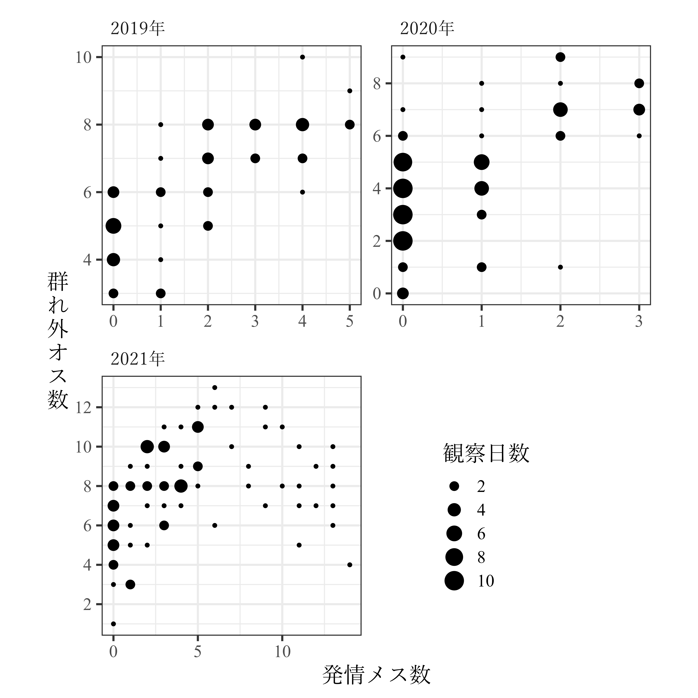

# 基礎情報の算出と図表の作成  
本章では、群れ追跡時間や個体追跡時間などの基本的なデータをまとめる。  

## 群れ追跡時間、調査日数、発情メス数、群れ外オス数のデータ  
発情メス数と群れ外オス数については、300分以上追跡した日のデータのみを使用した。  
```{r }  
base_all %>%
  mutate(season = ifelse(month(date) >= 9 & month(date) <= 12,"m","nm")) %>% 
  mutate(study_period = str_c(season,str_sub(year(date),3,4))) %>% 
  left_join(male_all %>% 
              filter(ntm == "1") %>% 
              group_by(date) %>% 
              summarise(no_ntm = sum(presence, na.rm = TRUE)) %>% 
              ungroup(), by = "date") %>% 
  left_join(female_all %>% 
              group_by(date) %>% 
              summarise(no_est = sum(rs2, na.rm = TRUE)) %>% 
              ungroup(), by = "date") %>% 
  mutate(date = as_date(date)) %>% 
  filter(date != "2019-11-22" & date != "2019-11-23") -> base_all_b
  
base_all_b %>% 
  filter(study_period != "nm20") %>% 
  group_by(study_period) %>% 
  summarise(N = n(),
            follow = str_c(sprintf("%.2f",mean(duration))," ± ",sprintf("%.2f", sd(duration)))) %>% 
  ungroup() -> follow_summary
            
base_all_b %>% 
  filter(duration >= 300) %>% 
  filter(!str_detect(study_period, "nm")) %>% 
  group_by(study_period) %>% 
  summarise(mean_est = str_c(sprintf("%.2f",mean(no_est, na.rm = TRUE))," ± ",sprintf("%.2f", sd(no_est, na.rm = TRUE))),
            range_est = str_c(min(no_est),"–",max(no_est)),
            mean_ntm = str_c(sprintf("%.2f",mean(no_ntm, na.rm = TRUE))," ± ",sprintf("%.2f", sd(no_ntm, na.rm = TRUE))),
            range_ntm = str_c(min(no_ntm),"–",max(no_ntm))) %>% 
  mutate(mean_ntm = ifelse(str_detect(mean_ntm,"NA"),NA,mean_ntm))-> daily_summary

left_join(follow_summary, daily_summary) %>% 
  mutate(season = ifelse(str_detect(study_period,"nm"),"非交尾期","交尾期")) %>%
  mutate(year = str_c("20",str_sub(study_period,-2,-1))) %>% 
  select(season, year, everything()) %>% 
  select(-study_period) %>% 
  replace_na(list(mean_est = "-", range_est = "-", mean_ntm = "-", range_ntm = "-")) %>% 
  rename("季節" = 1,"観察年" = 2, "観察日数" = 3, " 平均±SD" = 4, "平均±SD" = 5, "範囲" = 6, "平均±SD " = 7, "範囲 " = 8) %>% 
  flextable() %>% 
  add_header_row(values = c("","群れ追跡時間","発情メス数","群れ外オス数"), colwidth = c(3,1,2,2)) %>% 
  merge_v(j = 1) %>% 
  theme_zebra() %>% 
  align(j = 3:8, part = "all", align = "center") %>% 
  flextable::font(part = "body", j = 2:8, fontname = "Times New Roman") %>% 
  flextable::font(part = "body", j = 1, fontname = "Yu Mincho") %>%  
  flextable::font(part = "header", j = 1:8, fontname = "Yu Mincho") %>% 
  set_table_properties(layout = "autofit",
                       width = 1) %>% 
  width(j=c(4), width = 1.5) %>% 
  width(j = c(5,7), width = 1.3)-> table_daily_summary

table_daily_summary

# save_as_image(table_daily_summary, "table/table_daily_summary.png")
```

## 発情メス数と群れ外オス数の関連  
300分以上追跡した日について、発情メス数と群れ外オス数の関連を調べる。  

```{r}  
base_all_b %>% 
  filter(duration >= 300) %>% 
  filter(!str_detect(study_period,"nm")) %>% 
  filter(study_period != "m18") %>% 
  mutate(study_period = str_c("20",str_sub(study_period,-2,-1),"年")) %>% 
  ggplot(aes(x = no_est, y = no_ntm))+
  geom_count()+
  scale_size(range = c(3,7))+
  scale_size_continuous(breaks = seq(2,10,by =2))+
  labs(x = "発情メス数", y = "群\nれ\n外\nオ\nス\n数", size = "観察日数")+
  theme_bw(base_size = 16)+
  facet_rep_wrap(~study_period, repeat.tick.labels = TRUE,
                 scales = "free", ncol = 2)+
  scale_x_continuous(breaks = scales::pretty_breaks(4.5))+
  scale_y_continuous(breaks = seq(0,15,by=2))+
  theme(strip.background = element_blank(),
        strip.text = element_text(hjust = 0,
                                  family = "Yu Mincho"),
        aspect.ratio = 1,
        legend.position = c(0.7,0.2),
        axis.title.y = element_text(angle = 0,
                                    vjust = 0.5,
                                    family = "Yu Mincho"),
        axis.title.x = element_text(family = "Yu Mincho"),
        legend.title = element_text(family = "Yu Mincho"),
        axis.text = element_text("Times New Roman"),
        legend.text = element_text(family = "Times New Roman")) -> p_est_ntm

# ggsave("figure/p_est_ntm.png", p_est_ntm, width = 180, height = 180, units = "mm", dpi = 600)
```

```{r, fig.dim = c(10,10), fig.cap = "発情メス数と群れ外オス数の関連"}

```

## 個体追跡データ  
### 各個体の追跡時間概要  
#### 交尾期  
```{r}
att <- read_csv("data/attributes.csv")

focal_raw_fin %>% 
  group_by(no_focal, subject, study_period, rs2) %>% 
  summarise(dur = max(time)) %>% 
  ungroup() %>% 
  group_by(study_period, subject, rs2) %>% 
  summarise(N = n(),
            mean = mean(dur),
            sd = sd(dur, na.rm = TRUE)) %>% 
  replace_na(list(sd = 0)) %>% 
  ungroup() %>% 
  mutate(meansd = str_c(sprintf("%.2f",mean),"±",sprintf("%.2f",sd))) %>% 
  left_join(att, by = c("study_period","subject" = "femaleID"))  -> focal_summary

focal_summary %>% 
  ungroup() %>% 
  filter(rs2 == "0") %>% 
  select(-rs2, -mean, -sd) %>% 
  group_by(study_period) %>% 
  mutate(subject = fct_reorder(subject,rank)) %>% 
  ungroup() %>% 
  select(-rank, -age) %>% 
  left_join(focal_summary %>% 
  filter(rs2 == "1") %>% 
  select(-rs2, -mean, -sd) %>% 
  group_by(study_period) %>% 
  mutate(subject = fct_reorder(subject,rank)) %>% 
  ungroup() %>% 
  select(-rank, -age), by = c("study_period", "subject")) %>% 
  arrange(study_period, subject) %>% 
  mutate(study_period = str_c("20",str_sub(study_period,2,3),"年")) %>% 
  rename("調査期間" = 1,"個体名" = 2, "N" = 3, "平均±SD(分)" = 4, "N " = 5, "平均±SD(分) " = 6) %>%
  flextable() %>% 
  add_header_row(values = c("","非発情","発情"), colwidth = c(2,2,2)) %>% 
  merge_v(j = 1) %>% 
  theme_zebra() %>% 
  align(j = 3:6, part = "all", align = "center") %>% 
  flextable::font(part = "body", j = 2:6, fontname = "Times New Roman") %>% 
  flextable::font(part = "body", j = 1, fontname = "Yu Mincho") %>%  
  flextable::font(part = "header", j = 1:6, fontname = "Yu Mincho") %>% 
  set_table_properties(layout = "autofit",
                       width = 1) %>% 
  width(j=c(4,6), width = 1.5) -> table_focal_summary

table_focal_summary

# save_as_image(table_focal_summary, "table/table_focal_summary.png")
```

#### 非交尾期  
```{r}
bind_rows(focal_list19nm, focal_list21nm, focal_list22nm) %>% 
  dplyr::select(study_period, subject, duration) %>% 
  group_by(study_period, subject) %>% 
  summarise(N = n(),
            mean = mean(duration),
            sd = sd(duration, na.rm = TRUE)) %>% 
  replace_na(list(sd = 0)) %>% 
  ungroup() %>% 
  mutate(meansd = str_c(sprintf("%.2f",mean),"±",sprintf("%.2f",sd))) %>% 
  dplyr::select(-mean, -sd) %>% 
  left_join(att %>% select(study_period, femaleID,rank), by = c("study_period","subject" = "femaleID")) %>% 
  group_by(study_period) %>% 
  mutate(subject = fct_reorder(subject,rank)) %>% 
  ungroup() %>% 
  arrange(study_period, subject) %>% 
  mutate(study_period = str_c("20",str_sub(study_period,3,4),"年")) %>% 
  rename("調査期間" = 1,"個体名" = 2, "N" = 3, "平均±SD(分)" = 4) %>%
  select(-rank) %>% 
  flextable() %>% 
  merge_v(j = 1) %>% 
  theme_zebra() %>% 
  align(j = 3:4, part = "all", align = "center") %>% 
  flextable::font(part = "body", j = 2:4, fontname = "Times New Roman") %>% 
  flextable::font(part = "body", j = 1, fontname = "Yu Mincho") %>%  
  flextable::font(part = "header", j = 1:4, fontname = "Yu Mincho") %>% 
  set_table_properties(layout = "autofit",
                       width = 1) %>% 
  width(j=c(3,4), width = 1.5)-> table_focal_summary_nm

table_focal_summary_nm

# save_as_image(table_focal_summary_nm, "table/table_focal_summary_nm.png")
```

### 簡略版  
#### 交尾期  
```{r}
focal_raw_fin %>% 
  group_by(no_focal, subject, study_period, rs2) %>% 
  summarise(dur = max(time)) %>% 
  ungroup() %>% 
  group_by(study_period,rs2) %>% 
  summarise(N_subject = length(unique(subject)),
            N = n(),
            mean = mean(dur),
            sd = sd(dur)) %>% 
  ungroup() %>% 
  mutate(meansd = str_c(sprintf("%.2f",mean),"±",sprintf("%.2f",sd))) %>% 
  select(-mean,-sd) -> focal_summary_sim

focal_summary_sim %>% 
  filter(rs2 == "0") %>% 
  select(-rs2) %>% 
  bind_cols(focal_summary_sim %>% 
  filter(rs2 == "1") %>% 
  select(-rs2) %>% 
  select(-study_period)) %>% 
  mutate(study_period = str_c("20",str_sub(study_period,2,3),"年")) %>% 
  rename("調査期間" = 1,"観察個体数" = 2, "N" = 3,"平均±SD(分)" = 4, ,"観察個体数 " = 5, "N " = 6, "平均±SD(分) " = 7) %>% 
  flextable() %>% 
  add_header_row(values = c("","非発情","発情"), colwidth = c(1,3,3)) %>% 
  merge_v(j = 1) %>% 
  theme_zebra() %>% 
  align(j = 2:7, part = "all", align = "center") %>% 
  flextable::font(part = "body", j = 2:7, fontname = "Times New Roman") %>% 
  flextable::font(part = "body", j = 1, fontname = "Yu Mincho") %>%  
  flextable::font(part = "header", j = 1:7, fontname = "Yu Mincho") %>% 
  set_table_properties(layout = "autofit",
                       width = 1) %>% 
  width(j=c(4,7), width = 1.3) -> table_focal_summary_sim

table_focal_summary_sim

# save_as_image(table_focal_summary_sim, "table/table_focal_summary_sim.png")
```

#### 非交尾期  
```{r}
bind_rows(focal_list19nm, focal_list21nm, focal_list22nm) %>% 
  group_by(study_period) %>% 
  summarise(N_subject = length(unique(subject)),
            N = n(),
            mean = mean(duration),
            sd = sd(duration)) %>% 
  ungroup() %>% 
  mutate(meansd = str_c(sprintf("%.2f",mean),"±",sprintf("%.2f",sd))) %>% 
  select(-mean,-sd) %>% 
  mutate(study_period = str_c("20",str_sub(study_period,3,4),"年")) %>% 
  rename("調査期間" = 1,"観察個体数" = 2, "N" = 3,"平均±SD(分)" = 4) %>% 
  flextable() %>% 
  theme_zebra() %>% 
  align(j = 2:4, part = "all", align = "center") %>% 
  flextable::font(part = "body", j = 2:4, fontname = "Times New Roman") %>% 
  flextable::font(part = "body", j = 1, fontname = "Yu Mincho") %>%  
  flextable::font(part = "header", j = 1:4, fontname = "Yu Mincho") %>% 
  set_table_properties(layout = "autofit",
                       width = 1) %>% 
  width(j=c(4), width = 1.3)-> table_focal_summary_nm_sim

table_focal_summary_nm_sim

# save_as_image(table_focal_summary_nm_sim, "table/table_focal_summary_nm_sim.png")
```

