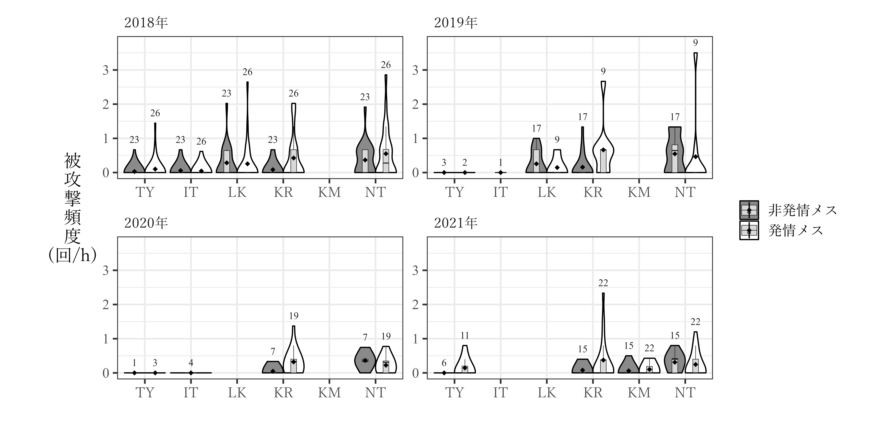

# メスの被攻撃頻度はどのようなときに多くなるか  
以下では、メスがオスから攻撃される頻度がどのような要因によって変化するのかを検討する。  

## 個体追跡データによる分析  
### データの加工  
個体追跡の生データを加工する。メスの被攻撃頻度に関連する要因としては、以下のものを考える。2018年は群れ外オス数が確認できていないため、ここでは除外する。また、60分以上追跡できた個体追跡セッションのみを用いる。      

- 追跡個体の発情の有無  
- 観察日の群れ外オス数  
- 観察日の発情メス数  
- 観察時の*TY*の有無、*IT*の有無(2019~2020年のみ)   

**群れオス・群れ外オスを区別せず**  
```{r}
focal_raw_fin %>% 
  group_by(no_focal, subject, rs2, TY, IT) %>% 
  summarise(no_agg1 = sum(if_victim1, na.rm = TRUE),
            no_agg2 = sum(if_victim2, na.rm = TRUE),
            dur = max(time),
            no_ntm = mean(no_ntm, na.rm = TRUE),
            no_est = mean(no_est, na.rm = TRUE),
            study_period = unique(study_period)) %>% 
  ungroup() %>% 
  mutate(no_agg = no_agg1 + no_agg2) %>% 
  select(-no_agg1, -no_agg2) %>% 
  mutate(logdur = log(dur/60)) %>% 
  replace_na(list(IT = 0)) %>% 
  mutate(cen_ntm = no_ntm - mean(no_ntm, na.rm = TRUE),
         cen_est = no_est - mean(no_est, na.rm = TRUE),
         std_ntm = standardize(no_ntm),
         std_est = standardize(no_est)) -> focal_sum
```


**群れオス・群れ外オスを区別**  
```{r}
focal_raw_fin %>% 
  left_join(males, by = c("study_period", "aggressor_focal1" = "maleID")) %>% 
  rename(ntm1 = ntm) %>% 
  mutate(ntm1 = ifelse(is.na(aggressor_focal1),NA,
                       ifelse(is.na(ntm1) & !is.na(aggressor_focal1),1,ntm1))) %>% 
  left_join(males, by = c("study_period", "aggressor_focal2" = "maleID")) %>% 
  rename(ntm2 = ntm) %>% 
  mutate(ntm2 = ifelse(is.na(aggressor_focal2),NA,
                       ifelse(is.na(ntm2) & !is.na(aggressor_focal2),1,ntm2))) -> focal_raw_fin_b
  
focal_raw_fin_b %>% 
  filter(agg_focal == "1") %>% 
  group_by(no_focal, subject, ntm1) %>% 
  summarise(no_agg = sum(agg_focal, na.rm = TRUE)) %>% 
  ungroup() %>% 
  pivot_wider(names_from = ntm1, values_from = no_agg) %>% 
  rename(agg_tm1 = `0`, agg_ntm1 = `1`) %>% 
  replace_na(list(agg_tm1 = 0, agg_ntm1 = 0))-> focal_list_ntm1

focal_raw_fin_b %>% 
  filter(agg_focal == "1" & !is.na(aggressor_focal2)) %>% 
  group_by(no_focal, subject, ntm2) %>% 
  summarise(no_agg = sum(agg_focal, na.rm = TRUE)) %>% 
  ungroup() %>% 
  pivot_wider(names_from = ntm2, values_from = no_agg) %>% 
  rename(agg_tm2 = `0`, agg_ntm2 = `1`) %>% 
  replace_na(list(agg_tm2 = 0, agg_ntm2 = 0)) -> focal_list_ntm2

left_join(focal_list_ntm1, focal_list_ntm2) %>% 
  replace_na(list(agg_tm2 = 0, agg_ntm2 = 0)) %>% 
  mutate(agg_tm = agg_tm1 + agg_tm2,
         agg_ntm = agg_ntm1 + agg_ntm2) %>% 
  select(-(agg_tm1:agg_ntm2)) %>% 
  right_join(focal_sum) %>% 
  replace_na(list(agg_tm = 0, agg_ntm = 0)) -> focal_sum_ntm
```

まとめたものは以下の通り。  
```{r}
datatable(focal_sum,
          options = list(scrollX = 10),
          filter = list(position ="top"))
```
<br/>  

### データの確認  
#### 調査年ごとの被攻撃頻度  
調査期間ごとに、発情メス・非発情メスが群れオス・群れ外オスから攻撃された頻度を図示する。  
```{r}
focal_sum_ntm %>% 
  filter(dur >= 60) %>% 
  pivot_longer(agg_tm:agg_ntm, names_to = "type", values_to= "agg") %>% 
  ggplot(aes(x = study_period, y = agg*60/dur))+
  geom_violin(aes(fill = type), bw = 0.25,
              color = "black",
              scale = "width")+
  geom_boxplot(aes(color = type),
               fill = "grey85",
               outlier.alpha = 0,
               width = 0.2,
               size = 0.2,
               position = position_dodge(0.9))+
  stat_summary(aes(fill = type),
               fun = "mean",
               position = position_dodge(0.9),
               shape = 18,
               size = 0.5)+
  labs(x = "", y = "被\n攻\n撃\n頻\n度\n(回/h)",
       fill = "", color = "")+
  facet_rep_wrap(~rs2, repeat.tick.labels = TRUE,
                 ncol = 2,
                 labeller = as_labeller(c("0" = "非発情メス","1" = "発情メス")))+
  theme_bw(base_size = 15)+
  scale_fill_manual(values = c("grey54","white"),
                    labels = c("群れ外オス","群れオス"))+
  scale_color_manual(values = c("grey10","grey10"),
                    labels = c("群れ外オス","群れオス"))+
  scale_x_discrete(labels = c("2018年","2019年","2020年","2021年"))+
  theme(aspect.ratio = 0.7,
        strip.background = element_blank(),
        strip.text = element_text(family = "Yu Mincho",
                                  hjust = 0),
        axis.text.x =  element_text(family = "Yu Mincho"),
        axis.title.y = element_text(family = "Yu Mincho",
                                    angle = 0,
                                    vjust = 0.5),
        legend.text = element_text(family = "Yu Mincho"),
        axis.text.y = element_text(family = "Times New Roman")) -> p_focalagg_studyperiod

# ggsave("figure/p_focalagg_studyperiod.png", p_focalagg_studyperiod, width = 270, height = 110, units = "mm", dpi = 600)
```

以下の通り。  
```{r fig-aggfocal-studyperiod, echo=FALSE, out.width="100%", fig.cap="調査期間ごとの被攻撃頻度"}
knitr::include_graphics("figure/p_focalagg_studyperiod.png")
```
<br/>  

続いて、群れオス・群れ外オスを分けバージョンを図示する。    
```{r}
focal_sum_ntm %>% 
  filter(dur >= 60) %>% 
  ggplot(aes(x = study_period, y = no_agg*60/dur))+
  geom_violin(bw = 0.3,
              color = "black",
              scale = "width")+
  geom_boxplot(fill = "grey85",
               outlier.alpha = 0,
               width = 0.2,
               size = 0.2)+
  stat_summary(fun = "mean",
               shape = 18,
               size = 0.5)+
  labs(x = "", y = "被\n攻\n撃\n頻\n度\n(回/h)",
       fill = "", color = "")+
  facet_rep_wrap(~rs2, repeat.tick.labels = TRUE,
                 ncol = 2,
                 labeller = as_labeller(c("0" = "非発情メス","1" = "発情メス")))+
  theme_bw(base_size = 15)+
  scale_x_discrete(labels = c("2018年","2019年","2020年","2021年"))+
  theme(aspect.ratio = 0.7,
        strip.background = element_blank(),
        strip.text = element_text(family = "Yu Mincho",
                                  hjust = 0),
        axis.text.x =  element_text(family = "Yu Mincho"),
        axis.title.y = element_text(family = "Yu Mincho",
                                    angle = 0,
                                    vjust = 0.5),
        legend.text = element_text(family = "Yu Mincho"),
        axis.text.y = element_text(family = "Times New Roman")) -> p_focalagg_studyperiod_2

# ggsave("figure/p_focalagg_studyperiod_2.png", p_focalagg_studyperiod_2, width = 200, height = 110, units = "mm", dpi = 600)
```

以下の通り。  
```{r fig-aggfocal-studyperiod-2, echo=FALSE, out.width="100%", fig.cap="調査期間ごとの被攻撃頻度"}
knitr::include_graphics("figure/p_focalagg_studyperiod_2.png")
```
<br/>  

#### オスごとの攻撃頻度  
##### データの加工  
```{r}
focal_raw_fin_b %>% 
  mutate(aggressor1 = ifelse(ntm1 == "1", "NT", aggressor_focal1)) %>% 
  mutate(aggressor2 = ifelse(ntm2 == "1", "NT", aggressor_focal2)) -> focal_raw_maleID
  
focal_raw_maleID %>% 
  filter(agg_focal == "1") %>% 
  group_by(no_focal, subject, aggressor1) %>% 
  summarise(agg_ID = n()) %>% 
  ungroup() %>% 
  rename(aggressor = aggressor1) -> focal_agg_ID1

focal_raw_maleID %>% 
  filter(agg_focal == "1") %>% 
  group_by(no_focal, subject, aggressor2) %>% 
  summarise(agg_ID = n()) %>% 
  ungroup() %>% 
  drop_na(aggressor2) %>% 
  rename(aggressor = aggressor2) -> focal_agg_ID2

focal_agg_ID1 %>% 
  bind_rows(focal_agg_ID2) %>% 
  group_by(no_focal, aggressor) %>% 
  summarise(agg = sum(agg_ID)) %>% 
  ungroup() -> focal_agg_ID 
  
focal_agg_ID  %>% 
  right_join(focal_sum_ntm) %>%
  drop_na(aggressor) %>% 
  replace_na(list(agg = 0)) %>% 
  select(no_focal, aggressor) %>% 
  complete(no_focal, aggressor) %>% 
  left_join(focal_agg_ID) %>% 
  replace_na(list(agg = 0)) %>% 
  right_join(focal_sum_ntm) %>% 
  mutate(inc = ifelse(study_period %in% c("m18","m19","m20") & aggressor == "KM"| study_period == "m21" & aggressor == "IT"|
                        study_period %in% c("m20","m21") & aggressor == "LK",0,1)) %>% 
  filter(inc == "1") %>% 
  mutate(inc2 = ifelse(TY == "0" & aggressor == "TY"|IT == "0" & aggressor == "IT", 0,1)) %>% 
  filter(inc2 == "1")-> focal_sum_ID
```

##### 図示  
```{r}
N <- focal_sum_ID %>% 
  mutate(rs2 = as.factor(rs2)) %>% 
  mutate(rate_agg = agg*60/dur) %>% 
  mutate(study_period = str_c("20",str_sub(study_period,2,3),"年")) %>% 
  mutate(aggressor = fct_relevel(aggressor,"TY","IT","LK","KR","KM","NT")) %>% 
  filter(dur >= 60) %>% 
  group_by(study_period, aggressor, rs2) %>% 
  summarise(N = n(),
            y = max(rate_agg + 0.3)) %>% 
  ungroup()

focal_sum_ID %>% 
  mutate(rs2 = as.factor(rs2)) %>% 
  filter(dur >= 60) %>% 
  mutate(rate_agg = agg*60/dur) %>% 
  mutate(study_period = str_c("20",str_sub(study_period,2,3),"年")) %>% 
  mutate(aggressor = fct_relevel(aggressor,"TY","IT","LK","KR","KM","NT")) %>% 
  ggplot(aes(x = aggressor, y = rate_agg))+
  geom_violin(aes(fill = rs2), bw = 0.25,
              color = "black",
              scale = "width")+
  geom_boxplot(aes(color = rs2),
               fill = "grey85",
               outlier.alpha = 0,
               width = 0.25,
               position = position_dodge(0.9),
               size = 0.2)+
  stat_summary(aes(fill = rs2),
               fun = "mean",
               position = position_dodge(0.9),
               shape = 18,
               size = 0.35)+
  geom_text(data = N,
            aes(y = y, color = rs2, label = N),
            stat = "identity",
            position = position_dodge(0.9),
            family = "Times New Roman",
            size = 3) +
  labs(x = "", y = "被\n攻\n撃\n頻\n度\n(回/h)",
       fill = "", color = "")+
  facet_rep_wrap(~study_period, repeat.tick.labels = TRUE,
                 ncol = 2) +
  theme_bw(base_size = 15)+
  scale_fill_manual(values = c("grey54","white"),
                    labels = c("非発情メス","発情メス"))+
  scale_color_manual(values = c("grey10","grey10"),
                    labels = c("非発情メス","発情メス"))+
  theme(aspect.ratio = 0.5,
        strip.background = element_blank(),
        strip.text = element_text(family = "Yu Mincho",
                                  hjust = 0),
        axis.text.x =  element_text(family = "Yu Mincho"),
        axis.title.y = element_text(family = "Yu Mincho",
                                    angle = 0,
                                    vjust = 0.5),
        legend.text = element_text(family = "Yu Mincho"),
        axis.text.y = element_text(family = "Times New Roman")) -> p_focalagg_maleID

# ggsave("figure/p_focalagg_maleID.png", p_focalagg_maleID, width = 270, height = 130, units = "mm", dpi = 600)
```

以下の通り。  
```{r fig-aggfocal-maleID, echo=FALSE, out.width="100%", fig.cap="調査期間ごとの各オスからの被攻撃頻度"}

```

### 分析  
それでは、分析に移る。以下では、主に群れ外オス数がメスの被攻撃頻度と同関連しているかを検討する。  

#### 群れオスと群れ外オスの攻撃を区別しない    
まず、群れオスと群れ外オスの攻撃を区別しないで分析を行う。  

##### モデリング       
モデルの詳細は以下の通り。なお、群れ外オス数と発情メス数は中心化した。60分以上追跡したデータのみを使用。      

- 分布: 負の二項分布  
- 応答変数: 被攻撃回数(`no_agg`)    
- オフセット項: log(追跡時間)(`logdur`)    
- 説明変数: 追跡個体の発情の有無(`rs2`)、観察日の群れ外オス数(`cen_ntm`)、発情メス数(`cen_est`)、発情の有無×群れ外オス数、発情の有無×発情メス数、*TY*の有無(`TY`)、調査期間(`study_period`)    
- ランダム切片: 追跡個体ID  

```{r}
m_aggfocal <- brm(no_agg ~ cen_ntm + cen_ntm:rs2 + rs2 + TY + study_period + offset(logdur) + (1|subject),
                     family = negbinomial,
                     iter = 5000, warmup = 2500, seed = 13,
                     prior = c(prior(student_t(4,0,5), class = "b"),
                           prior(student_t(4,0,10), class = "Intercept"),
                           prior(student_t(4,0,10), class = "sd"),
                           prior(gamma(0.01,0.01), class = "shape")),
                     control=list(adapt_delta = 0.9999, max_treedepth = 20),
                     backend = "cmdstanr",
                     data = focal_sum %>% filter(dur >= 60),
                    file = "model/m_aggfocal.rds")
```

###### モデルチェック  
分布から大きく外れていることはなく、過分散や外れ値の問題もないよう。  
```{r, include = FALSE}
check_m_aggfocal <- dh_check_brms(m_aggfocal)
```

```{r}
plotQQunif(check_m_aggfocal)
```

ゼロ過剰の問題もない。  
```{r}
testZeroInflation(check_m_aggfocal)
```

VIFは全て10以下であり、そこまで多重共線性の問題はないよう。  
```{r}
check_collinearity(m_aggfocal)
```

###### 結果の確認  
調査期間と発情の有無が有意な影響。2020年と2021年は他の変数を統制したときに2019年より被攻撃頻度が低かったようだ。  
```{r}
model_parameters(m_aggfocal) %>% 
  data.frame() %>% 
  select(c(1,3,5,6)) %>%   
  filter(Parameter != "shape") %>% 
  mutate("95%CI" = str_c("[",sprintf("%.2f",CI_low),",",sprintf("%.2f",CI_high),"]")) %>% 
  mutate(Median = sprintf("%.2f",Median)) %>% 
  select(1,2,5) %>% 
  mutate(Parameter = str_replace(Parameter,"b_","")) %>% 
  mutate(Parameter = str_replace_all(Parameter, c("Intercept" = "切片","cen_ntm" = "群れ外オス数","rs2" = "発情有(vs 無)",
                                              "TY" = "TY(在 vs 不在)", "study_periodm20" = "2020年(vs 2019年)",
                                              "study_periodm21" = "2021年(vs 2019年)", "cen_ntm:rs2" = "群れ外オス数×発情の有無",
                                              ":" = "×"))) %>% 
  rename("説明変数" =1, "係数の推定値" = 2) %>% 
  flextable() %>% 
  theme_zebra() %>% 
  colformat_double(digits=2) %>% 
  set_table_properties(layout="autofit",width = 1) %>% 
  align(j=2:3,part = "all",align = "center") %>% 
  font(part = "header", fontname = "Yu Mincho") %>% 
  font(part = "body", j=2:3, fontname = "Times New Roman") %>% 
  font(part = "body", j=1, fontname = "Yu Mincho") %>% 
  width(j=c(1), width = 2.3) %>% 
  width(j = 2, width = 1.5)-> table_agg_focal

table_agg_focal  

# save_as_image(table_agg_focal, "table/table_agg_focal.png")
```
<br/>  

交互作用項のある変数の検討を行う。  

まず、群れ外オス数については非発情メスについては被攻撃頻度と正の関連があった。  
```{r}
estimate_slopes(m_aggfocal,
               trend = "cen_ntm",
               at = "rs2 = c(0,1)")
```
<br/>  

発情の有無については、群れ外オス数に関わりなく非発情メスの方が発情メスよりも被攻撃頻度が有意に低い(図\@ref(fig:fig-aggfocal-rs))。
```{r fig-aggfocal-rs, fig.dim = c(12,5), fig.cap = "群れ外オス数/発情メス数ごとの発情の有無の効果"}
estimate_contrasts(m_aggfocal,
                   contrast = "rs2 = c(0,1)",
                   at = c("cen_ntm"),
                   length = 30) %>% 
  data.frame() -> estimate_cont_rs_ntm

estimate_cont_rs_ntm %>%
  mutate(no_ntm = cen_ntm + mean(focal_sum$no_ntm, na.rm = TRUE)) %>% 
  ggplot(aes(x = no_ntm, y = -Difference))+
  geom_line()+
  geom_ribbon(aes(ymin = -CI_low,
                  ymax = -CI_high),
              alpha = 0.2)+
  geom_hline(yintercept = 0,
             color = "red")+
  theme_bw(base_size = 15)+
  theme(aspect.ratio = 1,
        plot.title = element_text(size = 13))+
  scale_x_continuous(breaks = seq(0,13,1))+
  labs(title = "Effect of estrous status\nby number of nontroop males",
       y = "estrous - anestrus",
       x = "no. of nontroop males") -> p_cont_rs_ntm

p_cont_rs_ntm

# ggsave("figure/p_cont_rs_ntm.png", p_cont_rs_ntm, dpi = 600, width =100, height =100, units = "mm")
```


#### 群れオス・群れ外オスを区別  
続いて、群れオスと群れ外オスの攻撃を区別して分析する。  
いずれの分析ではモデルは以下の通りで、群れオス・群れ外オスを区別しない場合と同じである。  

- 分布: 負の二項分布  
- 応答変数: 被攻撃回数(`no_agg`)    
- オフセット項: log(追跡時間)(`logdur`)    
- 説明変数: 追跡個体の発情の有無(`rs2`)、観察日の群れ外オス数(`cen_ntm`)、発情の有無×群れ外オス数、*TY*の有無(`TY`)、調査期間(`study_period`)    
- ランダム切片: 追跡個体ID  

##### 群れオスからの攻撃頻度  
###### モデリング        
まず、群れオスの攻撃についてモデリングする。  
```{r}
m_aggfocal_tm <- brm(agg_tm ~ cen_ntm*rs2 + TY + study_period + offset(logdur) + (1|subject),
                         family = negbinomial,
                         iter = 5000, warmup = 2500, seed = 13,
                           prior = c(prior(student_t(4,0,5), class = "b"),
                           prior(student_t(4,0,10), class = "Intercept"),
                           prior(student_t(4,0,10), class = "sd"),
                           prior(gamma(0.01,0.01), class = "shape")),
                         control=list(adapt_delta = 0.9999, max_treedepth = 20),
                         backend = "cmdstanr",
                         data = focal_sum_ntm %>% filter(dur >= 60),
                         file = "model/m_aggfocal_tm.rds")
```

**モデルチェック**  
分布から大きく外れていることはなく、過分散や外れ値の問題もないよう。  
```{r, include = FALSE}
check_m_aggfocal_tm <- dh_check_brms(m_aggfocal_tm)
```

```{r}
plotQQunif(check_m_aggfocal_tm)
```

ゼロ過剰の問題もない。  
```{r}
testZeroInflation(check_m_aggfocal_tm)
```

多重共線性の問題もない。   
```{r}
check_collinearity(m_aggfocal_tm)
```

**結果の確認**  
発情の有無と調査期間のみが有意だった。  
```{r}
model_parameters(m_aggfocal_tm) %>% 
  data.frame() %>% 
  select(c(1,3,5,6)) %>%   
  filter(Parameter != "shape") %>% 
  mutate("95%CI" = str_c("[",sprintf("%.2f",CI_low),",",sprintf("%.2f",CI_high),"]")) %>% 
  mutate(Median = sprintf("%.2f",Median)) %>% 
  select(1,2,5) %>% 
  mutate(Parameter = str_replace(Parameter,"b_","")) %>% 
  mutate(Parameter = str_replace_all(Parameter, c("Intercept" = "切片","cen_ntm" = "群れ外オス数","rs2" = "発情有(vs 無)",
                                              "TY" = "TY(在 vs 不在)", "study_periodm20" = "2020年(vs 2019年)",
                                              "study_periodm21" = "2021年(vs 2019年)", "cen_ntm:rs2" = "群れ外オス数×発情の有無",
                                              ":" = "×"))) %>% 
  rename("説明変数" =1, "係数の推定値" = 2) %>% 
  flextable() %>% 
  theme_zebra() %>% 
  colformat_double(digits=2) %>% 
  set_table_properties(layout="autofit",width = 1) %>% 
  align(j=2:3,part = "all",align = "center") %>% 
  font(part = "header", fontname = "Yu Mincho") %>% 
  font(part = "body", j=2:3, fontname = "Times New Roman") %>% 
  font(part = "body", j=1, fontname = "Yu Mincho") %>% 
  width(j=c(1), width = 2.3) %>% 
  width(j = 2, width = 1.5)-> table_agg_focal_tm

table_agg_focal_tm  

# save_as_image(table_agg_focal_tm, "table/table_agg_focal_tm.png")
```
<br/>  

交互作用項のある変数の検討を行う。発情メス・非発情メスのいずれについても観察日の群れ外オス数の効果はなかった。  
```{r}
estimate_slopes(m_aggfocal_tm,
               trend = "cen_ntm",
               at = "rs2 = c(0,1)")
```
<br/>  

発情の有無については、群れ外オス数に関わりなく非発情メスの方が発情メスよりも被攻撃頻度が有意に低い(図\@ref(fig:fig-aggfocal-rs-tm))。  
```{r fig-aggfocal-rs-tm, fig.dim = c(12,5), fig.cap = "群れ外オス数/発情メス数ごとの発情の有無の効果"}
estimate_contrasts(m_aggfocal_tm,
                   contrast = "rs2 = c(0,1)",
                   at = c("cen_ntm"),
                   length = 30) %>% 
  data.frame() -> estimate_cont_rs_tm_ntm

estimate_cont_rs_tm_ntm %>%
  mutate(no_ntm = cen_ntm + mean(focal_sum_ntm$no_ntm, na.rm = TRUE)) %>% 
  ggplot(aes(x = no_ntm, y = -Difference))+
  geom_line()+
  geom_ribbon(aes(ymin = -CI_low,
                  ymax = -CI_high),
              alpha = 0.2)+
  geom_hline(yintercept = 0,
             color = "red")+
  theme_bw(base_size = 15)+
  theme(aspect.ratio = 1,
        plot.title = element_text(size = 13))+
  scale_x_continuous(breaks = seq(0,13,1))+
  labs(title = "Effect of estrous status\nby number of nontroop males",
       y = "estrous - anestrus",
       x = "no. of nontroop males") -> p_cont_rs_tm_ntm

p_cont_rs_tm_ntm

# ggsave("figure/p_cont_rs_tm_ntm.png", p_cont_rs_tm_ntm, dpi = 600, width =100, height =100, units = "mm")
```

**結果の図示**  
```{r}
focal_sum_ntm %>% 
  filter(dur >= 60) -> focal_sum_ntm_b

nd_aggfocal_tm <- tidyr::crossing(rs2 = c(0,1),
                          study_period = c("m19","m20","m21"),
                          cen_ntm = seq(min(focal_sum_ntm_b$cen_ntm, na.rm = TRUE),
                                        max(focal_sum_ntm_b$cen_ntm, na.rm = TRUE), length.out = 50),
                          TY = 0.5)

posterior_samples(m_aggfocal_tm) %>% 
  select(1:7) %>% 
  rename("In" = 1, "b_ntm" = 2, "b_rs" = 3, "b_TY" = 4, "m20" = 5, "m21" = 6, "int" = 7) %>% 
  tidyr::expand(nd_aggfocal_tm,
         nesting(In, b_ntm, b_rs, b_TY, m20, m21, int)) %>%  
  mutate(lambda = ifelse(study_period == "m19", exp(In + b_ntm*cen_ntm + b_rs*rs2 + b_TY*TY + int*cen_ntm*rs2),
                  ifelse(study_period == "m20", exp(In + m20+ b_ntm*cen_ntm + b_rs*rs2 + b_TY*TY + int*cen_ntm*rs2),
                  ifelse(study_period == "m21", exp(In + m21+b_ntm*cen_ntm + b_rs*rs2 + b_TY*TY + int*cen_ntm*rs2),0)))) %>% 
  mutate(lambda = as.numeric(lambda)) %>% 
  group_by(study_period, rs2, cen_ntm) %>% 
  summarise(Mean = mean(lambda),
         CI_low = quantile(lambda, 0.025),
         CI_high = quantile(lambda, 0.975)) %>% 
  mutate(no_ntm = cen_ntm + mean(focal_sum_ntm_b$no_ntm, na.rm = TRUE))-> fit_aggfocal_tm

focal_sum_ntm_b %>% 
  ggplot(aes(x = no_ntm, y = agg_tm*60/dur))+
  geom_count(aes(color = study_period),
             alpha = 0.7)+
  scale_size(range = c(2,6))+
  geom_line(data = fit_aggfocal_tm,
            aes(x = no_ntm, y = Mean, color = study_period))+
  geom_ribbon(data = fit_aggfocal_tm,
              aes(y = Mean, ymin = CI_low, ymax = CI_high,
                  fill = study_period),
              alpha = 0.3)+
  facet_grid(~rs2,
             labeller = as_labeller(c("0" = "非発情", "1" = "発情")))+
  theme_bw(base_size = 15)+
  theme_bw(base_size = 15)+
  labs(x = "観察日の群れ外オス数", y = "被\n攻\n撃\n頻\n度\n(回/h)",
       color = "調査期間", fill = "調査期間") +
  scale_x_continuous(breaks = seq(0,15,2))+
  scale_fill_nejm()+
  scale_color_nejm()+
  theme(axis.title.y = element_text(angle = 0,
                                    vjust = 0.5,
                                    family = "Yu Mincho"),
        axis.title.x = element_text(family = "Yu Mincho"),
        axis.text.x = element_text(family = "Yu Mincho"),
        axis.text.y = element_text(family = "Times New Roman",
                                   size = 12),
        strip.text = element_text(family = "Yu Mincho",
                                  hjust = 0),
        strip.background = element_blank(),
        legend.title = element_text(family = "Yu Mincho"),
        legend.text = element_text(family = "Times New Roman"),
        aspect.ratio = 1)  -> p_aggfocal_tm

# ggsave("figure/p_aggfocal_tm.png",  p_aggfocal_tm, width = 220, height = 100, units = "mm", dpi = 600)
```

```{r fig-aggfocal-tm, echo=FALSE, out.width="100%", fig.cap="群れ外オス数ごとの群れオスからの被攻撃頻度"}
knitr::include_graphics("figure/p_aggfocal_tm.png")
```


##### 群れ外オスからの攻撃頻度  
###### モデリング      
続いて、群れ外オスからの攻撃についてモデリングする。  

```{r}
m_aggfocal_ntm <- brm(agg_ntm ~ cen_ntm*rs2 + TY + study_period + offset(logdur) + (1|subject),
                     family = negbinomial,
                     iter = 5000, warmup = 2500, seed = 13,
                     prior = c(prior(student_t(4,0,5), class = "b"),
                           prior(student_t(4,0,10), class = "Intercept"),
                           prior(student_t(4,0,10), class = "sd"),
                           prior(gamma(0.01,0.01), class = "shape")),
                     control=list(adapt_delta = 0.9999, max_treedepth = 20),
                     backend = "cmdstanr",
                     data = focal_sum_ntm %>% filter(dur >= 60),
                     file = "model/m_aggfocal_ntm.rds")
```

**モデルチェック**  
分布から大きく外れていることはなく、過分散や外れ値の問題もないよう。  
```{r, include = FALSE}
check_m_aggfocal_ntm <- dh_check_brms(m_aggfocal_ntm)
```

```{r}
plotQQunif(check_m_aggfocal_ntm)
```

ゼロ過剰の問題もない。  
```{r}
testZeroInflation(check_m_aggfocal_ntm)
```

VIFは全て10以下であり、そこまで多重共線性の問題はないよう。  
```{r}
check_collinearity(m_aggfocal_ntm)
```

**結果の確認**  
群れ外オス数、調査期間、発情の有無に有意な影響があった。
```{r}
model_parameters(m_aggfocal_ntm)%>% 
  data.frame() %>% 
  select(c(1,3,5,6)) %>%   
  filter(Parameter != "shape") %>% 
  mutate("95%CI" = str_c("[",sprintf("%.2f",CI_low),",",sprintf("%.2f",CI_high),"]")) %>% 
  mutate(Median = sprintf("%.2f",Median)) %>% 
  select(1,2,5) %>% 
  mutate(Parameter = str_replace(Parameter,"b_","")) %>% 
  mutate(Parameter = str_replace_all(Parameter, c("Intercept" = "切片","cen_ntm" = "群れ外オス数","rs2" = "発情有(vs 無)",
                                              "TY" = "TY(在 vs 不在)", "study_periodm20" = "2020年(vs 2019年)",
                                              "study_periodm21" = "2021年(vs 2019年)", "cen_ntm:rs2" = "群れ外オス数×発情の有無",
                                              ":" = "×"))) %>% 
  rename("説明変数" =1, "係数の推定値" = 2) %>% 
  flextable() %>% 
  theme_zebra() %>% 
  colformat_double(digits=2) %>% 
  set_table_properties(layout="autofit",width = 1) %>% 
  align(j=2:3,part = "all",align = "center") %>% 
  font(part = "header", fontname = "Yu Mincho") %>% 
  font(part = "body", j=2:3, fontname = "Times New Roman") %>% 
  font(part = "body", j=1, fontname = "Yu Mincho") %>% 
  width(j=c(1), width = 2.3) %>% 
  width(j = 2, width = 1.5)-> table_agg_focal_ntm

table_agg_focal_ntm  

# save_as_image(table_agg_focal_ntm, "table/table_agg_focal_ntm.png")
```
<br/>  


交互作用項のある変数の検討を行う。  

まず、群れ外オス数については非発情メスについて被攻撃頻度と正の関連があった。  
```{r}
estimate_slopes(m_aggfocal_ntm,
                trend = "cen_ntm",
                at = "rs2 = c(0,1)")
```
<br/>  

発情の有無については、群れ外オス数が中くらいのときは非発情メスの方と発情メスの被攻撃頻度の差は有意ではなかった(図\@ref(fig:fig-aggfocal-rs-ntm))。　　  

```{r fig-aggfocal-rs-ntm, fig.dim = c(12,5), fig.cap = "群れ外オス数/発情メス数ごとの発情の有無の効果"}
estimate_contrasts(m_aggfocal_ntm,
                   contrast = "rs2 = c(0,1)",
                   at = c("cen_ntm"),
                   length = 30) %>% 
  data.frame() -> estimate_cont_rs_ntm_ntm

estimate_cont_rs_ntm_ntm %>%
  mutate(no_ntm = cen_ntm + mean(focal_sum_ntm$no_ntm, na.rm = TRUE)) %>% 
  ggplot(aes(x = no_ntm, y = -Difference))+
  geom_line()+
  geom_ribbon(aes(ymin = -CI_low,
                  ymax = -CI_high),
              alpha = 0.2)+
  geom_hline(yintercept = 0,
             color = "red")+
  theme_bw(base_size = 14)+
  theme(aspect.ratio = 1,
        plot.title = element_text(size = 13))+
  scale_x_continuous(breaks = seq(0,13,1))+
  labs(title = "Effect of estrous status\nby number of nontroop males",
       y = "anesrus - estrous",
       x = "no. of nontroop males") -> p_cont_rs_ntm_ntm

p_cont_rs_ntm_ntm

# ggsave("figure/p_cont_rs_ntm_ntm.png", p_cont_rs_ntm_ntm, dpi = 600, width =100, height =100, units = "mm")
```

**結果の図示**  
```{r}
focal_sum_ntm %>% 
  filter(dur >= 60) -> focal_sum_ntm_b

nd_aggfocal_ntm <- tidyr::crossing(rs2 = c(0,1),
                          study_period = c("m19","m20","m21"),
                          cen_ntm = seq(min(focal_sum_ntm_b$cen_ntm, na.rm = TRUE),
                                        max(focal_sum_ntm_b$cen_ntm, na.rm = TRUE), length.out = 50),
                          TY = 0.5)

posterior_samples(m_aggfocal_ntm) %>% 
  select(1:7) %>% 
  rename("In" = 1, "b_ntm" = 2, "b_rs" = 3, "b_TY" = 4, "m20" = 5, "m21" = 6, "int" = 7) %>% 
  tidyr::expand(nd_aggfocal_tm,
         nesting(In, b_ntm, b_rs, b_TY, m20, m21, int)) %>%  
  mutate(lambda = ifelse(study_period == "m19", exp(In + b_ntm*cen_ntm + b_rs*rs2 + b_TY*TY + int*cen_ntm*rs2),
                  ifelse(study_period == "m20", exp(In + m20+ b_ntm*cen_ntm + b_rs*rs2 + b_TY*TY + int*cen_ntm*rs2),
                  ifelse(study_period == "m21", exp(In + m21+b_ntm*cen_ntm + b_rs*rs2 + b_TY*TY + int*cen_ntm*rs2),0)))) %>% 
  mutate(lambda = as.numeric(lambda)) %>% 
  group_by(study_period, rs2, cen_ntm) %>% 
  summarise(Mean = mean(lambda),
         CI_low = quantile(lambda, 0.025),
         CI_high = quantile(lambda, 0.975)) %>% 
  mutate(no_ntm = cen_ntm + mean(focal_sum_ntm_b$no_ntm, na.rm = TRUE))-> fit_aggfocal_ntm

focal_sum_ntm_b %>% 
  ggplot(aes(x = no_ntm, y = agg_ntm*60/dur))+
  geom_count(aes(color = study_period),
             alpha = 0.7)+
  scale_size(range = c(2,6))+
  geom_line(data = fit_aggfocal_ntm,
            aes(x = no_ntm, y = Mean, color = study_period))+
  geom_ribbon(data = fit_aggfocal_ntm,
              aes(y = Mean, ymin = CI_low, ymax = CI_high,
                  fill = study_period),
              alpha = 0.3)+
  facet_wrap(~rs2,
             labeller = as_labeller(c("0" = "非発情", "1" = "発情")))+
  theme_bw(base_size = 15)+
  theme_bw(base_size = 15)+
  labs(x = "観察日の群れ外オス数", y = "被\n攻\n撃\n頻\n度\n(回/h)",
       color = "調査期間", fill = "調査期間") +
  scale_x_continuous(breaks = seq(0,15,2))+
  scale_fill_nejm()+
  scale_color_nejm()+
  theme(axis.title.y = element_text(angle = 0,
                                    vjust = 0.5,
                                    family = "Yu Mincho"),
        axis.title.x = element_text(family = "Yu Mincho"),
        axis.text.x = element_text(family = "Yu Mincho"),
        axis.text.y = element_text(family = "Times New Roman",
                                   size = 12),
        strip.text = element_text(family = "Yu Mincho",
                                  hjust = 0),
        strip.background = element_blank(),
        legend.title = element_text(family = "Yu Mincho"),
        legend.text = element_text(family = "Times New Roman"),
        aspect.ratio = 1)  -> p_aggfocal_ntm

# ggsave("figure/p_aggfocal_ntm.png",  p_aggfocal_ntm, width = 220, height = 100, units = "mm", dpi = 600)
```

```{r fig-aggfocal-ntm, echo=FALSE, out.width="100%", fig.cap="群れ外オス数ごとの群れ外オスからの被攻撃頻度"}

```

## 全生起サンプリングを用いた分析  
続いて、全生起サンプリングのデータを用いて同様の分析を行う。  

### データの加工  
6歳以上のメスについて、各メスが確認された時刻から追跡終了までが300分以上のメスのデータのみを用いる。  
```{r}
female_dur %>% 
  filter(!str_detect(study_period,"nm")) %>% 
  left_join(agg_female_all, by = c("date","femaleID")) %>% 
  replace_na(list(no_agg = 0)) %>% 
  left_join(agg_female_ntm, by = c("date","femaleID")) %>% 
  replace_na(list(agg_tm = 0, agg_ntm = 0)) %>% 
  mutate(ok = ifelse(no_agg == agg_tm + agg_ntm,1,0)) %>% 
  left_join(female_all, by = c("date", "femaleID")) %>% 
  filter(dur >= 300) -> agg_ao_all
```

観察日の群れ外オス数、発情メス数の情報を追加。  
```{r}
## 群れ外オス数  
male_all %>% 
  group_by(date) %>% 
  filter(ntm == "1") %>% 
  summarise(no_ntm= sum(presence, na.rm = TRUE)) %>% 
  ungroup() %>% 
  right_join(agg_ao_all) -> agg_ao_all_b

## 発情メス数  
female_all %>% 
  group_by(date) %>% 
  summarise(no_est = sum(rs2, na.rm = TRUE)) %>% 
  ungroup() %>% 
  right_join(agg_ao_all_b) -> agg_ao_all_c
```

*TY*と*IT*の確認状況を追加する。なお、1時間以上確認できた日を1、1時間未満しか確認できていない日を0とした。  
```{r}
## 2018
hr18 <- read_excel("C:/Users/Tsubasa Yamaguchi/Desktop/Study/data/2018mating/2018mating_raw.xlsx",
              sheet =　"male_presence") %>% 
        select(date,TY,IT)

## 2019
hr19 <- read_excel("C:/Users/Tsubasa Yamaguchi/Desktop/Study/data/2019mating/2019mating_raw.xlsx",
              sheet =　"male_presence_anal") %>% 
        select(date,TY,IT)

## 2020  
hr20 <- read_excel("C:/Users/Tsubasa Yamaguchi/Desktop/Study/DoctorStudy/data/2020mating/2020mating_raw.xlsx",
              sheet =　"male_presence_anal") %>% 
        select(date,TY,IT)

## 2021  
hr21 <- read_excel("C:/Users/Tsubasa Yamaguchi/Desktop/Study/DoctorStudy/data/2021mating/2021mating_raw.xlsx",
              sheet =　"male_presence_anal") %>% 
        select(date,TY)

## 結合して加工
bind_rows(hr18, hr19, hr20, hr21) %>% 
  replace_na(list(IT = 0)) %>% 
  mutate(date = as_date(date))-> hr_presence

agg_ao_all_c %>% 
  left_join(hr_presence, by = "date") -> agg_ao_all_d
```

各観察日の群れ追跡時間を追加する。また、群れ外オス数と発情メス数を中心化する。    
```{r}
agg_ao_all_d %>% 
  left_join(base_all %>% select(date,duration)) %>% 
  mutate(logdur = log(duration/60)) %>% 
  ungroup() %>% 
  mutate() %>% 
  mutate(cen_est = no_est - mean(no_est),
         cen_ntm = no_ntm - mean(no_ntm, na.rm = TRUE))-> agg_ao_all_fin
```

データは以下の通り。  
```{r}
datatable(agg_ao_all_fin,
          options = list(scrollX = 30), 
          filter = list(position ="top"))
```

### データの確認  
#### 調査年ごとの被攻撃頻度  
まず、調査年ごとの被攻撃頻度を発情メス・非発情メスそれぞれに、群れオス・群れ外オスからの攻撃ついてまとめる。  
```{r}
agg_ao_all_fin %>% 
  pivot_longer(agg_tm:agg_ntm, names_to = "type", values_to= "agg") %>% 
  ggplot(aes(x = study_period, y = agg*60/duration))+
  geom_violin(aes(fill = type), bw = 0.07,
              color = "black",
              scale = "width")+
  geom_boxplot(aes(color = type),
               fill = "grey85",
               outlier.alpha = 0,
               width = 0.2,
               size = 0.2,
               position = position_dodge(0.9))+
  stat_summary(aes(fill = type),
               fun = "mean",
               position = position_dodge(0.9),
               shape = 18,
               size = 0.5)+
  labs(x = "", y = "被\n攻\n撃\n頻\n度\n(回/h)",
       fill = "", color = "")+
  facet_rep_wrap(~rs2, repeat.tick.labels = TRUE,
                 ncol = 2,
                 labeller = as_labeller(c("0" = "非発情メス","1" = "発情メス")))+
  theme_bw(base_size = 15)+
  scale_fill_manual(values = c("grey54","white"),
                    labels = c("群れ外オス","群れオス"))+
  scale_color_manual(values = c("grey10","grey10"),
                    labels = c("群れ外オス","群れオス"))+
  scale_x_discrete(labels = c("2018年","2019年","2020年","2021年"))+
  theme(aspect.ratio = 0.7,
        strip.background = element_blank(),
        strip.text = element_text(family = "Yu Mincho",
                                  hjust = 0),
        axis.text.x =  element_text(family = "Yu Mincho"),
        axis.title.y = element_text(family = "Yu Mincho",
                                    angle = 0,
                                    vjust = 0.5),
        legend.text = element_text(family = "Yu Mincho"),
        plot.title = element_text(family = "Yu Mincho"),
        axis.text.y = element_text(family = "Times New Roman")) -> p_aggao_studyperiod

# ggsave("figure/p_aggao_studyperiod.png", p_aggao_studyperiod, width = 270, height = 110, units = "mm", dpi = 600)
```

以下の通り。  
```{r fig-aggao-study-period, echo=FALSE, out.width="100%", fig.cap="調査期間ごとの被攻撃頻度"}
knitr::include_graphics("figure/p_aggao_studyperiod.png")
```

群れオス・群れ外オスを分けない場合も書く。  
```{r}
agg_ao_all_fin %>% 
  ggplot(aes(x = study_period, y = no_agg*60/duration))+
  geom_violin(bw = 0.07,
              color = "black",
              scale = "width")+
  geom_boxplot(fill = "grey85",
               outlier.alpha = 0,
               width = 0.2,
               size = 0.2,
               position = position_dodge(0.9))+
  stat_summary(fun = "mean",
               position = position_dodge(0.9),
               shape = 18,
               size = 0.5)+
  labs(x = "", y = "被\n攻\n撃\n頻\n度\n(回/h)",
       fill = "", color = "")+
  facet_rep_wrap(~rs2, repeat.tick.labels = TRUE,
                 ncol = 2,
                 labeller = as_labeller(c("0" = "非発情メス","1" = "発情メス")))+
  theme_bw(base_size = 15)+
  scale_x_discrete(labels = c("2018年","2019年","2020年","2021年"))+
  theme(aspect.ratio = 0.7,
        strip.background = element_blank(),
        strip.text = element_text(family = "Yu Mincho",
                                  hjust = 0),
        axis.text.x =  element_text(family = "Yu Mincho"),
        axis.title.y = element_text(family = "Yu Mincho",
                                    angle = 0,
                                    vjust = 0.5),
        legend.text = element_text(family = "Yu Mincho"),
        plot.title = element_text(family = "Yu Mincho"),
        axis.text.y = element_text(family = "Times New Roman")) -> p_aggao_studyperiod_2

# ggsave("figure/p_aggao_studyperiod_2.png", p_aggao_studyperiod_2, width = 200, height = 110, units = "mm", dpi = 600)
```

以下の通り。  
```{r fig-aggao-study-period-2, echo=FALSE, out.width="100%", fig.cap="調査期間ごとの被攻撃頻度"}

```

#### オスごとの攻撃頻度  
##### データの加工  
```{r}
aggression_all_b %>% 
  drop_na(ntm) %>% 
  mutate(aggressor2 = ifelse(ntm == "0", aggressor, "NT")) %>% 
  group_by(date, aggressor2, femaleID) %>% 
  summarise(agg = n()) %>% 
  ungroup() -> aggression_dyad

female_dur %>% 
  tidyr::expand(data.frame(maleID = c("TY","IT","LK","KR","KM","NT")), nesting(date,study_period,femaleID,dur)) %>% 
  left_join(aggression_dyad, by = c("date","maleID" = "aggressor2","femaleID")) %>% 
  replace_na(list(agg = 0)) %>% 
  left_join(hr_presence, by = "date") %>% 
  mutate(inc = ifelse(maleID == "TY" & TY == "0"|maleID == "IT" & IT == "0",0,1)) %>% 
  filter(inc == "1") %>% 
  mutate(inc2 = ifelse(study_period %in% c("m18","m19","m20") & maleID == "KM"| study_period == "m21" & maleID == "IT"|
                        study_period %in% c("m20","m21") & maleID == "LK",0,1)) %>% 
  filter(inc2 == "1") %>% 
  left_join(base_all %>% select(date,duration)) %>% 
  left_join(female_all %>% select(date, femaleID, rs2)) %>% 
  drop_na(rs2) -> aggao_dyad
```

##### 図示  
```{r}
N_ao <- aggao_dyad %>% 
  mutate(rs2 = as.factor(rs2)) %>% 
  filter(dur >= 300) %>% 
  filter(duration >= 300) %>% 
  mutate(rate_agg = agg*60/duration) %>% 
  mutate(study_period = str_c("20",str_sub(study_period,2,3),"年")) %>% 
  mutate(maleID = fct_relevel(maleID,"TY","IT","LK","KR","KM","NT")) %>% 
  group_by(study_period, maleID, rs2) %>% 
  summarise(N = n(),
            y = max(rate_agg + 0.3)) %>% 
  ungroup()

aggao_dyad %>% 
  filter(dur >= 300) %>% 
  filter(duration >= 300) %>% 
  mutate(rs2 = as.factor(rs2)) %>% 
  mutate(rate_agg = agg*60/duration) %>% 
  mutate(study_period = str_c("20",str_sub(study_period,2,3),"年")) %>% 
  mutate(maleID = fct_relevel(maleID,"TY","IT","LK","KR","KM","NT")) %>% 
  ggplot(aes(x = maleID, y = rate_agg))+
  geom_violin(aes(fill = rs2), bw = 0.05,
              color = "black",
              scale = "width")+
  geom_boxplot(aes(color = rs2),
               fill = "grey85",
               outlier.alpha = 0,
               width = 0.25,
               position = position_dodge(0.9),
               size = 0.2)+
  stat_summary(aes(fill = rs2),
               fun = "mean",
               position = position_dodge(0.9),
               shape = 18,
               size = 0.35)+
  labs(x = "", y = "被\n攻\n撃\n頻\n度\n(回/h)",
       fill = "", color = "")+
  facet_rep_wrap(~study_period, repeat.tick.labels = TRUE,
                 ncol = 2) +
  coord_cartesian(ylim = c(0,1))+
  theme_bw(base_size = 15)+
  scale_fill_manual(values = c("grey54","white"),
                    labels = c("非発情メス","発情メス"))+
  scale_color_manual(values = c("grey10","grey10"),
                    labels = c("非発情メス","発情メス"))+
  theme(aspect.ratio = 0.5,
        strip.background = element_blank(),
        strip.text = element_text(family = "Yu Mincho",
                                  hjust = 0),
        axis.text.x =  element_text(family = "Yu Mincho"),
        axis.title.y = element_text(family = "Yu Mincho",
                                    angle = 0,
                                    vjust = 0.5),
        legend.text = element_text(family = "Yu Mincho"),
        axis.text.y = element_text(family = "Times New Roman")) -> p_aggao_maleID

# ggsave("figure/p_aggao_maleID.png", p_aggao_maleID, width = 270, height = 130, units = "mm", dpi = 600)
```

以下の通り。  
```{r fig-aggao-maleID, echo=FALSE, out.width="100%", fig.cap="調査期間ごとの各オスからの被攻撃頻度"}
knitr::include_graphics("figure/p_aggao_maleID.png")
```

### 分析  
#### 群れオスと群れ外オスを区別しない  
それでは分析を行う。まず、群れオスと群れ外オスの攻撃を区別しないで分析を行う。  

##### モデリング    
モデルの詳細は以下の通り。なお、群れ外オス数は中心化した。    

- 分布: 負の二項分布  
- 応答変数: 被攻撃回数(`no_agg`)    
- オフセット項: log(群れ追跡時間)(`logdur`)    
- 説明変数: 追跡個体の発情の有無(`rs2`)、観察日の群れ外オス数(`cen_ntm`)、発情の有無×群れ外オス数、*TY*の有無(`TY`)、調査期間(`study_period`)    
- ランダム切片: メスID(`femaleID`)、観察日(`date`)    

```{r}
m_aggao <- brm(no_agg ~ cen_ntm*rs2 + TY + study_period + offset(logdur) + (1|femaleID) + (1|date),
                     family = negbinomial,
                     iter = 5000, warmup = 2500, seed = 13,
                     prior = c(prior(student_t(4,0,5), class = "b"),
                           prior(student_t(4,0,10), class = "Intercept"),
                           prior(student_t(4,0,10), class = "sd"),
                           prior(gamma(0.01,0.01), class = "shape")),
                     control=list(adapt_delta = 0.9999, max_treedepth = 20),
                     backend = "cmdstanr",
                     data = agg_ao_all_fin %>% mutate(date = as.factor(date)),
                     file = "model/m_aggao.rds")
```

###### モデルチェック  
分布から大きく外れていることはなく、過分散や外れ値の問題もないよう。  
```{r, include = FALSE}
check_m_aggao <- dh_check_brms(m_aggao)
```

```{r}
plotQQunif(check_m_aggao)
```

ゼロ過剰の問題もない。  
```{r}
testZeroInflation(check_m_aggao)
```

VIFは全て10以下であり、そこまで多重共線性の問題はないよう。  
```{r}
check_collinearity(m_aggao)
```

###### 結果の確認  
群れ外オス数、*TY*の有無、発情の有無、調査期間、群れ外オス数と発情の有無が有意な影響。*TY*の有無については、*TY*がいる日は被攻撃頻度が有意に低下する。  
```{r}
model_parameters(m_aggao)  %>% 
  data.frame() %>% 
  select(c(1,3,5,6)) %>%   
  filter(Parameter != "shape") %>% 
  mutate("95%CI" = str_c("[",sprintf("%.2f",CI_low),",",sprintf("%.2f",CI_high),"]")) %>% 
  mutate(Median = sprintf("%.2f",Median)) %>% 
  select(1,2,5) %>% 
  mutate(Parameter = str_replace(Parameter,"b_","")) %>% 
  mutate(Parameter = str_replace_all(Parameter, c("Intercept" = "切片","cen_ntm" = "群れ外オス数","rs2" = "発情有(vs 無)",
                                              "TY" = "TY(在 vs 不在)", "study_periodm20" = "2020年(vs 2019年)",
                                              "study_periodm21" = "2021年(vs 2019年)", "cen_ntm:rs2" = "群れ外オス数×発情の有無",
                                              ":" = "×"))) %>% 
  rename("説明変数" =1, "係数の推定値" = 2) %>% 
  flextable() %>% 
  theme_zebra() %>% 
  colformat_double(digits=2) %>% 
  set_table_properties(layout="autofit",width = 1) %>% 
  align(j=2:3,part = "all",align = "center") %>% 
  font(part = "header", fontname = "Yu Mincho") %>% 
  font(part = "body", j=2:3, fontname = "Times New Roman") %>% 
  font(part = "body", j=1, fontname = "Yu Mincho") %>% 
  width(j=c(1), width = 2.3) %>% 
  width(j = 2, width = 1.5)-> table_agg_ao

table_agg_ao

# save_as_image(table_agg_ao, "table/table_agg_ao.png")
```
<br/>  

交互作用項のある変数の検討を行う。  
群れ外オス数については、発情の有無に限らず被攻撃頻度とは有意な正の関連があった。  
```{r}
estimate_slopes(m_aggao,
               trend = "cen_ntm",
               at = "rs2 = c(0,1)")
```
<br/>  

発情の有無については、群れ外オス数に関わりなく非発情メスの方が発情メスよりも被攻撃頻度が有意に低い(図\@ref(fig:fig-aggao-rs))。  

```{r fig-aggao-rs, fig.dim = c(12,5), fig.cap = "群れ外オス数ごとの発情の有無の効果"}
estimate_contrasts(m_aggao,
                   contrast = "rs2 = c(0,1)",
                   at = c("cen_ntm"),
                   length = 30) %>% 
  data.frame() -> estimate_cont_ao_rs_ntm

estimate_cont_ao_rs_ntm %>%
  mutate(no_ntm = cen_ntm + mean(agg_ao_all_fin$no_ntm, na.rm = TRUE)) %>% 
  ggplot(aes(x = no_ntm, y = -Difference))+
  geom_line()+
  geom_ribbon(aes(ymin = -CI_low,
                  ymax = -CI_high),
              alpha = 0.2)+
  geom_hline(yintercept = 0,
             color = "red")+
  theme_bw(base_size = 14)+
  theme(aspect.ratio = 1,
        plot.title = element_text(size = 13))+
  scale_x_continuous(breaks = seq(0,13,1))+
  labs(title = "Effect of estrous status\nby number of nontroop males",
       y = "anesrus - estrous",
       x = "no. of nontroop males") -> p_cont_ao_rs_ntm

p_cont_ao_rs_ntm 

# ggsave("figure/p_cont_ao_rs_ntm.png", p_cont_ao_rs_ntm, dpi = 600, width =100, height =100, units = "mm")
```

#### 群れオス・群れ外オスを区別する    
続いて、群れオスと群れ外オスの攻撃を区別して分析する。  
いずれの分析ではモデルは以下の通りで、群れオス・群れ外オスを区別しない場合と同じである。  

- 分布: 負の二項分布  
- 応答変数: 被攻撃回数(`no_agg`)    
- オフセット項: log(追跡時間)(`logdur`)    
- 説明変数: 追跡個体の発情の有無(`rs2`)、観察日の群れ外オス数(`cen_ntm`)、発情の有無×群れ外オス数、*TY*の有無(`TY`)、調査期間(`study_period`)    
- ランダム切片: 被攻撃個体ID、観察日  

##### 群れオスからの攻撃頻度  
###### モデリング    
まず、群れオスの攻撃についてモデリングする。  
```{r}
m_aggao_tm <- brm(agg_tm ~ cen_ntm*rs2 + TY + study_period + offset(logdur) + (1|femaleID) + (1|date),
                     family = negbinomial,
                     iter = 5000, warmup = 2500, seed = 13,
                     prior = c(prior(student_t(4,0,5), class = "b"),
                           prior(student_t(4,0,10), class = "Intercept"),
                           prior(student_t(4,0,10), class = "sd"),
                           prior(gamma(0.01,0.01), class = "shape")),
                     control=list(adapt_delta = 0.9999, max_treedepth = 20),
                     backend = "cmdstanr",
                     data = agg_ao_all_fin %>% mutate(date = as.factor(date)),
                 　  file = "model/m_aggao_tm.rds")
```

**モデルチェック**  
```{r, include = FALSE}
check_m_aggao_tm <- dh_check_brms(m_aggao_tm)
```

分布から大きく外れていることはなく、過分散や外れ値の問題もないよう。  
```{r}
plotQQunif(check_m_aggao_tm)
```

ゼロ過剰の問題もない。  
```{r}
testZeroInflation(check_m_aggao_tm)
```

VIFも10以下には収まっている。    
```{r}
check_collinearity(m_aggao_tm)
```

**結果の確認**  
群れ外オス数、*TY*の有無、発情の有無、調査期間、群れ外オス数と発情の有無の交互作用が有意な影響。  
```{r}
model_parameters(m_aggao_tm)%>% 
  data.frame() %>% 
  select(c(1,3,5,6)) %>%   
  filter(Parameter != "shape") %>% 
  mutate("95%CI" = str_c("[",sprintf("%.2f",CI_low),",",sprintf("%.2f",CI_high),"]")) %>% 
  mutate(Median = sprintf("%.2f",Median)) %>% 
  select(1,2,5) %>% 
  mutate(Parameter = str_replace(Parameter,"b_","")) %>% 
  mutate(Parameter = str_replace_all(Parameter, c("Intercept" = "切片","cen_ntm" = "群れ外オス数","rs2" = "発情有(vs 無)",
                                              "TY" = "TY(在 vs 不在)", "study_periodm20" = "2020年(vs 2019年)",
                                              "study_periodm21" = "2021年(vs 2019年)", "cen_ntm:rs2" = "群れ外オス数×発情の有無",
                                              ":" = "×"))) %>% 
  rename("説明変数" =1, "係数の推定値" = 2) %>% 
  flextable() %>% 
  theme_zebra() %>% 
  colformat_double(digits=2) %>% 
  set_table_properties(layout="autofit",width = 1) %>% 
  align(j=2:3,part = "all",align = "center") %>% 
  font(part = "header", fontname = "Yu Mincho") %>% 
  font(part = "body", j=2:3, fontname = "Times New Roman") %>% 
  font(part = "body", j=1, fontname = "Yu Mincho") %>% 
  width(j=c(1), width = 2.3) %>% 
  width(j = 2, width = 1.5)-> table_aggao_tm

table_aggao_tm

# save_as_image(table_aggao_tm, "table/table_aggao_tm.png")
```
<br/>  


交互作用項のある変数の検討を行う。  
群れ外オス数については、非発情メスのみで被攻撃頻度に有意に影響していた。  
```{r}
estimate_slopes(m_aggao_tm,
               trend = "cen_ntm",
               at = "rs2 = c(0,1)")
```
<br/>  

発情の有無については、群れ外オス数に関わりなく非発情メスの方が発情メスよりも被攻撃頻度が有意に低い(図\@ref(fig:fig-aggao-rs-tm))。  
```{r fig-aggao-rs-tm, fig.dim = c(12,5), fig.cap = "群れ外オス数ごとの発情の有無の効果"}
estimate_contrasts(m_aggao_tm,
                   contrast = "rs2 = c(0,1)",
                   at = c("cen_ntm"),
                   length = 30) %>% 
  data.frame() -> estimate_cont_ao_rs_tm_ntm

estimate_cont_ao_rs_tm_ntm %>%
  mutate(no_ntm = cen_ntm + mean(agg_ao_all_fin$no_ntm, na.rm = TRUE)) %>% 
  ggplot(aes(x = no_ntm, y = -Difference))+
  geom_line()+
  geom_ribbon(aes(ymin = -CI_low,
                  ymax = -CI_high),
              alpha = 0.2)+
  geom_hline(yintercept = 0,
             color = "red")+
  theme_bw(base_size = 14)+
  theme(aspect.ratio = 1,
        plot.title = element_text(size = 13))+
  scale_x_continuous(breaks = seq(0,13,1))+
  labs(title = "Effect of estrous status\nby number of nontroop males",
       y = "anesrus - estrous",
       x = "no. of nontroop males") -> p_cont_ao_rs_tm_ntm

p_cont_ao_rs_tm_ntm

## ggsave("figure/p_cont_ao_rs_tm_ntm.png", p_cont_ao_rs_tm_ntm, 
## dpi = 600, width =100, height =100, units = "mm")
```

**結果の図示**  
```{r}
nd_aggao_tm <- tidyr::crossing(rs2 = c(0,1),
                          study_period = c("m19","m20","m21"),
                          cen_ntm = seq(min(agg_ao_all_fin$cen_ntm, na.rm = TRUE),
                                        max(agg_ao_all_fin$cen_ntm, na.rm = TRUE), length.out = 50),
                          TY = 0.5)

posterior_samples(m_aggao_tm) %>% 
  select(1:7) %>% 
  rename("In" = 1, "b_ntm" = 2, "b_rs" = 3, "b_TY" = 4, "m20" = 5, "m21" = 6, "int" = 7) %>% 
  tidyr::expand(nd_aggao_tm,
         nesting(In, b_ntm, b_rs, b_TY, m20, m21, int)) %>%  
  mutate(lambda = ifelse(study_period == "m19", exp(In + b_ntm*cen_ntm + b_rs*rs2 + b_TY*TY + int*cen_ntm*rs2),
                  ifelse(study_period == "m20", exp(In + m20+ b_ntm*cen_ntm + b_rs*rs2 + b_TY*TY + int*cen_ntm*rs2),
                  ifelse(study_period == "m21", exp(In + m21+b_ntm*cen_ntm + b_rs*rs2 + b_TY*TY + int*cen_ntm*rs2),0)))) %>% 
  mutate(lambda = as.numeric(lambda)) %>% 
  group_by(study_period, rs2, cen_ntm) %>% 
  summarise(Mean = mean(lambda),
         CI_low = quantile(lambda, 0.025),
         CI_high = quantile(lambda, 0.975)) %>% 
  mutate(no_ntm = cen_ntm + mean(focal_sum_ntm_b$no_ntm, na.rm = TRUE))-> fit_aggao_tm

agg_ao_all_fin %>% 
  group_by(date, study_period, rs2, no_ntm) %>% 
  summarise(mean_agg = mean(agg_tm*60/duration)) %>% 
  ungroup() %>% 
  ggplot(aes(x = no_ntm, y = mean_agg))+
  geom_count(aes(color = study_period),
             alpha = 0.7)+
  scale_size(range = c(2,6))+
  geom_line(data = fit_aggao_tm,
            aes(x = no_ntm, y = Mean, color = study_period))+
  geom_ribbon(data = fit_aggao_tm,
              aes(y = Mean, ymin = CI_low, ymax = CI_high,
                  fill = study_period),
              alpha = 0.3)+
  facet_wrap(~rs2,
             labeller = as_labeller(c("0" = "非発情", "1" = "発情")))+
  theme_bw(base_size = 15)+
  theme_bw(base_size = 15)+
  labs(x = "観察日の群れ外オス数", y = "被\n攻\n撃\n頻\n度\n(回/h)",
       color = "調査期間", fill = "調査期間") +
  scale_x_continuous(breaks = seq(0,15,2))+
  scale_fill_nejm()+
  scale_color_nejm()+
  theme(axis.title.y = element_text(angle = 0,
                                    vjust = 0.5,
                                    family = "Yu Mincho"),
        axis.title.x = element_text(family = "Yu Mincho"),
        axis.text.x = element_text(family = "Yu Mincho"),
        axis.text.y = element_text(family = "Times New Roman",
                                   size = 12),
        strip.text = element_text(family = "Yu Mincho",
                                  hjust = 0),
        strip.background = element_blank(),
        legend.title = element_text(family = "Yu Mincho"),
        legend.text = element_text(family = "Times New Roman"),
        aspect.ratio = 1)  -> p_aggao_tm

# ggsave("figure/p_aggao_tm.png",  p_aggao_tm, width = 220, height = 100, units = "mm", dpi = 600)
```

```{r fig-aggao-tm, echo=FALSE, out.width="100%", fig.cap="群れ外オス数ごとの群れオスからの被攻撃頻度"}
knitr::include_graphics("figure/p_aggao_tm.png")
```

##### 群れ外オスからの攻撃頻度  
###### モデリング    
まず、群れオスの攻撃についてモデリングする。  
```{r}
m_aggao_ntm <- brm(agg_ntm ~ cen_ntm*rs2 + TY + study_period + offset(logdur) + (1|femaleID) + (1|date),
                     family = negbinomial,
                     iter = 5000, warmup = 2500, seed = 13,
                     prior = c(prior(student_t(4,0,5), class = "b"),
                           prior(student_t(4,0,10), class = "Intercept"),
                           prior(student_t(4,0,10), class = "sd"),
                           prior(gamma(0.01,0.01), class = "shape")),
                     control=list(adapt_delta = 0.9999, max_treedepth = 20),
                     backend = "cmdstanr",
                     data = agg_ao_all_fin %>% mutate(date = as.factor(date)),
                 　  file = "model/m_aggao_ntm.rds")
```

**モデルチェック**  
```{r, include = FALSE}
check_m_aggao_ntm <- dh_check_brms(m_aggao_ntm)
```

分布から大きく外れていることはなく、過分散や外れ値の問題もないよう。  
```{r}
plotQQunif(check_m_aggao_ntm)
```

ゼロ過剰の問題もない。  
```{r}
testZeroInflation(check_m_aggao_ntm)
```

VIFも10以下には収まっている。    
```{r}
check_collinearity(m_aggao_ntm)
```

**結果の確認**  
群れ外オス数、*TY*の有無、発情の有無、調査期間、群れ外オス数と発情の有無の交互作用が有意な影響。  
```{r}
model_parameters(m_aggao_ntm)%>% 
  data.frame() %>% 
  select(c(1,3,5,6)) %>%   
  filter(Parameter != "shape") %>% 
  mutate("95%CI" = str_c("[",sprintf("%.2f",CI_low),",",sprintf("%.2f",CI_high),"]")) %>% 
  mutate(Median = sprintf("%.2f",Median)) %>% 
  select(1,2,5) %>% 
  mutate(Parameter = str_replace(Parameter,"b_","")) %>% 
  mutate(Parameter = str_replace_all(Parameter, c("Intercept" = "切片","cen_ntm" = "群れ外オス数","rs2" = "発情有(vs 無)",
                                              "TY" = "TY(在 vs 不在)", "study_periodm20" = "2020年(vs 2019年)",
                                              "study_periodm21" = "2021年(vs 2019年)", "cen_ntm:rs2" = "群れ外オス数×発情の有無",
                                              ":" = "×"))) %>% 
  rename("説明変数" =1, "係数の推定値" = 2) %>% 
  flextable() %>% 
  theme_zebra() %>% 
  colformat_double(digits=2) %>% 
  set_table_properties(layout="autofit",width = 1) %>% 
  align(j=2:3,part = "all",align = "center") %>% 
  font(part = "header", fontname = "Yu Mincho") %>% 
  font(part = "body", j=2:3, fontname = "Times New Roman") %>% 
  font(part = "body", j=1, fontname = "Yu Mincho") %>% 
  width(j=c(1), width = 2.3) %>% 
  width(j = 2, width = 1.5)-> table_aggao_ntm

table_aggao_ntm

 save_as_image(table_aggao_ntm, "table/table_aggao_ntm.png")
```
<br/>  


交互作用項のある変数の検討を行う。群れ外オス数は非発情メス・発情メス療法でのみで被攻撃頻度に有意に影響していた。  
```{r}
estimate_slopes(m_aggao_ntm,
               trend = "cen_ntm",
               at = "rs2 = c(0,1)")
```
<br/>  

発情の有無については、群れ外オス数が多くない限りは非発情メスの被攻撃頻度が有意に低い(図\@ref(fig:fig-aggao-rs-ntm))。  
```{r fig-aggao-rs-ntm, fig.dim = c(12,5), fig.cap = "群れ外オス数数ごとの発情の有無の効果"}
estimate_contrasts(m_aggao_ntm,
                   contrast = "rs2 = c(0,1)",
                   at = c("cen_ntm"),
                   length = 30) %>% 
  data.frame() -> estimate_cont_ao_rs_ntm_ntm

estimate_cont_ao_rs_ntm_ntm %>%
  mutate(no_ntm = cen_ntm + mean(agg_ao_all_fin$no_ntm, na.rm = TRUE)) %>% 
  ggplot(aes(x = no_ntm, y = -Difference))+
  geom_line()+
  geom_ribbon(aes(ymin = -CI_low,
                  ymax = -CI_high),
              alpha = 0.2)+
  geom_hline(yintercept = 0,
             color = "red")+
  theme_bw(base_size = 14)+
  theme(aspect.ratio = 1,
        plot.title = element_text(size = 13))+
  scale_x_continuous(breaks = seq(0,13,1))+
  labs(title = "Effect of estrous status\nby number of nontroop males",
       y = "anesrus - estrous",
       x = "no. of nontroop males") -> p_cont_ao_rs_ntm_ntm

p_cont_ao_rs_ntm_ntm

# ggsave("figure/p_cont_ao_rs_ntm_ntm.png", p_cont_ao_rs_ntm_ntm, dpi = 600, width =100, height =100, units = "mm")
```

**結果の図示**  
```{r}
nd_aggao_tm <- tidyr::crossing(rs2 = c(0,1),
                          study_period = c("m19","m20","m21"),
                          cen_ntm = seq(min(agg_ao_all_fin$cen_ntm, na.rm = TRUE),
                                        max(agg_ao_all_fin$cen_ntm, na.rm = TRUE), length.out = 50),
                          TY = 0.5)

posterior_samples(m_aggao_tm) %>% 
  select(1:7) %>% 
  rename("In" = 1, "b_ntm" = 2, "b_rs" = 3, "b_TY" = 4, "m20" = 5, "m21" = 6, "int" = 7) %>% 
  tidyr::expand(nd_aggao_tm,
         nesting(In, b_ntm, b_rs, b_TY, m20, m21, int)) %>%  
  mutate(lambda = ifelse(study_period == "m19", exp(In + b_ntm*cen_ntm + b_rs*rs2 + b_TY*TY + int*cen_ntm*rs2),
                  ifelse(study_period == "m20", exp(In + m20+ b_ntm*cen_ntm + b_rs*rs2 + b_TY*TY + int*cen_ntm*rs2),
                  ifelse(study_period == "m21", exp(In + m21+b_ntm*cen_ntm + b_rs*rs2 + b_TY*TY + int*cen_ntm*rs2),0)))) %>% 
  mutate(lambda = as.numeric(lambda)) %>% 
  group_by(study_period, rs2, cen_ntm) %>% 
  summarise(Mean = mean(lambda),
         CI_low = quantile(lambda, 0.025),
         CI_high = quantile(lambda, 0.975)) %>% 
  mutate(no_ntm = cen_ntm + mean(focal_sum_ntm_b$no_ntm, na.rm = TRUE))-> fit_aggao_tm

agg_ao_all_fin %>% 
  group_by(date, study_period, rs2, no_ntm) %>% 
  summarise(mean_agg = mean(agg_ntm*60/duration)) %>% 
  ungroup() %>% 
  ggplot(aes(x = no_ntm, y = mean_agg))+
  geom_count(aes(color = study_period),
             alpha = 0.7)+
  scale_size(range = c(2,6))+
  geom_line(data = fit_aggao_tm,
            aes(x = no_ntm, y = Mean, color = study_period))+
  geom_ribbon(data = fit_aggao_tm,
              aes(y = Mean, ymin = CI_low, ymax = CI_high,
                  fill = study_period),
              alpha = 0.3)+
  facet_wrap(~rs2,
             labeller = as_labeller(c("0" = "非発情", "1" = "発情")))+
  theme_bw(base_size = 15)+
  theme_bw(base_size = 15)+
  labs(x = "観察日の群れ外オス数", y = "被\n攻\n撃\n頻\n度\n(回/h)",
       color = "調査期間", fill = "調査期間") +
  scale_x_continuous(breaks = seq(0,15,2))+
  scale_fill_nejm()+
  scale_color_nejm()+
  theme(axis.title.y = element_text(angle = 0,
                                    vjust = 0.5,
                                    family = "Yu Mincho"),
        axis.title.x = element_text(family = "Yu Mincho"),
        axis.text.x = element_text(family = "Yu Mincho"),
        axis.text.y = element_text(family = "Times New Roman",
                                   size = 12),
        strip.text = element_text(family = "Yu Mincho",
                                  hjust = 0),
        strip.background = element_blank(),
        legend.title = element_text(family = "Yu Mincho"),
        legend.text = element_text(family = "Times New Roman"),
        aspect.ratio = 1)  -> p_aggao_ntm

# ggsave("figure/p_aggao_ntm.png",  p_aggao_ntm, width = 220, height = 100, units = "mm", dpi = 600)
```

```{r fig-aggao-ntm, echo=FALSE, out.width="100%", fig.cap="群れ外オス数ごとの群れ外オスからの被攻撃頻度"}

```

