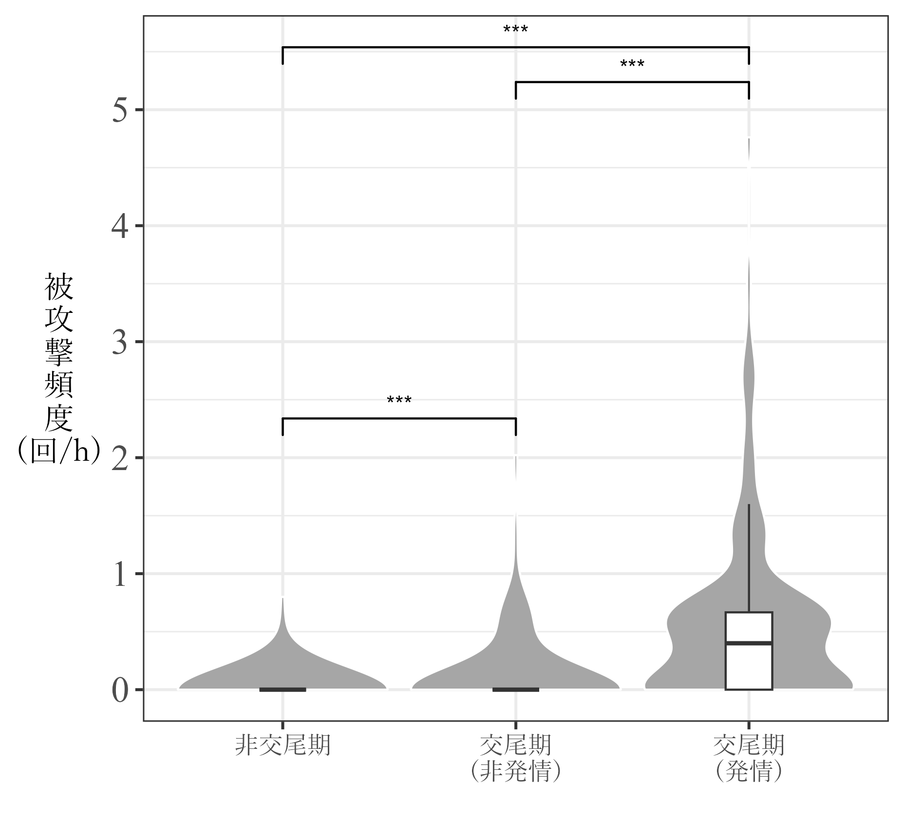
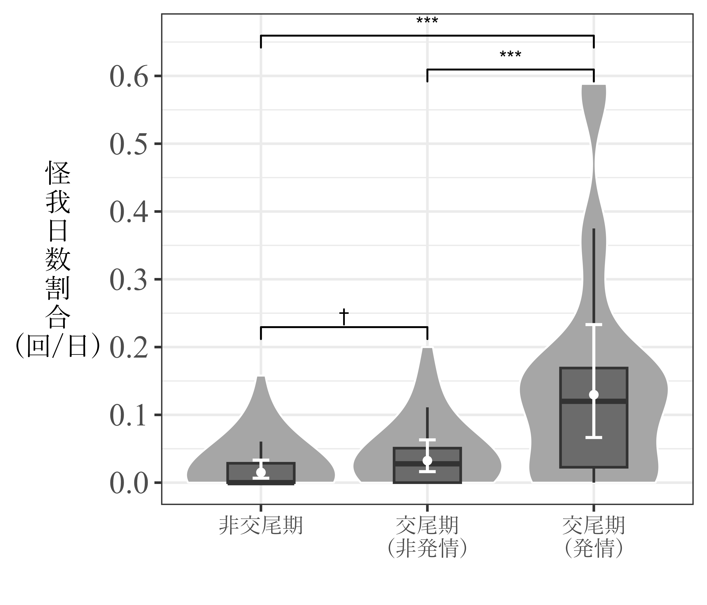
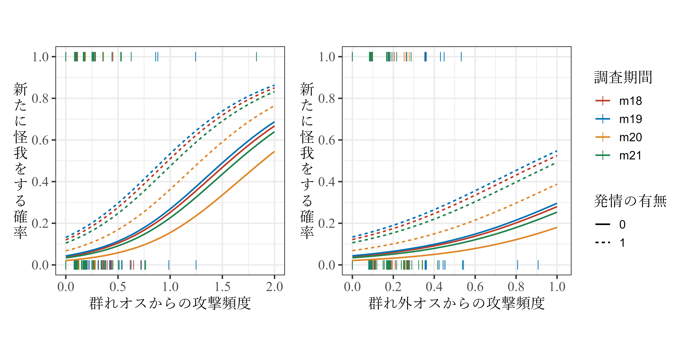
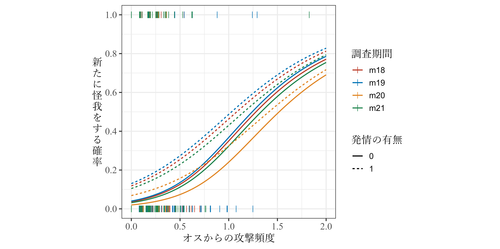

# オスの攻撃はメスのコストになっているのか  
本章では、オスからの攻撃がメスの怪我の有無と関連しているかを調べることで、オスの攻撃がメスのコストになっているかを検討する。  

## 交尾期と非交尾期の比較  
### 被攻撃頻度  
前提として、**交尾期には非交尾期よりもオスからメスへの攻撃頻度が高いのか**を検討する。ここでは、個体追跡中にメスが攻撃を受けた頻度の比較を行う。なお、交尾期のデータは<u>対象個体が発情しているときとしていないときで分ける</u>。  

#### データの読み込み・加工  
まず、個体追跡データから各フォーカルセッション中に攻撃を受けた回数を算出するためにデータを読み込み、加工する。    

**交尾期**  
```{r}
focal_list_m <- focal_raw_fin %>% 
  mutate(if_victim1 = ifelse(agg_focal == "1" & str_detect(victim1, subject),1,0),
         if_victim2 = ifelse(agg_focal == "1" & str_detect(victim2, subject),1,0)) %>% 
  group_by(no_focal, date, subject, study_period,rs2) %>% 
  summarise(duration = max(time),
            no_agg1 = sum(if_victim1, na.rm = TRUE),
            no_agg2 = sum(if_victim2, na.rm = TRUE)) %>% 
  ungroup() %>% 
  mutate(no_agg = no_agg1 + no_agg2) %>% 
  select(-no_agg1, -no_agg2)
```

**非交尾期**  
```{r}
## 2019年  
focal_list19nm <- focal_list19nm <- read_excel("C:/Users/Tsubasa Yamaguchi/Desktop/Study/data/2019nonmating/2019nonmating_raw.xlsx",
                      sheet = "focal_raw")  %>% 
  group_by(no_focal, date, subject) %>% 
  summarise(duration = max(time),
            no_agg = sum(agg_focal)) %>% 
  ungroup() %>% 
  mutate(study_period = "nm19",
         no_focal = str_c(study_period,"_",no_focal))


## 2021年
focal_list21nm <-  read_excel("C:/Users/Tsubasa Yamaguchi/Desktop/Study/DoctorStudy/data/2021nonmating/2021nonmating_raw.xlsx",
                      sheet = "focal_list") %>% 
  mutate(no_focal = str_c(study_period,"_",no_focal))

## 2022年  
focal_list22nm <- read_excel("C:/Users/Tsubasa Yamaguchi/Desktop/Study/DoctorStudy/data/2022nonmating/2022nonmating_raw.xlsx",
                      sheet = "focal_list") %>% 
  mutate(no_focal = str_c(study_period,"_",no_focal))
```

全データを結合する。分析には、60分以上追跡した個体追跡セッションのみを用いる。    
```{r}
focal_list <- bind_rows(focal_list_m,focal_list19nm, focal_list21nm, focal_list22nm) %>% 
  replace_na(list(rs2 = 0)) %>% 
  mutate(mating = ifelse(str_detect(study_period,"nm"),0,1)) %>% 
  mutate(cat = ifelse(rs2 == "1","est",
                      ifelse(mating == "0", "nm", "nonest"))) %>% 
  filter(duration >= 60) %>% 
  mutate(logdur = log(duration/60)) 
```

データは以下の通り。  
```{r}
datatable(focal_list,
          options = list(scrollX = 20))
```
<br/>  

#### 分析  
##### モデリング    
それでは、分析を行う。モデルの概要は以下の通り。  
事前分布には弱情報事前分布を用いた。  

- 分布: 負の二項分布  
- リンク関数: log  
- 応答変数: オスから攻撃された回数(`no_agg`)    
- オフセット項: 各セッションの観察時間の対数(`logdur`)      
- 説明変数: メスの発情状態`cat`(交尾期発情メス`est`、交尾期費発情`nonest`、非交尾期`nm`)  
- ランダム切片: 追跡個体(`subject`)、調査期間(`study_period`)   

```{r}
m_aggcomp <- brm(no_agg ~ cat + offset(logdur) + (1|subject) + (1|study_period),
                 family = negbinomial,
                 iter = 5000, warmup = 2500, seed = 13,
                 prior = c(prior(student_t(4,0,10), class = "b"),
                           prior(student_t(4,0,10), class = "Intercept"),
                           prior(student_t(4,0,10), class = "sd"),
                           prior(gamma(0.01,0.01), class = "shape")),
                 control=list(adapt_delta = 0.9999, max_treedepth = 20),
                 backend = "cmdstanr",
                 data = focal_list,
                 file = "model/m_aggcomp.rds")
```

###### モデルチェック  
`DHARMa`パッケージ及び、そのヘルパーパッケージである`DHARMa.helpers`パッケージを用いてモデルチェックを行う。  

分布から大きく外れていることはなく、過分散や外れ値の問題もないよう。  
```{r, include = FALSE}
check_aggcomp <- dh_check_brms(m_aggcomp)
```

```{r, fig.dim = c(4.5,4.5)}
plotQQunif(check_aggcomp)
```

ゼロ過剰の問題もなかった。  
```{r, fig.dim = c(4.5,4.5)}
testZeroInflation(check_aggcomp)
```

###### 結果の確認  
モデルの結果は以下の通り。`Rhat`はすべて1.01以下であり、収束の問題はないと思われる。有向サンプルサイズにも大きな問題はない。    
```{r}
model_parameters(m_aggcomp)
```
<br/> 

多重比較の結果は以下の通り。被攻撃頻度は交尾期発情 > 交尾期非発情 > 非交尾期で、いずれの差も有意。  
```{r}
estimate_contrasts(m_aggcomp,
                   contrast = "cat")
```
<br/> 

###### 結果の図示  
```{r}
posterior_samples(m_aggcomp) %>% 
  select(1,2,3) %>% 
  rename("est" = 1, "nm" = 2, "nonest" = 3) %>% 
  tidyr::expand(data.frame(cat = c("est","nonest","nm")),
         nesting(est, nm, nonest)) %>% 
  mutate(lambda = ifelse(cat == "est", exp(est),
                         ifelse(cat == "nonest", exp(est+ nonest),
                                ifelse(cat == "nm", exp(est + nm),"NA")))) %>% 
  mutate(lambda = as.numeric(lambda)) %>% 
  group_by(cat) %>% 
  summarise(Mean = mean(lambda),
         CI_low = quantile(lambda, 0.025),
         CI_high = quantile(lambda, 0.975)) -> mean_aggcomp
  

focal_list %>% 
  ungroup() %>% 
  mutate(cat = fct_relevel(cat,"nm","nonest","est")) %>% 
  ggplot(aes(x = cat, y = no_agg*60/duration))+
  geom_violin(scale = "width",
              fill = "grey65",
              color = "white",
              bw = 0.23)+
  geom_boxplot(width = 0.3,
               size = 0.7,
               outlier.alpha = 0,
               fill = "grey42") +
  geom_pointrange(data = mean_aggcomp,
                aes(y = Mean, ymin = CI_low, ymax = CI_high),
                color = "white",
                size = 0.3)+
  geom_errorbar(data = mean_aggcomp,
                aes(y = Mean, ymin = CI_low, ymax = CI_high),
                width = 0.1,
                linewidth = 0.8,
                color = "white")+
  geom_signif(comparisons = list(c("nm","nonest")),
              y_position = 2.1,
              annotation = "***") +
  geom_signif(comparisons = list(c("nonest","est")),
              y_position = 4.85,
              annotation = "***") +
  geom_signif(comparisons = list(c("nm","est")),
              y_position = 5.3,
              annotation = "***") +
  scale_y_continuous(breaks = seq(0,6,1)) +
  theme_bw(base_size = 15)+
  labs(x = "", y = "被\n攻\n撃\n頻\n度\n(回/h)") +
  scale_x_discrete(labels = c("非交尾期", "交尾期\n(非発情)","交尾期\n(発情)"))+
  theme(axis.title.y = element_text(angle = 0,
                                    vjust = 0.5,
                                    family = "Yu Mincho"),
        axis.text.x = element_text(family = "Yu Mincho"),
        axis.text.y = element_text(family = "Times New Roman",
                                   size = 18)) -> p_aggcomp

# ggsave("figure/p_aggcomp.png", p_aggcomp, width = 120, height = 120, units = "mm", dpi = 600)
```

結果は以下のようになる(図\@ref(fig:fig-aggcomp))。  
```{r fig-aggcomp, echo=FALSE, out.width="60%", fig.cap="季節ごとの被攻撃頻度"}

```
<br/>  

### 怪我の頻度 {#injcomp}   
それでは、実際にオスの攻撃が多い交尾期に怪我が多くなるかを調べる。先ほど同様に、交尾期のデータは<u>対象個体が発情しているときとしていないときで分ける</u>。    

#### データの読み込みと加工  

各メスがそれぞれの観察日に群れで最初に確認されてから、群れの観察を終了するまでの時間の長さを算出する。分析には**少なくとも300分以上**確認出来た個体のデータのみを用いる。2018年交尾期は確認時刻のデータがないため、それを除いた調査期間のデータを用いる。    

まずは、メスが確認された時刻のデータを読み込む。  
```{r}
female_time <- read_csv("C:/Users/Tsubasa Yamaguchi/Desktop/Study/data/combined_data/female_pre_all.csv") %>% 
  mutate(date = as_date(date))

att <- read_csv("data/attributes.csv")
```

確認できた時間の長さを算出する。  
```{r}
base_18b %>% 
  bind_rows(base_19_nm, base_19b, base_20_nm, base_20b, base_21_nm, base_21b, base_22_nm) -> base_all

female_time %>% 
  pivot_longer(cols = Kur:Har,
               names_to = "femaleID",
               values_to = "presence") %>% 
  left_join(base_all %>% select(date, start, fin, suspend, restart),
            by = "date") %>% 
  ## 死亡個体と確認時間不明個体、非対称個体(6歳未満)は除く
  filter(presence != "?" & presence != "DD" & presence != "NS" & presence != "NA") %>% 
  mutate(date = as_date(date)) %>%
  mutate(presence = str_c(date," ", presence)) %>% 
  mutate(presence = as_datetime(presence)) %>% 
  mutate(suspend_time = as.numeric(restart - suspend)) %>% 
  mutate(dur = ifelse(is.na(suspend), as.numeric(fin - presence),
                      ifelse(!is.na(suspend) & presence <= suspend, as.numeric(fin - presence) - suspend_time,
                             ifelse(!is.na(suspend) & presence >= restart, as.numeric(fin - presence), "NA")))) %>% 
  mutate(dur = as.numeric(dur)) %>% 
  mutate(season = ifelse(month(date)>=9 & month(date) <= 12, "m", "nm")) %>% 
  mutate(study_period = str_c(season,str_sub(year(date),3,4))) %>% 
  dplyr::select(date, femaleID, study_period, dur) -> female_dur
```

怪我のデータを読み込み、加工する。  
```{r}
## 交尾期 
injury18 <- read_excel("C:/Users/Tsubasa Yamaguchi/Desktop/Study/data/2018mating/2018mating_raw.xlsx", sheet = "injury")
injury19 <- read_excel("C:/Users/Tsubasa Yamaguchi/Desktop/Study/data/2019mating/2019mating_raw.xlsx", sheet = "injury")
injury20 <- read_excel("C:/Users/Tsubasa Yamaguchi/Desktop/Study/DoctorStudy/data/2020mating/2020mating_raw.xlsx",sheet = "injury")
injury21 <- read_excel("C:/Users/Tsubasa Yamaguchi/Desktop/Study/DoctorStudy/data/2021mating/2021mating_raw.xlsx",sheet = "injury")

## 非交尾期  
injury19nm <- read_excel("C:/Users/Tsubasa Yamaguchi/Desktop/Study/data/2019nonmating/2019nonmating_raw.xlsx", sheet = "injury")
injury21nm <- read_excel("C:/Users/Tsubasa Yamaguchi/Desktop/Study/DoctorStudy/data/2021nonmating/2021nonmating_raw.xlsx",sheet = "injury")
injury22nm <- read_excel("C:/Users/Tsubasa Yamaguchi/Desktop/Study/DoctorStudy/data/2022nonmating/2022nonmating_raw.xlsx",sheet = "injury")

## 結合  
injury <- bind_rows(injury18,injury19,injury20,injury21,injury19nm,injury21nm,injury22nm) %>% 
  pivot_longer(Kur:Har, names_to = "femaleID", values_to = "injury") %>% 
  mutate(injury01 = ifelse(injury >= 1, 1, 0)) %>% 
  mutate(injury02 = ifelse(injury >= 2, 1, 0)) %>% 
  mutate(date = as_date(date))
```

メスが確認できた時間や発情状態のデータと結合し、観察時間が300分以上のデータのみを抽出する。  
```{r}
injury %>% 
  left_join(female_dur, by = c("date", "femaleID")) %>% 
  filter(dur >= 300) %>% 
  left_join(female_all %>% dplyr::select(date, femaleID, rs2), by = c("date","femaleID")) %>% 
  replace_na(list(rs2 = 0)) %>% 
  mutate(cat = ifelse(rs2 == "1","est",
                    ifelse(str_detect(study_period, "nm"),"nm", "nonest"))) -> injury_fin
```

メスの発情状態`cat`(交尾期発情メス`est`、交尾期費発情`nonest`、非交尾期`nm`)によって怪我をした日数割合を算出する。なお、分析には少なくとも5日以上その状態が観察できた場合のみを用いる。  
```{r}
injury_fin %>% 
  group_by(cat, femaleID, study_period) %>% 
  summarise(N = n(),
            no_inj = sum(injury01, na.rm = TRUE)) %>%
  ## 5日以上観察できた状態のみ
  filter(N >= 5) %>% 
  ungroup() -> injury_long
```

データは以下の通り。  
```{r}
datatable(injury_long,
          options = list(scrollX = 20))
```

#### 分析  
##### モデリング     
それでは、モデリングを行う。モデルの概要は以下の通り。  
事前分布には弱情報事前分布を用いた。  

- 分布: 二項分布  
- リンク関数: ロジット関数  
- 応答変数: 怪我をした日数割合(`no_inj`/N)    
- 説明変数: メスの発情状態`cat`(交尾期・発情`est`、交尾期・非発情`nonest`、非交尾期`nm`)  
- ランダム切片: メスID(`femaleID`)、調査期間(`study_period`)   

```{r}
m_injcomp <- brm(no_inj|trials(N) ~ cat  + (1|femaleID) + (1|study_period),
                 family = binomial,
                 iter = 5000, warmup = 2500, seed = 13,
                 prior = c(prior(student_t(4,0,10), class = "b"),
                           prior(student_t(4,0,10), class = "Intercept"),
                           prior(student_t(3,0,4), class = "sd")),
                 control=list(adapt_delta = 0.9999, max_treedepth = 22),
                 backend = "cmdstanr",
                 data = injury_long,
                 file = "model/m_injcomp.rds")
```

###### モデルチェック  
`DHARMa`パッケージ及び、そのヘルパーパッケージである`DHARMa.helpers`パッケージを用いてモデルチェックを行う。  

分布から大きく外れていることはなく、過分散や外れ値の問題もないよう。  
```{r, include = FALSE}
check_injcomp <- dh_check_brms(m_injcomp)
```

```{r, fig.dim = c(4.5,4.5)}
plotQQunif(check_injcomp)
```

ゼロ過剰の問題もなかった。  
```{r, fig.dim = c(4.5,4.5)}
testZeroInflation(check_injcomp)
```

###### 結果の確認  
モデルの結果は以下の通り。`Rhat`はすべて1.01以下であり、収束の問題はないと思われる。有向サンプルサイズにも大きな問題はない。    
```{r}
model_parameters(m_injcomp)
```
<br/>  

多重比較の結果は以下の通り。怪我日数割合は有意に交尾期・発情 > 交尾期・非発情・非交尾期。しかし、交尾期・非発情と非交尾期の間に有意に差はなかった。これは、非交尾期にも山椒などの棘がある植物を食べた際にできた小さな怪我が結構あったため? あるいは、交尾期のデータに発情メスがいなかった日も含まれているため？      
```{r}
estimate_contrasts(m_injcomp,
                   contrast = "cat",
                   ci = 0.95)
```
<br/> 

確信区間を90%にすると、非交尾期と交尾期・非発情の差の確信区間は0を含まない。  
```{r}
estimate_contrasts(m_injcomp,
                   contrast = "cat",
                   ci = 0.9)
```


###### 結果の図示  
結果を図示する。  
```{r}
mean_injury <- estimate_means(m_injcomp, at = "cat") %>% 
  data.frame()

injury_long %>% 
  mutate(cat = fct_relevel(cat,"nm","nonest","est")) %>% 
  ggplot(aes(x = cat, y = no_inj/N)) +
  geom_violin(scale = "width",
              fill = "grey65",
              color = "white",
              bw = 0.043)+
  geom_boxplot(width = 0.4,
               size = 0.7,
               outlier.alpha = 0,
               fill = "grey42") +
  geom_signif(comparisons = list(c("nm","nonest")),
              y_position = 0.2,
              annotation = "†") +
  geom_signif(comparisons = list(c("nonest","est")),
              y_position = 0.58,
              annotation = "***") +
  geom_signif(comparisons = list(c("nm","est")),
              y_position = 0.63,
              annotation = "***") +
  geom_pointrange(data = mean_injury,
                aes(y = Probability, ymin = CI_low, ymax = CI_high),
                color = "white",
                size = 0.3)+
  geom_errorbar(data = mean_injury,
                aes(y = Probability, ymin = CI_low, ymax = CI_high),
                width = 0.1,
                linewidth = 0.8,
                color = "white")+
  scale_y_continuous(breaks = seq(0,0.6,0.1)) +
  theme_bw(base_size = 15)+
  labs(x = "", y = "怪\n我\n日\n数\n割\n合\n(回/日)") +
  scale_x_discrete(labels = c("非交尾期", "交尾期\n(非発情)","交尾期\n(発情)"))+
  theme(axis.title.y = element_text(angle = 0,
                                    vjust = 0.5,
                                    family = "Yu Mincho"),
        axis.text.x = element_text(family = "Yu Mincho"),
        axis.text.y = element_text(family = "Times New Roman",
                                   size = 18)) -> p_injcomp

# ggsave("figure/p_injcomp.png", p_injcomp, width = 140, height = 120, units = "mm", dpi = 600)
```

結果は以下のようになる(図\@ref(fig:fig-injcomp))。  
```{r fig-injcomp, echo=FALSE, out.width="60%", fig.cap="季節ごとの被攻撃頻度"}

```
<br/>  

## 交尾期内での被攻撃頻度と怪我の関連  
交尾期に着目し、メスの被攻撃頻度と怪我の有無の関連を調べる。   

### データの読み込み・加工  
各観察日に確認された各メスへのオスの攻撃頻度(全生起サンプリング)を計算する。群れオスと群れ外オスを分けて算出する。  

まず、攻撃のrawデータを読み込む。  
```{r}
agg18 <- read_excel("C:/Users/Tsubasa Yamaguchi/Desktop/Study/data/2018mating/2018mating_raw.xlsx", sheet = "agg_MF") 
agg19 <- read_excel("C:/Users/Tsubasa Yamaguchi/Desktop/Study/data/2019mating/2019mating_raw.xlsx", sheet = "agg_MF") 
agg20 <- read_excel("C:/Users/Tsubasa Yamaguchi/Desktop/Study/DoctorStudy/data/2020mating/2020mating_raw.xlsx",
                      sheet = "agg_MF") 
agg21 <- read_excel("C:/Users/Tsubasa Yamaguchi/Desktop/Study/DoctorStudy/data/2021mating/2021mating_raw.xlsx",
                      sheet = "agg_MF")

## 結合  
bind_rows(agg18, agg19, agg20, agg21) %>% 
  dplyr::select(date, type, type_no, aggressor, victim:victim3) %>% 
  mutate(date = as_date(date)) %>% 
  pivot_longer(cols = victim:victim3,
               names_to = "victim",
               values_to = "femaleID") %>% 
  drop_na(femaleID) %>% 
  dplyr::select(-victim) %>% 
  mutate(aggressor = str_replace(aggressor,"\\?","")) %>% 
  mutate(study_period = str_c("m",str_sub(year(date),3,4)))-> aggression_all
```

データは以下の通り。  
```{r}
datatable(aggression_all)
```
<br/>  

各メスごとに被攻撃頻度を算出する。各調査期間に6歳以上だったメスを対象とする。    

各年のオスの情報についてデータフレームを作成する。
```{r}
## 対象のオス
bind_rows(data.frame(study_period = "m18", 
                     maleID = c("TY","IT","LK","KR","EG"),
                     ntm = c(0,0,0,0,1)),
          data.frame(study_period = "m19", 
                     maleID = c("TY","IT","LK","KR","TM","KM","TG","EG","SH","JN","RU","KY","RY"),
                     ntm = c(0,0,0,0,0,1,1,1,1,1,1,1,1)),
          data.frame(study_period = "m20", 
                     maleID = c("TY","IT","KR","KM","TG","EG","SH","RU","RY","HG","FU","KY"),
                     ntm = c(0,0,0,1,1,1,1,1,1,1,1,1)),
          data.frame(study_period = "m21",
                     maleID = c("TY","KR","KM","TG","EG","SH","JN","RU","KY","HT","RY"),
                     ntm = c(0,0,0,1,1,1,1,1,1,1,1))) -> males
```

攻撃データに攻撃したオスと攻撃されたメスの情報を追加する。  
```{r}
aggression_all %>% 
  left_join(att, by = c("femaleID","study_period")) %>% 
  left_join(males, by = c("aggressor" = "maleID","study_period")) %>% 
  filter(age >= 6) -> aggression_all_b
```

データを基に、それぞれのメスが各観察日に群れオス・群れ外オスそれぞれから攻撃された頻度を求める。  
```{r}
aggression_all_b %>% 
  filter(!is.na(ntm)) %>% 
  filter(type_no >= 1) %>% 
  group_by(date, femaleID, ntm) %>% 
  summarise(no_agg = n()) %>% 
  ungroup() %>% 
  pivot_wider(names_from = ntm, values_from = no_agg) %>% 
  rename(agg_tm = `0`, agg_ntm = `1`) -> agg_female_ntm
```

分析には**少なくとも300分以上**確認出来た個体のデータのみを用いる。攻撃データをメスの怪我の状況や確認時間長などが載っているデータフレーム(`injury_fin`)に結合する。  

```{r}
injury_fin %>% 
  left_join(agg_female_ntm, by = c("date","femaleID")) %>%
  ## 交尾期データのみ
  filter(!str_detect(study_period,"nm")) %>% 
  filter(dur >= 300) %>% 
  ## 各観察日の群れ追跡時間を結合  
  left_join(base_all %>% dplyr::select(date, duration)) %>% 
  ## NAになっているところを0で埋める  
  replace_na(list(agg_tm = 0, agg_ntm = 0)) %>% 
  ## 被攻撃頻度を算出  
  mutate(rate_agg_tm = agg_tm*60/duration,
         rate_agg_ntm = agg_ntm*60/duration,
         rate_agg_tm2 = agg_tm*60/dur,
         rate_agg_ntm2 = agg_ntm*60/dur) -> agg_injury_ntm
```

### 分析1 (群れオス・群れ外オスを区別)             
#### モデリング
それでは、モデリングを行う。モデルの詳細は以下のとおりである。  
事前分布には弱情報事前分布を用いた。  

- 分布: ベルヌーイ分布    
- リンク関数: ロジット関数    
- 応答変数: 怪我が確認されたか否か(`injury01`)           
- 説明変数: 群れオスからの攻撃頻度(`rate`_agg_tm`)、群れ外オスからの攻撃頻度(`rate_agg_ntm``)、メスの発情の有無(`rs2`)、調査期間(`study_period`)  
- ランダム切片: メスID(`femaleID`)      

```{r}
## 被攻撃頻度を群れ追跡時間から算出 
m_agginj <- brm(injury01 ~ rate_agg_tm + rate_agg_ntm + rs2  + study_period + (1|femaleID),
                family = bernoulli,
                iter = 5000, warmup = 2500, seed = 13,
                 prior = c(prior(student_t(4,0,10), class = "b"),
                           prior(student_t(4,0,10), class = "Intercept"),
                           prior(student_t(4,0,10), class = "sd")),
                 control=list(adapt_delta = 0.9999, max_treedepth = 20),
                 backend = "cmdstanr",
                 data = agg_injury_ntm,
                 file = "model/m_agginj.rds")

## 被攻撃頻度を各個体を確認した時刻から群れ追跡終了時刻までの時間で算出  
m_agginj2 <- brm(injury01 ~ rate_agg_tm2 + rate_agg_ntm2 + rs2  + study_period + (1|femaleID),
                family = bernoulli,
                iter = 5000, warmup = 2500, seed = 13,
                 prior = c(prior(student_t(4,0,10), class = "b"),
                           prior(student_t(4,0,10), class = "Intercept"),
                           prior(student_t(4,0,10), class = "sd")),
                 control=list(adapt_delta = 0.9999, max_treedepth = 20),
                 backend = "cmdstanr",
                 data = agg_injury_ntm,
                 file = "model/m_agginj2.rds")
```

###### モデルチェック  
`DHARMa`パッケージ及び、そのヘルパーパッケージである`DHARMa.helpers`パッケージを用いてモデルチェックを行う。  

```{r, include = FALSE}
check_agginj <- dh_check_brms(m_agginj)
check_agginj2 <- dh_check_brms(m_agginj2)
```

いずれのモデルも、分布から大きく外れていることはなく、過分散や外れ値の問題もないよう。
```{r, fig.dim = c(4.5,4.5)}
plotQQunif(check_agginj)
```

```{r, fig.dim = c(4.5,4.5)}
plotQQunif(check_agginj2)
```


###### 結果の確認  
モデルの結果は以下の通り。`Rhat`はすべて1.01以下であり、収束の問題はないと思われる。有向サンプルサイズにも大きな問題はない。    
いずれのモデルでも、群れオス・群れ外オスの攻撃いずれもが怪我と有意に関連。  

```{r}
model_parameters(m_agginj)
```
<br/>  

```{r}
model_parameters(m_agginj2)
```

##### 結果の作図  
**群れオス**  
```{r}
nd_agginj_tm <- crossing(rate_agg_tm = seq(0,2,length.out =100),
                       rate_agg_ntm = mean(agg_injury$rate_agg_ntm),
                       study_period = c("m18","m19","m20","m21"),
                       rs2 = c(0,1))

fit_agginj_tm <- fitted(m_agginj,
                      newdata = nd_agginj_tm,
                      re_formula = NA) %>% 
               bind_cols(nd_agginj_tm)


agg_injury %>% 
  ggplot(aes(x = rate_agg_tm, y = injury01, color = study_period))+
  geom_point(shape = "|", size = 3)+
  geom_line(data = fit_agginj_tm,
            aes(y = Estimate, linetype = as.factor(rs2)),
            size = 0.7)+
  theme_bw(base_size = 14)+
  scale_y_continuous(breaks = seq(0,1,by = 0.2)) +
  labs(x = "群れオスからの攻撃頻度", y = "怪\n我\n日\n数\n割\n合\n(回/日)",
       color = "調査期間", linetype = "発情の有無") +
  scale_color_nejm()+
  theme(axis.title.y = element_text(angle = 0,
                                    vjust = 0.5,
                                    family = "Yu Mincho"),
        axis.title.x = element_text(family = "Yu Mincho"),
        axis.text = element_text(family = "Times New Roman",
                                   size = 13),
        legend.position = "none",
        legend.title = element_text(family = "Yu Mincho"),
        aspect.ratio = 1) -> p_agginj_tm
```

**群れ外オス**  
```{r}
nd_agginj_ntm <- crossing(rate_agg_ntm = seq(0,1,length.out =100),
                       rate_agg_tm = mean(agg_injury$rate_agg_tm),
                       study_period = c("m18","m19","m20","m21"),
                       rs2 = c(0,1))

fit_agginj_ntm <- fitted(m_agginj,
                      newdata = nd_agginj_ntm,
                      re_formula = NA) %>% 
               bind_cols(nd_agginj_ntm)


agg_injury %>% 
  ggplot(aes(x = rate_agg_ntm, y = injury01, color = study_period))+
  geom_point(shape = "|", size = 3)+
  geom_line(data = fit_agginj_ntm,
            aes(y = Estimate, linetype = as.factor(rs2)),
            size = 0.7)+
  theme_bw(base_size = 14)+
  scale_y_continuous(breaks = seq(0,1,by = 0.2)) +
  labs(x = "群れ外オスからの攻撃頻度", y = "怪\n我\n日\n数\n割\n合\n(回/日)",
       color = "調査期間", linetype = "発情の有無") +
  scale_color_nejm()+
  coord_cartesian(xlim = c(0,1.02))+
  scale_x_continuous(breaks = seq(0,1,by=0.2))+
  theme(axis.title.y = element_text(angle = 0,
                                    vjust = 0.5,
                                    family = "Yu Mincho"),
        axis.title.x = element_text(family = "Yu Mincho"),
        axis.text = element_text(family = "Times New Roman",
                                   size = 13),
        legend.title = element_text(family = "Yu Mincho"),
        aspect.ratio = 1) -> p_agginj_ntm

p_agginj <- p_agginj_tm + p_agginj_ntm

# ggsave("figure/p_agginj.png", p_agginj, width = 230, height = 120, units = "mm", dpi = 600)
```

結果は以下のようになる(図\@ref(fig:fig-agginj))。  
```{r fig-agginj, echo=FALSE, out.width="100%", fig.cap="被攻撃頻度と怪我の関連"}

```
<br/>  

### 分析2 (群れオス・群れ外オスを区別しない)           
#### データの加工  
オスの属性を問わず、それぞれのメスが各観察日にオスから攻撃された頻度を求め、怪我のデータと結合する。  
```{r}
aggression_all_b %>% 
  filter(type_no >= 1) %>% 
  group_by(date, femaleID) %>% 
  summarise(no_agg = n()) %>% 
  ungroup() -> agg_female_all
```

分析には**少なくとも300分以上**確認出来た個体のデータのみを用いる。攻撃データをメスの怪我の状況や確認時間長などが載っているデータフレーム(`injury_fin`)に結合する。  

```{r}
injury_fin %>% 
  left_join(agg_female_all, by = c("date","femaleID")) %>%
  ## 交尾期データのみ
  filter(!str_detect(study_period,"nm")) %>% 
  filter(dur >= 300) %>% 
  ## 各観察日の群れ追跡時間を結合  
  left_join(base_all %>% dplyr::select(date, duration)) %>% 
  ## NAになっているところを0で埋める  
  replace_na(list(no_agg = 0)) %>% 
  ## 被攻撃頻度を算出  
  mutate(rate_agg = no_agg*60/duration,
         rate_agg2 = no_agg*60/dur) -> agg_injury_all
```

#### モデリング
それでは、モデリングを行う。モデルの詳細は以下のとおりである。  
事前分布には弱情報事前分布を用いた。  

- 分布: ベルヌーイ分布    
- リンク関数: ロジット関数    
- 応答変数: 怪我が確認されたか否か(`injury01`)           
- 説明変数: オスからの攻撃頻度(`rate_agg``)、メスの発情の有無(`rs2`)、攻撃頻度と発情の有無の交互作用、調査期間(`study_period`)  
- ランダム切片: メスID(`femaleID`)      

```{r}
## 被攻撃頻度を群れ追跡時間から算出 
m_agginj_all <- brm(injury01 ~ rate_agg + rs2 + rate_agg:rs2 + study_period + (1|femaleID),
                    family = bernoulli,
                    iter = 5000, warmup = 2500, seed = 13,
                    prior = c(prior(student_t(4,0,10), class = "b"),
                           prior(student_t(4,0,10), class = "Intercept"),
                           prior(student_t(4,0,10), class = "sd")),
                     control=list(adapt_delta = 0.9999, max_treedepth = 20),
                     backend = "cmdstanr",
                     data = agg_injury_all,
                     file = "model/m_agginj_all.rds")

## 被攻撃頻度を各個体を確認した時刻から群れ追跡終了時刻までの時間で算出  
m_agginj_all2 <- brm(injury01 ~ rate_agg2 + rs2 + rate_agg2:rs2 + study_period + (1|femaleID),
                    family = bernoulli,
                    iter = 5000, warmup = 2500, seed = 13,
                    prior = c(prior(student_t(4,0,10), class = "b"),
                           prior(student_t(4,0,10), class = "Intercept"),
                           prior(student_t(4,0,10), class = "sd")),
                     control=list(adapt_delta = 0.9999, max_treedepth = 20),
                     backend = "cmdstanr",
                     data = agg_injury_all,
                     file = "model/m_agginj_all2.rds")
``` 

###### モデルチェック  
`DHARMa`パッケージ及び、そのヘルパーパッケージである`DHARMa.helpers`パッケージを用いてモデルチェックを行う。  

```{r, include = FALSE}
check_agginj_all <- dh_check_brms(m_agginj_all)
check_agginj_all2 <- dh_check_brms(m_agginj_all2)
```

いずれのモデルも、分布から大きく外れていることはなく、過分散や外れ値の問題もないよう。
```{r, fig.dim = c(4.5,4.5)}
plotQQunif(check_agginj_all)
```

```{r, fig.dim = c(4.5,4.5)}
plotQQunif(check_agginj_all2)
```

###### 結果の確認  
**1つ目のモデル**  
モデルの結果は以下の通り。`Rhat`はすべて1.01以下であり、収束の問題はないと思われる。有向サンプルサイズにも大きな問題はない。    
```{r}
model_parameters(m_agginj_all)
```
<br/>  

交互作用項を含む結果を確認する。発情メス、非発情メスのいずれについても「オスからの攻撃が多い日ほど有意に怪我をする確率が高くなっていた。    
```{r}
estimate_slopes(m_agginj_all,
                trend = "rate_agg",
                at = "rs2 = c(0,1)")
```
<br/>  

**2つ目のモデル**  
こちらも結果は変わらず。  
```{r}
model_parameters(m_agginj_all2)
```
<br/>  

```{r}
estimate_slopes(m_agginj_all2,
                trend = "rate_agg2",
                at = "rs2 = c(0,1)")
```
<br/>  

##### 結果の作図   
```{r}
nd_agginj_all <- crossing(rate_agg = seq(0,2,length.out =100),
                       study_period = c("m18","m19","m20","m21"),
                       rs2 = c(0,1))

fit_agginj_all <- fitted(m_agginj_all,
                      newdata = nd_agginj_all,
                      re_formula = NA) %>% 
               bind_cols(nd_agginj_all)


agg_injury_all %>% 
  ggplot(aes(x = rate_agg, y = injury01, color = study_period))+
  geom_point(shape = "|", size = 3)+
  geom_line(data = fit_agginj_all,
            aes(y = Estimate, linetype = as.factor(rs2)),
            linewidth = 0.7)+
  theme_bw(base_size = 14)+
  scale_y_continuous(breaks = seq(0,1,by = 0.2)) +
  labs(x = "オスからの攻撃頻度", y = "怪\n我\n日\n数\n割\n合\n(回/日)",
       color = "調査期間", linetype = "発情の有無") +
  scale_color_nejm()+
  theme(axis.title.y = element_text(angle = 0,
                                    vjust = 0.5,
                                    family = "Yu Mincho"),
        axis.title.x = element_text(family = "Yu Mincho"),
        axis.text = element_text(family = "Times New Roman",
                                   size = 13),
        legend.title = element_text(family = "Yu Mincho"),
        aspect.ratio = 1) -> p_agginj_all

#ggsave("figure/p_agginj_all.png", p_agginj_all, width = 240, height = 120, units = "mm", dpi = 600)
```

結果は以下のようになる(図\@ref(fig:fig-agginj-all))。  
```{r fig-agginj-all, echo=FALSE, out.width="100%", fig.cap="被攻撃頻度と怪我の関連"}

```
<br/>  


