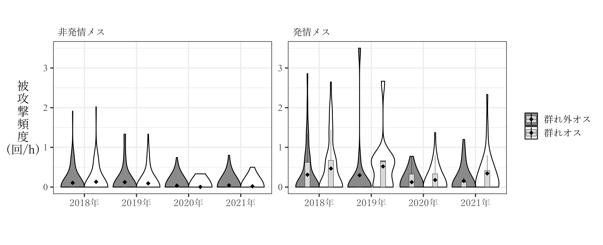

# メスの被攻撃頻度はどのようなときに多くなるか  
以下では、メスがオスから攻撃される頻度がどのような要因によって変化するのかを検討する。  

## 個体追跡データによる分析  
### データの加工  
個体追跡の生データを加工する。メスの被攻撃頻度に関連する要因としては、以下のものを考える。2018年は群れ外オス数が確認できていないため、ここでは除外する。また、60分以上追跡できた個体追跡セッションのみを用いる。      

- 追跡個体の発情の有無  
- 観察日の群れ外オス数  
- 観察日の発情メス数  
- 観察時の*TY*の有無、*IT*の有無(2019~2020年のみ)   

**群れオス・群れ外オスを区別せず**  
```{r}
focal_raw_fin %>% 
  group_by(no_focal, subject, rs2, TY, IT) %>% 
  summarise(no_agg1 = sum(if_victim1, na.rm = TRUE),
            no_agg2 = sum(if_victim2, na.rm = TRUE),
            dur = max(time),
            no_ntm = mean(no_ntm, na.rm = TRUE),
            no_est = mean(no_est, na.rm = TRUE),
            study_period = unique(study_period)) %>% 
  ungroup() %>% 
  mutate(no_agg = no_agg1 + no_agg2) %>% 
  select(-no_agg1, -no_agg2) %>% 
  mutate(logdur = log(dur/60)) %>% 
  replace_na(list(IT = 0)) %>% 
  mutate(cen_ntm = no_ntm - mean(no_ntm, na.rm = TRUE),
         cen_est = no_est - mean(no_est, na.rm = TRUE),
         std_ntm = standardize(no_ntm),
         std_est = standardize(no_est)) -> focal_sum
```


**群れオス・群れ外オスを区別**  
```{r}
focal_raw_fin %>% 
  left_join(males, by = c("study_period", "aggressor_focal1" = "maleID")) %>% 
  rename(ntm1 = ntm) %>% 
  mutate(ntm1 = ifelse(is.na(aggressor_focal1),NA,
                       ifelse(is.na(ntm1) & !is.na(aggressor_focal1),1,ntm1))) %>% 
  left_join(males, by = c("study_period", "aggressor_focal2" = "maleID")) %>% 
  rename(ntm2 = ntm) %>% 
  mutate(ntm2 = ifelse(is.na(aggressor_focal2),NA,
                       ifelse(is.na(ntm2) & !is.na(aggressor_focal2),1,ntm2))) -> focal_raw_fin_b
  
focal_raw_fin_b %>% 
  filter(agg_focal == "1") %>% 
  group_by(no_focal, subject, ntm1) %>% 
  summarise(no_agg = sum(agg_focal, na.rm = TRUE)) %>% 
  ungroup() %>% 
  pivot_wider(names_from = ntm1, values_from = no_agg) %>% 
  rename(agg_tm1 = `0`, agg_ntm1 = `1`) %>% 
  replace_na(list(agg_tm1 = 0, agg_ntm1 = 0))-> focal_list_ntm1

focal_raw_fin_b %>% 
  filter(agg_focal == "1" & !is.na(aggressor_focal2)) %>% 
  group_by(no_focal, subject, ntm2) %>% 
  summarise(no_agg = sum(agg_focal, na.rm = TRUE)) %>% 
  ungroup() %>% 
  pivot_wider(names_from = ntm2, values_from = no_agg) %>% 
  rename(agg_tm2 = `0`, agg_ntm2 = `1`) %>% 
  replace_na(list(agg_tm2 = 0, agg_ntm2 = 0)) -> focal_list_ntm2

left_join(focal_list_ntm1, focal_list_ntm2) %>% 
  replace_na(list(agg_tm2 = 0, agg_ntm2 = 0)) %>% 
  mutate(agg_tm = agg_tm1 + agg_tm2,
         agg_ntm = agg_ntm1 + agg_ntm2) %>% 
  select(-(agg_tm1:agg_ntm2)) %>% 
  right_join(focal_sum) %>% 
  replace_na(list(agg_tm = 0, agg_ntm = 0)) -> focal_sum_ntm
```

まとめたものは以下の通り。  
```{r}
datatable(focal_sum,
          options = list(scrollX = 10),
          filter = list(position ="top"))
```
<br/>  


### データの確認  
#### 調査年ごとの被攻撃頻度  
調査期間ごとに、発情メス・非発情メスが群れオス・群れ外オスから攻撃された頻度を図示する。  
```{r}
focal_sum_ntm %>% 
  filter(dur >= 60) %>% 
  pivot_longer(agg_tm:agg_ntm, names_to = "type", values_to= "agg") %>% 
  ggplot(aes(x = study_period, y = agg*60/dur))+
  geom_violin(aes(fill = type), bw = 0.25,
              color = "black",
              scale = "width")+
  geom_boxplot(aes(color = type),
               fill = "grey85",
               outlier.alpha = 0,
               width = 0.2,
               size = 0.2,
               position = position_dodge(0.9))+
  stat_summary(aes(fill = type),
               fun = "mean",
               position = position_dodge(0.9),
               shape = 18,
               size = 0.5)+
  labs(x = "", y = "被\n攻\n撃\n頻\n度\n(回/h)",
       fill = "", color = "")+
  facet_rep_wrap(~rs2, repeat.tick.labels = TRUE,
                 ncol = 2,
                 labeller = as_labeller(c("0" = "非発情メス","1" = "発情メス")))+
  theme_bw(base_size = 15)+
  scale_fill_manual(values = c("grey54","white"),
                    labels = c("群れ外オス","群れオス"))+
  scale_color_manual(values = c("grey10","grey10"),
                    labels = c("群れ外オス","群れオス"))+
  scale_x_discrete(labels = c("2018年","2019年","2020年","2021年"))+
  theme(aspect.ratio = 0.7,
        strip.background = element_blank(),
        strip.text = element_text(family = "Yu Mincho",
                                  hjust = 0),
        axis.text.x =  element_text(family = "Yu Mincho"),
        axis.title.y = element_text(family = "Yu Mincho",
                                    angle = 0,
                                    vjust = 0.5),
        legend.text = element_text(family = "Yu Mincho"),
        axis.text.y = element_text(family = "Times New Roman")) -> p_focalagg_studyperiod

# ggsave("figure/p_focalagg_studyperiod.png", p_focalagg_studyperiod, width = 270, height = 110, units = "mm", dpi = 600)
```

以下の通り。  
```{r fig-aggfocal-studyperiod, echo=FALSE, out.width="100%", fig.cap="調査期間ごとの被攻撃頻度"}

```
<br/>  

#### オスごとの攻撃頻度  
##### データの加工  
```{r}
focal_raw_fin_b %>% 
  mutate(aggressor1 = ifelse(ntm1 == "1", "NT", aggressor_focal1)) %>% 
  mutate(aggressor2 = ifelse(ntm2 == "1", "NT", aggressor_focal2)) -> focal_raw_maleID
  
focal_raw_maleID %>% 
  filter(agg_focal == "1") %>% 
  group_by(no_focal, subject, aggressor1) %>% 
  summarise(agg_ID = n()) %>% 
  ungroup() %>% 
  rename(aggressor = aggressor1) -> focal_agg_ID1

focal_raw_maleID %>% 
  filter(agg_focal == "1") %>% 
  group_by(no_focal, subject, aggressor2) %>% 
  summarise(agg_ID = n()) %>% 
  ungroup() %>% 
  drop_na(aggressor2) %>% 
  rename(aggressor = aggressor2) -> focal_agg_ID2

focal_agg_ID1 %>% 
  bind_rows(focal_agg_ID2) %>% 
  group_by(no_focal, aggressor) %>% 
  summarise(agg = sum(agg_ID)) %>% 
  ungroup() -> focal_agg_ID 
  
focal_agg_ID  %>% 
  right_join(focal_sum_ntm) %>%
  drop_na(aggressor) %>% 
  replace_na(list(agg = 0)) %>% 
  select(no_focal, aggressor) %>% 
  complete(no_focal, aggressor) %>% 
  left_join(focal_agg_ID) %>% 
  replace_na(list(agg = 0)) %>% 
  right_join(focal_sum_ntm) %>% 
  mutate(inc = ifelse(study_period %in% c("m18","m19","m20") & aggressor == "KM"| study_period == "m21" & aggressor == "IT"|
                        study_period %in% c("m20","m21") & aggressor == "LK",0,1)) %>% 
  filter(inc == "1") %>% 
  mutate(inc2 = ifelse(TY == "0" & aggressor == "TY"|IT == "0" & aggressor == "IT", 0,1)) %>% 
  filter(inc2 == "1")-> focal_sum_ID
```

##### 図示  
```{r}
N <- focal_sum_ID %>% 
  mutate(rs2 = as.factor(rs2)) %>% 
  mutate(rate_agg = agg*60/dur) %>% 
  mutate(study_period = str_c("20",str_sub(study_period,2,3),"年")) %>% 
  mutate(aggressor = fct_relevel(aggressor,"TY","IT","LK","KR","KM","NT")) %>% 
  filter(dur >= 60) %>% 
  group_by(study_period, aggressor, rs2) %>% 
  summarise(N = n(),
            y = max(rate_agg + 0.3)) %>% 
  ungroup()

focal_sum_ID %>% 
  mutate(rs2 = as.factor(rs2)) %>% 
  filter(dur >= 60) %>% 
  mutate(rate_agg = agg*60/dur) %>% 
  mutate(study_period = str_c("20",str_sub(study_period,2,3),"年")) %>% 
  mutate(aggressor = fct_relevel(aggressor,"TY","IT","LK","KR","KM","NT")) %>% 
  ggplot(aes(x = aggressor, y = rate_agg))+
  geom_violin(aes(fill = rs2), bw = 0.25,
              color = "black",
              scale = "width")+
  geom_boxplot(aes(color = rs2),
               fill = "grey85",
               outlier.alpha = 0,
               width = 0.25,
               position = position_dodge(0.9),
               size = 0.2)+
  stat_summary(aes(fill = rs2),
               fun = "mean",
               position = position_dodge(0.9),
               shape = 18,
               size = 0.35)+
  geom_text(data = N,
            aes(y = y, color = rs2, label = N),
            stat = "identity",
            position = position_dodge(0.9),
            family = "Times New Roman",
            size = 3) +
  labs(x = "", y = "被\n攻\n撃\n頻\n度\n(回/h)",
       fill = "", color = "")+
  facet_rep_wrap(~study_period, repeat.tick.labels = TRUE,
                 ncol = 2) +
  theme_bw(base_size = 15)+
  scale_fill_manual(values = c("grey54","white"),
                    labels = c("非発情メス","発情メス"))+
  scale_color_manual(values = c("grey10","grey10"),
                    labels = c("非発情メス","発情メス"))+
  theme(aspect.ratio = 0.5,
        strip.background = element_blank(),
        strip.text = element_text(family = "Yu Mincho",
                                  hjust = 0),
        axis.text.x =  element_text(family = "Yu Mincho"),
        axis.title.y = element_text(family = "Yu Mincho",
                                    angle = 0,
                                    vjust = 0.5),
        legend.text = element_text(family = "Yu Mincho"),
        axis.text.y = element_text(family = "Times New Roman")) -> p_focalagg_maleID

# ggsave("figure/p_focalagg_maleID.png", p_focalagg_maleID, width = 270, height = 130, units = "mm", dpi = 600)
```

以下の通り。  
```{r fig-aggfocal-maleID, echo=FALSE, out.width="100%", fig.cap="調査期間ごとの被攻撃頻度"}
knitr::include_graphics("figure/p_focalagg_maleID.png")
```

```{r}
focal_sum_ntm %>% 
  filter(study_period != "m18") %>% 
  filter(dur >= 60) %>% 
  filter(rs2 == "0") %>% 
  pivot_longer(agg_tm:agg_ntm, names_to = "type", values_to= "agg") %>% 
  ggplot(aes(x = no_est, y = agg*60/dur, color = type))+
  geom_count()+
  facet_grid(study_period~type,
             scales = "free") 

focal_sum_ntm %>% 
  filter(study_period != "m18") %>% 
  filter(dur >= 60) %>% 
  filter(rs2 == "1") %>% 
  pivot_longer(agg_tm:agg_ntm, names_to = "type", values_to= "agg") %>% 
  ggplot(aes(x = no_est, y = agg*60/dur, color = type))+
  geom_count()+
  facet_grid(study_period~type,
             scales = "free") 
```

### 分析  
#### 群れオスと群れ外オスの攻撃を区別しない    
まず、群れオスと群れ外オスの攻撃を区別しないで分析を行う。  

##### モデリング1(全期間をまとめる)       
モデルの詳細は以下の通り。なお、群れ外オス数と発情メス数は中心化した。    

- 分布: 負の二項分布  
- 応答変数: 被攻撃回数(`no_agg`)    
- オフセット項: log(追跡時間)(`logdur`)    
- 説明変数: 追跡個体の発情の有無(`rs2`)、観察日の群れ外オス数(`cen_ntm`)、発情メス数(`cen_est`)、発情の有無×群れ外オス数、発情の有無×発情メス数、*TY*の有無(`TY`)、調査期間(`study_period`)    
- ランダム切片: 追跡個体ID  

```{r}
m_aggfocal <- brm(no_agg ~ cen_ntm  + cen_est + rs2 + cen_ntm:rs2 + cen_est:rs2 + TY + study_period 
                  + offset(logdur) + (1|subject),
                     family = negbinomial,
                     iter = 5000, warmup = 2500, seed = 13,
                     prior = c(prior(student_t(4,0,5), class = "b"),
                           prior(student_t(4,0,10), class = "Intercept"),
                           prior(student_t(4,0,10), class = "sd"),
                           prior(gamma(0.01,0.01), class = "shape")),
                     control=list(adapt_delta = 0.9999, max_treedepth = 20),
                     backend = "cmdstanr",
                     data = focal_sum,
                  file = "model/m_aggfocal.rds")
```

###### モデルチェック  
分布から大きく外れていることはなく、過分散や外れ値の問題もないよう。  
```{r, include = FALSE}
check_m_aggfocal <- dh_check_brms(m_aggfocal)
```

```{r}
plotQQunif(check_m_aggfocal)
```

ゼロ過剰の問題もない。  
```{r}
testZeroInflation(check_m_aggfocal)
```

VIFは全て10以下であり、そこまで多重共線性の問題はないよう。  
```{r}
check_collinearity(m_aggfocal)
```

###### 結果の確認  
発情メス数と*TY*の有無、発情の有無、調査期間が有意な影響。*TY*の有無については、*TY*がいる日は被攻撃頻度が有意に低下する。また、2021年は他の変数を統制したときに2019年より被攻撃頻度が低かったようだ。  
```{r}
model_parameters(m_aggfocal)
```
<br/>  

交互作用項のある変数の検討を行う。  

まず、発情メス数については発情メス・非発情メスのいずれについても被攻撃頻度と正の関連があった。  
```{r}
estimate_slopes(m_aggfocal,
               trend = "cen_est",
               at = "rs2 = c(0,1)")
```
<br/>  

群れ外オス数については、発情の有無に限らず被攻撃頻度とは有意な関連がなかった。  
```{r}
estimate_slopes(m_aggfocal,
               trend = "cen_ntm",
               at = "rs2 = c(0,1)")
```
<br/>  

発情の有無については、群れ外オス数に関わりなく非発情メスの方が発情メスよりも被攻撃頻度が有意に低い(図\@ref(fig:fig-aggfocal-rs)の左)。一方で、発情メス数との関連については、発情メス数が10頭を超えるくらいまでは非発情メスの方が発情メスよりも被攻撃頻度が有意に低い(図\@ref(fig:fig-aggfocal-rs)の右)。10頭を超えることはまれなので、ほとんどの場合において非発情メスの方が被攻撃頻度は低いといえるだろう。  

```{r fig-aggfocal-rs, fig.dim = c(12,5), fig.cap = "群れ外オス数/発情メス数ごとの発情の有無の効果"}
estimate_contrasts(m_aggfocal,
                   contrast = "rs2 = c(0,1)",
                   at = c("cen_ntm"),
                   length = 30) %>% 
  data.frame() -> estimate_cont_rs_ntm

estimate_cont_rs_ntm %>%
  mutate(no_ntm = cen_ntm + mean(focal_sum$no_ntm)) %>% 
  ggplot(aes(x = no_ntm, y = Difference))+
  geom_line()+
  geom_ribbon(aes(ymin = CI_low,
                  ymax = CI_high),
              alpha = 0.2)+
  geom_hline(yintercept = 0,
             color = "red")+
  theme_bw(base_size = 14)+
  theme(aspect.ratio = 1,
        plot.title = element_text(size = 13))+
  scale_x_continuous(breaks = seq(0,13,1))+
  labs(title = "Effect of estrous status\nby number of nontroop males",
       y = "anesrus - estrous",
       x = "no. of nontroop males") -> p_cont_rs_ntm

estimate_contrasts(m_aggfocal,
                   contrast = "rs2 = c(0,1)",
                   at = c("cen_est"),
                   length = 30) %>% 
  data.frame() -> estimate_cont_rs_est

estimate_cont_rs_est %>%
  mutate(no_est = cen_est + mean(focal_sum$no_est)) %>% 
  ggplot(aes(x = no_est, y = Difference))+
  geom_line()+
  geom_ribbon(aes(ymin = CI_low,
                  ymax = CI_high),
              alpha = 0.2)+
  geom_hline(yintercept = 0,
             color = "red")+
  theme_bw(base_size = 14)+
  theme(aspect.ratio = 1,
        plot.title = element_text(size = 13))+
  scale_x_continuous(breaks = seq(0,13,1))+
  labs(title = "Effect of estrous status\nby number of estrous females",
       y = "anesrus - estrous",
       x = "no. of estrous females") -> p_cont_rs_est

p_cont_rs_ntm + p_cont_rs_est
```

##### モデリング2(2019年)         
続いて、2019年のデータのみを用いて分析を行う。また、調査期間を説明変数から除き、*IT*の在/不在もモデルに含める。    

```{r}
focal_sum %>% 
  filter(study_period == "m19") %>% 
  mutate(cen_ntm = no_ntm - mean(no_ntm),
         cen_est = no_est - mean(no_est)) -> focal_sum19

m_aggfocal19 <- brm(no_agg ~ cen_ntm  + cen_est + rs2 + cen_ntm:rs2 + cen_est:rs2 + TY + IT  
                  + offset(logdur) + (1|subject),
                     family = negbinomial,
                     iter = 5000, warmup = 2500, seed = 13,
                     prior = c(prior(student_t(4,0,5), class = "b"),
                           prior(student_t(4,0,10), class = "Intercept"),
                           prior(student_t(4,0,10), class = "sd"),
                           prior(gamma(0.01,0.01), class = "shape")),
                     control=list(adapt_delta = 0.9999, max_treedepth = 20),
                     backend = "cmdstanr",
                     data = focal_sum19,
                  file = "model/m_aggfocal19.rds")
```

###### モデルチェック  
分布から大きく外れていることはなく、過分散や外れ値の問題もないよう。  
```{r, include = FALSE}
check_m_aggfocal19 <- dh_check_brms(m_aggfocal19)
```

```{r}
plotQQunif(check_m_aggfocal19)
```

ゼロ過剰の問題もない。  
```{r}
testZeroInflation(check_m_aggfocal19)
```

VIFは全て10以下であり、そこまで多重共線性の問題はないよう。  
```{r}
check_collinearity(m_aggfocal19)
```

###### 結果の確認  
有意な変数は一つもなかった。  
```{r}
model_parameters(m_aggfocal19)
```
<br/>  

交互作用項のある変数の検討を行う。  

まず、発情メス数については発情メス・非発情メスのいずれについても被攻撃頻度と有意な関連はなかった。    
```{r}
estimate_slopes(m_aggfocal19,
               trend = "cen_est",
               at = "rs2 = c(0,1)")
```
<br/>  

これは、群れ外オス数についても同様であった。  
```{r}
estimate_slopes(m_aggfocal19,
               trend = "cen_ntm",
               at = "rs2 = c(0,1)")
```
<br/>  

##### モデリング3(2020年)         
続いて、2020年のデータのみを用いて分析を行う。*IT*の在/不在もモデルに含める。    

```{r}
focal_sum %>% 
  filter(study_period == "m20") %>% 
  mutate(cen_ntm = no_ntm - mean(no_ntm),
         cen_est = no_est - mean(no_est)) -> focal_sum20

m_aggfocal20 <- brm(no_agg ~ cen_ntm  + cen_est + rs2 + cen_ntm:rs2 + cen_est:rs2 + TY + IT  
                  + offset(logdur) + (1|subject),
                     family = negbinomial,
                     iter = 5000, warmup = 2500, seed = 13,
                     prior = c(prior(student_t(4,0,5), class = "b"),
                           prior(student_t(4,0,10), class = "Intercept"),
                           prior(student_t(4,0,10), class = "sd"),
                           prior(gamma(0.01,0.01), class = "shape")),
                     control=list(adapt_delta = 0.9999, max_treedepth = 20),
                     backend = "cmdstanr",
                     data = focal_sum20,
                  file = "model/m_aggfocal20.rds")
```

###### モデルチェック  
分布から大きく外れていることはなく、過分散や外れ値の問題もないよう。  
```{r, include = FALSE}
check_m_aggfocal20 <- dh_check_brms(m_aggfocal20)
```

```{r}
plotQQunif(check_m_aggfocal20)
```

ゼロ過剰の問題もない。  
```{r}
testZeroInflation(check_m_aggfocal20)
```

VIFは全て10以下であり、そこまで多重共線性の問題はないよう。  
```{r}
check_collinearity(m_aggfocal20)
```

###### 結果の確認  
*IT*の在/不在と発情の有無が有意な効果。
```{r}
model_parameters(m_aggfocal20)
```
<br/>  

交互作用項のある変数の検討を行う。  

まず、発情メス数については発情メス・非発情メスのいずれについても被攻撃頻度と有意な関連はなかった。    
```{r}
estimate_slopes(m_aggfocal20,
               trend = "cen_est",
               at = "rs2 = c(0,1)")
```
<br/>  

これは、群れ外オス数についても同様であった。  
```{r}
estimate_slopes(m_aggfocal20,
               trend = "cen_ntm",
               at = "rs2 = c(0,1)")
```
<br/>  

##### モデリング4(2021年)         
続いて、2019年のデータのみを用いて分析を行う。また、調査期間を説明変数から除き、*IT*の在/不在もモデルに含める。    

```{r}
focal_sum %>% 
  filter(study_period == "m21") %>% 
  mutate(cen_ntm = no_ntm - mean(no_ntm),
         cen_est = no_est - mean(no_est)) -> focal_sum21

m_aggfocal21 <- brm(no_agg ~ cen_ntm  + cen_est + rs2 + cen_ntm:rs2 + cen_est:rs2 + TY   
                  + offset(logdur) + (1|subject),
                     family = negbinomial,
                     iter = 5000, warmup = 2500, seed = 13,
                     prior = c(prior(student_t(4,0,5), class = "b"),
                           prior(student_t(4,0,10), class = "Intercept"),
                           prior(student_t(4,0,10), class = "sd"),
                           prior(gamma(0.01,0.01), class = "shape")),
                     control=list(adapt_delta = 0.9999, max_treedepth = 20),
                     backend = "cmdstanr",
                     data = focal_sum21,
                  file = "model/m_aggfocal21.rds")
```

###### モデルチェック  
分布から大きく外れていることはなく、過分散や外れ値の問題もないよう。  
```{r, include = FALSE}
check_m_aggfocal21 <- dh_check_brms(m_aggfocal21)
```

```{r}
plotQQunif(check_m_aggfocal21)
```

ゼロ過剰の問題もない。  
```{r}
testZeroInflation(check_m_aggfocal21)
```

VIFは全て10以下であり、そこまで多重共線性の問題はないよう。  
```{r}
check_collinearity(m_aggfocal21)
```

###### 結果の確認  
発情メス数と発情の有無のみが有意な影響。   
```{r}
model_parameters(m_aggfocal21)
```
<br/>  

交互作用項のある変数の検討を行う。  

まず、発情メス数については発情メスのみで被攻撃頻度と有意な関連があった。    
```{r}
estimate_slopes(m_aggfocal21,
               trend = "cen_est",
               at = "rs2 = c(0,1)")
```
<br/>  

群れ外オス数はいずれも有意な影響なし。  
```{r}
estimate_slopes(m_aggfocal21,
               trend = "cen_ntm",
               at = "rs2 = c(0,1)")
```
<br/>  


#### 群れオス・群れ外オスを区別  
続いて、群れオスと群れ外オスの攻撃を区別して分析する。  
いずれの分析ではモデルは以下の通りで、群れオス・群れ外オスを区別しない場合と同じである。  

- 分布: 負の二項分布  
- 応答変数: 被攻撃回数(`no_agg`)    
- オフセット項: log(追跡時間)(`logdur`)    
- 説明変数: 追跡個体の発情の有無(`rs2`)、観察日の群れ外オス数(`cen_ntm`)、発情メス数(`cen_est`)、発情の有無×群れ外オス数、発情の有無×発情メス数、*TY*の有無(`TY`)、調査期間(`study_period`)    
- ランダム切片: 追跡個体ID  

##### 群れオスからの攻撃頻度  
###### モデリング1(全期間含める)      
まず、群れオスの攻撃についてモデリングする。  
```{r}
m_aggfocal_tm <- brm(agg_tm ~ cen_est + cen_ntm  +  rs2 +  cen_est:rs2 +  cen_ntm:rs2 + TY + IT + study_period 
                         + offset(logdur) + (1|subject),
                         family = negbinomial,
                         iter = 5000, warmup = 2500, seed = 13,
                           prior = c(prior(student_t(4,0,5), class = "b"),
                           prior(student_t(4,0,10), class = "Intercept"),
                           prior(student_t(4,0,10), class = "sd"),
                           prior(gamma(0.01,0.01), class = "shape")),
                         control=list(adapt_delta = 0.9999, max_treedepth = 20),
                         backend = "cmdstanr",
                         data = focal_sum_ntm,
                         file = "model/m_aggfocal_tm.rds")
```

**モデルチェック**  
分布から大きく外れていることはなく、過分散や外れ値の問題もないよう。  
```{r, include = FALSE}
check_m_aggfocal_tm <- dh_check_brms(m_aggfocal_tm)
```

```{r}
plotQQunif(check_m_aggfocal_tm)
```

ゼロ過剰の問題もない。  
```{r}
testZeroInflation(check_m_aggfocal_tm)
```

ただし、VIFが10以上の変数がある。  
```{r}
check_collinearity(m_aggfocal_tm)
```

###### モデリング2(全期間含める)       
そこで、以下で群れ外オス数と発情メス数についてそれぞれ別のモデルを作成した。 
```{r}
m_aggfocal_tm_est <- brm(agg_tm ~ cen_est  +  rs2 +  cen_est:rs2 + TY + study_period 
                         + offset(logdur) + (1|subject),
                         family = negbinomial,
                         iter = 5000, warmup = 2500, seed = 13,
                           prior = c(prior(student_t(4,0,5), class = "b"),
                           prior(student_t(4,0,10), class = "Intercept"),
                           prior(student_t(4,0,10), class = "sd"),
                           prior(gamma(0.01,0.01), class = "shape")),
                         control=list(adapt_delta = 0.9999, max_treedepth = 20),
                         backend = "cmdstanr",
                         data = focal_sum_ntm,
                         file = "model/m_aggfocal_tm_est.rds")

m_aggfocal_tm_ntm <- brm(agg_tm ~ cen_ntm  +  rs2 +  cen_ntm:rs2 + TY  + study_period 
                  + offset(logdur) + (1|subject),
                     family = negbinomial,
                     iter = 5000, warmup = 2500, seed = 13,
                     prior = c(prior(student_t(4,0,5), class = "b"),
                           prior(student_t(4,0,10), class = "Intercept"),
                           prior(student_t(4,0,10), class = "sd"),
                           prior(gamma(0.01,0.01), class = "shape")),
                     control=list(adapt_delta = 0.9999, max_treedepth = 20),
                     backend = "cmdstanr",
                     data = focal_sum_ntm,
                  file = "model/m_aggfocal_tm_ntm.rds")
```

**モデルチェック**  
```{r, include = FALSE}
check_m_aggfocal_tm_est <- dh_check_brms(m_aggfocal_tm_est)
check_m_aggfocal_tm_ntm <- dh_check_brms(m_aggfocal_tm_ntm)
```

いずれのモデルについても、分布から大きく外れていることはなく、過分散や外れ値の問題もないよう。  
```{r}
plotQQunif(check_m_aggfocal_tm_est)
plotQQunif(check_m_aggfocal_tm_ntm)
```

ゼロ過剰の問題もない。  
```{r}
testZeroInflation(check_m_aggfocal_tm_est)
testZeroInflation(check_m_aggfocal_tm_ntm)
```

VIFも発情メス数についてはやや高いものの、10以下には収まっている。    
```{r}
# できなくなった?
# check_collinearity(m_aggfocal_tm_est)
check_collinearity(m_aggfocal_tm_ntm)
```

**結果の確認**  

いずれのモデルでも、発情の有無と調査期間のみが有意だった。  
```{r}
### 発情メス数
model_parameters(m_aggfocal_tm_est)
```
<br/>  

```{r}
### 群れ外オス数  
model_parameters(m_aggfocal_tm_ntm)
```
<br/>  


交互作用項のある変数の検討を行う。発情メス・非発情メスのいずれについても観察日の発情メス数や群れ外オス数の効果はなかった。  
```{r}
estimate_slopes(m_aggfocal_tm_est,
               trend = "cen_est",
               at = "rs2 = c(0,1)")
```
<br/>  

```{r}
estimate_slopes(m_aggfocal_tm_ntm,
               trend = "cen_ntm",
               at = "rs2 = c(0,1)")
```
<br/>  

発情の有無については、群れ外オス数や発情メス数に関わりなく非発情メスの方が発情メスよりも被攻撃頻度が有意に低い(図\@ref(fig:fig-aggfocal-rs-tm))。  
```{r fig-aggfocal-rs-tm, fig.dim = c(12,5), fig.cap = "群れ外オス数/発情メス数ごとの発情の有無の効果"}
estimate_contrasts(m_aggfocal_tm_ntm,
                   contrast = "rs2 = c(0,1)",
                   at = c("cen_ntm"),
                   length = 30) %>% 
  data.frame() -> estimate_cont_rs_tm_ntm

estimate_cont_rs_tm_ntm %>%
  mutate(no_ntm = cen_ntm + mean(focal_sum_ntm$no_ntm)) %>% 
  ggplot(aes(x = no_ntm, y = Difference))+
  geom_line()+
  geom_ribbon(aes(ymin = CI_low,
                  ymax = CI_high),
              alpha = 0.2)+
  geom_hline(yintercept = 0,
             color = "red")+
  theme_bw(base_size = 14)+
  theme(aspect.ratio = 1,
        plot.title = element_text(size = 13))+
  scale_x_continuous(breaks = seq(0,13,1))+
  labs(title = "Effect of estrous status\nby number of nontroop males",
       y = "anesrus - estrous",
       x = "no. of nontroop males") -> p_cont_rs_tm_ntm

estimate_contrasts(m_aggfocal_tm_est,
                   contrast = "rs2 = c(0,1)",
                   at = c("cen_est"),
                   length = 30) %>% 
  data.frame() -> estimate_cont_rs_tm_est

estimate_cont_rs_tm_est %>%
  mutate(no_est = cen_est + mean(focal_sum_ntm$no_est)) %>% 
  ggplot(aes(x = no_est, y = Difference))+
  geom_line()+
  geom_ribbon(aes(ymin = CI_low,
                  ymax = CI_high),
              alpha = 0.2)+
  geom_hline(yintercept = 0,
             color = "red")+
  theme_bw(base_size = 14)+
  theme(aspect.ratio = 1,
        plot.title = element_text(size = 13))+
  scale_x_continuous(breaks = seq(0,13,1))+
  labs(title = "Effect of estrous status\nby number of estrous females",
       y = "anesrus - estrous",
       x = "no. of estrous females") -> p_cont_rs_tm_est

p_cont_rs_tm_ntm + p_cont_rs_tm_est
```

###### 結果まとめ  
- 群れオスからの攻撃については、発情メス数や群れ外オス数の有意な影響はなかった。  
- 発情の有無のみが明確に影響を与えている要因だった。  

###### モデリング3(2019年)        
続いて、調査期間ごとにモデリングする。*IT*の在/不在をモデルに含める。    

```{r}
focal_sum_ntm %>% 
  filter(study_period == "m19") %>% 
  mutate(cen_ntm = no_ntm - mean(no_ntm),
         cen_est = no_est - mean(no_est)) -> focal_sum_ntm19

m_aggfocal_tm19 <- brm(agg_tm ~ cen_est + cen_ntm  +  rs2 +  cen_est:rs2 +  cen_ntm:rs2 + TY + IT  
                         + offset(logdur) + (1|subject),
                         family = negbinomial,
                         iter = 5000, warmup = 2500, seed = 13,
                           prior = c(prior(student_t(4,0,5), class = "b"),
                           prior(student_t(4,0,10), class = "Intercept"),
                           prior(student_t(4,0,10), class = "sd"),
                           prior(gamma(0.01,0.01), class = "shape")),
                         control=list(adapt_delta = 0.9999, max_treedepth = 20),
                         backend = "cmdstanr",
                         data = focal_sum_ntm19,
                         file = "model/m_aggfocal_tm19.rds")
```

**モデルチェック**  
分布から大きく外れていることはなく、過分散や外れ値の問題もないよう。  
```{r, include = FALSE}
check_m_aggfocal_tm19 <- dh_check_brms(m_aggfocal_tm19)
```

```{r}
plotQQunif(check_m_aggfocal_tm19)
```

ゼロ過剰の問題もない。  
```{r}
testZeroInflation(check_m_aggfocal_tm19)
```

VIFも10以下で問題ないよう。   
```{r}
check_collinearity(m_aggfocal_tm19)
```

**結果の確認**  

有意な変数はなかった。  
```{r}
model_parameters(m_aggfocal_tm19)
```
<br/>  

交互作用項のある変数の検討を行う。  

まず、発情メス数についてはいずれも有意な関連はなかった。    
```{r}
estimate_slopes(m_aggfocal_tm19,
               trend = "cen_est",
               at = "rs2 = c(0,1)")
```
<br/>  

群れ外オス数もいずれも有意な影響なし。  
```{r}
estimate_slopes(m_aggfocal_tm19,
               trend = "cen_ntm",
               at = "rs2 = c(0,1)")
```
<br/>  

###### モデリング4(2020年)        
*IT*の在/不在をモデルに含める。    

```{r}
focal_sum_ntm %>% 
  filter(study_period == "m20") %>% 
  mutate(cen_ntm = no_ntm - mean(no_ntm),
         cen_est = no_est - mean(no_est)) -> focal_sum_ntm20

m_aggfocal_tm20 <- brm(agg_tm ~ cen_est + cen_ntm  +  rs2 +  cen_est:rs2 +  cen_ntm:rs2 + TY + IT  
                         + offset(logdur) + (1|subject),
                         family = negbinomial,
                         iter = 5000, warmup = 2500, seed = 13,
                           prior = c(prior(student_t(4,0,5), class = "b"),
                           prior(student_t(4,0,10), class = "Intercept"),
                           prior(student_t(4,0,10), class = "sd"),
                           prior(gamma(0.01,0.01), class = "shape")),
                         control=list(adapt_delta = 0.9999, max_treedepth = 20),
                         backend = "cmdstanr",
                         data = focal_sum_ntm20,
                         file = "model/m_aggfocal_tm20.rds")
```

**モデルチェック**  
分布から大きく外れていることはなく、過分散や外れ値の問題もないよう。  
```{r, include = FALSE}
check_m_aggfocal_tm20 <- dh_check_brms(m_aggfocal_tm20)
```

```{r}
plotQQunif(check_m_aggfocal_tm20)
```

ゼロ過剰の問題もない。  
```{r}
testZeroInflation(check_m_aggfocal_tm20)
```

ただし、VIFが高くて多重共線性の問題があるよう。  
```{r}
check_collinearity(m_aggfocal_tm20)
```

###### モデリング5(2020年)  
そこで、交互作用をなくしてモデリングする(交互作用を含めると片方だけの変数を用いても多重共線性の問題は解決されなかった)。    
```{r}
## 群れ外オス数  
m_aggfocal_tm20_b <- brm(agg_tm ~ no_ntm  +  rs2 + no_est + TY + IT  
                         + offset(logdur) + (1|subject),
                         family = negbinomial,
                         iter = 5000, warmup = 2500, seed = 13,
                           prior = c(prior(student_t(4,0,5), class = "b"),
                           prior(student_t(4,0,10), class = "Intercept"),
                           prior(student_t(4,0,10), class = "sd"),
                           prior(gamma(0.01,0.01), class = "shape")),
                         control=list(adapt_delta = 0.9999, max_treedepth = 20),
                         backend = "cmdstanr",
                         data = focal_sum_ntm20,
                         file = "model/m_aggfocal_tm20_b.rds")
```

**モデルチェック**  
分布から大きく外れていることはなく、過分散や外れ値の問題もないよう。  
```{r, include = FALSE}
check_m_aggfocal_tm20_b <- dh_check_brms(m_aggfocal_tm20_b)
```

```{r}
plotQQunif(check_m_aggfocal_tm20_b)
```

ゼロ過剰の問題もない。  
```{r}
testZeroInflation(check_m_aggfocal_tm20_b)
```

VIFも問題ない。  
```{r}
check_collinearity(m_aggfocal_tm20_b)
```


**結果の確認**  
発情メス数のみが有意な影響。  
```{r}
model_parameters(m_aggfocal_tm20_b)
```

###### モデリング6(2021年)        

```{r}
focal_sum_ntm %>% 
  filter(study_period == "m21") %>% 
  mutate(cen_ntm = no_ntm - mean(no_ntm),
         cen_est = no_est - mean(no_est)) -> focal_sum_ntm21

m_aggfocal_tm21 <- brm(agg_tm ~ cen_est + cen_ntm  +  rs2 +  cen_est:rs2 +  cen_ntm:rs2 + TY + IT  
                         + offset(logdur) + (1|subject),
                         family = negbinomial,
                         iter = 5000, warmup = 2500, seed = 13,
                           prior = c(prior(student_t(4,0,5), class = "b"),
                           prior(student_t(4,0,10), class = "Intercept"),
                           prior(student_t(4,0,10), class = "sd"),
                           prior(gamma(0.01,0.01), class = "shape")),
                         control=list(adapt_delta = 0.9999, max_treedepth = 20),
                         backend = "cmdstanr",
                         data = focal_sum_ntm21,
                         file = "model/m_aggfocal_tm21.rds")
```

**モデルチェック**  
分布から大きく外れていることはなく、過分散や外れ値の問題もないよう。  
```{r, include = FALSE}
check_m_aggfocal_tm21 <- dh_check_brms(m_aggfocal_tm21)
```

```{r}
plotQQunif(check_m_aggfocal_tm21)
```

ゼロ過剰の問題もない。  
```{r}
testZeroInflation(check_m_aggfocal_tm21)
```

VIFが10以上で多重共線性の問題があるよう。    
```{r}
check_collinearity(m_aggfocal_tm21)
```

###### モデリング7(2021年)        
発情メス数と発情の有無を除いたモデルにする。 
```{r}
m_aggfocal_tm21_b <- brm(agg_tm ~ cen_ntm*rs2 + no_est + TY + IT  
                         + offset(logdur) + (1|subject),
                         family = negbinomial,
                         iter = 5000, warmup = 2500, seed = 13,
                           prior = c(prior(student_t(4,0,5), class = "b"),
                           prior(student_t(4,0,10), class = "Intercept"),
                           prior(student_t(4,0,10), class = "sd"),
                           prior(gamma(0.01,0.01), class = "shape")),
                         control=list(adapt_delta = 0.9999, max_treedepth = 20),
                         backend = "cmdstanr",
                         data = focal_sum_ntm21,
                         file = "model/m_aggfocal_tm21_b.rds")
```

**モデルチェック**  
分布から大きく外れていることはなく、過分散や外れ値の問題もないよう。  
```{r, include = FALSE}
check_m_aggfocal_tm21_b <- dh_check_brms(m_aggfocal_tm21_b)
```

```{r}
plotQQunif(check_m_aggfocal_tm21_b)
```

ゼロ過剰の問題もない。  
```{r}
testZeroInflation(check_m_aggfocal_tm21_b)
```

VIFも問題なかった。  
```{r}
check_collinearity(m_aggfocal_tm21_b)
```

**結果の確認**  
有意な変数はなかった。  
```{r}
model_parameters(m_aggfocal_tm21_b)
```
<br/>  

交互作用項のある変数の検討を行う。  

群れ外オス数はいずれも有意な影響なし。  
```{r}
estimate_slopes(m_aggfocal_tm21_b,
               trend = "cen_ntm",
               at = "rs2 = c(0,1)")
```
<br/>  

##### 群れ外オスからの攻撃頻度  
###### モデリング1(全部含める)    
続いて、群れ外オスからの攻撃についてモデリングする。  

```{r}
m_aggfocal_ntm <- brm(agg_ntm ~ cen_ntm + cen_est + rs2 + cen_ntm:rs2  + cen_est:rs2 + TY + study_period 
                  + offset(logdur) + (1|subject),
                     family = negbinomial,
                     iter = 5000, warmup = 2500, seed = 13,
                     prior = c(prior(student_t(4,0,5), class = "b"),
                           prior(student_t(4,0,10), class = "Intercept"),
                           prior(student_t(4,0,10), class = "sd"),
                           prior(gamma(0.01,0.01), class = "shape")),
                     control=list(adapt_delta = 0.9999, max_treedepth = 20),
                     backend = "cmdstanr",
                     data = focal_sum_ntm,
                     file = "model/m_aggfocal_ntm.rds")
```

**モデルチェック**  
分布から大きく外れていることはなく、過分散や外れ値の問題もないよう。  
```{r, include = FALSE}
check_m_aggfocal_ntm <- dh_check_brms(m_aggfocal_ntm)
```

```{r}
plotQQunif(check_m_aggfocal_ntm)
```

ゼロ過剰の問題もない。  
```{r}
testZeroInflation(check_m_aggfocal_ntm)
```

VIFは全て10以下であり、そこまで多重共線性の問題はないよう。  
```{r}
check_collinearity(m_aggfocal_ntm)
```

**結果の確認**  
発情メス数、調査期間のみ有意な影響があった。なお、調査期間について2021年が2019年より被攻撃頻度が有意に低かったが、2020年と2019年の違いは有意ではなかった。  
```{r}
model_parameters(m_aggfocal_ntm)
```
<br/>  

*TY*の有無に関しては、90%確信区間には0は含まれなかった。  
```{r}
model_parameters(m_aggfocal_ntm, ci = 0.9)
```
<br/>  

交互作用項のある変数の検討を行う。  

まず、発情メス数については発情メス・非発情メスのいずれについても被攻撃頻度と正の関連があった。  
```{r}
estimate_slopes(m_aggfocal_ntm,
                trend = "cen_est",
                at = "rs2 = c(0,1)")
```
<br/>  

群れ外オス数については、発情メス・非発情メスのいずれについて有意な効果はなかった。  
```{r}
estimate_slopes(m_aggfocal_ntm,
                trend = "cen_ntm",
                at = "rs2 = c(0,1)")
```
<br/>  

発情の有無については、群れ外オス数や発情メス数に関わりなく非発情メスの方と発情メスの被攻撃頻度の差は有意ではなかった(図\@ref(fig:fig-aggfocal-rs-ntm))。  

```{r fig-aggfocal-rs-ntm, fig.dim = c(12,5), fig.cap = "群れ外オス数/発情メス数ごとの発情の有無の効果"}
estimate_contrasts(m_aggfocal_ntm,
                   contrast = "rs2 = c(0,1)",
                   at = c("cen_ntm"),
                   length = 30) %>% 
  data.frame() -> estimate_cont_rs_ntm_ntm

estimate_cont_rs_ntm_ntm %>%
  mutate(no_ntm = cen_ntm + mean(focal_sum_ntm$no_ntm)) %>% 
  ggplot(aes(x = no_ntm, y = Difference))+
  geom_line()+
  geom_ribbon(aes(ymin = CI_low,
                  ymax = CI_high),
              alpha = 0.2)+
  geom_hline(yintercept = 0,
             color = "red")+
  theme_bw(base_size = 14)+
  theme(aspect.ratio = 1,
        plot.title = element_text(size = 13))+
  scale_x_continuous(breaks = seq(0,13,1))+
  labs(title = "Effect of estrous status\nby number of nontroop males",
       y = "anesrus - estrous",
       x = "no. of nontroop males") -> p_cont_rs_ntm_ntm

estimate_contrasts(m_aggfocal_ntm,
                   contrast = "rs2 = c(0,1)",
                   at = c("cen_est"),
                   length = 30) %>% 
  data.frame() -> estimate_cont_rs_ntm_est

estimate_cont_rs_ntm_est %>%
  mutate(no_est = cen_est + mean(focal_sum_ntm$no_est)) %>% 
  ggplot(aes(x = no_est, y = Difference))+
  geom_line()+
  geom_ribbon(aes(ymin = CI_low,
                  ymax = CI_high),
              alpha = 0.2)+
  geom_hline(yintercept = 0,
             color = "red")+
  theme_bw(base_size = 14)+
  theme(aspect.ratio = 1,
        plot.title = element_text(size = 13))+
  scale_x_continuous(breaks = seq(0,13,1))+
  labs(title = "Effect of estrous status\nby number of estrous females",
       y = "anesrus - estrous",
       x = "no. of estrous females") -> p_cont_rs_ntm_est

p_cont_rs_ntm_ntm + p_cont_rs_ntm_est
```

###### 結果まとめ  
- 群れ外オスからの攻撃については、発情メス・非発情メスともに発情メス数が有意に被攻撃頻度と正に関連していた。    
- 発情の有無による被攻撃頻度の違いはそこまで顕著ではなかった。   
- *TY*の有無による被攻撃頻度の違いは有意な傾向。  

###### モデリング2(2019年)      
調査期間ごとにモデリングする。  

```{r}
m_aggfocal_ntm19 <- brm(agg_ntm ~ cen_ntm + cen_est + rs2 + cen_ntm:rs2  + cen_est:rs2 + TY + IT
                  + offset(logdur) + (1|subject),
                     family = negbinomial,
                     iter = 5000, warmup = 2500, seed = 13,
                     prior = c(prior(student_t(4,0,5), class = "b"),
                           prior(student_t(4,0,10), class = "Intercept"),
                           prior(student_t(4,0,10), class = "sd"),
                           prior(gamma(0.01,0.01), class = "shape")),
                     control=list(adapt_delta = 0.9999, max_treedepth = 20),
                     backend = "cmdstanr",
                     data = focal_sum_ntm19,
                     file = "model/m_aggfocal_ntm19.rds")
```

**モデルチェック**  
分布から大きく外れていることはなく、過分散や外れ値の問題もないよう。  
```{r, include = FALSE}
check_m_aggfocal_ntm19 <- dh_check_brms(m_aggfocal_ntm19)
```

```{r}
plotQQunif(check_m_aggfocal_ntm19)
```

ゼロ過剰の問題もない。  
```{r}
testZeroInflation(check_m_aggfocal_ntm19)
```

VIFは全て10以下であり、そこまで多重共線性の問題はないよう。  
```{r}
check_collinearity(m_aggfocal_ntm19)
```

**結果の確認**  
有意な変数はなし。  
```{r}
model_parameters(m_aggfocal_ntm19)
```
<br/>  

交互作用項のある変数の検討を行う。  

まず、発情メス数については発情メス・非発情メスのいずれについても被攻撃頻度と関連がなかった。  
```{r}
estimate_slopes(m_aggfocal_ntm19,
                trend = "cen_est",
                at = "rs2 = c(0,1)")
```
<br/>  

群れ外オス数についても、発情メス・非発情メスのいずれについても有意な効果はなかった。  
```{r}
estimate_slopes(m_aggfocal_ntm19,
                trend = "cen_ntm",
                at = "rs2 = c(0,1)")
```
<br/>  

###### モデリング3(2020年)      
続いて、群れ外オスからの攻撃についてモデリングする。  

```{r}
m_aggfocal_ntm20 <- brm(agg_ntm ~ cen_ntm + cen_est + rs2 + cen_ntm:rs2  + cen_est:rs2 + TY + IT + 
                  + offset(logdur) + (1|subject),
                     family = negbinomial,
                     iter = 5000, warmup = 2500, seed = 13,
                     prior = c(prior(student_t(4,0,5), class = "b"),
                           prior(student_t(4,0,10), class = "Intercept"),
                           prior(student_t(4,0,10), class = "sd"),
                           prior(gamma(0.01,0.01), class = "shape")),
                     control=list(adapt_delta = 0.9999, max_treedepth = 20),
                     backend = "cmdstanr",
                     data = focal_sum_ntm20,
                     file = "model/m_aggfocal_ntm20.rds")
```

**モデルチェック**  
分布から大きく外れていることはなく、過分散や外れ値の問題もないよう。  
```{r, include = FALSE}
check_m_aggfocal_ntm20 <- dh_check_brms(m_aggfocal_ntm20)
```

```{r}
plotQQunif(check_m_aggfocal_ntm20)
```

ゼロ過剰の問題もない。  
```{r}
testZeroInflation(check_m_aggfocal_ntm20)
```

VIFは全て10以下であり、そこまで多重共線性の問題はないよう。  
```{r}
check_collinearity(m_aggfocal_ntm20)
```

**結果の確認**  
有意な変数はなし。  
```{r}
model_parameters(m_aggfocal_ntm20)
```
<br/>  

交互作用項のある変数の検討を行う。  

まず、発情メス数については発情メス・非発情メスのいずれについても被攻撃頻度と関連がなかった。  
```{r}
estimate_slopes(m_aggfocal_ntm20,
                trend = "cen_est",
                at = "rs2 = c(0,1)")
```
<br/>  

群れ外オス数についても、発情メス・非発情メスのいずれについても有意な効果はなかった。  
```{r}
estimate_slopes(m_aggfocal_ntm20,
                trend = "cen_ntm",
                at = "rs2 = c(0,1)")
```
<br/>  

###### モデリング3(2021年)      
続いて、群れ外オスからの攻撃についてモデリングする。  

```{r}
m_aggfocal_ntm21 <- brm(agg_ntm ~ cen_ntm + cen_est + rs2 + cen_ntm:rs2  + cen_est:rs2 + TY +  
                  + offset(logdur) + (1|subject),
                     family = negbinomial,
                     iter = 5000, warmup = 2500, seed = 13,
                     prior = c(prior(student_t(4,0,5), class = "b"),
                           prior(student_t(4,0,10), class = "Intercept"),
                           prior(student_t(4,0,10), class = "sd"),
                           prior(gamma(0.01,0.01), class = "shape")),
                     control=list(adapt_delta = 0.9999, max_treedepth = 21),
                     backend = "cmdstanr",
                     data = focal_sum_ntm21,
                     file = "model/m_aggfocal_ntm21.rds")
```

**モデルチェック**  
分布から大きく外れていることはなく、過分散や外れ値の問題もないよう。  
```{r, include = FALSE}
check_m_aggfocal_ntm21 <- dh_check_brms(m_aggfocal_ntm21)
```

```{r}
plotQQunif(check_m_aggfocal_ntm21)
```

ゼロ過剰の問題もない。  
```{r}
testZeroInflation(check_m_aggfocal_ntm21)
```

VIFは全て10以下であり、そこまで多重共線性の問題はないよう。  
```{r}
check_collinearity(m_aggfocal_ntm21)
```

**結果の確認**  
発情メス数の有意な影響あり。  
```{r}
model_parameters(m_aggfocal_ntm21)
```
<br/>  

交互作用項のある変数の検討を行う。  

まず、発情メス数については発情メス・非発情メスのいずれについても被攻撃頻度と有意な関連があった。    
```{r}
estimate_slopes(m_aggfocal_ntm21,
                trend = "cen_est",
                at = "rs2 = c(0,1)")
```
<br/>  

群れ外オス数についても、発情メス・非発情メスのいずれについても有意な効果はなかった。  
```{r}
estimate_slopes(m_aggfocal_ntm21,
                trend = "cen_ntm",
                at = "rs2 = c(0,1)")
```
<br/>  

## 全生起サンプリングを用いた分析  
続いて、全生起サンプリングのデータを用いて同様の分析を行う。  

### データの加工  
6歳以上のメスについて、各メスが確認された時刻から追跡終了までが300分以上のメスのデータのみを用いる。  
```{r}
female_dur %>% 
  filter(!str_detect(study_period,"nm")) %>% 
  left_join(agg_female_all, by = c("date","femaleID")) %>% 
  replace_na(list(no_agg = 0)) %>% 
  left_join(agg_female_ntm, by = c("date","femaleID")) %>% 
  replace_na(list(agg_tm = 0, agg_ntm = 0)) %>% 
  mutate(ok = ifelse(no_agg == agg_tm + agg_ntm,1,0)) %>% 
  left_join(female_all, by = c("date", "femaleID")) %>% 
  filter(dur >= 300) -> agg_ao_all
```

観察日の群れ外オス数、発情メス数の情報を追加。  
```{r}
## 群れ外オス数  
male_all %>% 
  group_by(date) %>% 
  filter(ntm == "1") %>% 
  summarise(no_ntm= sum(presence)) %>% 
  ungroup() %>% 
  right_join(agg_ao_all) -> agg_ao_all_b

## 発情メス数  
female_all %>% 
  group_by(date) %>% 
  summarise(no_est = sum(rs2, na.rm = TRUE)) %>% 
  ungroup() %>% 
  right_join(agg_ao_all_b) -> agg_ao_all_c
```

*TY*と*IT*の確認状況を追加する。なお、1時間以上確認できた日を1、1時間未満しか確認できていない日を0とした。  
```{r}
## 2018
hr18 <- read_excel("C:/Users/Tsubasa Yamaguchi/Desktop/Study/data/2018mating/2018mating_raw.xlsx",
              sheet =　"male_presence") %>% 
        select(date,TY,IT)

## 2019
hr19 <- read_excel("C:/Users/Tsubasa Yamaguchi/Desktop/Study/data/2019mating/2019mating_raw.xlsx",
              sheet =　"male_presence_anal") %>% 
        select(date,TY,IT)

## 2020  
hr20 <- read_excel("C:/Users/Tsubasa Yamaguchi/Desktop/Study/DoctorStudy/data/2020mating/2020mating_raw.xlsx",
              sheet =　"male_presence_anal") %>% 
        select(date,TY,IT)

## 2021  
hr21 <- read_excel("C:/Users/Tsubasa Yamaguchi/Desktop/Study/DoctorStudy/data/2021mating/2021mating_raw.xlsx",
              sheet =　"male_presence_anal") %>% 
        select(date,TY)

## 結合して加工
bind_rows(hr18, hr19, hr20, hr21) %>% 
  replace_na(list(IT = 0)) %>% 
  mutate(date = as_date(date))-> hr_presence

agg_ao_all_c %>% 
  left_join(hr_presence, by = "date") -> agg_ao_all_d
```

各観察日の群れ追跡時間を追加する。また、群れ外オス数と発情メス数を中心化する。    
```{r}
agg_ao_all_d %>% 
  left_join(base_all %>% select(date,duration)) %>% 
  mutate(logdur = log(duration/60)) %>% 
  ungroup() %>% 
  mutate() %>% 
  filter(study_period != "m18") %>% 
  mutate(cen_est = no_est - mean(no_est),
         cen_ntm = no_ntm - mean(no_ntm))-> agg_ao_all_fin
```

データは以下の通り。  
```{r}
datatable(agg_ao_all_fin,
          options = list(scrollX = 30), 
          filter = list(position ="top"))
```

### データの確認  
#### 調査年ごとの被攻撃頻度  
```{r}
agg_ao_all_fin %>% 
  pivot_longer(agg_tm:agg_ntm, names_to = "type", values_to= "agg") %>% 
  ggplot(aes(x = study_period, y = agg*60/duration))+
  geom_violin(aes(fill = type), bw = 0.07,
              color = "black",
              scale = "width")+
  geom_boxplot(aes(color = type),
               fill = "grey85",
               outlier.alpha = 0,
               width = 0.2,
               size = 0.2,
               position = position_dodge(0.9))+
  stat_summary(aes(fill = type),
               fun = "mean",
               position = position_dodge(0.9),
               shape = 18,
               size = 0.5)+
  labs(x = "", y = "被\n攻\n撃\n頻\n度\n(回/h)",
       fill = "", color = "")+
  facet_rep_wrap(~rs2, repeat.tick.labels = TRUE,
                 ncol = 2,
                 labeller = as_labeller(c("0" = "非発情メス","1" = "発情メス")))+
  theme_bw(base_size = 15)+
  scale_fill_manual(values = c("grey54","white"),
                    labels = c("群れ外オス","群れオス"))+
  scale_color_manual(values = c("grey10","grey10"),
                    labels = c("群れ外オス","群れオス"))+
  scale_x_discrete(labels = c("2018年","2019年","2020年","2021年"))+
  theme(aspect.ratio = 0.7,
        strip.background = element_blank(),
        strip.text = element_text(family = "Yu Mincho",
                                  hjust = 0),
        axis.text.x =  element_text(family = "Yu Mincho"),
        axis.title.y = element_text(family = "Yu Mincho",
                                    angle = 0,
                                    vjust = 0.5),
        legend.text = element_text(family = "Yu Mincho"),
        plot.title = element_text(family = "Yu Mincho"),
        axis.text.y = element_text(family = "Times New Roman")) -> p_aggao_studyperiod

# ggsave("figure/p_aggao_studyperiod.png", p_aggao_studyperiod, width = 270, height = 110, units = "mm", dpi = 600)
```

#### オスごとの攻撃頻度  
##### データの加工  
```{r}
aggression_all_b %>% 
  drop_na(ntm) %>% 
  mutate(aggressor2 = ifelse(ntm == "0", aggressor, "NT")) %>% 
  group_by(date, aggressor2, femaleID) %>% 
  summarise(agg = n()) %>% 
  ungroup() -> aggression_dyad

female_dur %>% 
  tidyr::expand(data.frame(maleID = c("TY","IT","LK","KR","KM","NT")), nesting(date,study_period,femaleID,dur)) %>% 
  left_join(aggression_dyad, by = c("date","maleID" = "aggressor2","femaleID")) %>% 
  replace_na(list(agg = 0)) %>% 
  left_join(hr_presence, by = "date") %>% 
  mutate(inc = ifelse(maleID == "TY" & TY == "0"|maleID == "IT" & IT == "0",0,1)) %>% 
  filter(inc == "1") %>% 
  mutate(inc2 = ifelse(study_period %in% c("m18","m19","m20") & maleID == "KM"| study_period == "m21" & maleID == "IT"|
                        study_period %in% c("m20","m21") & maleID == "LK",0,1)) %>% 
  filter(inc2 == "1") %>% 
  left_join(base_all %>% select(date,duration)) %>% 
  left_join(female_all %>% select(date, femaleID, rs2)) %>% 
  drop_na(rs2) -> aggao_dyad
```

##### 図示  
```{r}
N_ao <- aggao_dyad %>% 
  mutate(rs2 = as.factor(rs2)) %>% 
  filter(dur >= 300) %>% 
  filter(duration >= 300) %>% 
  mutate(rate_agg = agg*60/duration) %>% 
  mutate(study_period = str_c("20",str_sub(study_period,2,3),"年")) %>% 
  mutate(maleID = fct_relevel(maleID,"TY","IT","LK","KR","KM","NT")) %>% 
  group_by(study_period, maleID, rs2) %>% 
  summarise(N = n(),
            y = max(rate_agg + 0.3)) %>% 
  ungroup()

aggao_dyad %>% 
  filter(dur >= 300) %>% 
  filter(duration >= 300) %>% 
  mutate(rs2 = as.factor(rs2)) %>% 
  mutate(rate_agg = agg*60/duration) %>% 
  mutate(study_period = str_c("20",str_sub(study_period,2,3),"年")) %>% 
  mutate(maleID = fct_relevel(maleID,"TY","IT","LK","KR","KM","NT")) %>% 
  ggplot(aes(x = maleID, y = rate_agg))+
  geom_violin(aes(fill = rs2), bw = 0.05,
              color = "black",
              scale = "width")+
  geom_boxplot(aes(color = rs2),
               fill = "grey85",
               outlier.alpha = 0,
               width = 0.25,
               position = position_dodge(0.9),
               size = 0.2)+
  stat_summary(aes(fill = rs2),
               fun = "mean",
               position = position_dodge(0.9),
               shape = 18,
               size = 0.35)+
  labs(x = "", y = "被\n攻\n撃\n頻\n度\n(回/h)",
       fill = "", color = "")+
  facet_rep_wrap(~study_period, repeat.tick.labels = TRUE,
                 ncol = 2) +
  coord_cartesian(ylim = c(0,1))+
  theme_bw(base_size = 15)+
  scale_fill_manual(values = c("grey54","white"),
                    labels = c("非発情メス","発情メス"))+
  scale_color_manual(values = c("grey10","grey10"),
                    labels = c("非発情メス","発情メス"))+
  theme(aspect.ratio = 0.5,
        strip.background = element_blank(),
        strip.text = element_text(family = "Yu Mincho",
                                  hjust = 0),
        axis.text.x =  element_text(family = "Yu Mincho"),
        axis.title.y = element_text(family = "Yu Mincho",
                                    angle = 0,
                                    vjust = 0.5),
        legend.text = element_text(family = "Yu Mincho"),
        axis.text.y = element_text(family = "Times New Roman")) -> p_aggao_maleID

# ggsave("figure/p_aggao_maleID.png", p_aggao_maleID, width = 270, height = 130, units = "mm", dpi = 600)
```

以下の通り。  
```{r fig-aggao-maleID, echo=FALSE, out.width="100%", fig.cap="調査期間ごとの被攻撃頻度"}
knitr::include_graphics("figure/p_aggao_maleID.png")
```

```{r}
agg_ao_all_fin %>% 
  filter(rs2 == "0") %>% 
  pivot_longer(agg_tm:agg_ntm, names_to = "type", values_to = "agg") %>% 
  ggplot(aes(x = no_est, y = agg*60/duration))+
  geom_count()+
  facet_wrap(type~study_period)
```

### 分析  
#### 群れオスと群れ外オスを区別しない  
まず、群れオスと群れ外オスの攻撃を区別しないで分析を行う。  

##### モデリング    
モデルの詳細は以下の通り。なお、群れ外オス数と発情メス数は中心化した。    

- 分布: 負の二項分布  
- 応答変数: 被攻撃回数(`no_agg`)    
- オフセット項: log(群れ追跡時間)(`logdur`)    
- 説明変数: 追跡個体の発情の有無(`rs2`)、観察日の群れ外オス数(`cen_ntm`)、発情メス数(`cen_est`)、発情の有無×群れ外オス数、発情の有無×発情メス数、*TY*の有無(`TY`)、調査期間(`study_period`)    
- ランダム切片: メスID(`femaleID`)、観察日(`date`)    

```{r}
m_aggao <- brm(no_agg ~ cen_ntm  + cen_est + rs2 + cen_ntm:rs2 + cen_est:rs2 + TY + study_period 
                  + offset(logdur) + (1|femaleID) + (1|date),
                     family = negbinomial,
                     iter = 5000, warmup = 2500, seed = 13,
                     prior = c(prior(student_t(4,0,5), class = "b"),
                           prior(student_t(4,0,10), class = "Intercept"),
                           prior(student_t(4,0,10), class = "sd"),
                           prior(gamma(0.01,0.01), class = "shape")),
                     control=list(adapt_delta = 0.9999, max_treedepth = 20),
                     backend = "cmdstanr",
                     data = agg_ao_all_fin %>% mutate(date = as.factor(date)),
                  file = "model/m_aggao.rds")
```

###### モデルチェック  
分布から大きく外れていることはなく、過分散や外れ値の問題もないよう。  
```{r, include = FALSE}
check_m_aggao <- dh_check_brms(m_aggao)
```

```{r}
plotQQunif(check_m_aggao)
```

ゼロ過剰の問題もない。  
```{r}
testZeroInflation(check_m_aggao)
```

VIFは全て10以下であり、そこまで多重共線性の問題はないよう。  
```{r}
check_collinearity(m_aggao)
```

###### 結果の確認  
発情メス数と群れ外オス数、*TY*の有無、発情の有無、調査期間が有意な影響。*TY*の有無については、*TY*がいる日は被攻撃頻度が有意に低下する。
```{r}
model_parameters(m_aggao)
```
<br/>  

交互作用項のある変数の検討を行う。  

まず、発情メス数については発情メス・非発情メスのいずれについても被攻撃頻度と正の関連があった。  
```{r}
estimate_slopes(m_aggao,
               trend = "cen_est",
               at = "rs2 = c(0,1)")
```
<br/>  

群れ外オス数については、発情の有無に限らず被攻撃頻度とは有意な正の関連があった。  
```{r}
estimate_slopes(m_aggao,
               trend = "cen_ntm",
               at = "rs2 = c(0,1)")
```
<br/>  

発情の有無については、群れ外オス数や発情メス数に関わりなく非発情メスの方が発情メスよりも被攻撃頻度が有意に低い(図\@ref(fig:fig-aggao-rs))。  

```{r fig-aggao-rs, fig.dim = c(12,5), fig.cap = "群れ外オス数/発情メス数ごとの発情の有無の効果"}
estimate_contrasts(m_aggao,
                   contrast = "rs2 = c(0,1)",
                   at = c("cen_ntm"),
                   length = 30) %>% 
  data.frame() -> estimate_cont_ao_rs_ntm

estimate_cont_ao_rs_ntm %>%
  mutate(no_ntm = cen_ntm + mean(agg_ao_all_fin$no_ntm)) %>% 
  ggplot(aes(x = no_ntm, y = Difference))+
  geom_line()+
  geom_ribbon(aes(ymin = CI_low,
                  ymax = CI_high),
              alpha = 0.2)+
  geom_hline(yintercept = 0,
             color = "red")+
  theme_bw(base_size = 14)+
  theme(aspect.ratio = 1,
        plot.title = element_text(size = 13))+
  scale_x_continuous(breaks = seq(0,13,1))+
  labs(title = "Effect of estrous status\nby number of nontroop males",
       y = "anesrus - estrous",
       x = "no. of nontroop males") -> p_cont_ao_rs_ntm

estimate_contrasts(m_aggao,
                   contrast = "rs2 = c(0,1)",
                   at = c("cen_est"),
                   length = 30) %>% 
  data.frame() -> estimate_cont_ao_rs_est

estimate_cont_ao_rs_est %>%
  mutate(no_est = cen_est + mean(agg_ao_all_fin$no_est)) %>% 
  ggplot(aes(x = no_est, y = Difference))+
  geom_line()+
  geom_ribbon(aes(ymin = CI_low,
                  ymax = CI_high),
              alpha = 0.2)+
  geom_hline(yintercept = 0,
             color = "red")+
  theme_bw(base_size = 14)+
  theme(aspect.ratio = 1,
        plot.title = element_text(size = 13))+
  scale_x_continuous(breaks = seq(0,13,1))+
  labs(title = "Effect of estrous status\nby number of estrous females",
       y = "anesrus - estrous",
       x = "no. of estrous females") -> p_cont_ao_rs_est

p_cont_ao_rs_ntm + p_cont_ao_rs_est
```

#### 群れオス・群れ外オスを区別する    
続いて、群れオスと群れ外オスの攻撃を区別して分析する。  
いずれの分析ではモデルは以下の通りで、群れオス・群れ外オスを区別しない場合と同じである。  

- 分布: 負の二項分布  
- 応答変数: 被攻撃回数(`no_agg`)    
- オフセット項: log(追跡時間)(`logdur`)    
- 説明変数: 追跡個体の発情の有無(`rs2`)、観察日の群れ外オス数(`cen_ntm`)、発情メス数(`cen_est`)、発情の有無×群れ外オス数、発情の有無×発情メス数、*TY*の有無(`TY`)、調査期間(`study_period`)    
- ランダム切片: 追跡個体ID  

##### 群れオスからの攻撃頻度  
###### モデリング    
まず、群れオスの攻撃についてモデリングする。  
```{r}
m_aggao_tm <- brm(agg_tm ~ cen_ntm  + cen_est + rs2 + cen_ntm:rs2 + cen_est:rs2 + TY + study_period 
                  + offset(logdur) + (1|femaleID) + (1|date),
                     family = negbinomial,
                     iter = 5000, warmup = 2500, seed = 13,
                     prior = c(prior(student_t(4,0,5), class = "b"),
                           prior(student_t(4,0,10), class = "Intercept"),
                           prior(student_t(4,0,10), class = "sd"),
                           prior(gamma(0.01,0.01), class = "shape")),
                     control=list(adapt_delta = 0.9999, max_treedepth = 20),
                     backend = "cmdstanr",
                     data = agg_ao_all_fin %>% mutate(date = as.factor(date)),
                  file = "model/m_aggao_tm.rds")
```

**モデルチェック**  
```{r, include = FALSE}
check_m_aggao_tm <- dh_check_brms(m_aggao_tm)
```

分布から大きく外れていることはなく、過分散や外れ値の問題もないよう。  
```{r}
plotQQunif(check_m_aggao_tm)
```

ゼロ過剰の問題もない。  
```{r}
testZeroInflation(check_m_aggao_tm)
```

VIFも10以下には収まっている。    
```{r}
check_collinearity(m_aggao_tm)
```

**結果の確認**  
発情メス数と群れ外オス数、*TY*の有無、発情の有無、調査期間が有意な影響。*TY*の有無については、*TY*がいる日は被攻撃頻度が有意に低下する。
```{r}
model_parameters(m_aggao_tm)
```
<br/>  


交互作用項のある変数の検討を行う。非発情メスのみで観察日の発情メス数が被攻撃頻度に有意に影響していた。  
```{r}
estimate_slopes(m_aggao_tm,
               trend = "cen_est",
               at = "rs2 = c(0,1)")
```
<br/>  

群れ外オス数についても、非発情メスのみで被攻撃頻度に有意に影響していた。  
```{r}
estimate_slopes(m_aggao_tm,
               trend = "cen_ntm",
               at = "rs2 = c(0,1)")
```
<br/>  

発情の有無については、群れ外オス数や発情メス数に関わりなく非発情メスの方が発情メスよりも被攻撃頻度が有意に低い(図\@ref(fig:fig-aggao-rs-tm))。  
```{r fig-aggao-rs-tm, fig.dim = c(12,5), fig.cap = "群れ外オス数/発情メス数ごとの発情の有無の効果"}
estimate_contrasts(m_aggao_tm,
                   contrast = "rs2 = c(0,1)",
                   at = c("cen_ntm"),
                   length = 30) %>% 
  data.frame() -> estimate_cont_ao_rs_tm_ntm

estimate_cont_ao_rs_tm_ntm %>%
  mutate(no_ntm = cen_ntm + mean(agg_ao_all_fin$no_ntm)) %>% 
  ggplot(aes(x = no_ntm, y = Difference))+
  geom_line()+
  geom_ribbon(aes(ymin = CI_low,
                  ymax = CI_high),
              alpha = 0.2)+
  geom_hline(yintercept = 0,
             color = "red")+
  theme_bw(base_size = 14)+
  theme(aspect.ratio = 1,
        plot.title = element_text(size = 13))+
  scale_x_continuous(breaks = seq(0,13,1))+
  labs(title = "Effect of estrous status\nby number of nontroop males",
       y = "anesrus - estrous",
       x = "no. of nontroop males") -> p_cont_ao_rs_tm_ntm

estimate_contrasts(m_aggao_tm,
                   contrast = "rs2 = c(0,1)",
                   at = c("cen_est"),
                   length = 30) %>% 
  data.frame() -> estimate_cont_ao_rs_tm_est

estimate_cont_ao_rs_tm_est %>%
  mutate(no_est = cen_est + mean(agg_ao_all_fin$no_est)) %>% 
  ggplot(aes(x = no_est, y = Difference))+
  geom_line()+
  geom_ribbon(aes(ymin = CI_low,
                  ymax = CI_high),
              alpha = 0.2)+
  geom_hline(yintercept = 0,
             color = "red")+
  theme_bw(base_size = 14)+
  theme(aspect.ratio = 1,
        plot.title = element_text(size = 13))+
  scale_x_continuous(breaks = seq(0,13,1))+
  labs(title = "Effect of estrous status\nby number of estrous females",
       y = "anesrus - estrous",
       x = "no. of estrous females") -> p_cont_ao_rs_tm_est

p_cont_rs_tm_ntm + p_cont_rs_tm_est
```

###### モデリング2(2019年)      
```{r}
m_aggao_tm19 <- brm(agg_tm ~ cen_ntm  + cen_est + rs2 + cen_ntm:rs2 + cen_est:rs2 + TY + IT
                  + offset(logdur) + (1|femaleID) + (1|date),
                     family = negbinomial,
                     iter = 5000, warmup = 2500, seed = 13,
                     prior = c(prior(student_t(4,0,5), class = "b"),
                           prior(student_t(4,0,10), class = "Intercept"),
                           prior(student_t(4,0,10), class = "sd"),
                           prior(gamma(0.01,0.01), class = "shape")),
                     control=list(adapt_delta = 0.9999, max_treedepth = 20),
                     backend = "cmdstanr",
                     data = agg_ao_all_fin %>% mutate(date = as.factor(date)) %>% filter(study_period == "m19"),
                  file = "model/m_aggao_tm19.rds")
```

**モデルチェック**  
```{r, include = FALSE}
check_m_aggao_tm19 <- dh_check_brms(m_aggao_tm19)
```

分布から大きく外れていることはなく、過分散や外れ値の問題もないよう。  
```{r}
plotQQunif(check_m_aggao_tm19)
```

ゼロ過剰の問題もない。  
```{r}
testZeroInflation(check_m_aggao_tm19)
```

VIFも10以下には収まっている。    
```{r}
check_collinearity(m_aggao_tm19)
```

**結果の確認**  
群れ外オス数、発情の有無、*IT*の有無が有意な影響。
```{r}
model_parameters(m_aggao_tm19)
```
<br/>  


交互作用項のある変数の検討を行う。非発情メス・発情メスいずれも観察日の発情メス数が被攻撃頻度に有意に影響していなかった。  
```{r}
estimate_slopes(m_aggao_tm19,
               trend = "cen_est",
               at = "rs2 = c(0,1)")
```
<br/>  

群れ外オス数については、いずれも被攻撃頻度に有意に影響していた。  
```{r}
estimate_slopes(m_aggao_tm19,
               trend = "cen_ntm",
               at = "rs2 = c(0,1)")
```
<br/>  

###### モデリング3(2020年)      
```{r}
m_aggao_tm20 <- brm(agg_tm ~ cen_ntm  + cen_est + rs2 + cen_ntm:rs2 + cen_est:rs2 + TY + IT
                  + offset(logdur) + (1|femaleID) + (1|date),
                     family = negbinomial,
                     iter = 5000, warmup = 2500, seed = 13,
                     prior = c(prior(student_t(4,0,5), class = "b"),
                           prior(student_t(4,0,10), class = "Intercept"),
                           prior(student_t(4,0,10), class = "sd"),
                           prior(gamma(0.01,0.01), class = "shape")),
                     control=list(adapt_delta = 0.9999, max_treedepth = 20),
                     backend = "cmdstanr",
                     data = agg_ao_all_fin %>% mutate(date = as.factor(date)) %>% filter(study_period == "m20"),
                  file = "model/m_aggao_tm20.rds")
```

**モデルチェック**  
```{r, include = FALSE}
check_m_aggao_tm20 <- dh_check_brms(m_aggao_tm20)
```

分布から大きく外れていることはなく、過分散や外れ値の問題もないよう。  
```{r}
plotQQunif(check_m_aggao_tm20)
```

ゼロ過剰の問題もない。  
```{r}
testZeroInflation(check_m_aggao_tm20)
```

VIFも10以下には収まっている。    
```{r}
check_collinearity(m_aggao_tm20)
```

**結果の確認**  
*IT*の有無、発情の有無のみが有意な影響。  
```{r}
model_parameters(m_aggao_tm20)
```
<br/>  


交互作用項のある変数の検討を行う。非発情メス・発情メスいずれも観察日の発情メス数が被攻撃頻度に有意に影響していなかった。  
```{r}
estimate_slopes(m_aggao_tm20,
               trend = "cen_est",
               at = "rs2 = c(0,1)")
```
<br/>  

群れ外オス数についても同様だった。   
```{r}
estimate_slopes(m_aggao_tm20,
               trend = "cen_ntm",
               at = "rs2 = c(0,1)")
```
<br/>  

###### モデリング4(2021年)      
```{r}
m_aggao_tm21 <- brm(agg_tm ~ cen_ntm  + cen_est + rs2 + cen_ntm:rs2 + cen_est:rs2 + TY 
                  + offset(logdur) + (1|femaleID) + (1|date),
                     family = negbinomial,
                     iter = 5000, warmup = 2500, seed = 13,
                     prior = c(prior(student_t(4,0,5), class = "b"),
                           prior(student_t(4,0,10), class = "Intercept"),
                           prior(student_t(4,0,10), class = "sd"),
                           prior(gamma(0.01,0.01), class = "shape")),
                     control=list(adapt_delta = 0.9999, max_treedepth = 20),
                     backend = "cmdstanr",
                     data = agg_ao_all_fin %>% mutate(date = as.factor(date)) %>% filter(study_period == "m21"),
                  file = "model/m_aggao_tm21.rds")
```

**モデルチェック**  
```{r, include = FALSE}
check_m_aggao_tm21 <- dh_check_brms(m_aggao_tm21)
```

分布から大きく外れていることはなく、過分散や外れ値の問題もないよう。  
```{r}
plotQQunif(check_m_aggao_tm21)
```

ゼロ過剰の問題もない。  
```{r}
testZeroInflation(check_m_aggao_tm21)
```

VIFも10以下には収まっている。    
```{r}
check_collinearity(m_aggao_tm21)
```

**結果の確認**  
発情メス数と*TY*の有無、発情の有無、発情メス数と発情の有無の交互作用が有意。  
```{r}
model_parameters(m_aggao_tm21)
```
<br/>  


交互作用項のある変数の検討を行う。非発情メスのみが観察日の発情メス数が被攻撃頻度に有意に影響していた。  
```{r}
estimate_slopes(m_aggao_tm21,
               trend = "cen_est",
               at = "rs2 = c(0,1)")
```
<br/>  

群れ外オス数についてはいずれも有意ではなかった。  
```{r}
estimate_slopes(m_aggao_tm21,
               trend = "cen_ntm",
               at = "rs2 = c(0,1)")
```
<br/>  


##### 群れ外オスからの攻撃頻度  
###### モデリング1(全期間)    
```{r}
m_aggao_ntm <- brm(agg_ntm ~ cen_ntm  + cen_est + rs2 + cen_ntm:rs2 + cen_est:rs2 + TY + study_period 
                  + offset(logdur) + (1|femaleID) + (1|date),
                     family = negbinomial,
                     iter = 5000, warmup = 2500, seed = 13,
                     prior = c(prior(student_t(4,0,5), class = "b"),
                           prior(student_t(4,0,10), class = "Intercept"),
                           prior(student_t(4,0,10), class = "sd"),
                           prior(gamma(0.01,0.01), class = "shape")),
                     control=list(adapt_delta = 0.9999, max_treedepth = 20),
                     backend = "cmdstanr",
                     data = agg_ao_all_fin %>% mutate(date = as.factor(date)),
                  file = "model/m_aggao_ntm.rds")
```

**モデルチェック**  
```{r, include = FALSE}
check_m_aggao_ntm <- dh_check_brms(m_aggao_ntm)
```

分布から大きく外れていることはなく、過分散や外れ値の問題もないよう。  
```{r}
plotQQunif(check_m_aggao_ntm)
```

ゼロ過剰の問題もない。  
```{r}
testZeroInflation(check_m_aggao_ntm)
```

VIFも10以下には収まっている。    
```{r}
check_collinearity(m_aggao_ntm)
```

**結果の確認**  
発情メス数と群れ外オス数、*TY*の有無、発情の有無、調査期間が有意な影響。*TY*の有無については、*TY*がいる日は被攻撃頻度が有意に低下する。
```{r}
### 発情メス数
model_parameters(m_aggao_ntm)
```
<br/>  


交互作用項のある変数の検討を行う。非発情メス・発情メスいずれも観察日の発情メス数が被攻撃頻度に有意に影響していた。  
```{r}
estimate_slopes(m_aggao_ntm,
               trend = "cen_est",
               at = "rs2 = c(0,1)")
```
<br/>  

群れ外オス数についても、非発情メス・発情メスいずれも被攻撃頻度に有意に影響していた。  
```{r}
estimate_slopes(m_aggao_ntm,
               trend = "cen_ntm",
               at = "rs2 = c(0,1)")
```
<br/>  

発情の有無については、群れ外オス数や発情メス数がそこまで多くなければ非発情メス数の方が発情メスよりも被攻撃頻度が有意に低かった(図\@ref(fig:fig-aggao-rs-ntm))。  
```{r fig-aggao-rs-ntm, fig.dim = c(12,5), fig.cap = "群れ外オス数/発情メス数ごとの発情の有無の効果"}
estimate_contrasts(m_aggao_ntm,
                   contrast = "rs2 = c(0,1)",
                   at = c("cen_ntm"),
                   length = 30) %>% 
  data.frame() -> estimate_cont_ao_rs_ntm_ntm

estimate_cont_ao_rs_ntm_ntm %>%
  mutate(no_ntm = cen_ntm + mean(agg_ao_all_fin$no_ntm)) %>% 
  ggplot(aes(x = no_ntm, y = Difference))+
  geom_line()+
  geom_ribbon(aes(ymin = CI_low,
                  ymax = CI_high),
              alpha = 0.2)+
  geom_hline(yintercept = 0,
             color = "red")+
  theme_bw(base_size = 14)+
  theme(aspect.ratio = 1,
        plot.title = element_text(size = 13))+
  scale_x_continuous(breaks = seq(0,13,1))+
  labs(title = "Effect of estrous status\nby number of nontroop males",
       y = "anesrus - estrous",
       x = "no. of nontroop males") -> p_cont_ao_rs_ntm_ntm

estimate_contrasts(m_aggao_ntm,
                   contrast = "rs2 = c(0,1)",
                   at = c("cen_est"),
                   length = 30) %>% 
  data.frame() -> estimate_cont_ao_rs_ntm_est

estimate_cont_ao_rs_ntm_est %>%
  mutate(no_est = cen_est + mean(agg_ao_all_fin$no_est)) %>% 
  ggplot(aes(x = no_est, y = Difference))+
  geom_line()+
  geom_ribbon(aes(ymin = CI_low,
                  ymax = CI_high),
              alpha = 0.2)+
  geom_hline(yintercept = 0,
             color = "red")+
  theme_bw(base_size = 14)+
  theme(aspect.ratio = 1,
        plot.title = element_text(size = 13))+
  scale_x_continuous(breaks = seq(0,13,1))+
  labs(title = "Effect of estrous status\nby number of estrous females",
       y = "anesrus - estrous",
       x = "no. of estrous females") -> p_cont_ao_rs_ntm_est

p_cont_ao_rs_ntm_ntm + p_cont_ao_rs_ntm_est
```

###### モデリング2(2019年)      
```{r}
m_aggao_ntm19 <- brm(agg_ntm ~ cen_ntm  + cen_est + rs2 + cen_ntm:rs2 + cen_est:rs2 + TY + IT
                  + offset(logdur) + (1|femaleID) + (1|date),
                     family = negbinomial,
                     iter = 5000, warmup = 2500, seed = 13,
                     prior = c(prior(student_t(4,0,5), class = "b"),
                           prior(student_t(4,0,10), class = "Intercept"),
                           prior(student_t(4,0,10), class = "sd"),
                           prior(gamma(0.01,0.01), class = "shape")),
                     control=list(adapt_delta = 0.9999, max_treedepth = 20),
                     backend = "cmdstanr",
                     data = agg_ao_all_fin %>% mutate(date = as.factor(date)) %>% filter(study_period == "m19"),
                  file = "model/m_aggao_ntm19.rds")
```

**モデルチェック**  
```{r, include = FALSE}
check_m_aggao_ntm19 <- dh_check_brms(m_aggao_ntm19)
```

分布から大きく外れていることはなく、過分散や外れ値の問題もないよう。  
```{r}
plotQQunif(check_m_aggao_ntm19)
```

ゼロ過剰の問題もない。  
```{r}
testZeroInflation(check_m_aggao_ntm19)
```

VIFも10以下には収まっている。    
```{r}
check_collinearity(m_aggao_ntm19)
```

**結果の確認**  
群れ外オス数、*TY*の有無、*IT*の有無が有意な影響。
```{r}
### 発情メス数
model_parameters(m_aggao_ntm19)
```
<br/>  


交互作用項のある変数の検討を行う。非発情メス・発情メスいずれも観察日の発情メス数が被攻撃頻度に有意に影響していなかった。  
```{r}
estimate_slopes(m_aggao_ntm19,
               trend = "cen_est",
               at = "rs2 = c(0,1)")
```
<br/>  

群れ外オス数については、非発情メスのみで被攻撃頻度に有意に影響していた。  
```{r}
estimate_slopes(m_aggao_ntm19,
               trend = "cen_ntm",
               at = "rs2 = c(0,1)")
```
<br/>  

###### モデリング3(2020年)      
```{r}
m_aggao_ntm20 <- brm(agg_ntm ~ cen_ntm  + cen_est + rs2 + cen_ntm:rs2 + cen_est:rs2 + TY + IT
                  + offset(logdur) + (1|femaleID) + (1|date),
                     family = negbinomial,
                     iter = 5000, warmup = 2500, seed = 13,
                     prior = c(prior(student_t(4,0,5), class = "b"),
                           prior(student_t(4,0,10), class = "Intercept"),
                           prior(student_t(4,0,10), class = "sd"),
                           prior(gamma(0.01,0.01), class = "shape")),
                     control=list(adapt_delta = 0.9999, max_treedepth = 20),
                     backend = "cmdstanr",
                     data = agg_ao_all_fin %>% mutate(date = as.factor(date)) %>% filter(study_period == "m20"),
                  file = "model/m_aggao_ntm20.rds")
```

**モデルチェック**  
```{r, include = FALSE}
check_m_aggao_ntm20 <- dh_check_brms(m_aggao_ntm20)
```

分布から大きく外れていることはなく、過分散や外れ値の問題もないよう。  
```{r}
plotQQunif(check_m_aggao_ntm20)
```

ゼロ過剰の問題もない。  
```{r}
testZeroInflation(check_m_aggao_ntm20)
```

VIFも10以下には収まっている。    
```{r}
check_collinearity(m_aggao_ntm20)
```

**結果の確認**  
群れ外オス数、*IT*の有無、発情の有無、調査期間が有意な影響。  
```{r}
model_parameters(m_aggao_ntm20)
```
<br/>  


交互作用項のある変数の検討を行う。非発情メス・発情メスいずれも観察日の発情メス数が被攻撃頻度に有意に影響していなかった。  
```{r}
estimate_slopes(m_aggao_ntm20,
               trend = "cen_est",
               at = "rs2 = c(0,1)")
```
<br/>  

群れ外オス数については、非発情メスのみ被攻撃頻度に有意に影響していた。  
```{r}
estimate_slopes(m_aggao_ntm20,
               trend = "cen_ntm",
               at = "rs2 = c(0,1)")
```
<br/>  

###### モデリング4(2021年)      
```{r}
m_aggao_ntm21 <- brm(agg_ntm ~ cen_ntm  + cen_est + rs2 + cen_ntm:rs2 + cen_est:rs2 + TY 
                  + offset(logdur) + (1|femaleID) + (1|date),
                     family = negbinomial,
                     iter = 5000, warmup = 2500, seed = 13,
                     prior = c(prior(student_t(4,0,5), class = "b"),
                           prior(student_t(4,0,10), class = "Intercept"),
                           prior(student_t(4,0,10), class = "sd"),
                           prior(gamma(0.01,0.01), class = "shape")),
                     control=list(adapt_delta = 0.9999, max_treedepth = 20),
                     backend = "cmdstanr",
                     data = agg_ao_all_fin %>% mutate(date = as.factor(date)) %>% filter(study_period == "m21"),
                  file = "model/m_aggao_ntm21.rds")
```

**モデルチェック**  
```{r, include = FALSE}
check_m_aggao_ntm21 <- dh_check_brms(m_aggao_ntm21)
```

分布から大きく外れていることはなく、過分散や外れ値の問題もないよう。  
```{r}
plotQQunif(check_m_aggao_ntm21)
```

ゼロ過剰の問題もない。  
```{r}
testZeroInflation(check_m_aggao_ntm21)
```

VIFも10以下には収まっている。    
```{r}
check_collinearity(m_aggao_ntm21)
```

**結果の確認**  
発情メス数と群れ外オス数、*TY*の有無、発情の有無、調査期間が有意な影響。
```{r}
### 発情メス数
model_parameters(m_aggao_ntm21)
```
<br/>  


交互作用項のある変数の検討を行う。非発情メス・発情メスいずれも観察日の発情メス数が被攻撃頻度に有意に影響していた。  
```{r}
estimate_slopes(m_aggao_ntm21,
               trend = "cen_est",
               at = "rs2 = c(0,1)")
```
<br/>  

群れ外オス数については、非発情メスのみで被攻撃頻度に有意に影響していた。  
```{r}
estimate_slopes(m_aggao_ntm21,
               trend = "cen_ntm",
               at = "rs2 = c(0,1)")  
```
<br/>  
